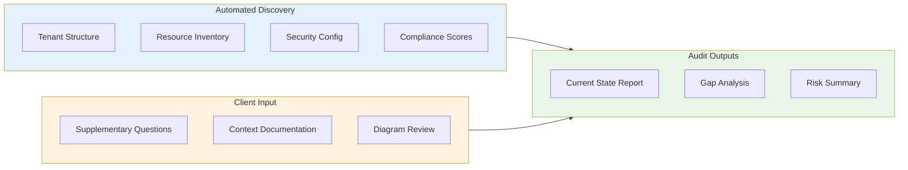
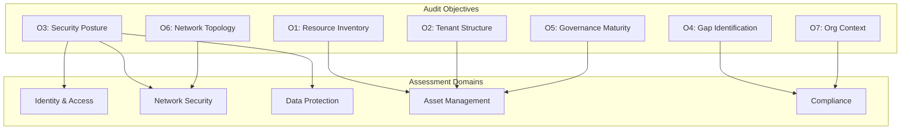
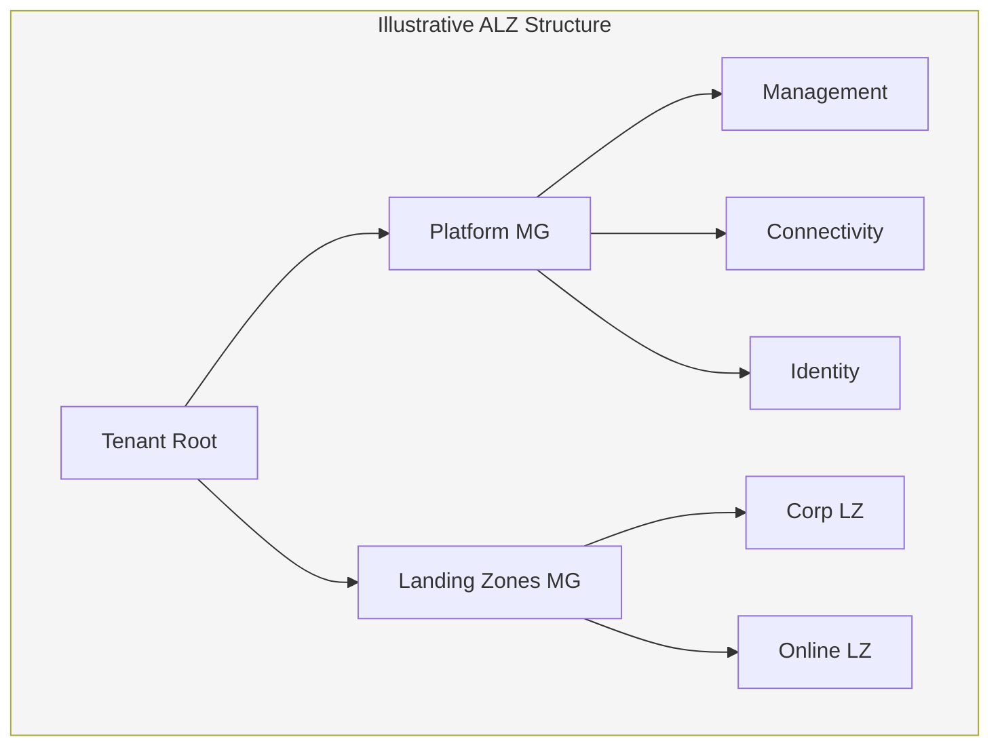

# Azure Estate Snapshot Audit
## Vision, Strategy, Objectives & Metrics (VSOM)

**Document Version:** 2.1
**Date:** February 2026
**Document Type:** VSOM Framework
**Classification:** Client Engagement

---

## Document Purpose

This document applies the **VSOM (Vision, Strategy, Objectives, Metrics)** framework to define a rapid, focused snapshot audit of the client's Azure environment. This is a **quick, sharp litmus test** of the current estate state—not a transformation programme.

**Intent:** Take stock of the Azure environment efficiently, saving client team and consultant architectural time through automated discovery and structured assessment.

---

## 1. Vision

### 1.1 Audit Vision Statement

> **Gain clear, evidence-based visibility of the current Azure estate within days—not weeks—enabling informed decisions on security posture, compliance alignment, and operational maturity without disrupting business operations.**

### 1.2 Vision Principles

| Principle | Description |
|-----------|-------------|
| **Speed over Perfection** | Rapid baseline, not exhaustive analysis |
| **Evidence-Based** | API-driven automated discovery, not manual interviews |
| **Minimal Disruption** | Read-only assessment, no changes to environment |
| **Decision Enablement** | Outputs support go/no-go and prioritisation decisions |
| **Time Efficiency** | Save architectural consulting time through automation |

### 1.3 What This Audit IS and IS NOT

| This Audit IS | This Audit IS NOT |
|---------------|-------------------|
| A point-in-time snapshot | An ongoing monitoring solution |
| Automated API-based discovery | Manual architecture interviews |
| Compliance gap identification | Remediation implementation |
| Current state documentation | Target state design |
| Risk and exposure assessment | Risk mitigation execution |
| Input for future planning | A transformation roadmap |

---

## 2. Strategy

### 2.1 Audit Strategy Statement

> **Deploy automated tooling to extract, analyse, and report on the Azure estate within a compressed timeframe, supplemented by targeted client questions to capture context that cannot be discovered via API.**

### 2.2 Strategic Approach

### 2.3 Time Investment Model

| Activity | Client Team | Consultant | Automation |
|----------|-------------|------------|------------|
| Azure access provisioning | 30 mins | - | - |
| Automated discovery execution | - | - | 2-4 hours |
| Supplementary questions | 1-2 hours | - | - |
| Diagram provision (PDF) | 30 mins | - | - |
| Analysis and reporting | - | 4-8 hours | - |
| Findings review meeting | 1 hour | 1 hour | - |
| **Total Client Time** | **~3-4 hours** | | |

### 2.4 Delivery Approach

1. **Day 1**: Provisioning & automated discovery
2. **Day 2**: Client completes supplementary questions
3. **Day 3-4**: Analysis and report compilation
4. **Day 5**: Findings presentation

---

## 3. Objectives

### 3.1 Primary Objectives

| # | Objective | Success Indicator |
|---|-----------|-------------------|
| **O1** | Establish complete Azure resource inventory | 100% resources catalogued via API |
| **O2** | Document tenant and subscription structure | Management group hierarchy mapped |
| **O3** | Assess security compliance posture | MCSB v2 score captured |
| **O4** | Identify critical security gaps | High/Critical findings documented |
| **O5** | Baseline governance maturity | Policy and tagging coverage quantified |
| **O6** | Map network topology | VNet/subnet/peering structure documented |
| **O7** | Capture organisational context | Supplementary questions completed |

### 3.2 Objective Alignment to Audit Domains

---

## 4. Metrics

### 4.1 Audit Completion Metrics

| Metric | Target | Measurement Method |
|--------|--------|-------------------|
| **Resource Discovery Rate** | 100% | API query coverage vs manual spot-check |
| **Subscription Coverage** | 100% | All enabled subscriptions queried |
| **Query Success Rate** | ≥95% | Successful queries / total queries |
| **Supplementary Question Response** | 100% | All questions answered by client |
| **Diagram Provision** | ≥1 PDF | Architecture diagrams received |
| **Time to Completion** | ≤5 days | Calendar days from access grant |

### 4.2 Security Posture Metrics (Captured)

| Metric | Source | Purpose |
|--------|--------|---------|
| **Defender Secure Score** | Microsoft Defender for Cloud | Overall security posture |
| **MCSB v2 Compliance %** | Defender compliance dashboard | Benchmark alignment |
| **Unhealthy Assessments** | Defender assessments API | Critical gaps count |
| **Resources without NSG** | Resource Graph query | Network exposure |
| **Untagged Resources %** | Resource Graph query | Governance gap |
| **Storage with Public Access** | Resource Graph query | Data exposure risk |
| **Key Vaults without RBAC** | Resource Graph query | Secrets management |

### 4.3 Metrics Dashboard Template

| Category | Metric | Current | Benchmark | Status |
|----------|--------|---------|-----------|--------|
| **Security** | Defender Secure Score | _TBD_ | ≥70% | ⬜ |
| **Security** | MCSB v2 Compliance | _TBD_ | ≥80% | ⬜ |
| **Security** | Critical Findings | _TBD_ | 0 | ⬜ |
| **Governance** | Tagged Resources | _TBD_ | ≥90% | ⬜ |
| **Governance** | Policy Assignments | _TBD_ | ≥1 | ⬜ |
| **Network** | Subnets with NSG | _TBD_ | 100% | ⬜ |
| **Network** | Private Endpoints | _TBD_ | ≥1 | ⬜ |
| **Identity** | PIM Enabled | _TBD_ | Yes | ⬜ |

---

## 5. Client Context Capture

### 5.1 Organisation Profile (To Be Completed)

| Attribute | Client Response |
|-----------|-----------------|
| **Organisation Name** | ___________________________ |
| **Sector** | ___________________________ |
| **Azure Tenant Type** | ☐ Single Tenant ☐ Multi-Tenant |
| **Primary Azure Region(s)** | ___________________________ |
| **Estimated Resource Count** | ___________________________ |
| **Number of Subscriptions** | ___________________________ |
| **Regulatory Requirements** | ___________________________ |

### 5.2 Supplementary Questions

These questions capture context that **cannot be discovered via API**. Client team to complete prior to analysis.

#### Section A: Organisational Context

| # | Question | Response |
|---|----------|----------|
| A1 | Who is the business owner of the Azure environment? | |
| A2 | Who manages day-to-day Azure operations (internal/external)? | |
| A3 | Is there a Cloud Centre of Excellence (CCoE) or equivalent? | ☐ Yes ☐ No ☐ Planned |
| A4 | What is the primary business use of Azure? | |
| A5 | Are there other cloud platforms in use (AWS, GCP)? | |

#### Section B: Governance & Operations

| # | Question | Response |
|---|----------|----------|
| B1 | Is there a documented cloud strategy or policy? | ☐ Yes ☐ No ☐ In Progress |
| B2 | Who approves new Azure resource deployments? | |
| B3 | Is there a change management process for Azure? | ☐ Yes ☐ No ☐ Informal |
| B4 | How are Azure costs monitored and allocated? | |
| B5 | Is there a tagging standard documented? | ☐ Yes ☐ No |

#### Section C: Security & Compliance

| # | Question | Response |
|---|----------|----------|
| C1 | What compliance frameworks apply? (e.g., ISO 27001, SOC 2) | |
| C2 | When was the last security assessment/penetration test? | |
| C3 | Is there a dedicated security team for cloud? | ☐ Yes ☐ No ☐ Shared |
| C4 | Are there known security concerns or incidents? | |
| C5 | Is Defender for Cloud actively monitored? | ☐ Yes ☐ No ☐ Unknown |

#### Section D: Identity & Access

| # | Question | Response |
|---|----------|----------|
| D1 | Is Azure AD/Entra ID the primary identity provider? | ☐ Yes ☐ No ☐ Hybrid |
| D2 | Is MFA enforced for all Azure access? | ☐ Yes ☐ No ☐ Partial |
| D3 | Is Privileged Identity Management (PIM) used? | ☐ Yes ☐ No ☐ Unknown |
| D4 | How many Global Administrators exist? | |
| D5 | Are service principals/managed identities documented? | ☐ Yes ☐ No |

#### Section E: Network & Connectivity

| # | Question | Response |
|---|----------|----------|
| E1 | Is there connectivity to on-premises? | ☐ ExpressRoute ☐ VPN ☐ None |
| E2 | Is there a hub-spoke network design? | ☐ Yes ☐ No ☐ Unknown |
| E3 | Are there any third-party firewalls or NVAs? | |
| E4 | Is there egress filtering/inspection? | ☐ Yes ☐ No ☐ Unknown |
| E5 | Are Private Endpoints used for PaaS services? | ☐ Yes ☐ No ☐ Partial |

#### Section F: Data & Applications

| # | Question | Response |
|---|----------|----------|
| F1 | What are the primary workloads running in Azure? | |
| F2 | Is sensitive/regulated data stored in Azure? | ☐ Yes ☐ No |
| F3 | Is data classification applied? | ☐ Yes ☐ No ☐ Partial |
| F4 | Are backups configured and tested? | ☐ Yes ☐ No ☐ Unknown |
| F5 | Is there a disaster recovery plan for Azure workloads? | ☐ Yes ☐ No ☐ Partial |

### 5.3 Documentation Request

Please provide the following (PDF format preferred):

| Document | Required | Received |
|----------|----------|----------|
| Current Azure architecture diagram(s) | ☐ Required | ☐ |
| Network topology diagram | ☐ Required | ☐ |
| Subscription/Management Group diagram | ☐ If available | ☐ |
| Security architecture documentation | ☐ If available | ☐ |
| Compliance certifications/reports | ☐ If available | ☐ |

---

## 6. Audit Scope & Deliverables

### 6.1 In Scope

| Domain | Automated Discovery | Manual Review |
|--------|---------------------|---------------|
| **Resource Inventory** | ✓ Full API extraction | - |
| **Subscription Structure** | ✓ MG/Sub hierarchy | - |
| **Security Configuration** | ✓ KV, NSG, Storage | - |
| **Compliance Scores** | ✓ Defender metrics | - |
| **Network Topology** | ✓ VNet/Subnet/Peering | Client diagrams |
| **Identity/RBAC** | ✓ Role assignments | - |
| **Organisational Context** | - | Supplementary questions |

### 6.2 Out of Scope

- Remediation or implementation of changes
- Target state architecture design
- Migration planning or execution
- Detailed application assessment
- Code or configuration reviews
- Penetration testing

### 6.3 Deliverables

| Deliverable | Format | Description |
|-------------|--------|-------------|
| **Executive Summary** | PDF (1-2 pages) | Key findings, risk summary, recommendations |
| **Current State Report** | PDF | Full audit findings with evidence |
| **Resource Inventory** | Excel/CSV | Complete resource listing |
| **Security Gap Analysis** | PDF | MCSB alignment, critical gaps |
| **Metrics Dashboard** | PDF | Populated metrics template |
| **Raw Data Exports** | JSON/CSV | Query outputs for client records |

---

## 7. Compliance & Architecture Framework Reference

### 7.1 Security Compliance Frameworks

| Framework | Assessment Method |
|-----------|-------------------|
| **MCSB v2** | Defender for Cloud compliance score |
| **MCSB v1** | Defender for Cloud (legacy) |
| **NIST 800-53** | Control mapping to MCSB |
| **UK NCSC 14 Principles** | Control mapping to MCSB |
| **ISO 27001** | Control mapping to MCSB |

### 7.2 Architecture Quality Frameworks

| Framework | Assessment Method |
|-----------|-------------------|
| **Azure Well-Architected Framework** | WAF Assessment, Azure Advisor |
| **Cloud Adoption Framework** | ALZ alignment, governance maturity |

**WAF Pillar Alignment to Audit:**

| Pillar | Code | Audit Focus |
|--------|------|-------------|
| Reliability | RE | Backup coverage, availability zones, DR |
| Security | SE | MCSB alignment, Defender scores |
| Cost Optimization | CO | Unused resources, rightsizing |
| Operational Excellence | OE | Monitoring, automation, IaC |
| Performance Efficiency | PE | Scalability, load balancing |

### 7.3 Sector-Specific Considerations

If applicable to client sector:

| Regulation | Relevance Check |
|------------|-----------------|
| FCA SYSC | ☐ Applicable |
| PRA Expectations | ☐ Applicable |
| Solvency II | ☐ Applicable |
| Lloyd's Standards | ☐ Applicable |
| GDPR | ☐ Applicable |
| Other: _________ | ☐ Applicable |

---

## 8. Risk Summary Framework

### 8.1 Risk Rating Criteria

| Rating | Description | Response Timeframe |
|--------|-------------|-------------------|
| **Critical** | Immediate exposure, active risk | Immediate action required |
| **High** | Significant gap, potential exposure | Address within 30 days |
| **Medium** | Notable gap, limited exposure | Address within 90 days |
| **Low** | Minor gap, best practice deviation | Address as convenient |

### 8.2 Risk Summary Template

| # | Finding | Domain | Rating | Evidence |
|---|---------|--------|--------|----------|
| 1 | _Example: Public blob storage_ | Data Protection | High | _storage-security.csv_ |
| 2 | | | | |
| 3 | | | | |

---

## Appendices

### Appendix A: Automated Query Catalogue

See accompanying files:
- `05-ALZ-SS-Audit-KQL-Queries-v1.json` - Resource Graph queries
- `14-ALZ-SS-Audit-Tenant-Discovery-v1.py` - Tenant/MG discovery
- `15-ALZ-SS-Audit-Full-Auto-v1.sh` - Automated execution script

### Appendix B: Compliance Control Mapping

See accompanying file:
- `06-ALZ-SS-Audit-Compliance-Mapping-v1.json` - MCSB/NIST/NCSC/ISO mapping

### Appendix C: Illustrative Future State (Reference Only)

> **Note:** The following is provided for **illustrative reference only**. This snapshot audit does not include target state design or transformation planning. Future state architecture should be developed as a separate engagement based on audit findings.

#### C.1 Typical ALZ Structure (Illustrative)

#### C.2 Indicative Roadmap Phases (Illustrative)

| Phase | Focus | Typical Duration |
|-------|-------|------------------|
| Assessment | Current state audit | 1 week |
| Design | Target state architecture | 2-4 weeks |
| Foundation | Platform deployment | 4-6 weeks |
| Migration | Workload transition | Varies |
| Optimisation | Continuous improvement | Ongoing |

*Note: Durations are illustrative. Actual timelines depend on scope and complexity.*

---

**Document Control**

**Status:** DRAFT - To Be Discussed

| Version | Date | Author | Status | Changes |
|---------|------|--------|--------|---------|
| 1.0 | Feb 2026 | Advisory Team | Draft | Initial release |
| 1.1 | Feb 2026 | Advisory Team | Draft | Insurance sector focus |
| 2.0 | Feb 2026 | Advisory Team | Draft | VSOM restructure, snapshot audit focus, supplementary questions added, future state moved to appendix |
| 2.1 | Feb 2026 | Advisory Team | Draft | Added Azure WAF + CAF framework references (Section 7.2) |
