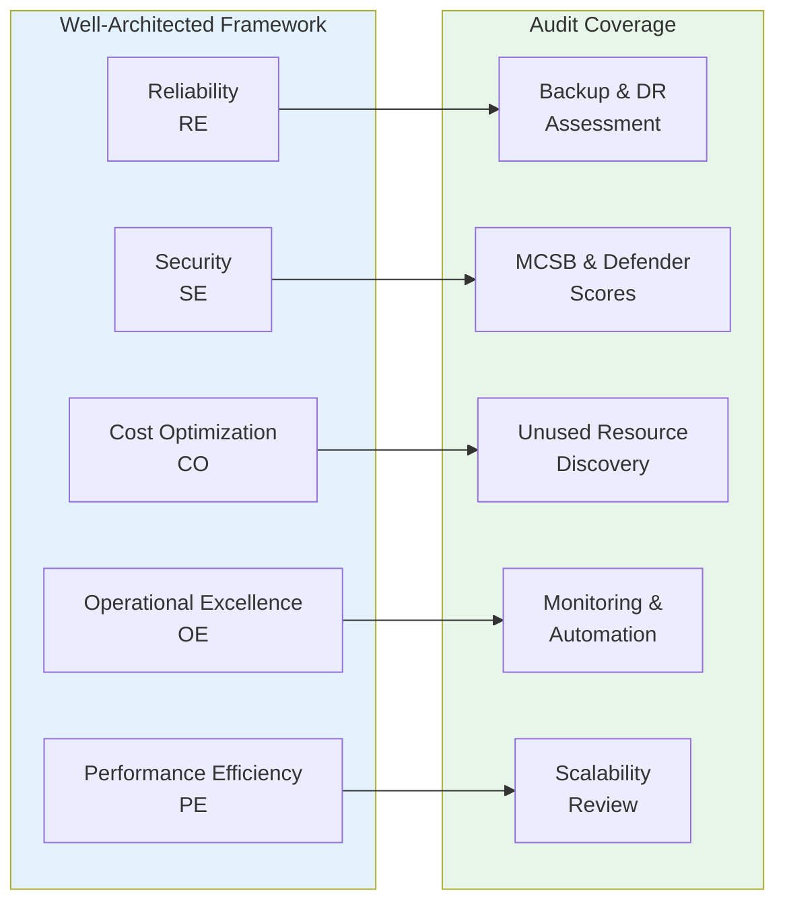
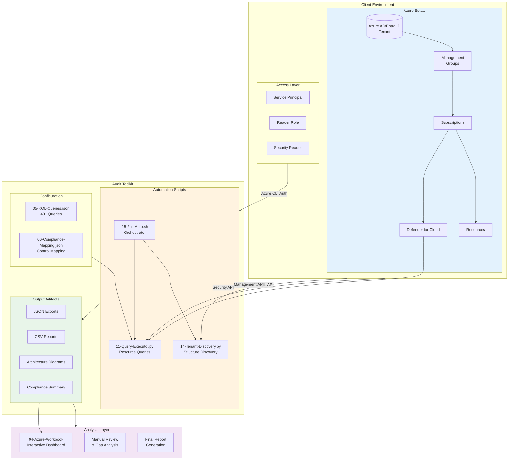
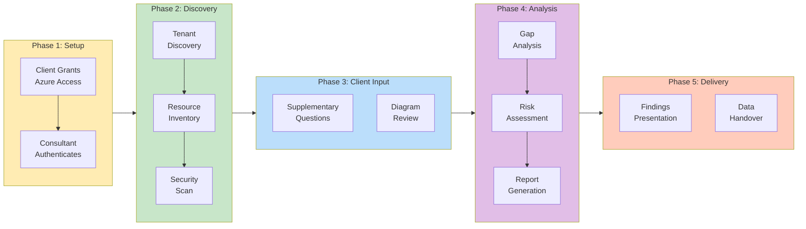
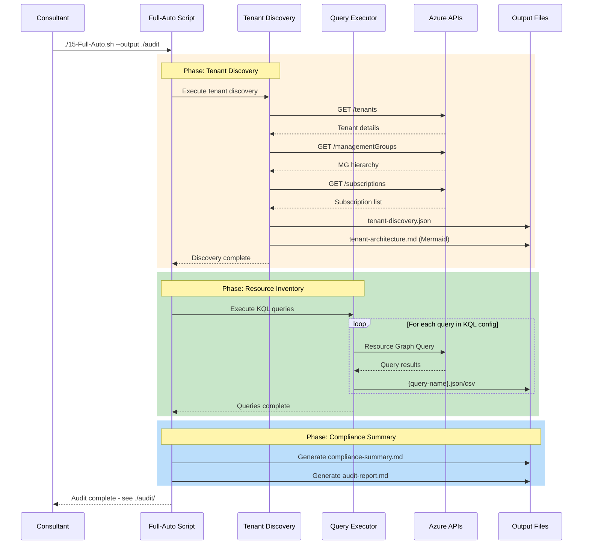
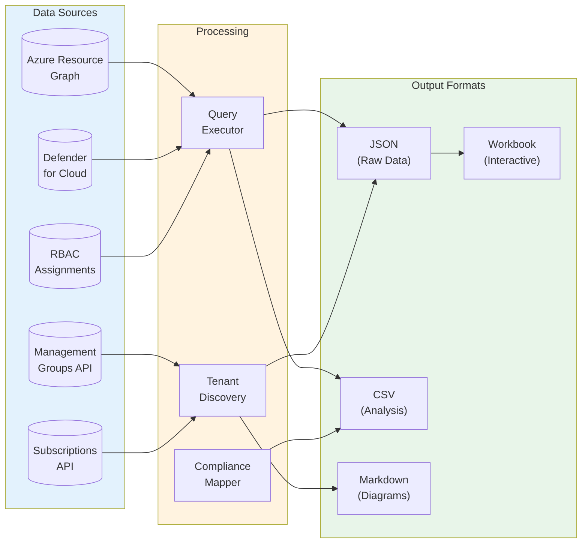
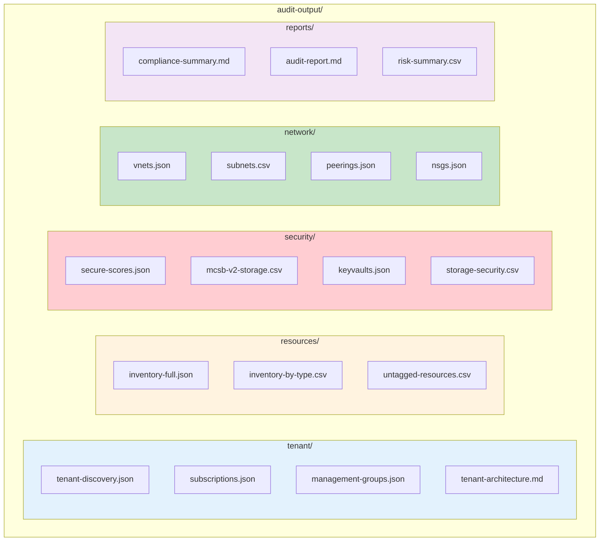
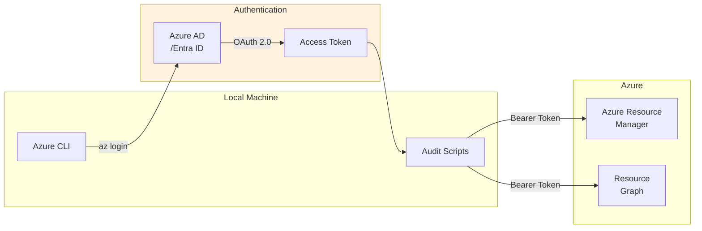
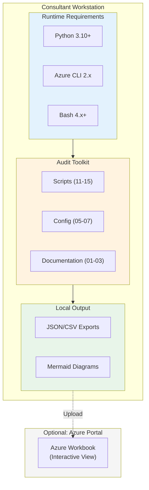
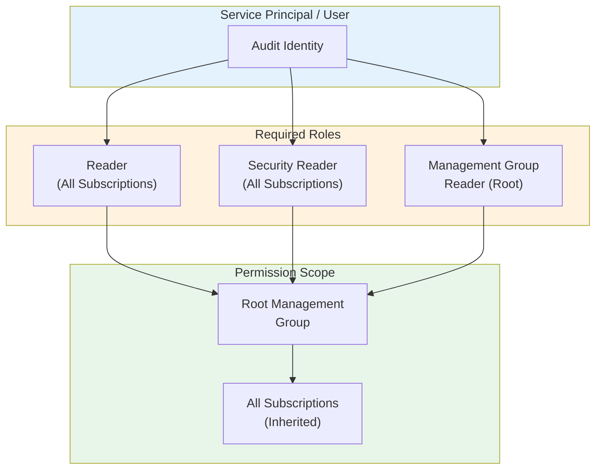
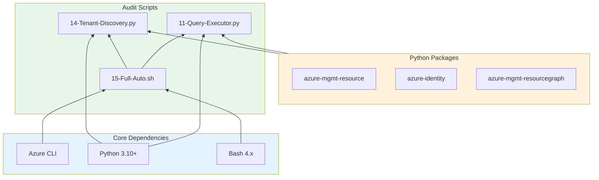

# ALZ Snapshot Audit - High-Level Design

**Document Version:** 1.1.0
**Date:** February 2026
**Document Type:** Architecture Overview
**Classification:** Technical Reference

---

## 1. Solution Overview

The ALZ Snapshot Audit is an automated assessment solution that provides rapid visibility into an Azure environment's security posture, compliance alignment, and governance maturity.

### 1.1 Architecture Principles

| Principle | Implementation |
|-----------|----------------|
| **Read-Only** | All discovery via Azure APIs, no modifications |
| **Automated** | Minimal manual intervention required |
| **Modular** | Components can run independently |
| **Portable** | No Azure-side deployment required |
| **Auditable** | All outputs preserved for evidence |

### 1.2 Framework Alignment

The audit aligns with Microsoft's architecture frameworks:

| Framework | Alignment |
|-----------|-----------|
| **Cloud Adoption Framework (CAF)** | ALZ structure, governance maturity assessment |
| **Well-Architected Framework (WAF)** | 5-pillar quality assessment |
| **Microsoft Cloud Security Benchmark** | Security posture and compliance |

**WAF Pillar Coverage:**



---

## 2. Component Architecture



---

## 3. Component Descriptions

### 3.1 Automation Scripts

| Component | File | Purpose | Dependencies |
|-----------|------|---------|--------------|
| **Orchestrator** | `15-ALZ-SS-Audit-Full-Auto-v1.sh` | Single-command audit execution | All below |
| **Tenant Discovery** | `14-ALZ-SS-Audit-Tenant-Discovery-v1.py` | MG/Subscription structure | Azure CLI |
| **Query Executor** | `11-ALZ-SS-Audit-Query-Executor-v1.py` | Resource Graph queries | Azure CLI, Python |
| **Run Script** | `12-ALZ-SS-Audit-Run-Script-v1.sh` | Legacy manual wrapper | Bash |

### 3.2 Configuration Files

| Component | File | Purpose |
|-----------|------|---------|
| **KQL Library** | `05-ALZ-SS-Audit-KQL-Queries-v1.json` | 40+ Resource Graph queries |
| **Compliance Map** | `06-ALZ-SS-Audit-Compliance-Mapping-v1.json` | MCSB/NIST/NCSC/ISO mapping |
| **Requirements** | `13-ALZ-SS-Audit-Requirements-v1.txt` | Python dependencies |

### 3.3 Analysis Tools

| Component | File | Purpose |
|-----------|------|---------|
| **Azure Workbook** | `04-ALZ-SS-Audit-Azure-Workbook-v1.workbook` | Interactive dashboard |
| **Ontology** | `07-ALZ-SS-Audit-OAA-Ontology-v1.json` | OAA compliance structure |

---

## 4. Workflow Architecture

### 4.1 End-to-End Process Flow



### 4.2 Automated Discovery Sequence



---

## 5. Data Flow Architecture

### 5.1 Data Sources and Sinks



### 5.2 Output File Taxonomy



---

## 6. Integration Architecture

### 6.1 Azure API Integration

| API | Endpoint | Purpose | Auth |
|-----|----------|---------|------|
| **Resource Graph** | `management.azure.com/providers/Microsoft.ResourceGraph/resources` | Resource queries | Bearer token |
| **Management Groups** | `management.azure.com/providers/Microsoft.Management/managementGroups` | Hierarchy discovery | Bearer token |
| **Subscriptions** | `management.azure.com/subscriptions` | Subscription list | Bearer token |
| **Defender** | `management.azure.com/providers/Microsoft.Security` | Security posture | Bearer token |
| **Policy** | `management.azure.com/providers/Microsoft.Authorization/policyAssignments` | Governance | Bearer token |

### 6.2 Authentication Flow



---

## 7. Deployment Topology

### 7.1 Runtime Environment



### 7.2 No Azure Deployment Required

The audit toolkit is **fully portable** and requires:
- No resources deployed to client Azure
- No Azure Functions or Logic Apps
- No storage accounts for outputs
- No network connectivity from Azure to consultant

All processing occurs on the consultant's local machine using standard Azure CLI authentication.

---

## 8. Security Architecture

### 8.1 Permissions Model



### 8.2 Data Handling

| Data Type | Handling | Retention |
|-----------|----------|-----------|
| Resource metadata | Exported to local files | Client discretion |
| Security scores | Exported to local files | Client discretion |
| RBAC assignments | Exported to local files | Redact before sharing |
| Secrets/keys | **Never exported** | N/A |
| Access tokens | In-memory only | Session duration |

---

## 9. Extensibility Points

### 9.1 Adding Custom Queries

New KQL queries can be added to `05-ALZ-SS-Audit-KQL-Queries-v1.json`:

```json
{
  "queries": [
    {
      "name": "custom-query",
      "description": "Custom resource query",
      "query": "Resources | where type == 'microsoft.compute/virtualmachines'",
      "outputFormat": "json"
    }
  ]
}
```

### 9.2 Adding Compliance Controls

New control mappings can be added to `06-ALZ-SS-Audit-Compliance-Mapping-v1.json`:

```json
{
  "controls": [
    {
      "id": "CUSTOM-001",
      "framework": "Custom Framework",
      "mcsbMapping": ["NS-1", "NS-2"],
      "queryRef": "custom-query"
    }
  ]
}
```

---

## 10. Component Dependencies



---

## Document Control

**Status:** DRAFT - To Be Discussed

| Version | Date | Author | Status | Changes |
|---------|------|--------|--------|---------|
| 1.0.0 | 2026-02-03 | Advisory Team | Draft | Initial release |
| 1.1.0 | 2026-02-03 | Advisory Team | Draft | Added Section 1.2 Framework Alignment with WAF pillar coverage |
