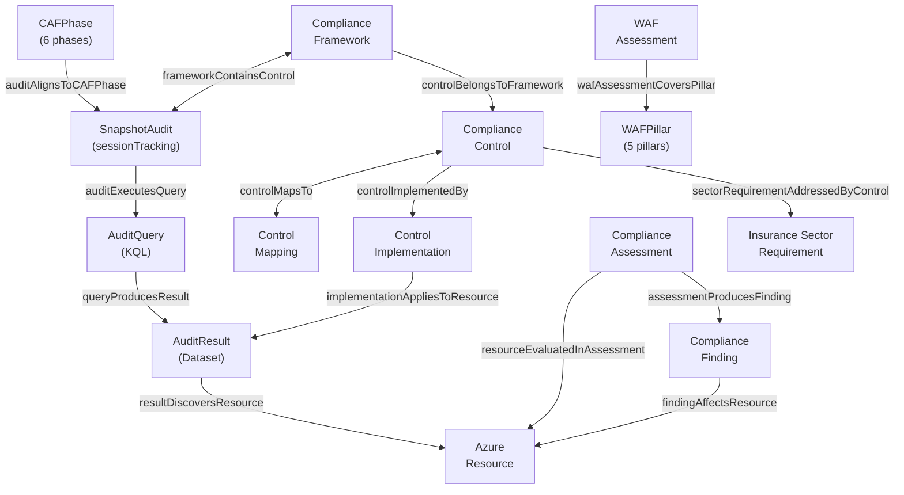

# ALZ Compliance Ontology - Readable Reference

> **Version:** 1.2.0 | **Status:** Active | **Domain:** Cloud Governance
> **Created:** 2026-02-03 | **Last Modified:** 2026-02-03
> **OAA Version:** 5.0.0 | **Tier:** Tier 2

---

## Overview

Ontology for Azure Landing Zone compliance management and snapshot audits, mapping controls across MCSB v1/v2, NIST 800-53, UK NCSC, ISO 27001, Azure Well-Architected Framework (WAF), and Cloud Adoption Framework (CAF) for Insurance Advisory sector.

### Context Namespaces

| Prefix | URI |
|--------|-----|
| `@vocab` | https://schema.org/ |
| `baiv` | https://baiv.co.uk/ontology/ |
| `alz` | https://baiv.co.uk/ontology/alz/ |
| `mcsb` | https://learn.microsoft.com/security/benchmark/azure/ |
| `nist` | https://csrc.nist.gov/publications/detail/sp/800-53/ |
| `ncsc` | https://www.ncsc.gov.uk/collection/cloud/ |
| `iso` | https://www.iso.org/standard/27001/ |
| `waf` | https://learn.microsoft.com/azure/well-architected/ |
| `caf` | https://learn.microsoft.com/azure/cloud-adoption-framework/ |

### Tags

`azure` `landing-zone` `compliance` `security` `insurance` `mcsb` `nist` `ncsc` `iso` `waf` `caf` `audit` `snapshot`

---

## Entities (16)

### 1. ComplianceFramework

**ID:** `alz:ComplianceFramework`
**Schema.org Type:** `DefinedTermSet`

A regulatory or industry compliance framework that defines security and governance controls for cloud environments.

**Schema.org Alignment:**
- Base Type: DefinedTermSet
- Rationale: Compliance frameworks are collections of defined terms (controls)
- Extensions: frameworkVersion, regulatoryBody, applicableSectors

| Property | Type | Required | Cardinality |
|----------|------|----------|-------------|
| `frameworkId` | Text | Yes | 1..1 |
| `frameworkName` | Text | Yes | 1..1 |
| `frameworkVersion` | Text | Yes | 1..1 |
| `regulatoryBody` | Organization | No | 0..1 |
| `applicableSectors` | Text | No | 0..* |
| `policySetDefinitionId` | URL | No | 0..1 |

---

### 2. ComplianceControl

**ID:** `alz:ComplianceControl`
**Schema.org Type:** `DefinedTerm`

A specific security or governance requirement within a compliance framework that can be implemented and audited.

**Schema.org Alignment:**
- Base Type: DefinedTerm
- Rationale: Controls are defined terms with specific implementation requirements
- Extensions: controlId, controlFamily, implementationGuidance, auditEvidence

| Property | Type | Required | Cardinality |
|----------|------|----------|-------------|
| `controlId` | Text | Yes | 1..1 |
| `controlName` | Text | Yes | 1..1 |
| `controlFamily` | Text | Yes | 1..1 |
| `description` | Text | Yes | 1..1 |
| `implementationGuidance` | Text | No | 0..1 |
| `auditEvidence` | Text | No | 0..* |

---

### 3. WAFPillar

**ID:** `alz:WAFPillar`
**Schema.org Type:** `DefinedTerm`

One of the five Azure Well-Architected Framework pillars that define quality attributes for cloud workloads: Reliability, Security, Cost Optimization, Operational Excellence, Performance Efficiency.

**Schema.org Alignment:**
- Base Type: DefinedTerm
- Rationale: WAF pillars are defined quality attributes with specific assessment criteria
- Extensions: pillarCode, mcsbAlignment, advisorCategory

| Property | Type | Required | Cardinality | Enum Values |
|----------|------|----------|-------------|-------------|
| `pillarCode` | Text | Yes | 1..1 | RE, SE, CO, OE, PE |
| `pillarName` | Text | Yes | 1..1 | - |
| `description` | Text | Yes | 1..1 | - |
| `mcsbAlignment` | Text | No | 0..* | - |
| `focusAreas` | Text | Yes | 1..* | - |
| `advisorCategory` | Text | Yes | 1..1 | - |

**Pillar Reference:**
| Code | Pillar | Focus |
|------|--------|-------|
| RE | Reliability | Resiliency, availability, recovery |
| SE | Security | Protection, threat mitigation |
| CO | Cost Optimization | Cost management, efficiency |
| OE | Operational Excellence | DevOps, monitoring, deployment |
| PE | Performance Efficiency | Scalability, performance |

---

### 4. CAFPhase

**ID:** `alz:CAFPhase`
**Schema.org Type:** `DefinedTerm`

A phase in the Microsoft Cloud Adoption Framework journey: Strategy, Plan, Ready, Adopt, Govern, Manage.

**Schema.org Alignment:**
- Base Type: DefinedTerm
- Rationale: CAF phases are defined stages in cloud adoption with specific activities
- Extensions: phaseOrder, keyActivities, deliverables

| Property | Type | Required | Cardinality |
|----------|------|----------|-------------|
| `phaseName` | Text | Yes | 1..1 |
| `phaseOrder` | Integer | Yes | 1..1 |
| `description` | Text | Yes | 1..1 |
| `keyActivities` | Text | Yes | 1..* |
| `deliverables` | Text | No | 0..* |

---

### 5. SnapshotAudit

**ID:** `alz:SnapshotAudit`
**Schema.org Type:** `Action`

A point-in-time automated assessment of an Azure environment capturing resource inventory, security posture, compliance alignment, and governance maturity within a compressed timeframe. Supports multiple runs with unique session identifiers for periodic re-audits and change tracking.

**Schema.org Alignment:**
- Base Type: Action
- Rationale: A snapshot audit is an action performed on an Azure environment producing results
- Extensions: auditScope, auditDuration, automationLevel, sessionTracking

| Property | Type | Required | Description | Enum Values |
|----------|------|----------|-------------|-------------|
| `auditId` | Text | Yes | Unique identifier for the audit engagement/project | - |
| `sessionId` | Text | Yes | UUID for each unique audit execution run | - |
| `auditName` | Text | Yes | - | - |
| `auditDate` | Date | Yes | Scheduled or planned date of the audit | - |
| `startedAt` | DateTime | No | Timestamp when audit execution began | - |
| `completedAt` | DateTime | No | Timestamp when audit execution completed | - |
| `tenantId` | Text | Yes | - | - |
| `subscriptionScope` | Text | Yes | - | (1..*) |
| `auditDurationDays` | Integer | Yes | - | - |
| `automationScript` | Text | No | - | - |
| `status` | Text | Yes | - | planned, in-progress, completed, failed |
| `runSequence` | Integer | No | Sequential run number for periodic re-audits | - |
| `previousSessionId` | Text | No | Reference to previous session for delta comparison | - |

---

### 6. AuditQuery

**ID:** `alz:AuditQuery`
**Schema.org Type:** `SoftwareSourceCode`

A KQL query executed against Azure Resource Graph to discover and assess Azure resources for compliance and architecture quality.

**Schema.org Alignment:**
- Base Type: SoftwareSourceCode
- Rationale: Audit queries are source code (KQL) that extract data from Azure
- Extensions: queryCategory, outputFormat, wafPillarAlignment

| Property | Type | Required | Enum Values |
|----------|------|----------|-------------|
| `queryId` | Text | Yes | - |
| `queryName` | Text | Yes | - |
| `description` | Text | Yes | - |
| `queryText` | Text | Yes | - |
| `queryCategory` | Text | Yes | summary, inventory, governance, security, network, identity, dataAndAI, mcsbCompliance, wafPillarAssessment |
| `outputFile` | Text | Yes | - |
| `outputFormat` | Text | Yes | json, csv |

---

### 7. AuditResult

**ID:** `alz:AuditResult`
**Schema.org Type:** `Dataset`

The output data captured from executing an audit query, containing discovered resources, compliance status, or assessment metrics.

**Schema.org Alignment:**
- Base Type: Dataset
- Rationale: Audit results are datasets produced by query execution
- Extensions: resultFormat, recordCount, captureTimestamp

| Property | Type | Required |
|----------|------|----------|
| `resultId` | Text | Yes |
| `queryRef` | alz:AuditQuery | Yes |
| `captureTimestamp` | DateTime | Yes |
| `outputFilePath` | Text | Yes |
| `recordCount` | Integer | Yes |
| `resultFormat` | Text (json/csv) | Yes |
| `fileSizeBytes` | Integer | No |

---

### 8. ControlMapping

**ID:** `alz:ControlMapping`
**Schema.org Type:** `PropertyValue`

A mapping relationship between equivalent controls across different compliance frameworks enabling cross-framework compliance assessment.

**Schema.org Alignment:**
- Base Type: PropertyValue
- Rationale: Mappings are property-value associations between controls
- Extensions: mappingStrength, mappingRationale

| Property | Type | Required | Enum Values |
|----------|------|----------|-------------|
| `sourceControl` | alz:ComplianceControl | Yes | - |
| `targetControl` | alz:ComplianceControl | Yes | - |
| `mappingStrength` | Text | Yes | exact, partial, related |
| `mappingRationale` | Text | No | - |

---

### 9. AzureResource

**ID:** `alz:AzureResource`
**Schema.org Type:** `SoftwareApplication`

An Azure cloud resource that can be configured and audited for compliance with security controls.

**Schema.org Alignment:**
- Base Type: SoftwareApplication
- Rationale: Azure resources are software applications/services
- Extensions: resourceType, resourceProvider, configurationProperties

| Property | Type | Required | Cardinality |
|----------|------|----------|-------------|
| `resourceId` | Text | Yes | 1..1 |
| `resourceType` | Text | Yes | 1..1 |
| `resourceProvider` | Text | Yes | 1..1 |
| `subscriptionId` | Text | Yes | 1..1 |
| `resourceGroup` | Text | Yes | 1..1 |
| `location` | Text | Yes | 1..1 |
| `tags` | PropertyValue | No | 0..* |

---

### 10. ControlImplementation

**ID:** `alz:ControlImplementation`
**Schema.org Type:** `Action`

The specific Azure configuration or policy that implements a compliance control for a resource type.

**Schema.org Alignment:**
- Base Type: Action
- Rationale: Implementations are actions taken to achieve compliance
- Extensions: azurePolicy, configurationSetting, automationRunbook

| Property | Type | Required |
|----------|------|----------|
| `implementationId` | Text | Yes |
| `implementationName` | Text | Yes |
| `azurePolicyId` | URL | No |
| `configurationProperty` | Text | No |
| `expectedValue` | Text | No |
| `remediationAction` | Text | No |

---

### 11. ComplianceAssessment

**ID:** `alz:ComplianceAssessment`
**Schema.org Type:** `Dataset`

A point-in-time evaluation of an Azure environment against compliance controls producing a compliance score.

**Schema.org Alignment:**
- Base Type: Dataset
- Rationale: Assessments produce datasets of compliance results
- Extensions: assessmentScope, complianceScore, findingsCount

| Property | Type | Required | Cardinality |
|----------|------|----------|-------------|
| `assessmentId` | Text | Yes | 1..1 |
| `assessmentDate` | DateTime | Yes | 1..1 |
| `assessmentScope` | Text | Yes | 1..* |
| `frameworksAssessed` | alz:ComplianceFramework | Yes | 1..* |
| `overallScore` | Number | Yes | 1..1 |
| `findingsCount` | Integer | Yes | 1..1 |

---

### 12. WAFAssessment

**ID:** `alz:WAFAssessment`
**Schema.org Type:** `Dataset`

An assessment of Azure workloads against the Well-Architected Framework pillars, capturing pillar-specific scores and recommendations.

**Schema.org Alignment:**
- Base Type: Dataset
- Rationale: WAF assessments produce datasets of pillar-specific results
- Extensions: pillarScores, advisorRecommendations

| Property | Type | Required |
|----------|------|----------|
| `assessmentId` | Text | Yes |
| `assessmentDate` | DateTime | Yes |
| `workloadScope` | Text (1..*) | Yes |
| `reliabilityScore` | Number | No |
| `securityScore` | Number | No |
| `costOptimizationScore` | Number | No |
| `operationalExcellenceScore` | Number | No |
| `performanceEfficiencyScore` | Number | No |
| `advisorRecommendationCount` | Integer | No |

---

### 13. ComplianceFinding

**ID:** `alz:ComplianceFinding`
**Schema.org Type:** `Report`

A specific non-compliance issue identified during assessment with severity and remediation guidance.

**Schema.org Alignment:**
- Base Type: Report
- Rationale: Findings are reports of compliance status
- Extensions: findingSeverity, remediationPriority, remediationGuidance

| Property | Type | Required | Enum Values |
|----------|------|----------|-------------|
| `findingId` | Text | Yes | - |
| `findingSeverity` | Text | Yes | critical, high, medium, low, informational |
| `affectedResource` | alz:AzureResource | Yes | - |
| `violatedControl` | alz:ComplianceControl | Yes | - |
| `currentState` | Text | Yes | - |
| `expectedState` | Text | Yes | - |
| `remediationGuidance` | Text | Yes | - |
| `remediationPriority` | Integer | Yes | - |

---

### 14. InsuranceSectorRequirement

**ID:** `alz:InsuranceSectorRequirement`
**Schema.org Type:** `GovernmentService`

A regulatory requirement specific to the insurance sector that must be addressed through cloud compliance controls.

**Schema.org Alignment:**
- Base Type: GovernmentService
- Rationale: Regulatory requirements are government-mandated services/rules
- Extensions: regulatoryBody, enforcementDate, penaltyForNonCompliance

| Property | Type | Required | Enum Values |
|----------|------|----------|-------------|
| `requirementId` | Text | Yes | - |
| `requirementName` | Text | Yes | - |
| `regulatoryBody` | Text | Yes | FCA, PRA, Lloyd's, EIOPA, ICO |
| `applicableRegulation` | Text | Yes | - |
| `enforcementDate` | Date | No | - |
| `complianceDeadline` | Date | No | - |

---

### 15. AuditDeliverable

**ID:** `alz:AuditDeliverable`
**Schema.org Type:** `CreativeWork`

A document or data artifact produced as output from a snapshot audit, such as executive summary, gap analysis, or resource inventory.

**Schema.org Alignment:**
- Base Type: CreativeWork
- Rationale: Deliverables are creative works (documents, reports) produced by the audit
- Extensions: deliverableFormat, targetAudience

| Property | Type | Required | Enum Values |
|----------|------|----------|-------------|
| `deliverableId` | Text | Yes | - |
| `deliverableName` | Text | Yes | - |
| `deliverableType` | Text | Yes | ExecutiveSummary, CurrentStateReport, ResourceInventory, SecurityGapAnalysis, MetricsDashboard, RawDataExport |
| `format` | Text | Yes | PDF, Excel, CSV, JSON, Markdown |
| `targetAudience` | Text | Yes | Executive, Technical, Both |
| `description` | Text | Yes | - |

---

## Relationships (28)

### Framework & Control Relationships

| Relationship | From | To | Cardinality | Inverse |
|--------------|------|-----|-------------|---------|
| `frameworkContainsControl` | ComplianceFramework | ComplianceControl | 1..* | controlBelongsToFramework |
| `controlBelongsToFramework` | ComplianceControl | ComplianceFramework | 1..1 | frameworkContainsControl |
| `controlMapsTo` | ComplianceControl | ControlMapping | 0..* | - |
| `mappingConnectsControls` | ControlMapping | ComplianceControl | 2..2 | - |
| `controlImplementedBy` | ComplianceControl | ControlImplementation | 1..* | implementationSatisfiesControl |
| `implementationSatisfiesControl` | ControlImplementation | ComplianceControl | 1..* | controlImplementedBy |
| `implementationAppliesToResource` | ControlImplementation | AzureResource | 1..* | - |

### Audit Workflow Relationships

| Relationship | From | To | Cardinality | Inverse |
|--------------|------|-----|-------------|---------|
| `auditExecutesQuery` | SnapshotAudit | AuditQuery | 1..* | queryExecutedByAudit |
| `queryExecutedByAudit` | AuditQuery | SnapshotAudit | 0..* | auditExecutesQuery |
| `queryProducesResult` | AuditQuery | AuditResult | 0..* | resultFromQuery |
| `resultFromQuery` | AuditResult | AuditQuery | 1..1 | queryProducesResult |
| `resultDiscoversResource` | AuditResult | AzureResource | 0..* | - |
| `auditProducesDeliverable` | SnapshotAudit | AuditDeliverable | 1..* | deliverableFromAudit |
| `deliverableFromAudit` | AuditDeliverable | SnapshotAudit | 1..1 | auditProducesDeliverable |
| `auditGeneratesAssessment` | SnapshotAudit | ComplianceAssessment, WAFAssessment | 0..* | - |

### WAF & CAF Relationships

| Relationship | From | To | Cardinality |
|--------------|------|-----|-------------|
| `queryAssessesWAFPillar` | AuditQuery | WAFPillar | 0..1 |
| `queryAssessesControl` | AuditQuery | ComplianceControl | 0..* |
| `pillarAlignedToMCSB` | WAFPillar | ComplianceControl | 0..* |
| `auditAlignsToCAFPhase` | SnapshotAudit | CAFPhase | 1..1 |
| `wafAssessmentCoversPillar` | WAFAssessment | WAFPillar | 1..* |

### Assessment & Finding Relationships

| Relationship | From | To | Cardinality | Inverse |
|--------------|------|-----|-------------|---------|
| `resourceEvaluatedInAssessment` | AzureResource | ComplianceAssessment | 0..* | - |
| `assessmentCoversFramework` | ComplianceAssessment | ComplianceFramework | 1..* | - |
| `assessmentProducesFinding` | ComplianceAssessment | ComplianceFinding | 0..* | findingFromAssessment |
| `findingFromAssessment` | ComplianceFinding | ComplianceAssessment | 1..1 | assessmentProducesFinding |
| `findingViolatesControl` | ComplianceFinding | ComplianceControl | 1..1 | - |
| `findingAffectsResource` | ComplianceFinding | AzureResource | 1..1 | - |

### Sector Requirement Relationships

| Relationship | From | To | Cardinality |
|--------------|------|-----|-------------|
| `sectorRequirementAddressedByControl` | InsuranceSectorRequirement | ComplianceControl | 1..* |
| `controlAddressesSectorRequirement` | ComplianceControl | InsuranceSectorRequirement | 0..* |

---

## Entity Relationship Diagram

---

## Business Rules (10)

### BR001: Mandatory MCSB Assessment
**Description:** All ALZ implementations must be assessed against both MCSB v1 and MCSB v2
**Rule:** `IF AzureLandingZone deployed THEN ComplianceAssessment MUST cover MCSB_v1 AND MCSB_v2`

### BR002: Insurance Sector Compliance
**Description:** Insurance advisory workloads must address FCA and PRA requirements
**Rule:** `IF InsuranceSectorRequirement.regulatoryBody IN ('FCA', 'PRA') THEN sectorRequirementAddressedByControl.count >= 1`

### BR003: Critical Finding Remediation
**Description:** Critical severity findings must have high priority remediation
**Rule:** `IF ComplianceFinding.findingSeverity = 'critical' THEN ComplianceFinding.remediationPriority <= 1`

### BR004: Control Implementation Coverage
**Description:** Every compliance control must have at least one implementation
**Rule:** `IF ComplianceControl exists THEN controlImplementedBy.count >= 1`

### BR005: Assessment Scope Completeness
**Description:** Compliance assessments must cover all subscriptions in scope
**Rule:** `IF ComplianceAssessment created THEN assessmentScope MUST include all active subscriptions`

### BR006: Cross-Framework Mapping Requirement
**Description:** Controls in primary frameworks must map to at least one other framework
**Rule:** `IF ComplianceControl.controlFamily IN ('IM', 'PA', 'NS', 'DP') THEN controlMapsTo.count >= 1`

### BR007: WAF Pillar Coverage
**Description:** Snapshot audits should assess all five WAF pillars for comprehensive quality evaluation
**Rule:** `IF SnapshotAudit.status = 'completed' THEN auditGeneratesAssessment MUST include WAFAssessment covering all 5 pillars`

### BR008: Query Must Produce Results
**Description:** Every executed audit query must produce at least one audit result
**Rule:** `IF AuditQuery.queryExecutedByAudit exists THEN queryProducesResult.count >= 1`

### BR009: Audit Deliverables Required
**Description:** Completed snapshot audits must produce minimum deliverables
**Rule:** `IF SnapshotAudit.status = 'completed' THEN auditProducesDeliverable MUST include ExecutiveSummary AND ResourceInventory`

### BR010: CAF Alignment
**Description:** Snapshot audits align to the Assessment phase of Cloud Adoption Framework
**Rule:** `IF SnapshotAudit exists THEN auditAlignsToCAFPhase = 'Ready' phase (Assessment activity)`

---

## Quality Metrics

| Metric | Score |
|--------|-------|
| **Overall Score** | 95 |
| **Completeness Score** | 100 |
| **Entity Connectivity** | 100% |
| **Graph Connectivity** | 1 (single connected component) |
| **Relationship Density** | 1.75 |
| **Schema.org Alignment** | 100% |
| **Validation Status** | PASS |

### Completeness Gates

| Gate | Status | Details |
|------|--------|---------|
| G1 - Entity Descriptions | PASS | 16/16 entities have descriptions ≥20 chars |
| G2 - Relationship Cardinality | PASS | 28/28 relationships have cardinality |
| G2B - Entity Connectivity | PASS | 16/16 entities participate in relationships |
| G2C - Graph Connectivity | PASS | Single connected component |
| G3 - Business Rules Format | PASS | 10/10 rules follow IF-THEN format |
| G4 - Property Mappings | PASS | All properties mapped to schema.org |
| G5 - Test Data Coverage | PASS | Minimum 5 instances per entity |
| G6 - Cross-Artifact Consistency | PASS | All references validated |

### Competency Validation

| Metric | Value |
|--------|-------|
| Domain | cloud-governance |
| Pattern Type | CUSTOM_DOMAIN |
| Required Entities | 16 |
| Present Entities | 16 |
| Missing Entities | None |
| Required Relationships | 28 |
| Present Relationships | 28 |
| Missing Relationships | None |
| Competency Score | 100 |
| Threshold | 90 |
| Result | **PASS** |

---

## Cross-Artifact Relationships

### Consumed By
| Artifact | Relationship |
|----------|--------------|
| `baiv:uniregistry:agent:alz-audit-agent-v1-0-0` | Uses ontology for compliance assessment |

### Requires
| Artifact | Relationship |
|----------|--------------|
| `baiv:uniregistry:schema:azure-resource-graph-v1-0-0` | Queries resource data |
| `baiv:uniregistry:api:defender-for-cloud-v1-0-0` | Retrieves security scores |
| `baiv:uniregistry:config:kql-queries-v1-2-0` | Defines audit queries |

### Validates
| Artifact | Relationship |
|----------|--------------|
| `baiv:uniregistry:ontology:alz-foundation-v1-0-0` | Validates compliance of ALZ resources |

---

## Version History

| Version | Date | Changes |
|---------|------|---------|
| 1.0.0 | 2026-02-03 | Initial creation for Insurance Advisory ALZ MVP |
| 1.1.0 | 2026-02-03 | Added WAF pillars, CAF phases, snapshot audit workflow entities (SnapshotAudit, AuditQuery, AuditResult, AuditDeliverable, WAFAssessment), and related relationships/business rules |
| 1.2.0 | 2026-02-03 | Enhanced SnapshotAudit with session tracking: sessionId, startedAt, completedAt, runSequence, previousSessionId for multiple audit runs and periodic re-audits |

### Change Control (v1.2.0)
- **Change Reason:** Added session tracking to SnapshotAudit entity for multiple audit runs and periodic re-audits
- **Approval Status:** Approved
- **Approved By:** Mission Optimisation Team
- **Breaking Changes:** No
- **Migration Guide:** SnapshotAudit entity enhanced with: sessionId (UUID per run), startedAt, completedAt timestamps, runSequence (for periodic audits), previousSessionId (for delta comparison). Enables multiple audit runs per engagement.

---

## Related Artifacts

| Artifact | File |
|----------|------|
| Specification | alz-compliance-ontology-v1.2.0.json |
| Glossary | alz-compliance-glossary-v1.2.0.json |
| Test Data | alz-compliance-testdata-v1.2.0.json |
| Visual Guide | alz-compliance-visual-guide-v1.2.0.md |
| Documentation | alz-compliance-docs-v1.2.0.md |
| Registry Entry | alz-compliance-registry-entry-v1.2.0.json |

---

*Generated from 07-ALZ-SS-Audit-OAA-Ontology-v1.json on 2026-02-03*
