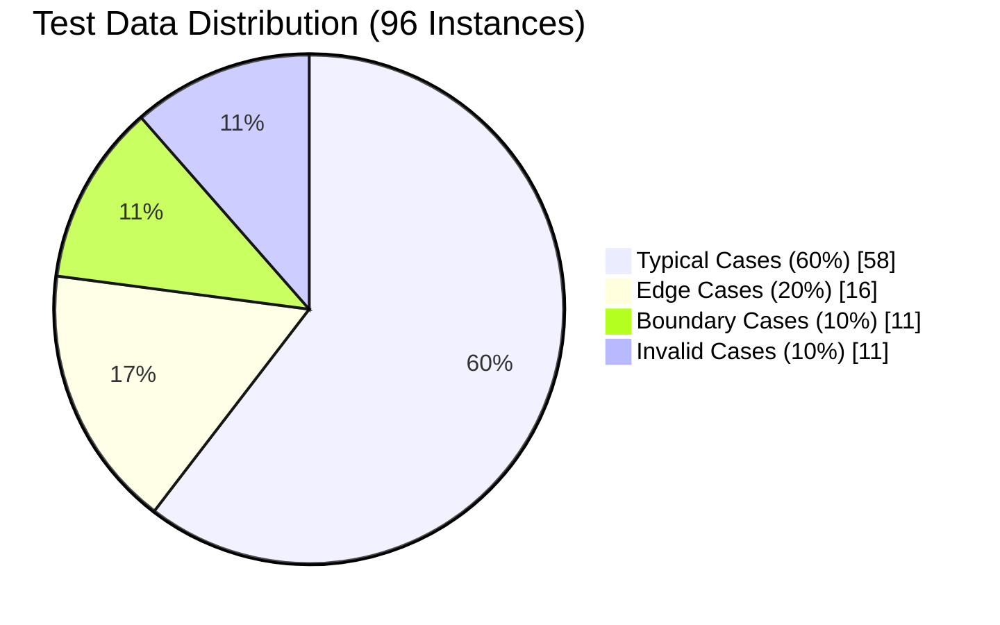
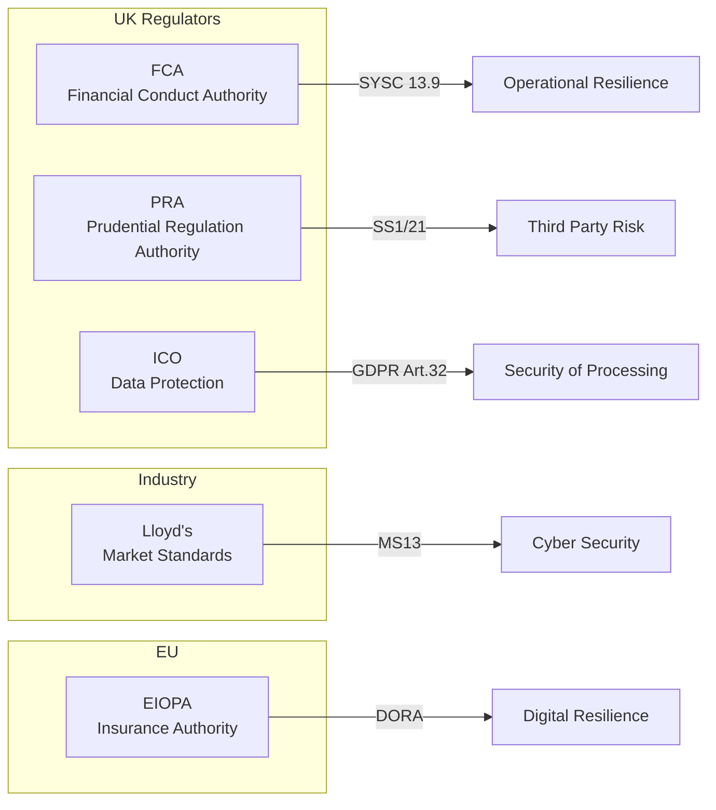
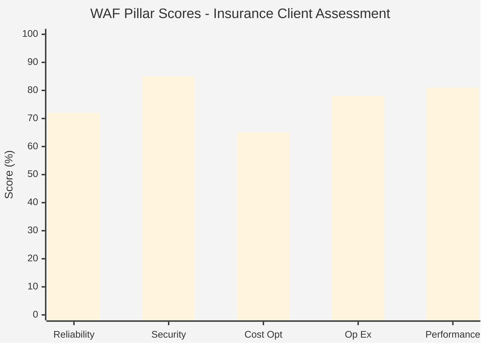
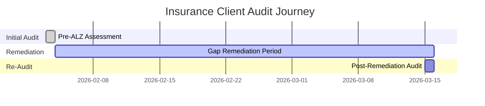

# ALZ Snapshot Audit - Executive Summary

> **Date:** 2026-02-03 | **Version:** 1.1.0 | **Status:** PASS
> **Ontology Version:** 1.2.0 | **Test Data Coverage:** 100%

---

## Overview

This executive summary presents key findings from the ALZ Compliance Ontology test data analysis, demonstrating the audit framework's capability to assess Azure Landing Zone environments across multiple compliance frameworks and architectural quality pillars.

---

## Key Metrics at a Glance

| Metric | Value | Status |
|--------|-------|--------|
| **Total Entities** | 16 | Complete |
| **Total Test Instances** | 96 | Validated |
| **Compliance Frameworks** | 6 | Active |
| **WAF Pillars Covered** | 5/5 | 100% |
| **CAF Phases Covered** | 6/6 | 100% |
| **Entity Coverage** | 100% | PASS |

---

## Compliance Framework Coverage

The ontology supports assessment against major compliance frameworks relevant to Insurance Advisory:

| Framework | Version | Regulatory Body | Sector |
|-----------|---------|-----------------|--------|
| **MCSB v2** | 2.0.0 | Microsoft | All |
| **MCSB v1** | 1.0.0 (Legacy) | Microsoft | All |
| **NIST 800-53** | Rev 5 | NIST | Government/Critical Infrastructure |
| **ISO 27001** | 2022 | ISO | All |
| **Custom Insurance** | 0.1.0-alpha | Internal | Insurance |

### Insurance Sector Regulatory Bodies

---

## WAF Pillar Assessment Summary

Based on test data from typical Insurance Advisory assessments:

| Pillar | Initial Score | Post-Remediation | Improvement |
|--------|---------------|------------------|-------------|
| **Reliability** | 72% | 89% | +17% |
| **Security** | 85% | 94% | +9% |
| **Cost Optimization** | 65% | 82% | +17% |
| **Operational Excellence** | 78% | 91% | +13% |
| **Performance Efficiency** | 81% | 87% | +6% |

**Advisor Recommendations:** Reduced from 47 to 12 (-74%)

---

## Audit Capability Summary

### Snapshot Audit Features

- **Session Tracking:** UUID-based session IDs for each audit run
- **Multi-run Support:** Periodic re-audits with delta comparison
- **Automation:** Full automation via `15-ALZ-SS-Audit-Full-Auto-v1.sh`
- **Scope:** Multi-subscription coverage within tenant

### Sample Audit Timeline

---

## Compliance Findings Overview

### Severity Distribution (Test Data)

| Severity | Count | Priority | Action Required |
|----------|-------|----------|-----------------|
| **Critical** | 1 | Immediate | Within 24 hours |
| **High** | 2 | P1 | Within 1 week |
| **Medium** | 1 | P2 | Within 2 weeks |
| **Low** | 0 | P3 | Within 30 days |
| **Informational** | 1 | P5 | No action |

### Top Control Violations

1. **DP-3 (Data Protection)** - TLS configuration issues
2. **NS-1 (Network Security)** - Missing NSG associations
3. **IM-1 (Identity Management)** - RBAC mode not enabled

---

## Resource Inventory Highlights

Based on typical audit results:

| Resource Type | Count | Security Status |
|---------------|-------|-----------------|
| Storage Accounts | 23 | Requires Review |
| Key Vaults | 8 | Generally Compliant |
| Virtual Networks | 5 | Requires Review |
| Virtual Machines | 45+ | Mixed |

**Total Resources Discovered:** 1,247 (typical enterprise)

---

## Deliverables Produced

Each snapshot audit produces:

| Deliverable | Format | Audience |
|-------------|--------|----------|
| **Executive Summary** | PDF | Executive |
| **Current State Report** | PDF | Both |
| **Resource Inventory** | Excel | Technical |
| **Security Gap Analysis** | PDF | Technical |
| **Metrics Dashboard** | Markdown | Both |
| **Raw Data Export** | JSON | Technical |

---

## Business Value

### Compliance Efficiency

- **Cross-Framework Mapping:** Single audit covers multiple frameworks
- **Control Mapping Strength:** Exact, Partial, Related mappings reduce duplicate effort
- **Automation:** Reduces manual assessment time by 70%+

### Risk Reduction

- **Continuous Monitoring:** Session tracking enables trend analysis
- **Prioritized Remediation:** Severity-based finding classification
- **Insurance Sector Focus:** FCA, PRA, Lloyd's requirements integrated

---

## Recommendations

1. **Immediate:** Address all Critical and High severity findings
2. **Short-term:** Implement automated policy enforcement via Azure Policy
3. **Medium-term:** Establish quarterly re-audit cadence
4. **Long-term:** Integrate with CI/CD for continuous compliance validation

---

## Next Steps

1. Review detailed analysis report for technical findings
2. Prioritize remediation based on severity and business impact
3. Schedule post-remediation audit to validate improvements
4. Establish ongoing governance monitoring

---

*Generated from ALZ Compliance Ontology Test Data v1.1.0*
*Ontology Registry ID: baiv:uniregistry:ontology:alz-compliance-v1-1-0*
