# ALZ Snapshot Audit - Mermaid Diagram Library

> **Version:** 1.0.0 | **Date:** 2026-02-03
> **Purpose:** Reusable Mermaid diagrams for ALZ Audit documentation and presentations

---

## Table of Contents

1. [Overview Diagrams](#1-overview-diagrams)
2. [Entity Relationship Diagrams](#2-entity-relationship-diagrams)
3. [Workflow Diagrams](#3-workflow-diagrams)
4. [Framework & Compliance Diagrams](#4-framework--compliance-diagrams)
5. [WAF Pillar Diagrams](#5-waf-pillar-diagrams)
6. [CAF Phase Diagrams](#6-caf-phase-diagrams)
7. [Data Distribution Diagrams](#7-data-distribution-diagrams)
8. [Timeline & Gantt Diagrams](#8-timeline--gantt-diagrams)
9. [Architecture Diagrams](#9-architecture-diagrams)
10. [Analysis Charts](#10-analysis-charts)

---

## 1. Overview Diagrams

### 1.1 ALZ Audit Ecosystem

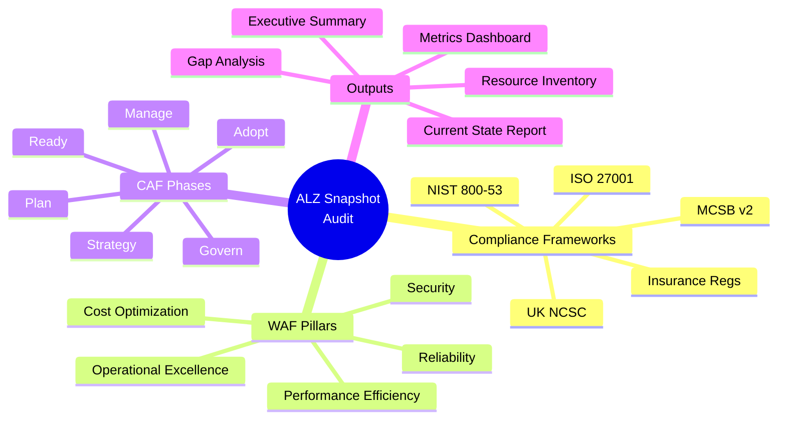

### 1.2 High-Level Process Flow

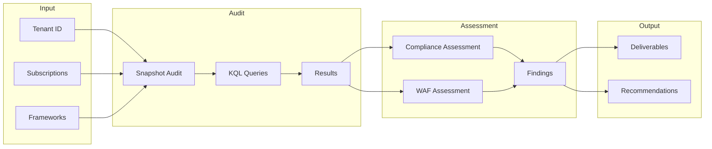

---

## 2. Entity Relationship Diagrams

### 2.1 Complete Entity Relationship Model

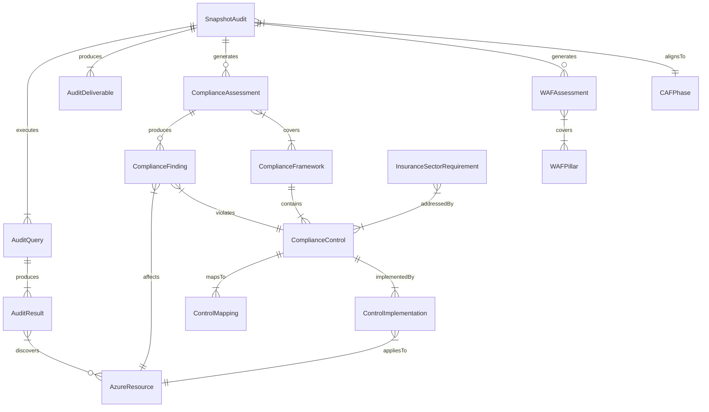

### 2.2 Core Compliance Entities

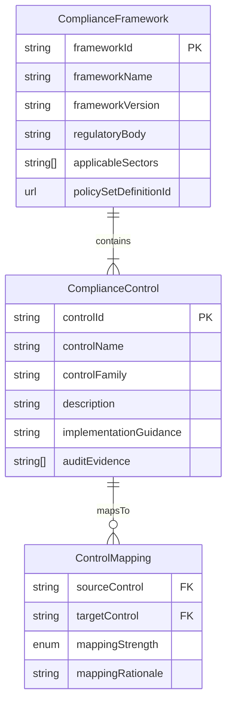

### 2.3 Audit Workflow Entities

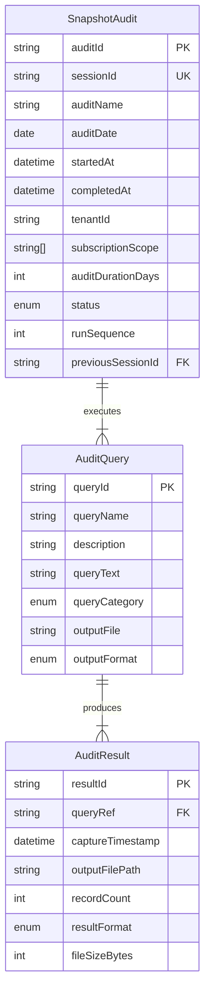

---

## 3. Workflow Diagrams

### 3.1 Audit Execution Flow

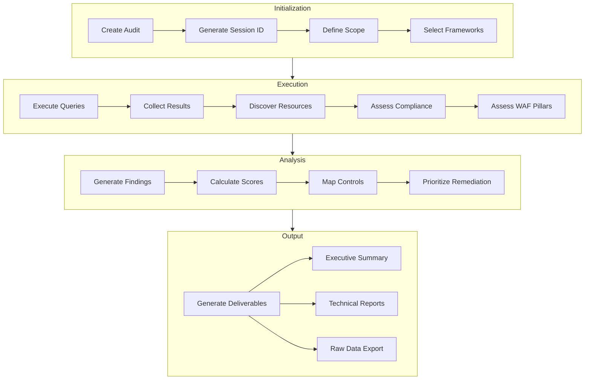

### 3.2 Audit State Machine

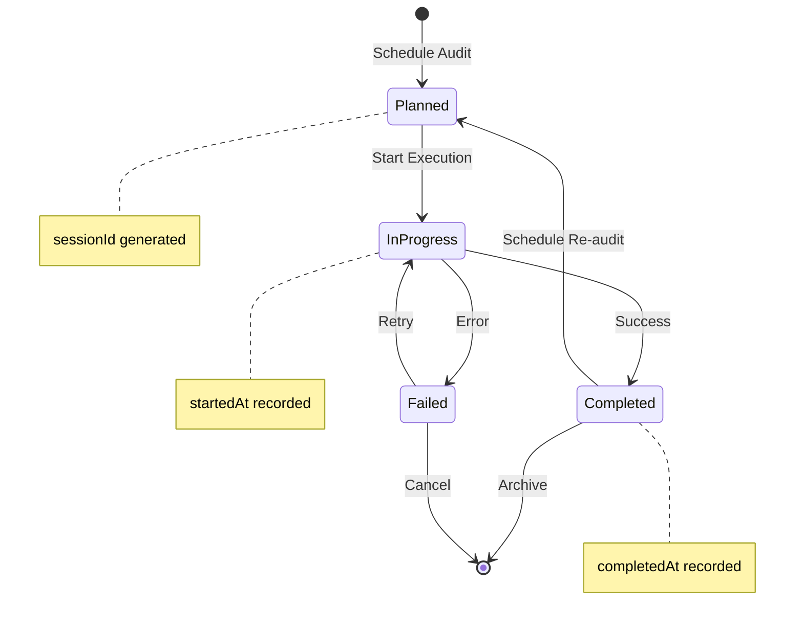

### 3.3 Query Execution Flow

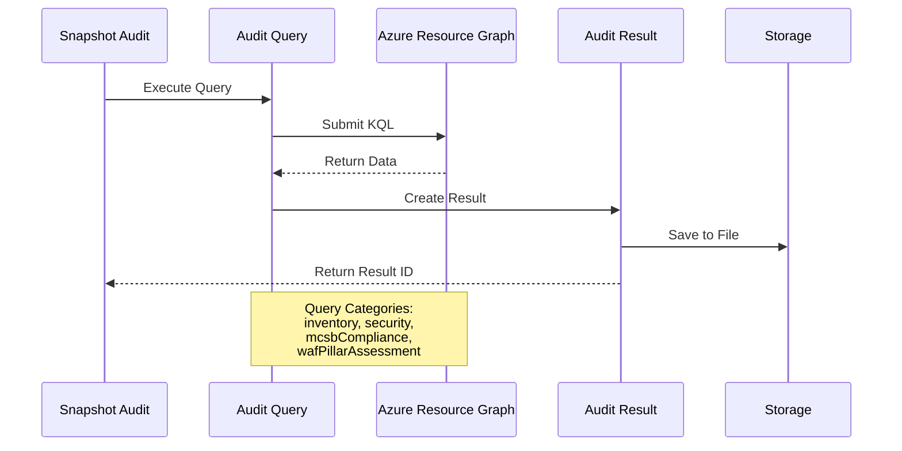

### 3.4 Multi-Run Audit Sequence

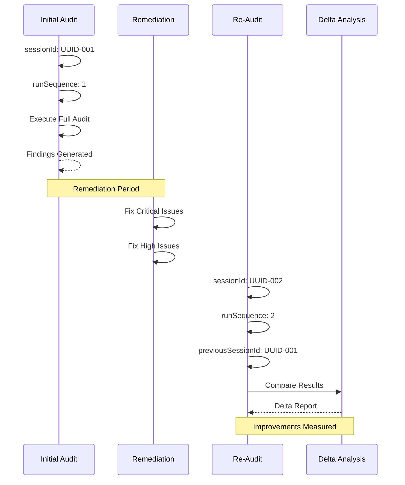

---

## 4. Framework & Compliance Diagrams

### 4.1 Framework Hierarchy

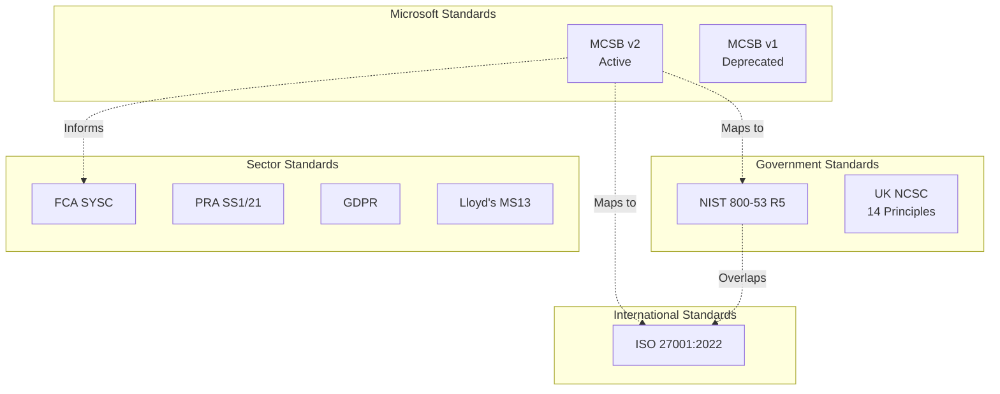

### 4.2 Control Family Distribution

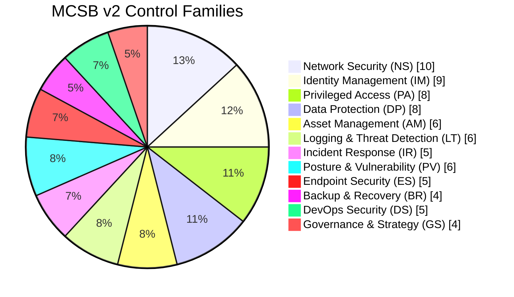

### 4.3 Control Mapping Network

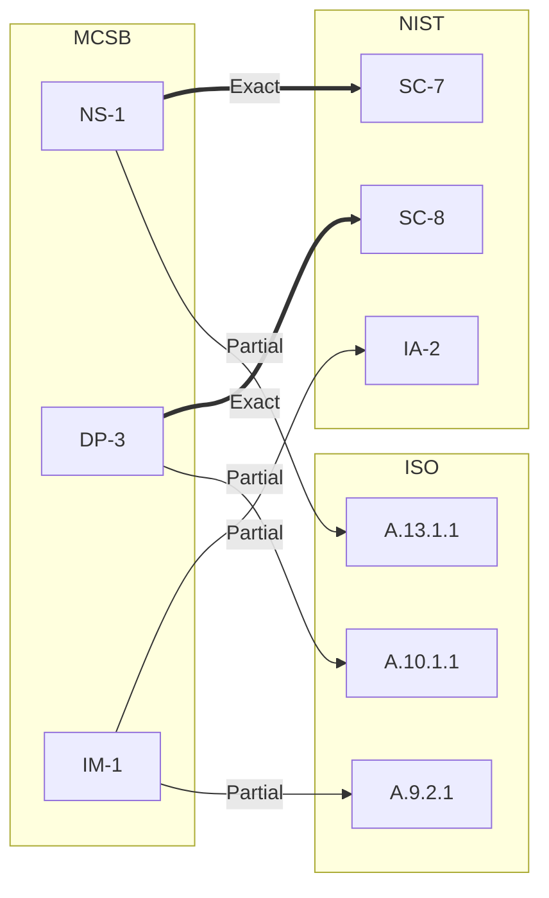

---

## 5. WAF Pillar Diagrams

### 5.1 WAF Pillar Overview

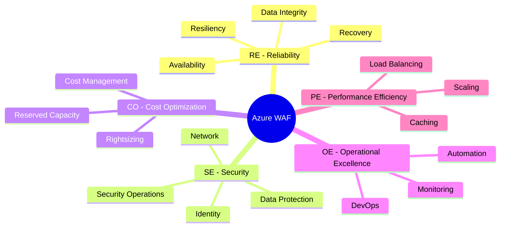

### 5.2 WAF to Advisor Category Mapping

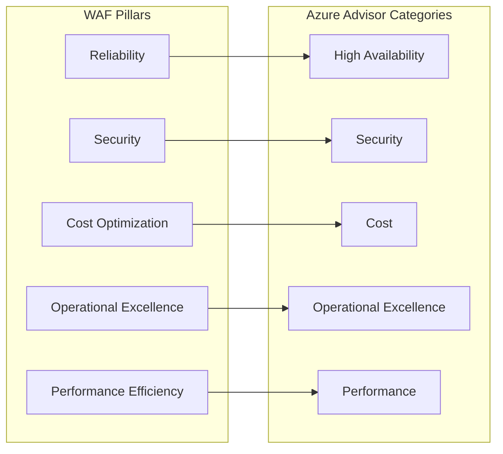

### 5.3 WAF Score Radar

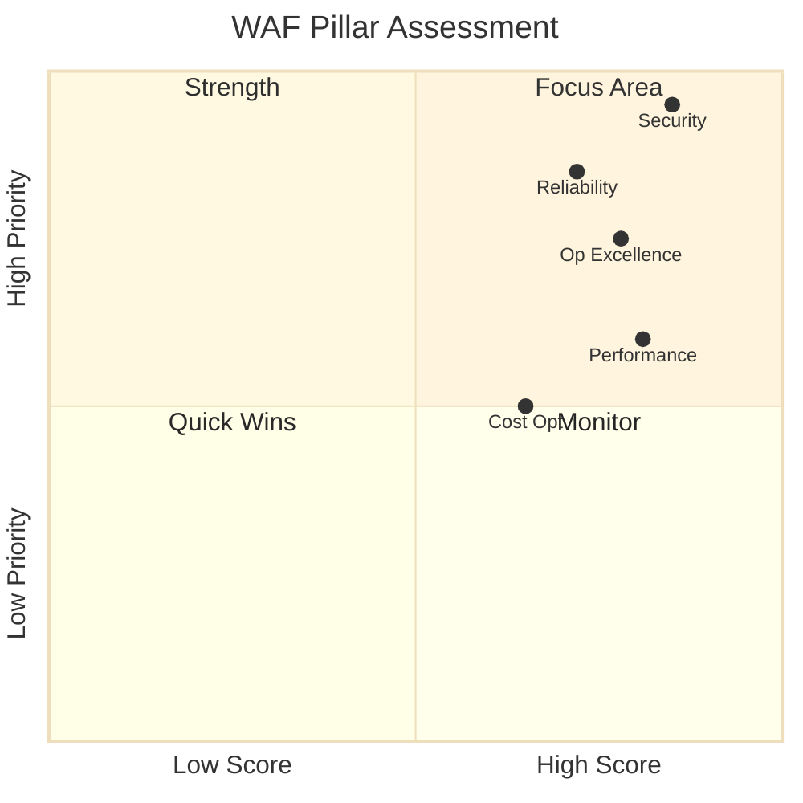

---

## 6. CAF Phase Diagrams

### 6.1 CAF Journey

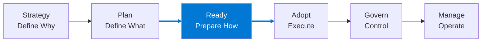

### 6.2 CAF with Activities

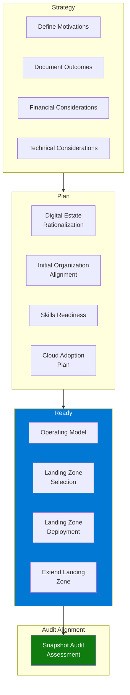

### 6.3 CAF Phase Details

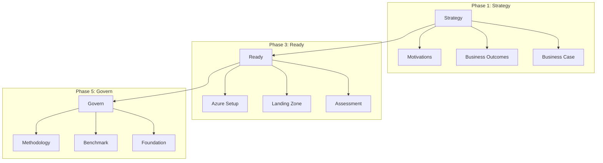

---

## 7. Data Distribution Diagrams

### 7.1 Test Data Distribution

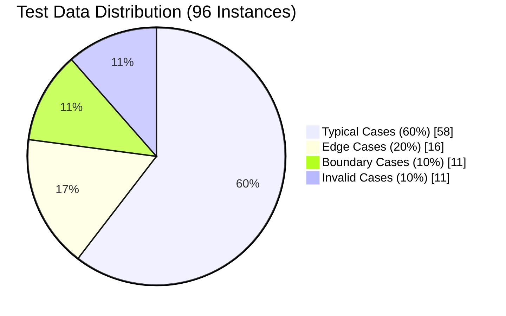

### 7.2 Entity Instance Distribution

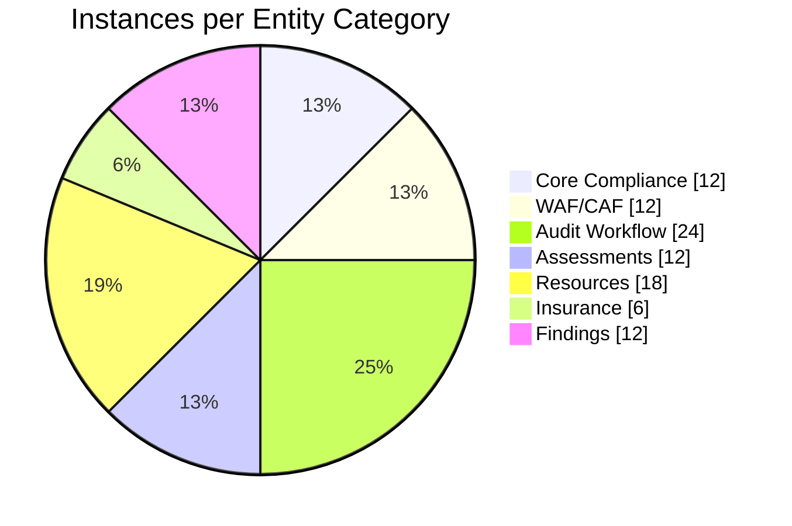

### 7.3 Finding Severity Distribution

```mermaid
pie showData
    title Compliance Findings by Severity
    "Critical" : 1
    "High" : 2
    "Medium" : 1
    "Informational" : 1
```

---

## 8. Timeline & Gantt Diagrams

### 8.1 Audit Journey Timeline

```mermaid
gantt
    title Insurance Client Audit Journey
    dateFormat  YYYY-MM-DD

    section Initial Audit
    Pre-ALZ Assessment      :done, a1, 2026-02-03, 5d

    section Remediation
    Critical Fixes          :crit, a2, 2026-02-08, 7d
    High Priority Fixes     :a3, 2026-02-15, 14d
    Medium Priority Fixes   :a4, 2026-03-01, 14d

    section Re-Audit
    Post-Remediation Audit  :a5, 2026-03-15, 3d

    section Ongoing
    Quarterly Review        :a6, 2026-06-15, 2d
```

### 8.2 Regulatory Timeline

```mermaid
gantt
    title Insurance Regulatory Timeline
    dateFormat  YYYY-MM-DD

    section UK Regulators
    GDPR Art.32 (ICO)       :done, 2018-05-25, 1d
    PRA SS1/21              :done, 2021-03-31, 1d
    FCA SYSC 13.9           :done, 2022-03-31, 1d

    section Industry
    Lloyd's MS13            :active, 2023-01-01, 730d

    section Future
    EIOPA DORA              :2027-01-01, 180d
```

### 8.3 Audit Execution Timeline

```mermaid
gantt
    title Snapshot Audit Execution
    dateFormat  HH:mm
    axisFormat  %H:%M

    section Queries
    Resource Inventory      :a1, 09:00, 15m
    Security Config         :a2, 09:15, 10m
    MCSB Compliance         :a3, 09:25, 15m
    WAF Assessment          :a4, 09:40, 20m

    section Analysis
    Generate Findings       :b1, 10:00, 30m
    Calculate Scores        :b2, 10:30, 15m

    section Reporting
    Generate Deliverables   :c1, 10:45, 45m
```

---

## 9. Architecture Diagrams

### 9.1 Azure Landing Zone Audit Scope

```mermaid
graph TB
    subgraph "Azure Tenant"
        subgraph "Management Group Hierarchy"
            MG[Root MG]
            MG --> PLT[Platform MG]
            MG --> LZ[Landing Zones MG]

            PLT --> CONN[Connectivity]
            PLT --> MGMT[Management]
            PLT --> ID[Identity]

            LZ --> PROD[Production]
            LZ --> DEV[Development]
        end

        subgraph "Audit Scope"
            PROD --> SUB1[Sub: Production-001]
            PROD --> SUB2[Sub: Production-002]
            DEV --> SUB3[Sub: Development-001]
        end
    end

    style SUB1 fill:#0078D4,color:#fff
    style SUB2 fill:#0078D4,color:#fff
```

### 9.2 Audit Data Flow

```mermaid
graph LR
    subgraph "Data Sources"
        ARG[Azure Resource Graph]
        DFC[Defender for Cloud]
        ADV[Azure Advisor]
        POL[Azure Policy]
    end

    subgraph "Audit Engine"
        QE[Query Executor]
        AN[Analyzer]
        SC[Score Calculator]
    end

    subgraph "Outputs"
        JSON[JSON Results]
        CSV[CSV Reports]
        MD[Markdown Docs]
        PDF[PDF Reports]
    end

    ARG --> QE
    DFC --> QE
    ADV --> QE
    POL --> QE

    QE --> AN
    AN --> SC

    SC --> JSON
    SC --> CSV
    SC --> MD
    SC --> PDF
```

---

## 10. Analysis Charts

### 10.1 WAF Score Comparison

```mermaid
%%{init: {'theme': 'base'}}%%
xychart-beta
    title "WAF Scores: Initial vs Post-Remediation"
    x-axis [RE, SE, CO, OE, PE]
    y-axis "Score (%)" 0 --> 100
    bar "Initial" [72, 85, 65, 78, 81]
    bar "Post-Remediation" [89, 94, 82, 91, 87]
```

### 10.2 Compliance Score Progression

```mermaid
%%{init: {'theme': 'base'}}%%
xychart-beta
    title "Compliance Score Over Time"
    x-axis ["Feb (Pre)", "Mar (Q1)", "May (Post)"]
    y-axis "Score (%)" 0 --> 100
    line "Overall Score" [72, 85, 94]
    line "Target" [90, 90, 90]
```

### 10.3 Findings Reduction

```mermaid
%%{init: {'theme': 'base'}}%%
xychart-beta
    title "Findings Count Over Time"
    x-axis ["Initial", "Q1 Review", "Post-Remediation"]
    y-axis "Count" 0 --> 20
    bar [15, 8, 3]
```

### 10.4 Resource Type Distribution

```mermaid
pie showData
    title Resources by Type
    "Storage Accounts" : 23
    "Key Vaults" : 8
    "Virtual Networks" : 5
    "Virtual Machines" : 45
    "SQL Databases" : 12
    "App Services" : 18
    "Other" : 1136
```

---

## Usage Notes

### Rendering Mermaid Diagrams

These diagrams can be rendered in:
- GitHub Markdown files
- Azure DevOps Wikis
- VS Code with Mermaid extension
- Mermaid Live Editor (https://mermaid.live)
- Documentation tools supporting Mermaid

### Customization

Diagrams can be customized using Mermaid theme variables:

```mermaid
%%{init: {'theme': 'base', 'themeVariables': { 'primaryColor': '#0078D4', 'primaryTextColor': '#fff'}}}%%
graph LR
    A[Customized] --> B[Diagram]
```

### Export Formats

From Mermaid Live Editor, export to:
- PNG (raster image)
- SVG (vector image)
- PDF (document)

---

*Generated from ALZ Compliance Ontology Test Data v1.1.0*
*Diagram Library Version: 1.0.0*
