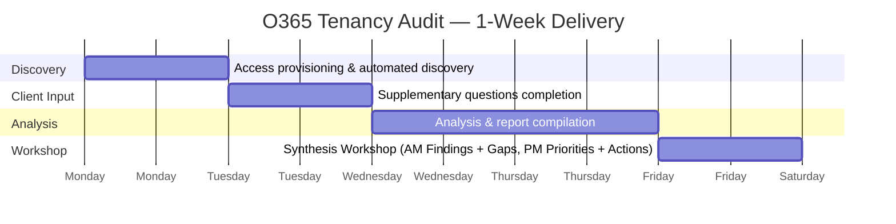
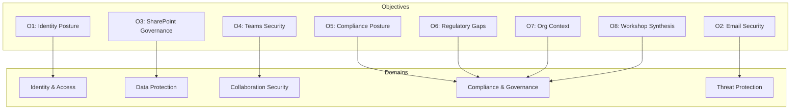

# O365 Tenancy Snapshot Audit
## Vision, Strategy, Objectives & Metrics (VSOM)

**Document Version:** 1.0
**Date:** February 2026
**Document Type:** VSOM Framework
**Classification:** Client Engagement

---

## Document Purpose

This document applies the **VSOM (Vision, Strategy, Objectives, Metrics)** framework to define a rapid snapshot audit of the client's Microsoft 365 tenancy. Following the proven ALZ Snapshot Audit pattern, this is a **quick, evidence-based litmus test** of M365 security posture, governance, and compliance — not a transformation programme.

**Client Context:** Insurance sector, 800 headcount, Office 365 licensing.

---

## 1. Vision

### 1.1 Audit Vision Statement

> **Gain clear, evidence-based visibility of the current Microsoft 365 tenancy configuration within days — enabling informed decisions on identity security, data protection, collaboration governance, and regulatory alignment without disrupting business operations.**

### 1.2 Vision Principles

| Principle | Description |
|-----------|-------------|
| **Speed over Perfection** | Rapid baseline, not exhaustive analysis |
| **Evidence-Based** | Graph API / PowerShell automated discovery |
| **Minimal Disruption** | Read-only assessment, no changes to tenancy |
| **Decision Enablement** | Outputs support workshop synthesis and prioritisation |
| **Time Efficiency** | Client provides inputs; we synthesise in 1-day workshop |

### 1.3 What This Audit IS and IS NOT

| This Audit IS | This Audit IS NOT |
|---------------|-------------------|
| A point-in-time M365 configuration snapshot | An ongoing monitoring solution |
| Automated Graph API discovery | Manual interviews and walkthroughs |
| Identity and collaboration posture assessment | Penetration testing |
| Compliance gap identification | Remediation implementation |
| Input for EA review and design workshop | A transformation roadmap |

---

## 2. Strategy

### 2.1 Audit Strategy Statement

> **Deploy automated Graph API and PowerShell tooling to extract, analyse, and report on the M365 tenancy configuration, supplemented by targeted client questions to capture operational context for a 1-day synthesis workshop.**

### 2.2 Strategic Approach

```mermaid
flowchart LR
    subgraph ClientPrep["Client Preparation (Pre-Workshop)"]
        C1[Grant read-only access]
        C2[Complete supplementary questions]
        C3[Provide existing documentation]
    end

    subgraph Automated["Automated Discovery"]
        A1[Entra ID Configuration]
        A2[Exchange Online Settings]
        A3[SharePoint/OneDrive Policies]
        A4[Teams Configuration]
        A5[DLP & Sensitivity Labels]
        A6[Defender Settings]
    end

    subgraph Workshop["1-Day Synthesis Workshop"]
        W1[Findings Presentation]
        W2[Gap Analysis Review]
        W3[Priority Setting]
        W4[Action Planning]
    end

    ClientPrep --> Automated --> Workshop

    style ClientPrep fill:#fff3e0
    style Automated fill:#e3f2fd
    style Workshop fill:#e8f5e9
```

### 2.3 Time Investment Model

| Activity | Client Team | Consultant | Automation |
|----------|-------------|------------|------------|
| Access provisioning (Global Reader) | 30 mins | - | - |
| Supplementary questions | 1-2 hours | - | - |
| Automated discovery execution | - | - | 2-3 hours |
| Documentation provision | 30 mins | - | - |
| Analysis and report preparation | - | 4-6 hours | - |
| **1-Day Synthesis Workshop** | **6 hours** | **6 hours** | - |
| **Total Client Time** | **~9 hours** | | |

### 2.4 Delivery Timeline

---

## 3. Objectives

### 3.1 Primary Objectives

| # | Objective | Success Indicator |
|---|-----------|-------------------|
| **O1** | Assess Entra ID security posture | MFA, Conditional Access, PIM status documented |
| **O2** | Evaluate Exchange Online security | Mail flow rules, anti-phishing, DKIM/DMARC checked |
| **O3** | Review SharePoint/OneDrive governance | External sharing, DLP, sensitivity labels assessed |
| **O4** | Assess Teams collaboration security | Guest access, meeting policies, external access reviewed |
| **O5** | Map M365 compliance posture | Secure Score captured, MCSB identity controls mapped |
| **O6** | Identify insurance regulatory gaps | FCA, PRA, Lloyd's, GDPR alignment assessed |
| **O7** | Capture organisational context | Supplementary questions completed |
| **O8** | Synthesise findings in workshop | Prioritised action plan agreed |

### 3.2 Objective Alignment to Assessment Domains

---

## 4. Metrics

### 4.1 Audit Completion Metrics

| Metric | Target | Measurement Method |
|--------|--------|-------------------|
| **Graph API Query Success Rate** | ≥95% | Successful queries / total queries |
| **Assessment Domain Coverage** | 5/5 domains | All domains assessed |
| **Supplementary Question Response** | 100% | All questions answered |
| **Workshop Attendance** | Key stakeholders present | IT, Security, Compliance leads |
| **Time to Completion** | ≤5 days | Calendar days from access grant |

### 4.2 Security Posture Metrics (Captured)

| Metric | Source | Purpose |
|--------|--------|---------|
| **Microsoft Secure Score** | M365 Security portal | Overall security posture |
| **MFA Registration %** | Entra ID reports | Identity protection coverage |
| **Conditional Access Policy Count** | Entra ID | Access governance maturity |
| **Legacy Auth Enabled** | Sign-in logs / CA policies | High-risk authentication |
| **Global Admin Count** | Entra ID roles | Privileged access exposure |
| **External Sharing Level** | SharePoint admin | Data exposure risk |
| **DLP Policy Count** | Purview compliance | Data protection maturity |
| **Mail Flow Rules (risky)** | Exchange admin | Email security posture |
| **Guest User Count** | Entra ID | External access exposure |

### 4.3 Metrics Dashboard Template

| Category | Metric | Current | Benchmark (800 users) | Status |
|----------|--------|---------|----------------------|--------|
| **Identity** | MFA Registration | _TBD_ | ≥99% | ⬜ |
| **Identity** | Global Admins | _TBD_ | ≤5 | ⬜ |
| **Identity** | Conditional Access Policies | _TBD_ | ≥5 | ⬜ |
| **Identity** | Legacy Auth Blocked | _TBD_ | Yes | ⬜ |
| **Identity** | PIM Enabled | _TBD_ | Yes | ⬜ |
| **Email** | DKIM Enabled (all domains) | _TBD_ | Yes | ⬜ |
| **Email** | DMARC Policy | _TBD_ | Reject/Quarantine | ⬜ |
| **Email** | Anti-Phishing Policy | _TBD_ | Strict | ⬜ |
| **Data** | DLP Policies Active | _TBD_ | ≥3 | ⬜ |
| **Data** | Sensitivity Labels Published | _TBD_ | Yes | ⬜ |
| **Data** | External Sharing | _TBD_ | Restricted | ⬜ |
| **Collaboration** | Guest User Count | _TBD_ | Reviewed quarterly | ⬜ |
| **Collaboration** | Teams External Access | _TBD_ | Restricted | ⬜ |
| **Security** | Secure Score | _TBD_ | ≥70% | ⬜ |

---

## 5. Client Context Capture

### 5.1 Organisation Profile

| Attribute | Client Response |
|-----------|-----------------|
| **Organisation Name** | ___________________________ |
| **Sector** | Insurance |
| **Headcount** | 800 |
| **M365 Licensing** | Office 365 (tier TBC) |
| **Tenant Type** | ☐ Single ☐ Multi-tenant |
| **Primary Region** | ___________________________ |
| **Regulatory Requirements** | FCA, PRA, Lloyd's, GDPR |

### 5.2 Supplementary Questions

See `06-O365-SS-Audit-Client-Questions-v1.md` for the full questionnaire.

---

## 6. Assessment Domains

### 6.1 Domain 1: Identity & Access (Entra ID)

| Check | Query Method | Risk |
|-------|-------------|------|
| MFA registration status | Graph API: authenticationMethods | Critical |
| Conditional Access policies | Graph API: conditionalAccess | Critical |
| Legacy authentication status | Sign-in logs / CA policies | Critical |
| Global Administrator count | Graph API: directoryRoles | High |
| PIM enabled and active | Graph API: privilegedAccess | High |
| Service principal inventory | Graph API: servicePrincipals | Medium |
| Guest user inventory | Graph API: users (guest) | Medium |
| Password policies | Graph API: authorizationPolicy | Medium |
| Sign-in risk policies | Graph API: identityProtection | High |
| Named locations | Graph API: conditionalAccess | Low |

### 6.2 Domain 2: Email Security (Exchange Online)

| Check | Query Method | Risk |
|-------|-------------|------|
| DKIM configuration | PowerShell: Get-DkimSigningConfig | Medium |
| DMARC records | DNS: TXT records | Medium |
| SPF records | DNS: TXT records | Medium |
| Mail flow rules (forwarding) | PowerShell: Get-TransportRule | High |
| Anti-phishing policies | PowerShell: Get-AntiPhishPolicy | High |
| Anti-spam policies | PowerShell: Get-HostedConnectionFilterPolicy | Medium |
| Safe Attachments | PowerShell: Get-SafeAttachmentPolicy | High |
| Safe Links | PowerShell: Get-SafeLinksPolicy | Medium |
| Unified audit log enabled | PowerShell: Get-AdminAuditLogConfig | Critical |
| Mailbox forwarding rules | PowerShell: Get-InboxRule | High |

### 6.3 Domain 3: Data Protection (SharePoint/OneDrive/Purview)

| Check | Query Method | Risk |
|-------|-------------|------|
| External sharing settings | SharePoint Admin API | High |
| OneDrive sharing defaults | SharePoint Admin API | High |
| DLP policies | Graph API: dlp/policies | Medium |
| Sensitivity labels | Graph API: informationProtection | Medium |
| Retention policies | PowerShell: Get-RetentionCompliancePolicy | Medium |
| Site collection admin inventory | SharePoint Admin API | Medium |
| Information barriers | Graph API: informationBarriers | Low |
| Data residency config | Tenant settings | Medium |

### 6.4 Domain 4: Collaboration Security (Teams)

| Check | Query Method | Risk |
|-------|-------------|------|
| External access settings | Teams Admin API | Medium |
| Guest access policies | Teams Admin API | Medium |
| Meeting policies | Teams Admin API | Low |
| Messaging policies | Teams Admin API | Low |
| App permission policies | Teams Admin API | Medium |
| Channel creation policies | Teams Admin API | Low |
| Teams creation restrictions | Entra ID group settings | Medium |

### 6.5 Domain 5: Threat Protection (Defender for Office 365)

| Check | Query Method | Risk |
|-------|-------------|------|
| Defender for O365 plan | License check | High |
| Safe Attachments global | PowerShell | High |
| Safe Links global | PowerShell | Medium |
| Anti-phishing impersonation | PowerShell | High |
| Attack simulation training | Admin portal | Low |
| Threat explorer access | Role check | Low |

---

## 7. Compliance Framework Alignment

### 7.1 Framework Mapping

| Framework | M365 Controls |
|-----------|---------------|
| **MCSB v2** | IM-1 to IM-8 (Identity), DP-1 to DP-8 (Data Protection) |
| **ISO 27001** | A.9 Access Control, A.13 Communications, A.18 Compliance |
| **GDPR** | Art.32 Security, Art.30 Records, Art.25 Privacy by Design |

### 7.2 Insurance Sector Alignment

| Regulator | M365 Relevance |
|-----------|----------------|
| **FCA SYSC 13.9** | Email continuity, operational resilience |
| **PRA SS1/21** | M365 as third-party service dependency |
| **Lloyd's MS13** | Email security, phishing controls |
| **ICO/GDPR** | Data in Exchange, SharePoint, OneDrive |
| **DORA (2027)** | M365 as critical ICT service |

---

## 8. Workshop Synthesis Plan

### 8.1 1-Day Workshop Agenda

| Time | Session | Format | Outcome |
|------|---------|--------|---------|
| 09:00-09:30 | Introduction & Methodology | Presentation | Context set |
| 09:30-10:30 | **Identity & Access Findings** | Presentation + Discussion | MFA/CA/PIM gaps agreed |
| 10:30-10:45 | Break | | |
| 10:45-11:45 | **Email & Threat Protection Findings** | Presentation + Discussion | Email security gaps agreed |
| 11:45-12:30 | **Data Protection & Governance Findings** | Presentation + Discussion | DLP/sharing gaps agreed |
| 12:30-13:15 | Lunch | | |
| 13:15-14:00 | **Collaboration & Teams Findings** | Presentation + Discussion | Teams governance agreed |
| 14:00-14:45 | **Compliance & Regulatory Gap Analysis** | Workshop | Regulatory priorities set |
| 14:45-15:00 | Break | | |
| 15:00-15:45 | **Risk Prioritisation Exercise** | Workshop | Top 10 risks ranked |
| 15:45-16:30 | **Action Planning** | Workshop | 30/60/90-day plan drafted |
| 16:30-17:00 | **Wrap-up & Next Steps** | Summary | Actions assigned |

### 8.2 Workshop Attendees

| Role | Required | Purpose |
|------|----------|---------|
| IT Director / CTO | Required | Decision authority |
| M365 Administrator | Required | Technical context |
| Security Lead / CISO | Required | Risk ownership |
| Compliance / DPO | Required | Regulatory context |
| Service Desk Lead | Optional | Operational impact |
| HR Representative | Optional | Employee data context |

### 8.3 Workshop Deliverables

| Deliverable | Format | Description |
|-------------|--------|-------------|
| Findings Presentation | PowerPoint/PDF | Full audit findings |
| Gap Analysis Matrix | Excel | Control-by-control gaps |
| Risk Register | Excel | Prioritised risk list |
| Action Plan | Excel/PDF | 30/60/90-day actions |
| Executive Summary | PDF (1-2 pages) | Board-ready summary |

---

## 9. Scope & Deliverables

### 9.1 In Scope

| Domain | Automated Discovery | Manual Review |
|--------|---------------------|---------------|
| **Entra ID** | ✓ MFA, CA, roles, PIM | - |
| **Exchange Online** | ✓ Policies, rules, DKIM | DNS records |
| **SharePoint/OneDrive** | ✓ Sharing, DLP, labels | - |
| **Teams** | ✓ Policies, external access | - |
| **Defender for O365** | ✓ Policy status | - |
| **Purview Compliance** | ✓ DLP, retention | - |
| **Organisational Context** | - | Supplementary questions |

### 9.2 Out of Scope

- Remediation or configuration changes
- Individual mailbox analysis
- Full eDiscovery or content inspection
- User behaviour analytics deep dive
- Migration planning
- Penetration testing
- Power Platform (separate audit)
- Azure infrastructure (separate ALZ audit)

### 9.3 Deliverables

| Deliverable | Format | When |
|-------------|--------|------|
| Automated discovery data | JSON/CSV | Pre-workshop |
| Findings presentation | PDF/PPTX | Workshop |
| Gap analysis matrix | Excel | Workshop |
| Risk register | Excel | Workshop |
| Action plan (30/60/90) | PDF | Post-workshop |
| Executive summary | PDF | Post-workshop |

---

## Appendix: Sizing Considerations for 800 Users

| Factor | Implication |
|--------|-------------|
| **800 headcount** | Mid-size tenant; full Graph API queries feasible |
| **Office 365 licensing** | May lack Defender P2, PIM (depends on tier) |
| **Insurance sector** | Enhanced regulatory requirements (FCA, PRA) |
| **Expected guest users** | Estimate 50-150 external collaborators |
| **Expected groups** | Estimate 200-400 M365 groups |
| **Expected mail flow rules** | Estimate 10-50 transport rules |
| **Expected SharePoint sites** | Estimate 100-300 site collections |

### Licensing Gap Check

| Feature | E1 | E3 | E5 | Impact on Audit |
|---------|----|----|----|----|
| MFA | ✓ | ✓ | ✓ | Always available |
| Conditional Access | Basic | ✓ | ✓ | E1 limited |
| PIM | - | - | ✓ | May not be available |
| Defender P1 | - | ✓ | ✓ | Safe Links/Attachments |
| Defender P2 | - | - | ✓ | Threat Explorer |
| DLP | Basic | ✓ | ✓ | E1 limited |
| Sensitivity Labels | - | ✓ | ✓ | May not be available |
| eDiscovery Premium | - | - | ✓ | Out of scope |

---

**Document Control**

| Version | Date | Author | Status | Changes |
|---------|------|--------|--------|---------|
| 1.0 | Feb 2026 | Advisory Team | Draft | Initial release |
