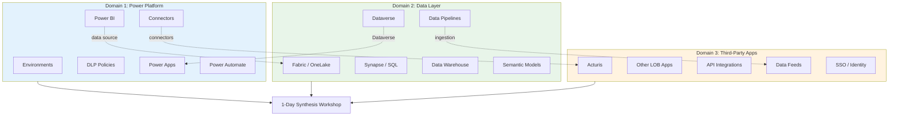
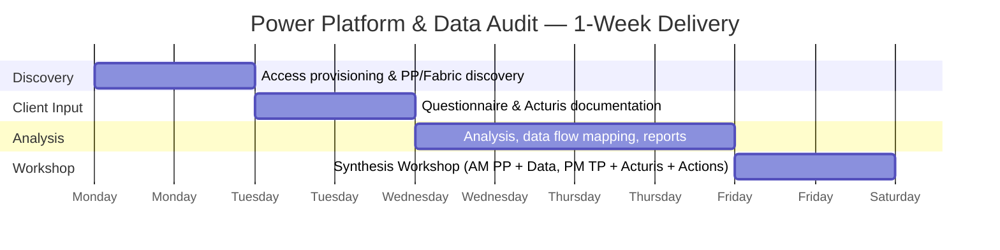
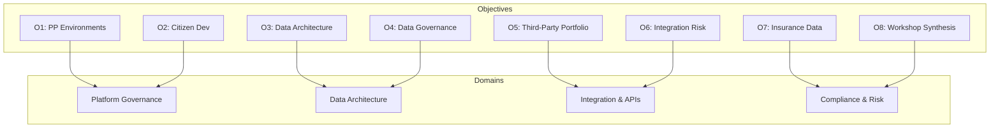
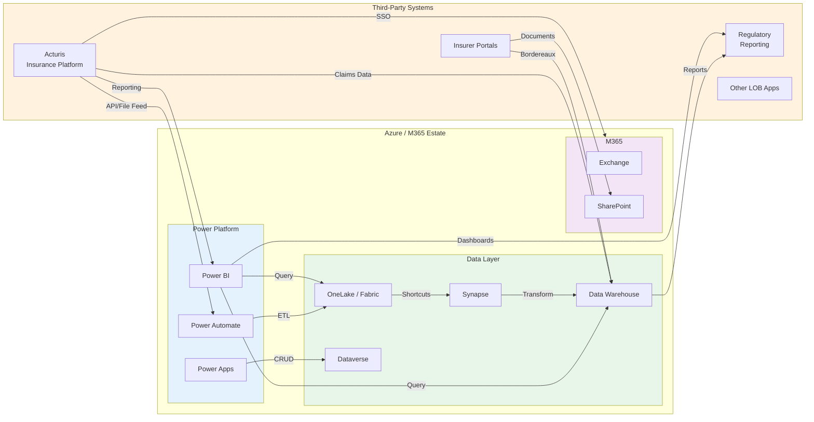
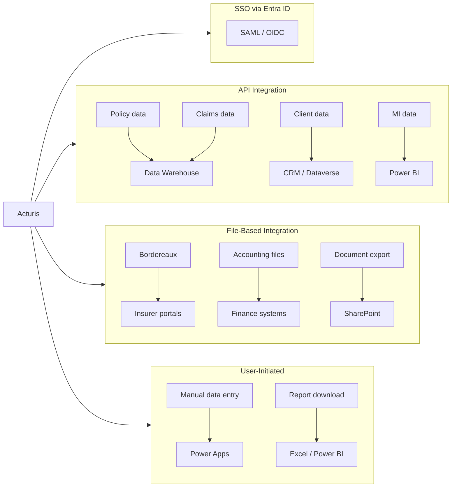
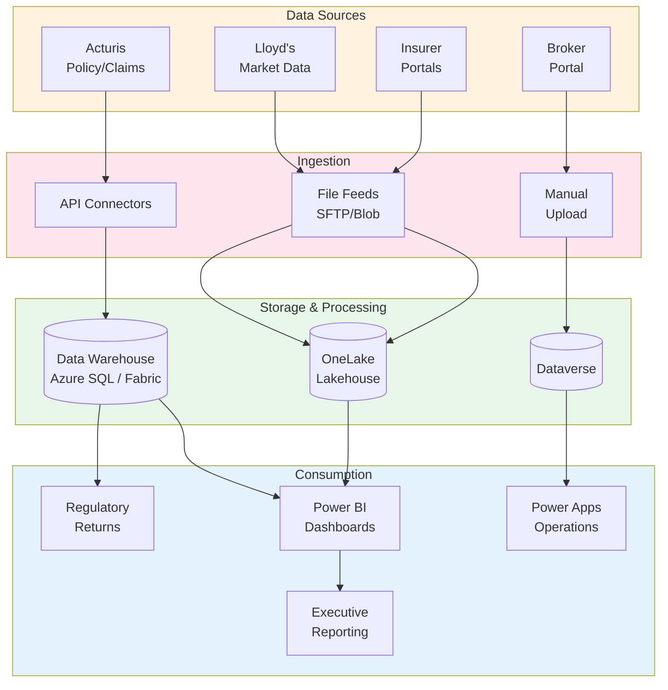

# Power Platform & Data Layer Snapshot Audit
## Vision, Strategy, Objectives & Metrics (VSOM)

**Document Version:** 1.0
**Date:** February 2026
**Document Type:** VSOM Framework
**Classification:** Client Engagement

---

## Document Purpose

This document applies the **VSOM framework** to define a rapid snapshot audit of the client's Power Platform estate, data layer (Fabric/OneLake/Synapse/Data Warehouse), and third-party application portfolio. This audit extends the ALZ and O365 snapshot patterns to cover citizen developer platforms, data governance, and critical business applications including **Acturis**.

**Client Context:** Insurance sector, 800 headcount, Office 365 licensing, Acturis as primary broking platform.

---

## 1. Vision

### 1.1 Audit Vision Statement

> **Gain clear visibility of Power Platform governance, data architecture maturity, and third-party application risk posture — enabling informed decisions on citizen developer controls, data strategy, and integration security for the insurance enterprise.**

### 1.2 Vision Principles

| Principle | Description |
|-----------|-------------|
| **Data-Centric** | Follow the data — understand where it lives, flows, and is governed |
| **Integration Aware** | Map connections between Power Platform, Acturis, and Azure |
| **Governance Focused** | Assess DLP, environment isolation, and citizen developer controls |
| **Risk-Informed** | Identify third-party dependencies and data sovereignty exposure |
| **Workshop-Ready** | All findings synthesised for 1-day workshop |

### 1.3 What This Audit IS and IS NOT

| This Audit IS | This Audit IS NOT |
|---------------|-------------------|
| A point-in-time Power Platform & data snapshot | An ongoing monitoring solution |
| Governance and policy assessment | Individual app code review |
| Data architecture and flow mapping | Data migration planning |
| Third-party risk identification | Vendor selection or procurement |
| Acturis integration assessment | Acturis replacement analysis |
| Input for EA review and data strategy | A data transformation roadmap |

---

## 2. Strategy

### 2.1 Audit Strategy Statement

> **Deploy Power Platform Admin API, Fabric REST API, and structured questionnaires to discover platform configuration, data estate topology, and third-party integration landscape — synthesised in a 1-day workshop with data and platform stakeholders.**

### 2.2 Three-Domain Approach

### 2.3 Time Investment Model

| Activity | Client Team | Consultant | Automation |
|----------|-------------|------------|------------|
| Access provisioning (PP Admin, Fabric) | 30 mins | - | - |
| Supplementary questions | 2-3 hours | - | - |
| Acturis integration documentation | 1-2 hours | - | - |
| Automated discovery execution | - | - | 2-3 hours |
| Analysis and report preparation | - | 6-8 hours | - |
| **1-Day Synthesis Workshop** | **6 hours** | **6 hours** | - |
| **Total Client Time** | **~12 hours** | | |

### 2.4 Delivery Timeline

---

## 3. Objectives

### 3.1 Primary Objectives

| # | Objective | Success Indicator |
|---|-----------|-------------------|
| **O1** | Map Power Platform environment landscape | All environments discovered, DLP coverage assessed |
| **O2** | Assess citizen developer governance | App/flow inventory, connector usage documented |
| **O3** | Evaluate data layer architecture | Fabric/Synapse/DW topology mapped |
| **O4** | Assess data governance maturity | OneLake security, sensitivity labels, lineage |
| **O5** | Map third-party application portfolio | Acturis + all integrated apps documented |
| **O6** | Identify integration risks | API connections, data flows, SSO assessed |
| **O7** | Assess insurance data handling | Policyholder PII, claims data governance |
| **O8** | Synthesise findings in workshop | Prioritised action plan agreed |

### 3.2 Objective Alignment to Assessment Domains

---

## 4. Metrics

### 4.1 Audit Completion Metrics

| Metric | Target |
|--------|--------|
| **Environment Discovery** | 100% of PP environments identified |
| **App/Flow Inventory** | 100% of apps and flows catalogued |
| **Data Source Mapping** | All data connections documented |
| **Third-Party Coverage** | All integrated applications identified |
| **Question Response** | 100% supplementary questions answered |

### 4.2 Platform Metrics (Captured)

| Category | Metric | Benchmark (800 users) | Status |
|----------|--------|----------------------|--------|
| **Environments** | Total PP environments | Documented | ⬜ |
| **Environments** | Production isolation | Yes | ⬜ |
| **DLP** | DLP policy coverage | 100% environments | ⬜ |
| **DLP** | Blocked connectors defined | Yes | ⬜ |
| **Apps** | Total Power Apps | Documented | ⬜ |
| **Apps** | Apps without owners | 0 | ⬜ |
| **Flows** | Total Power Automate flows | Documented | ⬜ |
| **Flows** | Flows with premium connectors | Documented | ⬜ |
| **Power BI** | Workspaces | Documented | ⬜ |
| **Power BI** | External sharing | Restricted | ⬜ |
| **Data** | Fabric capacity | Documented | ⬜ |
| **Data** | OneLake shortcuts | Documented | ⬜ |
| **Data** | Synapse/DW instances | Documented | ⬜ |
| **Data** | Sensitivity labels on data | Applied | ⬜ |
| **Integration** | Acturis connection type | Documented | ⬜ |
| **Integration** | Custom connectors | Documented | ⬜ |
| **Integration** | API connections active | Documented | ⬜ |

---

## 5. Assessment Domains

### 5.1 Domain 1: Power Platform Governance

#### 5.1.1 Environments

| Check | Method | Risk |
|-------|--------|------|
| Environment inventory (Default, Prod, Dev, Sandbox) | PP Admin API | Info |
| Environment security groups | PP Admin API | High |
| Managed vs unmanaged environments | PP Admin API | Medium |
| Environment creation policies | Tenant settings | High |
| Capacity allocation | PP Admin API | Medium |

#### 5.1.2 DLP Policies

| Check | Method | Risk |
|-------|--------|------|
| DLP policy count and scope | PP Admin API | Critical |
| Business vs non-business connector classification | PP Admin API | High |
| Blocked connector list | PP Admin API | High |
| Custom connector classification | PP Admin API | High |
| DLP policy gaps (unprotected environments) | Analysis | Critical |

#### 5.1.3 Power Apps

| Check | Method | Risk |
|-------|--------|------|
| App inventory (canvas + model-driven) | PP Admin API | Info |
| App owners and shared-with | PP Admin API | Medium |
| Connectors used per app | PP Admin API | High |
| Apps connecting to Acturis | PP Admin API / Questions | High |
| Orphaned apps (owner left) | PP Admin API | Medium |
| Apps with external sharing | PP Admin API | High |

#### 5.1.4 Power Automate

| Check | Method | Risk |
|-------|--------|------|
| Flow inventory (cloud + desktop) | PP Admin API | Info |
| Flows with premium connectors | PP Admin API | Medium |
| Flows connecting to external systems | PP Admin API | High |
| Flows with Acturis integration | PP Admin API / Questions | High |
| Solution-aware vs standalone flows | PP Admin API | Medium |
| Flows with HTTP/webhook actions | PP Admin API | High |

#### 5.1.5 Power BI

| Check | Method | Risk |
|-------|--------|------|
| Workspace inventory | Power BI Admin API | Info |
| Workspace access and roles | Power BI Admin API | Medium |
| External sharing settings | Power BI Admin API | High |
| Data sources per workspace | Power BI Admin API | Medium |
| Gateway configuration | Power BI Admin API | High |
| Refresh schedules and credentials | Power BI Admin API | Medium |
| Row-level security (RLS) usage | Power BI Admin API | Medium |
| Certified/promoted content | Power BI Admin API | Low |

### 5.2 Domain 2: Data Layer

#### 5.2.1 Microsoft Fabric / OneLake

| Check | Method | Risk |
|-------|--------|------|
| Fabric capacity inventory | Fabric REST API | Info |
| Capacity admin assignments | Fabric REST API | High |
| Workspace-to-capacity mapping | Fabric REST API | Medium |
| OneLake file/table structure | Fabric REST API | Info |
| OneLake sharing permissions | Fabric REST API | Critical |
| Shortcuts to external sources | Fabric REST API | High |
| Sensitivity label coverage | Fabric REST API | Medium |
| Domain and endorsement setup | Fabric REST API | Low |
| Multi-geo configuration | Fabric REST API | Medium |
| Lakehouse inventory | Fabric REST API | Info |

#### 5.2.2 Azure Synapse Analytics

| Check | Method | Risk |
|-------|--------|------|
| Synapse workspace inventory | Azure Resource Graph | Info |
| Managed VNet / private endpoints | Azure Resource Graph | High |
| SQL pool configuration (dedicated/serverless) | Synapse REST API | Medium |
| Spark pool configuration | Synapse REST API | Medium |
| Pipeline inventory | Synapse REST API | Info |
| Linked services (data connections) | Synapse REST API | High |
| Data exfiltration protection | Synapse settings | Critical |
| Managed identity usage | Azure Resource Graph | Medium |
| RBAC and workspace access | Synapse REST API | High |
| Auditing and diagnostics | Azure Resource Graph | Medium |

#### 5.2.3 Data Warehouse

| Check | Method | Risk |
|-------|--------|------|
| SQL Server/Azure SQL inventory | Azure Resource Graph | Info |
| Azure SQL DB / Managed Instance | Azure Resource Graph | Info |
| Fabric Warehouse instances | Fabric REST API | Info |
| TDE encryption status | Azure Resource Graph | High |
| Firewall rules and VNet integration | Azure Resource Graph | High |
| Backup configuration | Azure Resource Graph | Medium |
| Auditing enabled | Azure Resource Graph | High |
| Row-level security | SQL metadata query | Medium |
| Dynamic data masking | SQL metadata query | Medium |
| Always Encrypted columns | SQL metadata query | Medium |

#### 5.2.4 Dataverse

| Check | Method | Risk |
|-------|--------|------|
| Dataverse environments | PP Admin API | Info |
| Table inventory | Dataverse Web API | Info |
| Security roles | Dataverse Web API | High |
| Business units | Dataverse Web API | Medium |
| Field-level security | Dataverse Web API | Medium |
| Audit logging enabled | Dataverse Web API | High |
| Plugins and custom actions | Dataverse Web API | Medium |
| Data integration connections | Dataverse Web API | High |

### 5.3 Domain 3: Third-Party Application Portfolio

#### 5.3.1 Acturis (Primary Insurance Platform)

| Check | Method | Risk |
|-------|--------|------|
| Acturis deployment model (SaaS/hosted) | Client questions | Info |
| Integration method (API/file/direct DB) | Client questions + discovery | High |
| Data flow: Acturis → Azure/M365 | Mapping exercise | High |
| Data flow: Azure/M365 → Acturis | Mapping exercise | High |
| SSO integration (SAML/OIDC) | Entra ID app registrations | High |
| API credentials management | Key Vault / secrets audit | Critical |
| Data types exchanged | Client questions | High |
| Frequency of data exchange | Client questions | Medium |
| Acturis user provisioning | Client questions | Medium |
| Acturis backup / DR alignment | Client questions | High |
| Regulatory data in Acturis | Client questions | Critical |
| Acturis compliance certifications | Client questions | Medium |

#### 5.3.2 Third-Party Application Portfolio

| Check | Method | Risk |
|-------|--------|------|
| Entra ID enterprise application inventory | Graph API | Info |
| Applications with delegated permissions | Graph API | High |
| Applications with application permissions | Graph API | Critical |
| OAuth consent grants | Graph API | High |
| SAML/OIDC SSO integrations | Graph API | Medium |
| Custom connectors in Power Platform | PP Admin API | High |
| Power Automate connections to third parties | PP Admin API | High |
| Power BI gateway data sources | Power BI Admin API | High |
| Synapse linked services | Synapse REST API | High |
| API Management (if deployed) | Azure Resource Graph | Medium |

#### 5.3.3 Data Flow Mapping

---

## 6. Compliance Framework Alignment

### 6.1 Framework Mapping

| Framework | PP/Data Relevance |
|-----------|-------------------|
| **MCSB v2** | Data governance (DP), access control (IM), logging (LT) |
| **ISO 27001** | A.9 Access, A.12 Operations, A.14 Development, A.15 Supplier |
| **GDPR** | Art.30 RoPA (data mapping), Art.32 Security, Art.35 DPIA |
| **NIST 800-53** | AC (Access), CM (Config), SC (System/Comms), SA (Acquisition) |

### 6.2 Insurance Sector Alignment

| Regulator | PP/Data/Third-Party Relevance |
|-----------|-------------------------------|
| **FCA SYSC 13.9** | Operational resilience of citizen dev apps, Acturis dependency |
| **PRA SS1/21** | Acturis as material third-party, Fabric as critical ICT |
| **PRA SS2/21** | Power Platform as outsourced processing capability |
| **Lloyd's MS13** | Data handling in Power BI dashboards, DW security |
| **ICO/GDPR** | Policyholder PII in Dataverse, OneLake, Acturis data flows |
| **EIOPA DORA** | Acturis ICT risk, digital resilience of data layer |
| **Solvency II** | Actuarial data in DW, reporting integrity |

### 6.3 Acturis-Specific Compliance

| Requirement | Assessment |
|-------------|------------|
| Data processing agreement in place | ☐ Yes ☐ No |
| Sub-processor disclosures reviewed | ☐ Yes ☐ No |
| Acturis SOC 2 / ISO 27001 certificate | ☐ Obtained ☐ Requested |
| Data residency confirmed (UK) | ☐ Yes ☐ No |
| Exit strategy documented | ☐ Yes ☐ No |
| Incident notification SLA agreed | ☐ Yes ☐ No |
| Business continuity / DR tested | ☐ Yes ☐ No |

---

## 7. Workshop Synthesis Plan

### 7.1 1-Day Workshop Agenda

| Time | Session | Format | Outcome |
|------|---------|--------|---------|
| 09:00-09:30 | Introduction & Methodology | Presentation | Context set |
| 09:30-10:30 | **Power Platform Governance** | Presentation + Discussion | DLP gaps, environment strategy agreed |
| 10:30-10:45 | Break | | |
| 10:45-11:45 | **Data Layer Architecture** | Presentation + Discussion | Fabric/Synapse/DW posture agreed |
| 11:45-12:30 | **Data Governance & Compliance** | Workshop | Sensitivity labels, RLS, GDPR alignment |
| 12:30-13:15 | Lunch | | |
| 13:15-14:15 | **Third-Party Portfolio & Acturis** | Presentation + Discussion | Integration risks, dependency map |
| 14:15-15:00 | **Data Flow & Integration Risk** | Workshop | Critical data flows mapped |
| 15:00-15:15 | Break | | |
| 15:15-16:00 | **Risk Prioritisation** | Workshop | Top 10 risks ranked |
| 16:00-16:45 | **Action Planning** | Workshop | 30/60/90-day plan drafted |
| 16:45-17:00 | **Wrap-up & Next Steps** | Summary | Actions assigned |

### 7.2 Workshop Attendees

| Role | Required | Purpose |
|------|----------|---------|
| IT Director / CTO | Required | Decision authority |
| Power Platform Admin | Required | PP governance context |
| Data / BI Lead | Required | Data architecture context |
| Acturis System Owner | Required | Third-party integration |
| Security Lead / CISO | Required | Risk ownership |
| Compliance / DPO | Required | Regulatory context |
| Underwriting / Claims Rep | Optional | Business data context |
| Finance / Actuarial Rep | Optional | Reporting data context |

---

## 8. Scope & Deliverables

### 8.1 In Scope

| Domain | Automated Discovery | Manual Review |
|--------|---------------------|---------------|
| **PP Environments** | ✓ Admin API discovery | - |
| **DLP Policies** | ✓ Policy extraction | Gap analysis |
| **Power Apps / Automate** | ✓ Inventory, connectors | - |
| **Power BI** | ✓ Workspaces, sharing | Gateway review |
| **Fabric / OneLake** | ✓ Capacity, workspaces | Shortcut review |
| **Synapse** | ✓ Resource Graph, linked services | Pipeline review |
| **Data Warehouse** | ✓ SQL config, encryption | Security model |
| **Dataverse** | ✓ Tables, security roles | - |
| **Acturis** | - | Integration mapping |
| **Third-Party Apps** | ✓ Entra ID app registrations | Permissions review |
| **Data Flows** | ✓ Connector/pipeline mapping | End-to-end flows |

### 8.2 Out of Scope

- Power Apps source code review
- Power Automate flow logic review
- SQL query performance tuning
- Acturis internal configuration review
- Data migration planning
- ETL pipeline development
- Data model design
- Individual report analysis

### 8.3 Deliverables

| Deliverable | Format | When |
|-------------|--------|------|
| Platform governance report | PDF | Pre-workshop |
| Data architecture assessment | PDF | Pre-workshop |
| Third-party portfolio & risk matrix | Excel | Pre-workshop |
| Data flow diagrams (Mermaid) | Markdown | Pre-workshop |
| Findings presentation | PDF/PPTX | Workshop |
| Gap analysis matrix | Excel | Workshop |
| Risk register | Excel | Workshop |
| Action plan (30/60/90) | PDF | Post-workshop |
| Executive summary | PDF | Post-workshop |

---

## 9. Risk Assessment Focus Areas

### 9.1 Power Platform Risks

| Risk | Description | Likelihood | Impact |
|------|-------------|------------|--------|
| **Shadow IT** | Unmanaged citizen-built apps with no governance | High | High |
| **DLP Bypass** | Connectors mixing business/personal data | Medium | High |
| **Data Leakage** | Power Automate flows sending data externally | Medium | Critical |
| **Orphaned Apps** | Apps with no owner after staff departure | High | Medium |
| **Premium Sprawl** | Uncontrolled premium connector/licence consumption | Medium | Medium |

### 9.2 Data Layer Risks

| Risk | Description | Likelihood | Impact |
|------|-------------|------------|--------|
| **Data Sovereignty** | Insurance data stored outside UK | Medium | Critical |
| **Unencrypted Data** | DW/lakehouse without TDE/encryption | Low | Critical |
| **Over-Permissioned** | Broad access to OneLake/DW data | High | High |
| **No Lineage** | Inability to trace data origin to Acturis | Medium | High |
| **Stale Data** | Pipelines failing silently | Medium | Medium |

### 9.3 Third-Party / Acturis Risks

| Risk | Description | Likelihood | Impact |
|------|-------------|------------|--------|
| **Vendor Lock-in** | Critical dependency on Acturis with no exit plan | High | Critical |
| **Credential Exposure** | API keys/secrets for Acturis not in Key Vault | Medium | Critical |
| **Data Inconsistency** | Acturis ↔ DW sync gaps | Medium | High |
| **No DR Alignment** | Acturis DR plan not aligned with Azure DR | Medium | High |
| **PII Exposure** | Policyholder data flowing unencrypted via APIs | Low | Critical |

---

## Appendix A: Acturis Context

### What is Acturis?

Acturis is a leading UK insurance broking and MGA (Managing General Agent) platform providing:

| Capability | Description |
|------------|-------------|
| Policy Administration | Quote, bind, mid-term adjustments |
| Claims Management | Claims notification, tracking, settlement |
| Client Management | CRM for insurance clients and prospects |
| Bordereaux | Insurer bordereaux generation and submission |
| Accounting | Premium handling, credit control |
| Document Management | Policy documents, correspondence |
| MI / Reporting | Management information and analytics |
| Insurer Connectivity | EDI links to insurers and Lloyd's |

### Typical Acturis Integration Points

### Acturis Data Classification

| Data Type | Classification | GDPR Relevance |
|-----------|----------------|----------------|
| Policyholder PII | Confidential | Art.6 lawful basis, Art.9 special cat |
| Claims data | Confidential | Art.9 health data (injury claims) |
| Financial data | Internal | Art.30 records |
| Insurer terms | Commercial | N/A |
| MI / analytics | Internal | Aggregated (pseudonymised) |

---

## Appendix B: Insurance Data Landscape

### Typical Insurance Data Flows

### Key Data Entities (Insurance)

| Entity | Source | Storage | Sensitivity |
|--------|--------|---------|-------------|
| Policyholder | Acturis | DW, Dataverse | High (PII) |
| Policy | Acturis | DW | Medium |
| Claim | Acturis | DW | High (may contain health) |
| Premium | Acturis | DW | Medium (financial) |
| Bordereaux | Acturis | OneLake/Blob | Medium |
| MI Summary | DW | Power BI | Low (aggregated) |
| Regulatory Return | DW | Blob/SharePoint | Medium |

---

**Document Control**

| Version | Date | Author | Status | Changes |
|---------|------|--------|--------|---------|
| 1.0 | Feb 2026 | Advisory Team | Draft | Initial release |
