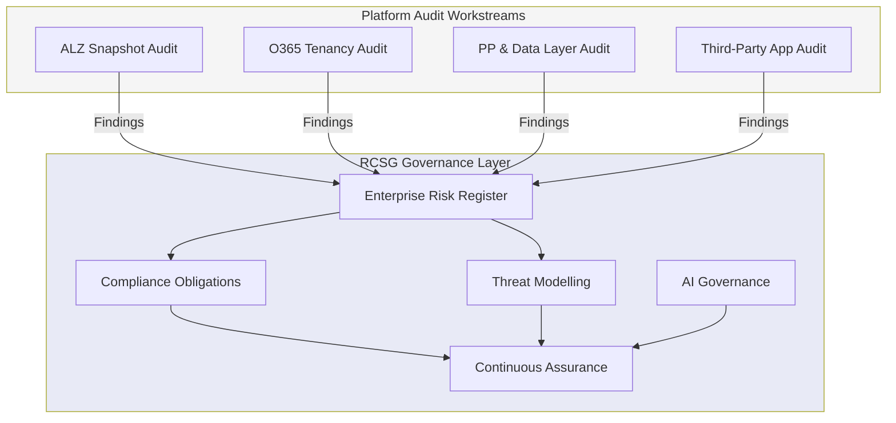
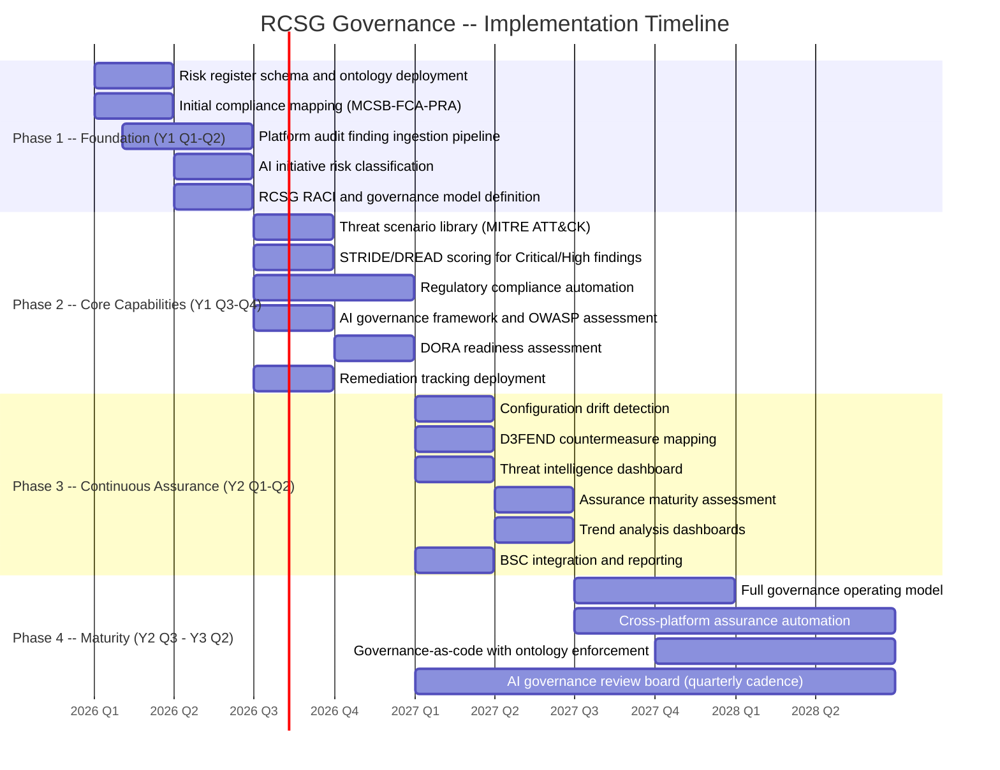
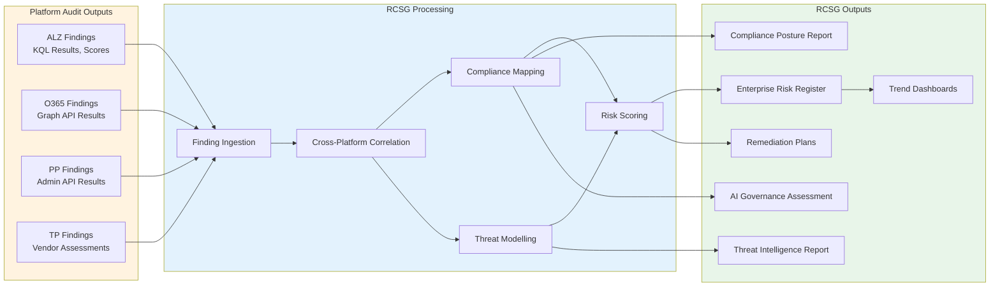
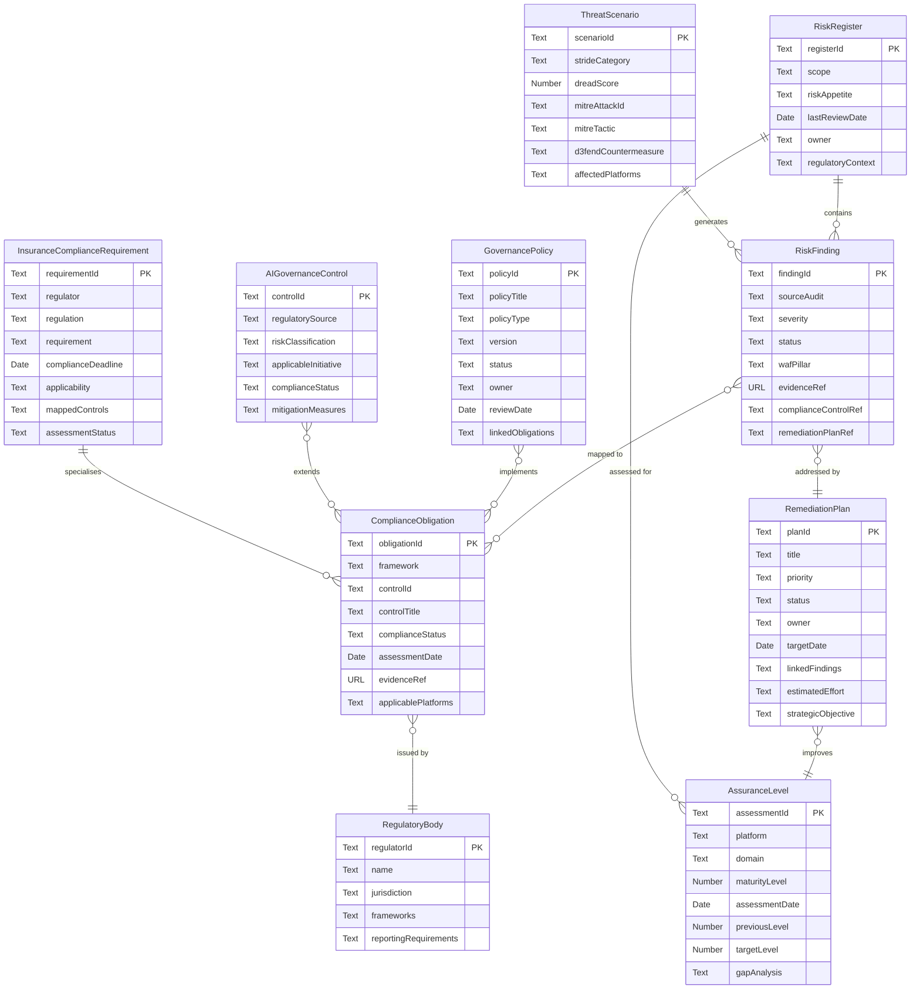

# Risk, Compliance, Security & Governance (RCSG) Audit
## Vision, Strategy & Plan (VSOM/OKR)

**Document Version:** 1.0
**Date:** 2026-02-04
**Document Type:** VSOM/OKR Framework
**Classification:** Enterprise Architecture -- Governance Layer
**Scope:** Cross-cutting governance capability spanning ALZ, O365, PP, and TP audit workstreams within the insurance sector EA audit portfolio.

---

## 1. Audit Overview

### 1.1 Purpose

This document defines the **Vision, Strategy, Objectives, and Metrics (VSOM)** for the Risk, Compliance, Security & Governance (RCSG) workstream. Unlike the platform-specific audit packages (ALZ, O365, PP, TP), the RCSG workstream operates as a **cross-cutting governance layer** that aggregates findings, enforces compliance obligations, manages enterprise risk, and provides continuous assurance across the entire audit portfolio.

The RCSG workstream does not perform its own point-in-time snapshot audits. Instead, it **consumes outputs** from the four platform audit workstreams, **correlates findings** against regulatory and framework obligations, and **produces strategic governance artefacts** including the enterprise risk register, compliance posture reports, threat model assessments, and AI governance controls.

### 1.2 Scope

| Dimension | Coverage |
|-----------|----------|
| **Platforms** | Azure Landing Zone (ALZ), Microsoft 365 (O365), Power Platform & Data Layer (PP), Third-Party Applications (TP) |
| **Regulatory Frameworks** | FCA SYSC 13.9, PRA SS1/21, Lloyd's MS13, GDPR, DORA, UK AI Regulation, EU AI Act, USA AI Executive Orders |
| **Technical Frameworks** | MCSB v2, NIST 800-53 R5, ISO 27001:2022, MITRE ATT&CK, STRIDE/DREAD, OWASP LLM Top 10, MITRE D3FEND |
| **Governance Domains** | Risk Management, Compliance, Security Posture, AI Governance, Continuous Assurance |
| **Sector Context** | UK insurance sector, 800 headcount, Acturis as primary broking platform, Lloyd's market participant |

### 1.3 Governance Layer Description

The RCSG governance layer sits above and across the four platform audit workstreams, providing:

- **Unified Risk Aggregation** -- collecting and correlating risk findings from ALZ, O365, PP, and TP into a single enterprise risk register.
- **Regulatory Compliance Mapping** -- cross-referencing platform-level findings against insurance sector regulatory obligations (FCA, PRA, Lloyd's, DORA) and international standards (MCSB, NIST, ISO).
- **Threat Intelligence Correlation** -- mapping discovered vulnerabilities and misconfigurations to known threat scenarios using STRIDE/DREAD and MITRE ATT&CK frameworks.
- **AI Governance Oversight** -- providing assurance that AI initiatives within the strategy programme comply with UK, EU, and USA AI regulation and OWASP LLM Top 10.
- **Continuous Assurance** -- tracking remediation progress, detecting configuration drift, and producing trend analysis across audit cycles.

---

## 2. Vision, Strategy & Plan

### 2.1 Vision Statement

> **Establish a unified, ontology-driven risk, compliance, security, and governance capability that provides continuous assurance across all enterprise platforms, enabling proactive regulatory compliance and strategic risk-informed decision making.**

This vision positions RCSG as the strategic governance backbone of the EA audit portfolio. Rather than operating as a standalone assessment, RCSG transforms the outputs of individual platform audits into an enterprise-wide governance posture that supports board-level risk reporting, regulatory compliance evidence, and architectural decision making.

### 2.2 Strategic Pillars

| Pillar | Allocation | Focus |
|--------|------------|-------|
| **Unified Risk Posture** | 30% | Enterprise risk register, threat scenarios, cross-platform risk aggregation, risk appetite alignment |
| **Regulatory Compliance** | 25% | FCA, PRA, DORA, GDPR, Lloyd's MS13 compliance mapping and automation |
| **Threat Intelligence** | 20% | MITRE ATT&CK mapping, STRIDE/DREAD threat modelling, continuous security monitoring |
| **AI Governance** | 15% | UK/EU/USA AI regulation compliance, OWASP LLM Top 10 assessment, AI initiative risk classification |
| **Continuous Assurance** | 10% | Audit automation, remediation tracking, drift detection, trend analysis |

### 2.3 OKRs (Objectives & Key Results)

#### O1: Establish Enterprise Risk Register

Consolidate risk findings from all platform audit workstreams into a unified, ontology-driven enterprise risk register with cross-platform correlation and regulatory context.

| KR ID | Key Result | Target | Timeline |
|-------|------------|--------|----------|
| KR1.1 | Deploy unified risk register schema aligned to RCSG ontology | Risk register operational with all 10 entity types | Y1 Q1 |
| KR1.2 | Ingest findings from all four platform audit workstreams (ALZ, O365, PP, TP) | 100% of Critical and High findings ingested within 48 hours of discovery | Y1 Q2 |
| KR1.3 | Establish cross-platform risk correlation engine | Identify and link related findings across platforms (e.g., identity risk spanning Entra ID and ALZ) | Y1 Q3 |
| KR1.4 | Deliver board-ready enterprise risk posture report | Quarterly risk posture report with trend analysis, accepted for ExCo consumption | Y1 Q4 |

#### O2: Automate Regulatory Compliance Mapping

Automate the mapping of audit findings to regulatory obligations across FCA, PRA, Lloyd's, DORA, and GDPR, providing continuous evidence of compliance posture.

| KR ID | Key Result | Target | Timeline |
|-------|------------|--------|----------|
| KR2.1 | Map all MCSB v2 controls to FCA SYSC 13.9 and PRA SS1/21 requirements | 100% of applicable controls cross-referenced | Y1 Q1 |
| KR2.2 | Automate compliance status aggregation from platform audit outputs | Compliance dashboard refreshes within 24 hours of new audit data | Y1 Q2 |
| KR2.3 | Deliver DORA readiness assessment for ICT third-party risk | DORA ICT service register populated, concentration risk analysis complete | Y1 Q4 |
| KR2.4 | Achieve automated evidence generation for Lloyd's MS13 cyber requirements | MS13 evidence pack generated from audit data without manual intervention | Y2 Q1 |

#### O3: Deploy Threat Modelling Capability

Implement structured threat modelling using STRIDE/DREAD and MITRE ATT&CK frameworks, mapping discovered vulnerabilities to real-world threat scenarios.

| KR ID | Key Result | Target | Timeline |
|-------|------------|--------|----------|
| KR3.1 | Define threat scenario library aligned to MITRE ATT&CK for insurance sector | Minimum 30 insurance-relevant threat scenarios documented | Y1 Q2 |
| KR3.2 | Apply STRIDE/DREAD scoring to all Critical and High risk findings | 100% of Critical/High findings scored with composite DREAD rating (0-50 scale) | Y1 Q3 |
| KR3.3 | Map MITRE D3FEND countermeasures to identified threat scenarios | Defensive technique recommendations for all scored scenarios | Y1 Q4 |
| KR3.4 | Deliver threat intelligence dashboard with cross-platform attack surface view | Dashboard operational, refreshed quarterly, covering ALZ, O365, PP, and TP surfaces | Y2 Q1 |

#### O4: Implement AI Governance Framework

Establish AI governance controls aligned to UK AI Regulation, EU AI Act, USA AI Executive Orders, and OWASP LLM Top 10, providing assurance for AI initiatives within the strategy programme.

| KR ID | Key Result | Target | Timeline |
|-------|------------|--------|----------|
| KR4.1 | Complete risk classification of all AI initiatives under EU AI Act taxonomy | All AI Strategy Programme initiatives classified (Unacceptable, High, Limited, Minimal) | Y1 Q2 |
| KR4.2 | Map AI governance controls to UK AI Regulation principles (safety, transparency, fairness, accountability, contestability) | Control mapping complete with gap analysis per initiative | Y1 Q3 |
| KR4.3 | Deploy OWASP LLM Top 10 assessment for all LLM-based initiatives | Assessment complete for all initiatives using LLM capabilities (e.g., Virtual Emma) | Y1 Q3 |
| KR4.4 | Establish AI governance review board with quarterly assurance cycle | Review board operational, first quarterly review completed | Y2 Q1 |

#### O5: Establish Continuous Assurance Model

Build a continuous assurance capability that tracks remediation progress, detects configuration drift between audit cycles, and produces trend analysis for governance reporting.

| KR ID | Key Result | Target | Timeline |
|-------|------------|--------|----------|
| KR5.1 | Deploy remediation tracking linked to risk findings and compliance obligations | All P1-Critical and P2-High remediation plans tracked with owner and target date | Y1 Q3 |
| KR5.2 | Implement configuration drift detection between audit snapshots | Drift detection operational for ALZ and O365 workstreams, alerting on material changes | Y2 Q1 |
| KR5.3 | Deliver assurance maturity assessment across all platforms | Maturity levels (1-5 scale) assessed for all platforms across Identity, Network, Data, Application, and Operations domains | Y2 Q2 |
| KR5.4 | Produce trend analysis dashboards showing posture improvement over time | Quarterly trend dashboards operational, demonstrating posture movement across audit cycles | Y2 Q2 |

#### O6: Deliver Governance Operating Model

Define and operationalise the RCSG governance operating model, including roles, responsibilities, cadences, escalation paths, and integration with the AI Strategy Programme BSC.

| KR ID | Key Result | Target | Timeline |
|-------|------------|--------|----------|
| KR6.1 | Define RCSG RACI matrix covering all governance activities | RACI published and agreed with CISO, CRO, DPO, CTO, and EA Lead | Y1 Q2 |
| KR6.2 | Establish governance cadence (daily, weekly, monthly, quarterly review cycles) | All cadences operational with documented agendas and attendees | Y1 Q3 |
| KR6.3 | Integrate RCSG outputs with AI Strategy Programme BSC reporting | RCSG metrics feeding P3 (Compliance) and F4 (Cost-to-Serve) BSC objectives | Y2 Q1 |
| KR6.4 | Achieve governance-as-code with ontology-driven policy enforcement | Policy definitions codified in RCSG ontology, automated policy evaluation operational | Y2 Q4 |

### 2.4 Delivery Timeline

---

## 3. BSC Alignment

The RCSG workstream aligns directly to the **AI Strategy Programme Balanced Scorecard (BSC)**, serving as a governance enabler that underpins the delivery of all other strategic objectives.

### 3.1 Primary BSC Alignment

| BSC Objective | Alignment | RCSG Contribution |
|---------------|-----------|-------------------|
| **P3: Streamline Compliance** | Primary | Automated regulatory compliance mapping, continuous evidence generation, DORA readiness, Lloyd's MS13 automation |
| **F4: Reduce Cost-to-Serve** | Primary | Reduced manual compliance effort through automation, fewer regulatory findings, lower audit preparation cost |

### 3.2 Cross-Cutting Enablement

RCSG is a **governance enabler** for all other BSC objectives. Without adequate risk, compliance, security, and governance foundations, no strategic initiative can proceed to production deployment.

| BSC Perspective | RCSG Enablement |
|-----------------|-----------------|
| **Customer** | Customer data protection assurance, GDPR compliance evidence, trust through governance transparency |
| **Process** | Governance gates in delivery lifecycle, compliance-by-design in architecture reviews, risk-informed prioritisation |
| **Financial** | Cost avoidance through proactive compliance (vs. reactive remediation), reduced regulatory penalty risk |
| **Learning & Growth** | Governance capability maturity, security awareness, regulatory knowledge base |

### 3.3 Compliance by Design

RCSG supports the overarching "Compliance by Design" theme within the AI Strategy Programme by ensuring that:

- All new platform deployments are assessed against RCSG compliance obligations before go-live.
- AI initiatives undergo risk classification and governance review before entering development.
- Remediation plans are integrated into delivery sprints rather than treated as post-deployment activities.
- Governance policies are codified in the RCSG ontology and enforced programmatically where possible.

---

## 4. Integration with Audit Workstreams

The RCSG workstream consumes findings from, and feeds strategic direction back into, the four platform audit workstreams.

### 4.1 Workstream Integration Matrix

| Audit Workstream | RCSG Consumes | RCSG Provides |
|------------------|---------------|---------------|
| **ALZ (Azure Landing Zone)** | Resource inventory, security posture (Defender Secure Score, MCSB compliance %), governance maturity (policy coverage, tagging), network topology findings | Regulatory context for findings (FCA, PRA mapping), enterprise risk register entries, threat scenario correlation (MITRE ATT&CK for Azure), remediation priority alignment |
| **O365 (Microsoft 365)** | Identity posture (MFA, Conditional Access, PIM), email security findings (DKIM, DMARC, anti-phishing), data protection gaps (DLP, sensitivity labels), Secure Score | Compliance obligation mapping (GDPR Art.32, Lloyd's MS13 email security), cross-platform identity risk correlation, AI governance controls for M365 Copilot |
| **PP (Power Platform & Data)** | Environment governance (DLP policies, connector classification), citizen developer risk, data architecture findings (Fabric, Synapse, Dataverse security), Acturis data flow mapping | Data sovereignty compliance assessment (GDPR Art.44-49), DORA ICT risk classification for data platforms, AI governance for Power Platform AI Builder |
| **TP (Third-Party Applications)** | Application portfolio (enterprise apps, OAuth consents), integration security (API credentials, Key Vault), vendor risk assessment (DPA, DR, certifications), Acturis integration posture | PRA SS1/21 third-party risk classification, DORA ICT third-party register, vendor compliance obligation tracking, supply chain threat modelling |

### 4.2 Data Flow

---

## 5. Integration with Existing Issues

The RCSG objectives map directly to existing GitHub issues in the INS-PPL-AZL repository. This ensures traceability from strategic objectives through to delivery backlog items.

### 5.1 Issue Mapping

| Objective | Issue # | Issue Title | Relationship |
|-----------|---------|-------------|--------------|
| **O1: Enterprise Risk Register** | #54 | Risk Management Framework | Primary delivery vehicle for risk register capability |
| | #55 | Threat Modelling Epic | Provides threat scenarios that generate risk findings |
| | #57 | STRIDE/DREAD Methodology | Scoring methodology for risk findings |
| **O2: Regulatory Compliance** | #46-53 | Compliance Feature Set | Platform-level compliance features feeding RCSG aggregation |
| | #59 | UK Insurance Regulatory Migration | Insurance-specific regulatory compliance mapping |
| **O3: Threat Modelling** | #55 | Threat Modelling Epic | Epic for threat modelling capability delivery |
| | #56 | OWASP LLM Top 10 | AI-specific threat assessment within the threat model |
| | #57 | STRIDE/DREAD Methodology | Threat scoring methodology implementation |
| | #54 | Risk Management Framework (MITRE) | MITRE ATT&CK integration for threat intelligence |
| **O4: AI Governance** | #48 | UK AI Regulation | UK AI regulatory compliance mapping |
| | #49 | EU AI Act | EU AI Act risk classification and compliance |
| | #50 | USA AI Executive Orders | USA AI regulatory landscape assessment |
| **O5: Continuous Assurance** | #60 | Audit Revisions v2 | Next-generation audit capability with drift detection |
| | #10 | Compliance Assessment | Foundational compliance assessment capability |
| **O6: Governance Operating Model** | #28 | Portfolio PMM | Programme management model supporting governance cadence |
| | #29 | Portfolio Governance | Governance framework and operating model definition |

---

## 6. Ontology Reference

The RCSG ontology is defined in `01-RCSG-Audit-Ontology-v1.json` and follows the OAA v6 pattern used across the audit portfolio. It provides the semantic foundation for all RCSG data structures, relationships, and business rules.

### 6.1 Entity Summary

| Entity | OAA Type | Schema.org Mapping | Description |
|--------|----------|-------------------|-------------|
| **RiskRegister** | `oaa:UniRegistryEntry` | `schema:ItemList` | Enterprise risk register aggregating risks across all platforms |
| **RiskFinding** | `oaa:UniRegistryEntry` | `schema:Report` | Individual risk finding from an audit workstream |
| **ThreatScenario** | `oaa:UniRegistryEntry` | `schema:Action` | Threat scenario modelled using STRIDE/DREAD and MITRE ATT&CK |
| **ComplianceObligation** | `oaa:UniRegistryEntry` | `schema:Legislation` | Regulatory or framework compliance obligation |
| **GovernancePolicy** | `oaa:UniRegistryEntry` | `schema:DigitalDocument` | Internal governance policy with lifecycle management |
| **AIGovernanceControl** | `oaa:UniRegistryEntry` | `schema:DefinedTerm` | AI-specific governance control for UK/EU/USA regulation |
| **RegulatoryBody** | `oaa:UniRegistryEntry` | `schema:Organization` | Regulatory body relevant to the insurance sector |
| **AssuranceLevel** | `oaa:UniRegistryEntry` | `schema:Rating` | Assurance level assessment tracking posture over time |
| **RemediationPlan** | `oaa:UniRegistryEntry` | `schema:HowTo` | Remediation plan linked to risk findings |
| **InsuranceComplianceRequirement** | `oaa:UniRegistryEntry` | `schema:Legislation` | Insurance sector-specific compliance requirement |

### 6.2 Entity Relationship Diagram

---

## 7. Compliance Framework Coverage

The RCSG workstream provides the overarching compliance framework coverage matrix for the entire EA audit portfolio. This extends the platform-specific mappings into a unified governance view.

### 7.1 Framework Coverage Matrix

| Framework | RCSG Coverage | Key Controls / Articles | Insurance Relevance |
|-----------|---------------|------------------------|---------------------|
| **MCSB v2** | Enterprise-wide aggregation | All control families (IM, NS, DP, ES, AM, LT, IR, PV, GS, DS, BR) | Primary Azure security benchmark; feeds Defender Secure Score |
| **NIST 800-53 R5** | Cross-platform control mapping | AC, AT, AU, CA, CM, CP, IA, IR, MA, MP, PE, PL, PM, PS, RA, SA, SC, SI, SR | Federal alignment for international insurance operations |
| **ISO 27001:2022** | Full ISMS alignment | A.5-A.8 Organisational, People, Physical, Technological controls | Recognised certification standard for insurance sector |
| **FCA SYSC 13.9** | Operational resilience mapping | SYSC 13.9.1-13.9.4 (Operational risk, outsourcing, business continuity) | Mandatory for FCA-regulated insurance firms |
| **PRA SS1/21** | Third-party risk management | Material outsourcing, cloud service governance, exit strategies | Mandatory for PRA-regulated insurers; covers Azure and Acturis |
| **Lloyd's MS13** | Cyber security requirements | Access control, vulnerability management, incident response, data protection | Mandatory for Lloyd's market participants |
| **GDPR Art.28** | Data processor obligations | Art.28 (Processor), Art.30 (Records), Art.32 (Security), Art.35 (DPIA) | Data protection for policyholder and claims data |
| **DORA** | Digital operational resilience | ICT risk management, incident reporting, resilience testing, third-party risk | Mandatory from January 2025; critical for insurance sector |
| **UK AI Regulation** | AI regulatory principles | Safety, transparency, fairness, accountability, contestability | Pro-innovation framework; applies to AI Strategy Programme |
| **EU AI Act** | AI risk classification | Unacceptable, High, Limited, Minimal risk categories; conformity assessment | Applies to EU-facing insurance operations and AI initiatives |

### 7.2 Regulatory Calendar

| Regulation | Status | Key Dates |
|------------|--------|-----------|
| FCA SYSC 13.9 | Active | Ongoing compliance obligation |
| PRA SS1/21 | Active | Ongoing; enhanced reporting from 2024 |
| Lloyd's MS13 | Active | Annual attestation required |
| GDPR | Active | Ongoing; ICO enforcement active |
| DORA | Active | Compliance mandatory from January 2025 |
| UK AI Regulation | Emerging | Framework expected 2025-2026; sector-specific guidance forthcoming |
| EU AI Act | Phased | Prohibited AI: Feb 2025; High-risk obligations: Aug 2026; Full application: Aug 2027 |

---

## 8. Value Propositions

### VP1: Board / ExCo

> **"Unified view of enterprise risk posture with regulatory assurance."**

| Benefit | Detail |
|---------|--------|
| Single risk view | One enterprise risk register spanning all platforms, replacing siloed platform-specific risk views |
| Regulatory confidence | Automated compliance evidence for FCA, PRA, Lloyd's, and DORA reporting |
| Trend visibility | Quarterly posture reports showing improvement or degradation over time |
| Risk-informed decisions | Board-level risk appetite aligned to actual measured posture |

### VP2: CISO / CTO

> **"Automated threat intelligence and security posture management."**

| Benefit | Detail |
|---------|--------|
| Threat-informed defence | MITRE ATT&CK mapped threat scenarios with D3FEND countermeasure recommendations |
| Cross-platform visibility | Correlated security findings across Azure, M365, Power Platform, and third-party applications |
| Prioritised remediation | Risk-scored remediation plans aligned to threat severity and regulatory impact |
| AI security assurance | OWASP LLM Top 10 assessment for all AI initiatives before deployment |

### VP3: Compliance / DPO

> **"Continuous regulatory compliance with evidence-backed assessments."**

| Benefit | Detail |
|---------|--------|
| Automated evidence | Compliance evidence generated from audit data without manual collection |
| Multi-framework mapping | Single finding mapped to multiple frameworks (MCSB, NIST, ISO, FCA, PRA) simultaneously |
| DORA readiness | ICT third-party risk register and concentration analysis pre-built for DORA compliance |
| GDPR assurance | Data processor obligations tracked across all third-party relationships |

### VP4: EA / Architecture

> **"Governance-as-code with ontology-driven policy enforcement."**

| Benefit | Detail |
|---------|--------|
| Ontology-driven governance | All governance artefacts structured using OAA v6 ontology patterns, enabling programmatic policy evaluation |
| Architecture decision support | Risk and compliance data feeding architecture review boards and design decisions |
| Pattern library | Reusable governance patterns across engagements and client contexts |
| Continuous assurance | Drift detection between audit cycles, reducing the need for full re-assessment |

---

## 9. Business Rules

The RCSG ontology defines six business rules that govern the operational behaviour of the governance layer. These rules are codified in the ontology and will be enforced programmatically as the capability matures.

| Rule ID | Description | Scope |
|---------|-------------|-------|
| BR-RCSG-001 | All Critical and High severity findings must have an associated remediation plan within 5 business days | RiskFinding, RemediationPlan |
| BR-RCSG-002 | Compliance obligations from FCA, PRA, and Lloyd's must be reassessed at least quarterly | ComplianceObligation, InsuranceComplianceRequirement |
| BR-RCSG-003 | AI initiatives classified as High Risk under EU AI Act must have documented AI governance controls before deployment | AIGovernanceControl |
| BR-RCSG-004 | Governance policies must be reviewed at least annually; security policies at least bi-annually | GovernancePolicy |
| BR-RCSG-005 | Risk acceptance decisions for findings above Medium severity require CISO or CRO approval | RiskFinding, RemediationPlan |
| BR-RCSG-006 | Cross-platform risk findings must be aggregated into the enterprise risk register within 48 hours of discovery | RiskRegister, RiskFinding |

---

**Document Control**

| Version | Date | Author | Status | Changes |
|---------|------|--------|--------|---------|
| 1.0 | 2026-02-04 | Advisory Team | Draft | Initial release |

---

*Generated: 2026-02-04*
*Aligned to: AI Strategy Programme BSC (P3: Streamline Compliance, F4: Reduce Cost-to-Serve)*
*Ontology: 01-RCSG-Audit-Ontology-v1.json (OAA v6 pattern)*
*Repository: INS-PPL-AZL*
