# PII Protection Architecture: Visual Guide

## Microsoft-Native Stack for Web Applications

**Document Version:** 2.0.0  
**Date:** February 2026  
**Platform:** PF-Core Security Module  
**Classification:** INTERNAL USE

---

## 1. High-Level Architecture Overview

The architecture follows a defense-in-depth approach with six distinct layers, each providing specific security controls for PII protection. All components deploy to UK South for data residency compliance.

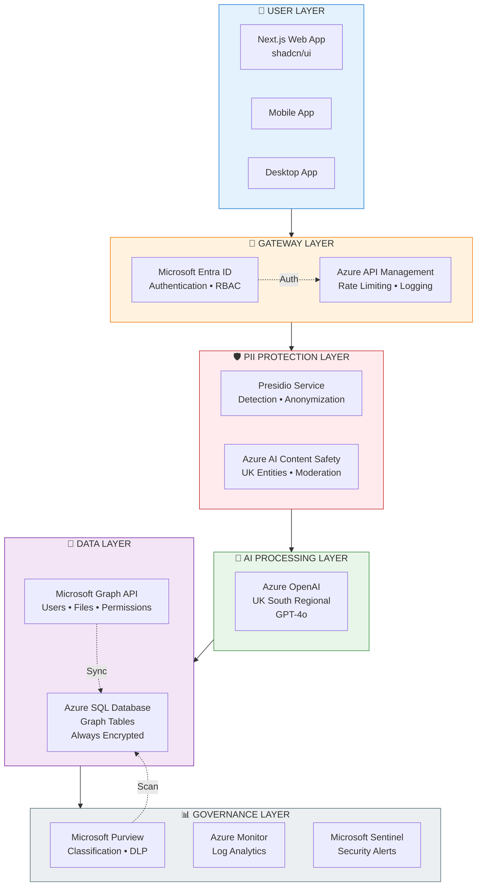

**Layer Responsibilities:**

| Layer | Primary Function | UK Data Residency |
|-------|-----------------|-------------------|
| **User** | Frontend interfaces | App Service UK South |
| **Gateway** | Authentication, rate limiting, request logging | APIM UK South |
| **PII Protection** | Detect, block, or anonymize PII before AI processing | Container Apps UK South |
| **AI Processing** | LLM inference with anonymized inputs only | Azure OpenAI UK South Regional |
| **Data** | Graph storage with encryption, M365 integration | SQL Database UK South |
| **Governance** | Classification, audit trails, security monitoring | Purview + Monitor UK South |

---

## 2. PII-Protected Request Flow

Every request passes through a strict pipeline that ensures PII is either blocked (for high-risk types) or anonymized (for lower-risk types) before reaching the AI model. The response is also scanned for potential PII leakage.

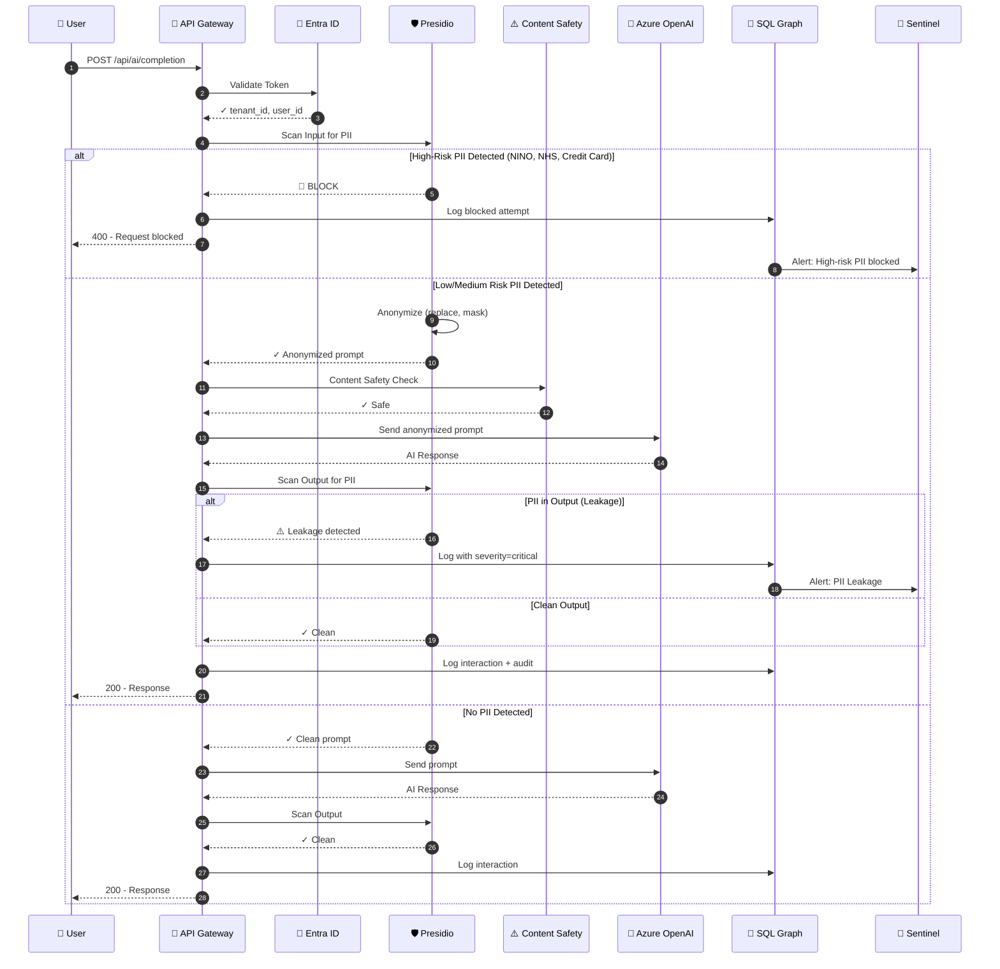

**Key Decision Points:**

1. **Authentication Gate** - Entra ID validates the bearer token and extracts tenant/user context for RLS
2. **Input PII Gate** - Presidio scans for 15+ PII entity types including UK-specific (NINO, NHS Number)
3. **High-Risk Block** - Critical PII types are NEVER anonymized, always blocked
4. **Anonymization** - Lower-risk PII is replaced, masked, or hashed before AI processing
5. **Output Scan** - AI responses are scanned for potential PII leakage (hallucination risk)
6. **Audit Trail** - Every interaction logged to SQL Graph with full lineage

---

## 3. PII Risk Classification & Actions

Not all PII carries the same risk. The system classifies PII into four risk levels and applies different actions based on the combination of risk level and document sensitivity.

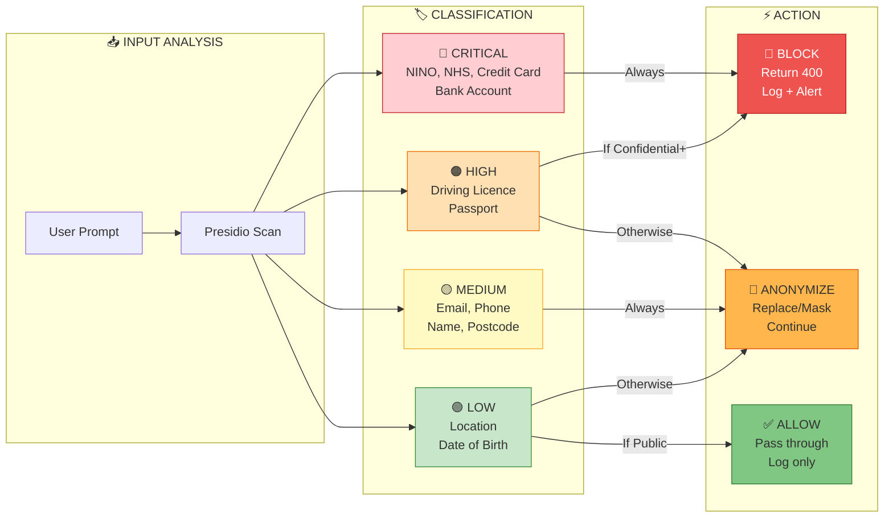

**Risk Level Definitions:**

| Risk Level | PII Types | Default Action | Rationale |
|------------|-----------|----------------|-----------|
| **CRITICAL** | UK NINO, NHS Number, Credit Card, Bank Account, IBAN | Always BLOCK | Identity theft, financial fraud risk |
| **HIGH** | UK Driving Licence, Passport Number | BLOCK or ANONYMIZE | Government-issued ID, context-dependent |
| **MEDIUM** | Email, Phone, Full Name, UK Postcode | ANONYMIZE | Personal but recoverable, useful for AI context |
| **LOW** | General Location, Dates | ALLOW or ANONYMIZE | Minimal direct risk, often needed for queries |

---

## 4. Azure SQL Database Graph Schema

The data layer uses Azure SQL Database's native graph capabilities with Node tables (entities) and Edge tables (relationships). This enables powerful traversal queries for permission checking and audit trails.

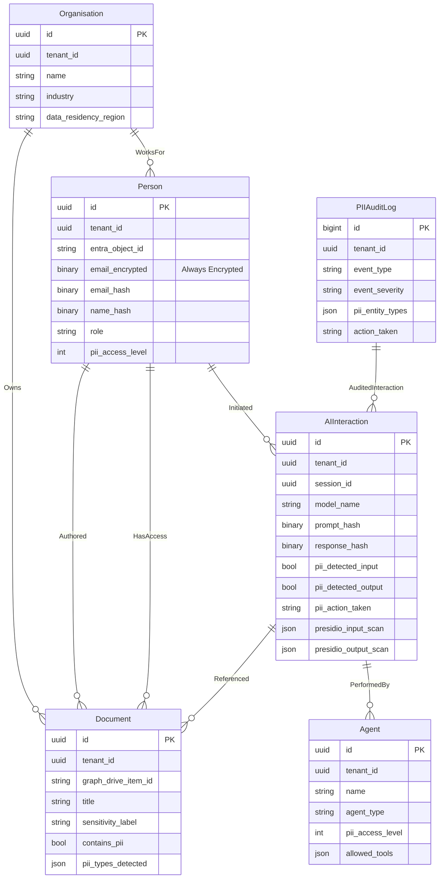

**Schema Design Principles:**

1. **PII Never Stored in Plain Text** - All PII columns use either Always Encrypted (for searchable fields) or one-way hashing (for audit)
2. **Tenant Isolation via RLS** - Row-Level Security ensures queries only return data for the authenticated tenant
3. **Graph Edges for Lineage** - Relationships are first-class citizens, enabling queries like "who accessed what through which AI interaction"
4. **Audit as Graph Nodes** - PIIAuditLog entries connect to AIInteractions via edges for complete traceability

---

## 5. Graph Query Patterns

Azure SQL Graph uses the `MATCH` clause for traversing relationships. These patterns power permission checks, audit reports, and compliance evidence.

```mermaid
flowchart TD
    subgraph Q1["🔍 Query 1: User Document Access"]
        P1[Person] -->|HasAccess| D1[Document]
    end

    subgraph Q2["🔍 Query 2: AI Interaction Audit Trail"]
        P2[Person] -->|Initiated| AI2[AIInteraction]
        AI2 -->|Referenced| D2[Document]
    end

    subgraph Q3["🔍 Query 3: PII Exposure Report"]
        PAL[PIIAuditLog] -->|AuditedInteraction| AI3[AIInteraction]
        AI3 -->|"←Initiated"| P3[Person]
    end

    subgraph Q4["🔍 Query 4: Indirect Access via Org"]
        P4[Person] -->|WorksFor| O4[Organisation]
        O4 -->|Owns| D4[Document]
    end

    style Q1 fill:#e3f2fd,stroke:#1976d2
    style Q2 fill:#fff3e0,stroke:#f57c00
    style Q3 fill:#ffebee,stroke:#c62828
    style Q4 fill:#e8f5e9,stroke:#388e3c
```

**Example SQL Queries:**

```sql
-- Query 1: What documents can this user access?
SELECT d.title, d.sensitivity_label, ha.permission_level
FROM Person p, HasAccess ha, Document d
WHERE MATCH(p-(ha)->d)
  AND p.entra_object_id = @user_id;

-- Query 2: Full audit trail for AI interactions
SELECT p.role, ai.model_name, ai.pii_action_taken, d.title
FROM Person p, Initiated i, AIInteraction ai, Referenced r, Document d
WHERE MATCH(p-(i)->ai-(r)->d)
  AND ai.created_at > DATEADD(day, -7, GETUTCDATE());

-- Query 3: High-severity PII incidents
SELECT pal.event_severity, pal.pii_entity_types, ai.model_name, p.department
FROM PIIAuditLog pal, AuditedInteraction aui, AIInteraction ai, Initiated init, Person p
WHERE MATCH(pal-(aui)->ai<-(init)-p)
  AND pal.event_severity = 'critical';
```

---

## 6. Presidio Processing Pipeline

Presidio runs as a containerized service providing PII detection and anonymization. It includes custom recognizers for UK-specific PII types that aren't built into the base library.

```mermaid
flowchart TB
    subgraph INPUT["📥 INPUT"]
        Text[Raw Text]
    end

    subgraph ANALYZER["🔬 ANALYZER ENGINE"]
        NER[NER Models<br/>spaCy en_core_web_lg]
        Regex[Regex Patterns]
        Checksum[Checksum Validators]
        Context[Context Enhancement]
        
        subgraph RECOGNIZERS["Recognizers"]
            BuiltIn[Built-in<br/>PERSON, EMAIL<br/>PHONE, CREDIT_CARD]
            UK[UK Custom<br/>NINO, NHS<br/>POSTCODE, LICENCE]
        end
    end

    subgraph DECISION["⚖️ DECISION"]
        Score[Score Threshold<br/>≥ 0.5]
        RiskCheck{High Risk?}
    end

    subgraph ANONYMIZER["🔄 ANONYMIZER ENGINE"]
        Replace[Replace<br/>→ PERSON]
        Mask[Mask<br/>john****@example.com]
        Hash[Hash<br/>→ a3f2b8...]
        Encrypt[Encrypt<br/>→ enc_xyz...]
        Redact[Redact<br/>→ removed]
    end

    subgraph OUTPUT["📤 OUTPUT"]
        Blocked[🚫 Blocked Response]
        Anonymized[✓ Anonymized Text]
        AuditData[📋 Audit Data]
    end

    Text --> NER
    Text --> Regex
    NER --> Score
    Regex --> Score
    Checksum --> Score
    Context --> Score
    BuiltIn --> Score
    UK --> Score
    
    Score --> RiskCheck
    RiskCheck -->|Yes| Blocked
    RiskCheck -->|No| Replace
    RiskCheck -->|No| Mask
    RiskCheck -->|No| Hash
    
    Replace --> Anonymized
    Mask --> Anonymized
    Hash --> AuditData
    Encrypt --> Anonymized
    Redact --> Anonymized

    style ANALYZER fill:#e3f2fd,stroke:#1976d2
    style ANONYMIZER fill:#fff3e0,stroke:#f57c00
    style Blocked fill:#ef5350,stroke:#b71c1c,color:#fff
    style Anonymized fill:#81c784,stroke:#2e7d32
```

**UK Custom Recognizer Patterns:**

| Entity | Pattern | Context Keywords | Confidence |
|--------|---------|------------------|------------|
| **UK_NINO** | `[A-CEGHJ-PR-TW-Z]{2}\d{6}[A-D]` | national insurance, NI, HMRC, tax | 0.85 |
| **UK_NHS_NUMBER** | `\d{3}\s?\d{3}\s?\d{4}` | NHS, patient, medical, hospital | 0.60 |
| **UK_POSTCODE** | `[A-Z]{1,2}\d[A-Z\d]?\s?\d[A-Z]{2}` | address, postcode, delivery | 0.70 |
| **UK_DRIVING_LICENCE** | `[A-Z]{5}\d{6}[A-Z]{2}\d{2}` | driving, licence, DVLA | 0.80 |
| **UK_BANK_ACCOUNT** | `\d{2}-\d{2}-\d{2}` (sort code) | bank, account, payment, BACS | 0.60 |

---

## 7. Microsoft Graph API Integration

The system synchronises user and document metadata from Microsoft 365 while protecting PII through hashing. This enables permission-aware AI interactions without storing sensitive data.

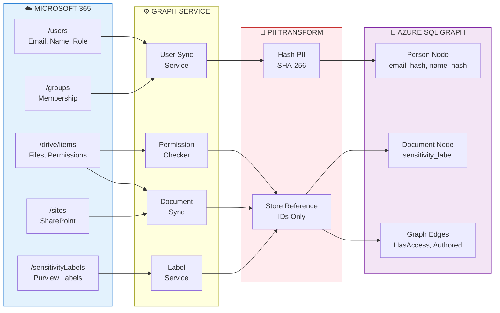

**Data Transformation Rules:**

| M365 Field | Storage Approach | Rationale |
|------------|-----------------|-----------|
| `user.mail` | SHA-256 hash | Audit correlation without storing email |
| `user.displayName` | SHA-256 hash | Reference only, not displayed |
| `user.id` (Entra Object ID) | Plain text | Non-PII identifier |
| `driveItem.id` | Plain text | Non-PII identifier |
| `permission.grantedTo.user.id` | Plain text | Reference to Person node |
| `sensitivityLabel.displayName` | Plain text | Classification metadata |

---

## 8. Security Layers & Encryption

Multiple encryption mechanisms protect data at rest and in transit. The architecture implements defense-in-depth with no single point of failure.

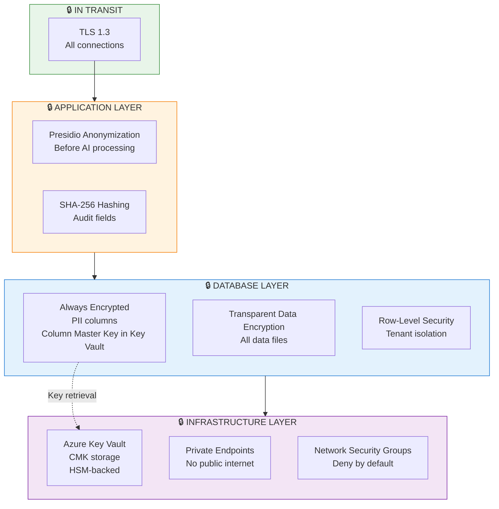

**Encryption Specifications:**

| Layer | Mechanism | Key Management | Scope |
|-------|-----------|----------------|-------|
| **Transit** | TLS 1.3 | Azure-managed certificates | All HTTP/SQL connections |
| **Application** | Presidio anonymization | N/A (transformation, not encryption) | PII fields before AI |
| **Column** | Always Encrypted (AES-256) | Customer-managed key in Key Vault | `email_encrypted` column |
| **Database** | TDE (AES-256) | Service-managed or CMK | All data/log files |
| **Backup** | Azure Backup encryption | Service-managed | All backup data |

---

## 9. Compliance Framework Mapping

The architecture maps directly to MCSB v2 AI controls and UK GDPR requirements, with clear evidence locations for audit.

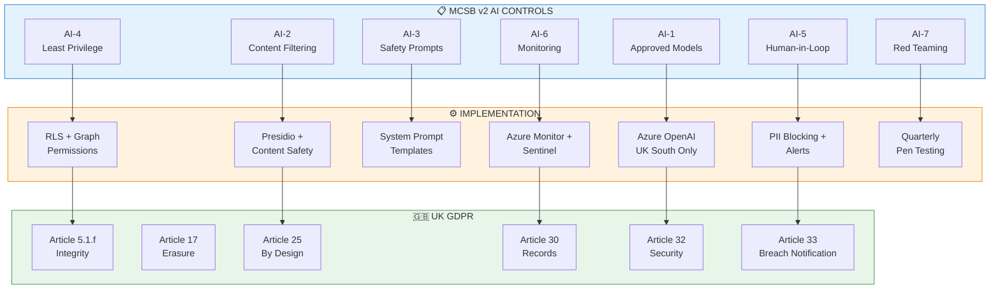

**Evidence Locations:**

| Control | Evidence Type | Location |
|---------|--------------|----------|
| AI-1 | Deployment configuration | Bicep templates, Azure Portal |
| AI-2 | PII detection logs | `PIIAuditLog` table, Azure Monitor |
| AI-3 | System prompts | Code repository, version controlled |
| AI-4 | RLS policies, Graph permissions | SQL schema, Entra app registrations |
| AI-5 | Blocked request logs | `PIIAuditLog` where `action_taken = 'blocked'` |
| AI-6 | Monitoring dashboards | Log Analytics workbooks, Sentinel |
| AI-7 | Pen test reports | Security assessment documents |

---

## 10. Deployment Architecture

All components deploy to UK South with private networking. No PII traverses the public internet.

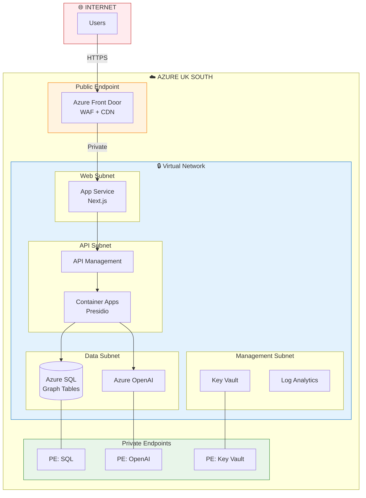

**Network Security Rules:**

| Source | Destination | Port | Action |
|--------|-------------|------|--------|
| Internet | Front Door | 443 | Allow |
| Front Door | App Service | 443 | Allow |
| App Service | APIM | 443 | Allow |
| APIM | Container Apps | 8080 | Allow |
| Container Apps | SQL (PE) | 1433 | Allow |
| Container Apps | OpenAI (PE) | 443 | Allow |
| * | * | * | Deny |

---

## 11. Monitoring & Alerting

Real-time monitoring detects PII incidents and triggers alerts through Microsoft Sentinel.

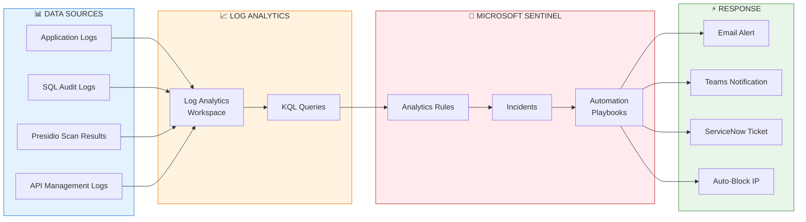

**Alert Rules:**

| Rule Name | Condition | Severity | Response |
|-----------|-----------|----------|----------|
| PII Leakage Detected | `pii_detected_output = true` | Critical | Immediate notification + incident |
| High-Risk PII Blocked | `action_taken = 'blocked' AND entity_type IN ('UK_NINO', 'UK_NHS_NUMBER')` | High | Log + weekly report |
| Unusual AI Query Volume | `count > 100 per user per hour` | Medium | Investigation trigger |
| Failed Auth Spike | `auth_failures > 10 per minute` | High | Auto-block IP |

---

## 12. Summary: Defense-in-Depth

The architecture implements seven layers of PII protection, ensuring no single failure compromises data security.

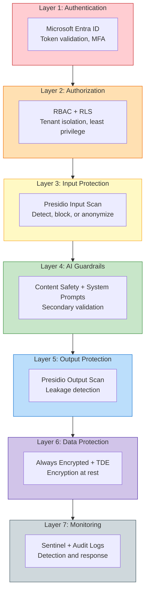

**Protection Summary:**

| Layer | Threat Mitigated | Failure Impact |
|-------|------------------|----------------|
| **Authentication** | Unauthorized access | Other layers still protect data |
| **Authorization** | Cross-tenant access | Encryption still protects data |
| **Input Protection** | PII in prompts | AI never sees raw PII |
| **AI Guardrails** | Prompt injection, jailbreak | Presidio provides backup |
| **Output Protection** | Hallucinated PII | Alerts trigger before user sees |
| **Data Protection** | Database breach | Encrypted data unusable |
| **Monitoring** | Undetected incidents | Forensic evidence preserved |

---

**Document Classification:** INTERNAL USE  
**Last Updated:** February 2026  
**Platform Instances:** PF-Core, BAIV, W4M, AIR

---

*© 2026 Platform Foundation Core Holdings. All rights reserved.*
