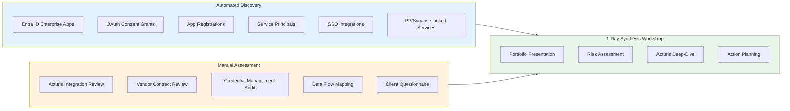
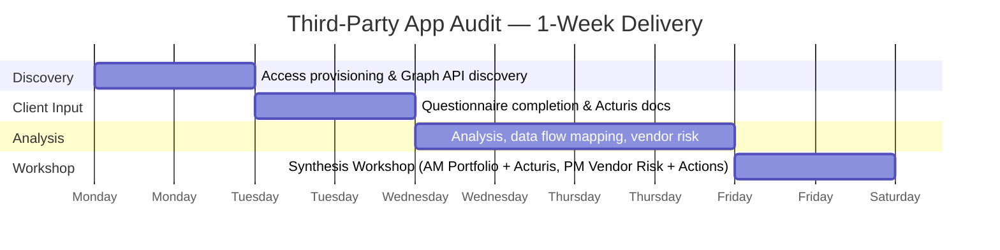
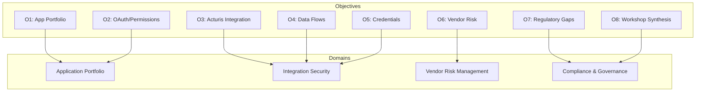
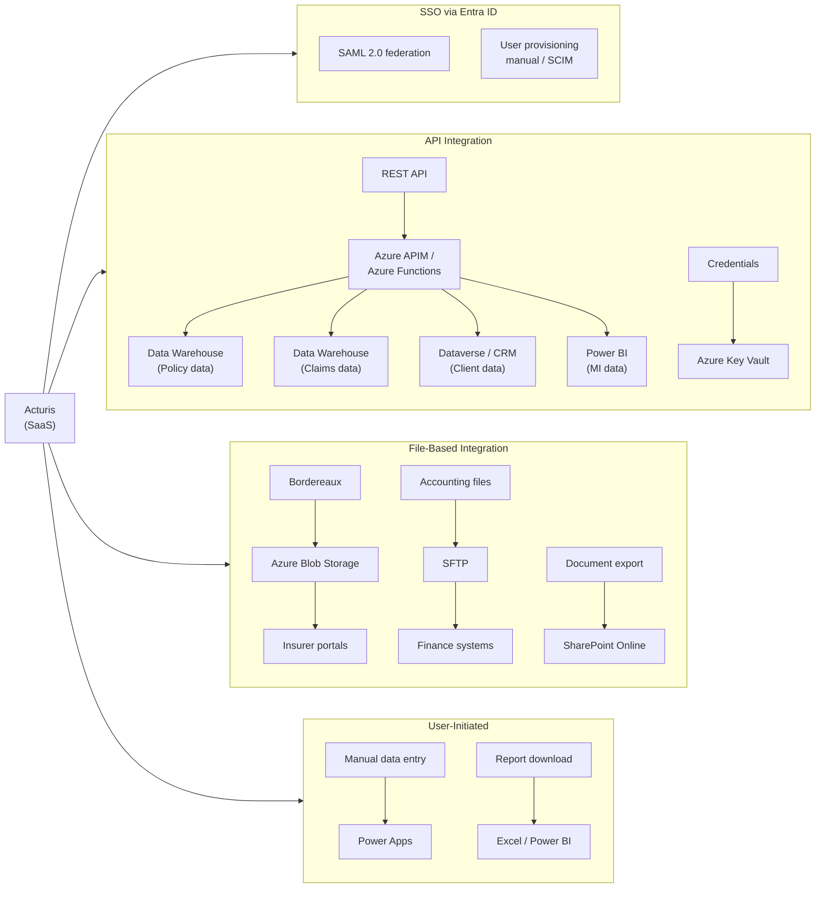

# Third-Party Application Snapshot Audit
## Vision, Strategy, Objectives & Metrics (VSOM)

**Document Version:** 1.0
**Date:** February 2026
**Document Type:** VSOM Framework
**Classification:** Client Engagement

---

## Document Purpose

This document applies the **VSOM framework** to define a rapid snapshot audit of the client's third-party application portfolio, with a primary focus on **Acturis** (the core insurance broking platform) and all integrated applications across the Azure and M365 estate. This audit completes the four-pillar assessment alongside the ALZ, O365, and PP/Data Layer audits.

**Client Context:** Insurance sector, 800 headcount, Acturis as primary broking platform, multiple insurer portal integrations.

---

## 1. Vision

### 1.1 Audit Vision Statement

> **Gain clear, evidence-based visibility of the third-party application landscape, integration security posture, and vendor risk exposure — enabling informed decisions on supply chain governance, credential management, and regulatory compliance for the insurance enterprise.**

### 1.2 Vision Principles

| Principle | Description |
|-----------|-------------|
| **Supply Chain Aware** | Map the full vendor dependency chain, including sub-processors |
| **Integration Focused** | Understand how data flows between systems, not just what apps exist |
| **Risk-Proportionate** | Depth of assessment proportional to criticality and data exposure |
| **Insurance Context** | Acturis and insurer integrations are the primary risk surface |
| **Workshop-Ready** | All findings synthesised for 1-day workshop with business stakeholders |

### 1.3 What This Audit IS and IS NOT

| This Audit IS | This Audit IS NOT |
|---------------|-------------------|
| A point-in-time third-party application snapshot | An ongoing vendor management programme |
| Application portfolio and integration discovery | Individual application security testing |
| Vendor risk and dependency identification | Vendor selection or replacement analysis |
| Credential and API security assessment | Penetration testing of third-party systems |
| Acturis integration posture assessment | Acturis internal platform audit |
| Regulatory compliance gap identification | Remediation or contract renegotiation |

---

## 2. Strategy

### 2.1 Audit Strategy Statement

> **Deploy Microsoft Graph API discovery and structured vendor questionnaires to map the third-party application portfolio, assess integration security, and identify vendor risk exposure — synthesised in a 1-day workshop with IT, security, and business stakeholders.**

### 2.2 Strategic Approach



### 2.3 Time Investment Model

| Activity | Client Team | Consultant | Automation |
|----------|-------------|------------|------------|
| Access provisioning (Global Reader) | 30 mins | - | - |
| Supplementary questions + vendor docs | 3-4 hours | - | - |
| Acturis integration documentation | 1-2 hours | - | - |
| Automated discovery (Graph API) | - | - | 1-2 hours |
| Analysis, risk scoring, report preparation | - | 6-8 hours | - |
| **1-Day Synthesis Workshop** | **6 hours** | **6 hours** | - |
| **Total Client Time** | **~12 hours** | | |

### 2.4 Delivery Timeline



---

## 3. Objectives

### 3.1 Primary Objectives

| # | Objective | Success Indicator |
|---|-----------|-------------------|
| **O1** | Map third-party application portfolio | All Entra ID enterprise apps inventoried, categorised |
| **O2** | Assess OAuth and permission grants | Delegated + application permissions documented, high-risk flagged |
| **O3** | Evaluate Acturis integration security | API, SSO, data flows, credential management assessed |
| **O4** | Map data flows across third parties | Data exchange paths and classifications documented |
| **O5** | Assess credential management | API keys, secrets, certificates reviewed (Key Vault usage) |
| **O6** | Evaluate vendor risk posture | Contract, compliance, DR alignment for critical vendors |
| **O7** | Identify regulatory compliance gaps | FCA, PRA, GDPR, DORA alignment assessed |
| **O8** | Synthesise findings in workshop | Prioritised action plan agreed |

### 3.2 Objective Alignment to Assessment Domains



---

## 4. Metrics

### 4.1 Audit Completion Metrics

| Metric | Target |
|--------|--------|
| **Enterprise App Discovery** | 100% of Entra ID apps inventoried |
| **Permission Assessment** | All high-risk permissions flagged |
| **Acturis Integration Mapped** | All data flows documented |
| **Vendor Documentation** | Critical vendor contracts reviewed |
| **Question Response** | 100% supplementary questions answered |

### 4.2 Third-Party Risk Metrics (Captured)

| Category | Metric | Benchmark | Status |
|----------|--------|-----------|--------|
| **Portfolio** | Total enterprise applications | Documented | ⬜ |
| **Portfolio** | Apps with application permissions | Reviewed | ⬜ |
| **Portfolio** | Apps with delegated permissions | Reviewed | ⬜ |
| **Portfolio** | OAuth consent grants | Documented | ⬜ |
| **Portfolio** | Stale/unused applications | Identified | ⬜ |
| **Integration** | SSO integrations (SAML/OIDC) | Documented | ⬜ |
| **Integration** | Custom connectors | Documented | ⬜ |
| **Integration** | API connections active | Documented | ⬜ |
| **Credentials** | Secrets in Key Vault | 100% | ⬜ |
| **Credentials** | Expired/expiring certificates | Identified | ⬜ |
| **Credentials** | Service accounts documented | 100% | ⬜ |
| **Acturis** | Integration method documented | Yes | ⬜ |
| **Acturis** | Data flows mapped | Yes | ⬜ |
| **Acturis** | DPA in place | Yes | ⬜ |
| **Acturis** | Exit strategy documented | Yes | ⬜ |
| **Vendor Risk** | Critical vendors with SOC 2/ISO | Verified | ⬜ |
| **Vendor Risk** | Vendors with DPA | 100% (data processors) | ⬜ |

---

## 5. Assessment Domains

### 5.1 Domain 1: Application Portfolio

#### 5.1.1 Entra ID Enterprise Applications

| Check | Method | Risk |
|-------|--------|------|
| Enterprise application inventory | Graph API | Info |
| Application permissions (high privilege) | Graph API | Critical |
| Delegated permissions by consent type | Graph API | High |
| OAuth2 consent grants (admin vs user) | Graph API | High |
| Applications with directory-wide access | Graph API | Critical |
| Stale applications (no sign-in > 90 days) | Graph API / Sign-in logs | Medium |
| Multi-tenant vs single-tenant apps | Graph API | Medium |
| Publisher verification status | Graph API | Medium |

#### 5.1.2 App Registrations (Internal)

| Check | Method | Risk |
|-------|--------|------|
| App registration inventory | Graph API | Info |
| Credential expiry status (secrets/certs) | Graph API | High |
| Redirect URIs (insecure HTTP, localhost) | Graph API | High |
| API permissions requested | Graph API | Medium |
| Owner assignments | Graph API | Medium |
| Apps with no owner | Graph API | Medium |

#### 5.1.3 SSO Integrations

| Check | Method | Risk |
|-------|--------|------|
| SAML SSO integrations | Graph API | Medium |
| OIDC SSO integrations | Graph API | Medium |
| Password-based SSO (legacy) | Graph API | High |
| Provisioning (SCIM) integrations | Graph API | Medium |
| Sign-in URL and reply URL review | Graph API | Low |

### 5.2 Domain 2: Integration Security

#### 5.2.1 API and Credential Management

| Check | Method | Risk |
|-------|--------|------|
| API keys stored in Key Vault | Key Vault audit + questions | Critical |
| Hard-coded credentials (app configs) | Code review / questions | Critical |
| Service account passwords rotated | Entra ID / questions | High |
| Certificate-based auth where possible | Graph API | Medium |
| Managed identity usage (vs service principals) | Graph API / Azure RG | Medium |
| API Management (APIM) deployed | Azure Resource Graph | Medium |
| API gateway security (rate limiting, auth) | APIM review | Medium |

#### 5.2.2 Data Transfer Security

| Check | Method | Risk |
|-------|--------|------|
| Data transfers encrypted in transit (TLS 1.2+) | Questions / config review | High |
| SFTP/FTP file exchange | Questions | High |
| File-based integrations (blob, SharePoint) | Discovery + questions | Medium |
| Webhook endpoints secured | App config review | Medium |
| VPN/ExpressRoute for partner connectivity | Network review | Medium |

#### 5.2.3 Acturis Integration (Deep-Dive)

| Check | Method | Risk |
|-------|--------|------|
| Acturis deployment model (SaaS/hosted) | Client questions | Info |
| SSO integration method (SAML/OIDC) | Entra ID app registration | High |
| API integration method and endpoints | Client documentation | High |
| Data flow: Acturis → Azure/M365 | Mapping exercise | High |
| Data flow: Azure/M365 → Acturis | Mapping exercise | High |
| API credential storage (Key Vault?) | Questions / Key Vault audit | Critical |
| Data types exchanged (PII, claims, financial) | Client questions | Critical |
| Data sync frequency and method | Client questions | Medium |
| Error handling and retry logic | Client questions | Medium |
| Acturis user provisioning (manual/SCIM) | Client questions | Medium |
| Acturis backup / DR alignment | Client questions | High |
| Acturis change management notifications | Client questions | Medium |

### 5.3 Domain 3: Vendor Risk Management

#### 5.3.1 Vendor Governance

| Check | Method | Risk |
|-------|--------|------|
| Vendor register maintained | Client questions | Medium |
| Vendor risk assessment process | Client questions | Medium |
| Vendor due diligence for new vendors | Client questions | Medium |
| Annual vendor reviews conducted | Client questions | Medium |
| Vendor exit strategies documented | Client questions | High |
| Sub-processor management | Client questions | Medium |

#### 5.3.2 Critical Vendor Assessment

| Check | Method | Risk |
|-------|--------|------|
| SOC 2 / ISO 27001 certification | Client documents | High |
| Data processing agreement (DPA) | Contract review | Critical |
| Data residency confirmation (UK) | Client questions | High |
| Incident notification SLA | Contract review | High |
| Business continuity / DR tested | Client questions | High |
| Regulatory compliance alignment | Client questions | Medium |
| Insurance coverage (cyber liability) | Client questions | Low |

#### 5.3.3 Insurance-Specific Vendors

| Vendor Type | Examples | Key Risks |
|-------------|----------|-----------|
| Broking platform | Acturis, SSP, Applied, Open GI | Core dependency, PII, vendor lock-in |
| Insurer portals | Aviva, AXA, Allianz, RSA | Bordereaux, EDI, data exchange |
| Lloyd's systems | PPL, Vitesse, Crystal | Market data, regulatory |
| Claims systems | Guidewire, Claims Management | PII, health data (Art.9) |
| Accounting | Sage, Xero, QuickBooks | Financial data, payment |
| Document management | iManage, NetDocuments | PII storage, retention |
| HR/Payroll | ADP, Sage HR | Employee PII |
| CRM | Salesforce, Dynamics 365 | Client PII |

### 5.4 Domain 4: Compliance & Governance

#### 5.4.1 Regulatory Alignment

| Framework | Third-Party Relevance |
|-----------|-----------------------|
| **FCA SYSC 13.9** | Operational resilience of outsourced services, critical vendor dependencies |
| **PRA SS1/21** | Material third-party arrangements (Acturis, Microsoft) |
| **PRA SS2/21** | Outsourcing and third-party risk management |
| **GDPR Art.28** | Data processor obligations, DPAs, sub-processor controls |
| **GDPR Art.30** | Records of processing for third-party data flows |
| **GDPR Art.44-49** | International transfers (third-party data residency) |
| **Lloyd's MS13** | Cyber security requirements for third-party access |
| **DORA (2027)** | ICT third-party risk management, critical service register |
| **Solvency II** | Outsourcing governance for regulated activities |

#### 5.4.2 DORA Preparation (2027)

| DORA Requirement | Assessment Area |
|------------------|-----------------|
| **ICT Service Register** | All third-party ICT services catalogued |
| **Concentration Risk** | Single vendor dependencies identified |
| **Exit Strategies** | Exit plans for critical ICT providers |
| **Sub-outsourcing** | Sub-processor chains documented |
| **Incident Reporting** | Third-party incident notification SLAs |
| **Testing** | Third-party service resilience testing |

---

## 6. Data Flow Mapping

### 6.1 Insurance Third-Party Data Flows

```mermaid
flowchart LR
    subgraph External["Third-Party Systems"]
        ACT[Acturis<br/>Broking Platform]
        INS[Insurer Portals<br/>Aviva, AXA, etc.]
        LLOYDS[Lloyd's<br/>PPL, Vitesse]
        CLAIMS[Claims<br/>Management]
        ACCT[Accounting<br/>Sage/Xero]
        HR[HR/Payroll]
        DOC[Document<br/>Management]
    end

    subgraph Azure["Azure / M365 Estate"]
        ENTRA[Entra ID<br/>SSO & Identity]
        EXO[Exchange<br/>Online]
        SPO[SharePoint<br/>Online]
        DW[(Data<br/>Warehouse)]
        KV[Key Vault<br/>Credentials]
        APIM[API<br/>Management]
    end

    ACT -->|SSO (SAML)| ENTRA
    ACT -->|API / File Feed| APIM
    ACT -->|Policy/Claims Data| DW
    ACT -->|Documents| SPO
    ACT -->|API Keys| KV

    INS -->|Bordereaux| DW
    INS -->|Documents| SPO
    INS -->|Email| EXO

    LLOYDS -->|Market Data| DW
    LLOYDS -->|EDI| APIM

    CLAIMS -->|Claims Data| DW
    CLAIMS -->|SSO| ENTRA

    ACCT -->|Financial Data| DW
    HR -->|Employee Data| ENTRA

    DOC -->|SSO| ENTRA

    style External fill:#fff3e0
    style Azure fill:#e3f2fd
```

### 6.2 Data Classification in Third-Party Flows

| Data Type | Source | Destination | Classification | GDPR |
|-----------|--------|-------------|----------------|------|
| Policyholder PII | Acturis | DW, Dataverse | Confidential | Art.6 + Art.9 |
| Claims data (health/injury) | Acturis / Claims | DW | Restricted | Art.9 special cat |
| Financial / premium data | Acturis | DW, Accounting | Internal | Art.30 |
| Bordereaux | Acturis | Insurer portals | Commercial | N/A |
| Employee PII | HR system | Entra ID | Confidential | Art.6 |
| Client communications | Insurer portals | Exchange | Internal | Art.30 |
| Market data | Lloyd's | DW | Commercial | N/A |
| API credentials | Multiple | Key Vault | Restricted | N/A |

---

## 7. Workshop Synthesis Plan

### 7.1 1-Day Workshop Agenda

| Time | Session | Format | Outcome |
|------|---------|--------|---------|
| 09:00-09:30 | Introduction & Methodology | Presentation | Context set |
| 09:30-10:30 | **Application Portfolio Findings** | Presentation + Discussion | App inventory reviewed, high-risk permissions flagged |
| 10:30-10:45 | Break | | |
| 10:45-12:00 | **Acturis Integration Deep-Dive** | Presentation + Discussion | Integration risks agreed, data flows validated |
| 12:00-12:30 | **Integration Security Findings** | Presentation | Credential gaps, API security issues |
| 12:30-13:15 | Lunch | | |
| 13:15-14:15 | **Vendor Risk Assessment** | Workshop | Critical vendor risks ranked |
| 14:15-15:00 | **Regulatory Compliance Gaps** | Workshop | GDPR/FCA/PRA/DORA gaps identified |
| 15:00-15:15 | Break | | |
| 15:15-16:00 | **Risk Prioritisation Exercise** | Workshop | Top 10 risks ranked |
| 16:00-16:45 | **Action Planning** | Workshop | 30/60/90-day plan drafted |
| 16:45-17:00 | **Wrap-up & Next Steps** | Summary | Actions assigned |

### 7.2 Workshop Attendees

| Role | Required | Purpose |
|------|----------|---------|
| IT Director / CTO | Required | Decision authority |
| Security Lead / CISO | Required | Risk ownership |
| Acturis System Owner | Required | Integration knowledge |
| Procurement / Vendor Manager | Required | Contract context |
| Compliance / DPO | Required | Regulatory context |
| Business Operations Lead | Optional | Business process context |
| Service Desk Lead | Optional | Operational impact |

### 7.3 Workshop Deliverables

| Deliverable | Format | Description |
|-------------|--------|-------------|
| Application portfolio report | PDF | Enterprise app inventory and risk assessment |
| Acturis integration assessment | PDF | Dedicated Acturis deep-dive findings |
| Vendor risk matrix | Excel | Risk-scored vendor register |
| Data flow diagrams | Markdown/Visio | Third-party data flow maps |
| Gap analysis matrix | Excel | Control-by-control gaps |
| Risk register | Excel | Prioritised risk list |
| Action plan (30/60/90) | PDF | Sequenced remediation actions |
| Executive summary | PDF (1-2 pages) | Board-ready summary |

---

## 8. Scope & Deliverables

### 8.1 In Scope

| Domain | Automated Discovery | Manual Review |
|--------|---------------------|---------------|
| **Enterprise Applications** | ✓ Graph API inventory | Permissions review |
| **OAuth Consents** | ✓ Consent grant listing | Admin vs user consent |
| **App Registrations** | ✓ Credential expiry, redirect URIs | Owner review |
| **SSO Integrations** | ✓ SAML/OIDC listing | Configuration review |
| **Acturis** | ✓ Entra ID app registration | Full integration mapping |
| **Insurer Portals** | - | Integration questionnaire |
| **Credential Management** | ✓ Key Vault audit | Hard-coded cred check |
| **Vendor Contracts** | - | DPA, SLA, exit strategy |
| **Data Flows** | ✓ Linked services, connectors | End-to-end flow mapping |

### 8.2 Out of Scope

- Penetration testing of third-party applications
- Internal code review of third-party systems
- Vendor commercial negotiation
- Application performance testing
- Migration or replacement planning
- Individual API endpoint testing
- Sub-processor audits (documented only)

### 8.3 Deliverables

| Deliverable | Format | When |
|-------------|--------|------|
| Automated discovery data | JSON/CSV | Pre-workshop |
| Application portfolio report | PDF | Pre-workshop |
| Acturis integration assessment | PDF | Pre-workshop |
| Vendor risk matrix | Excel | Workshop |
| Data flow diagrams | Markdown/Visio | Workshop |
| Findings presentation | PDF/PPTX | Workshop |
| Gap analysis matrix | Excel | Workshop |
| Risk register | Excel | Workshop |
| Action plan (30/60/90) | PDF | Post-workshop |
| Executive summary | PDF | Post-workshop |

---

## 9. Risk Assessment Focus Areas

### 9.1 Application Portfolio Risks

| Risk | Description | Likelihood | Impact |
|------|-------------|------------|--------|
| **Over-Permissioned Apps** | Applications with excessive Graph API permissions | High | Critical |
| **User Consent Abuse** | Users granting OAuth consent to malicious apps | Medium | High |
| **Stale Applications** | Abandoned apps with active credentials | High | High |
| **Unverified Publishers** | Apps from unverified third-party publishers | Medium | Medium |
| **Shadow IT** | Unapproved apps registered by users | Medium | High |

### 9.2 Integration Security Risks

| Risk | Description | Likelihood | Impact |
|------|-------------|------------|--------|
| **Hard-Coded Credentials** | API keys stored in code/config, not Key Vault | Medium | Critical |
| **Expired Certificates** | Client certificates expired or expiring | Medium | High |
| **Unencrypted Transfers** | Data flowing without TLS/encryption | Low | Critical |
| **No API Gateway** | Direct API exposure without rate limiting/auth | Medium | High |
| **Shared Service Accounts** | Generic accounts used for integrations | High | High |

### 9.3 Vendor / Acturis Risks

| Risk | Description | Likelihood | Impact |
|------|-------------|------------|--------|
| **Vendor Lock-in** | Critical dependency on Acturis with no exit plan | High | Critical |
| **No DPA** | Data processors without data processing agreements | Medium | Critical |
| **DR Misalignment** | Vendor DR not aligned with client DR plans | Medium | High |
| **Sub-Processor Opacity** | Unknown sub-processors handling insurance data | Medium | High |
| **Credential Exposure** | Acturis API keys not in Key Vault | Medium | Critical |
| **Data Residency** | Vendor processing data outside UK without adequacy | Low | Critical |
| **PII in Transit** | Policyholder data flowing unencrypted between systems | Low | Critical |

---

## Appendix A: Acturis Integration Reference

### Typical Acturis Integration Architecture



### Acturis Compliance Checklist

| Requirement | Status | Evidence |
|-------------|--------|----------|
| Data processing agreement | ☐ Yes ☐ No | |
| SOC 2 / ISO 27001 certificate | ☐ Obtained ☐ Requested | |
| Sub-processor disclosures reviewed | ☐ Yes ☐ No | |
| Data residency confirmed (UK) | ☐ Yes ☐ No | |
| Exit strategy documented | ☐ Yes ☐ No | |
| Incident notification SLA agreed | ☐ Yes ☐ No | |
| Business continuity / DR tested | ☐ Yes ☐ No | |
| DORA ICT service registration | ☐ Yes ☐ No ☐ N/A | |

---

## Appendix B: Common Insurance Vendor Categories

| Category | Examples | Data Risk | Criticality |
|----------|----------|-----------|-------------|
| **Broking Platform** | Acturis, SSP, Applied, Open GI | PII, Claims, Financial | Critical |
| **Insurer Portals** | Aviva, AXA, Allianz, RSA, Zurich | Bordereaux, quotes | High |
| **Lloyd's Market** | PPL, Vitesse, Crystal, CLASS | Market data, regulatory | High |
| **Claims Management** | Guidewire, ClaimCenter | PII, health data | Critical |
| **Accounting/Finance** | Sage, Xero, QuickBooks | Financial | Medium |
| **Document Management** | iManage, NetDocuments, SharePoint | PII, legal docs | Medium |
| **HR/Payroll** | ADP, Sage HR, BambooHR | Employee PII | Medium |
| **CRM** | Salesforce, Dynamics 365 | Client PII | Medium |
| **Compliance/RegTech** | ComplyAdvantage, Onfido | AML/KYC data | High |
| **Actuarial/Analytics** | Emblem, ResQ, R/Python tools | Actuarial models | Medium |

---

**Document Control**

| Version | Date | Author | Status | Changes |
|---------|------|--------|--------|---------|
| 1.0 | Feb 2026 | Advisory Team | Draft | Initial release |
