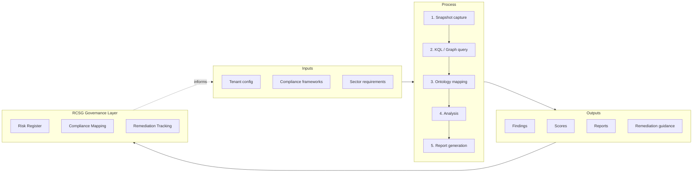
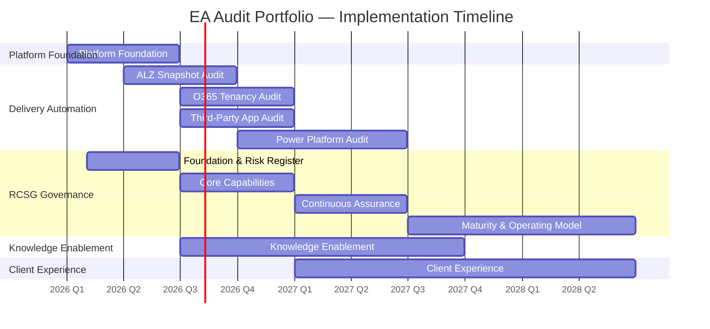

# Enterprise Architecture Audit Portfolio - VSOM Structure

## VE Lineage Chain: VSOM → OKR → VP → PMF → EFS → PPM

This document defines the strategic structure for semi-automated EA audit capabilities following the Azlan-EA-AAA ontology patterns.

---

## 1. VSOM (Vision, Strategy, Operating Model)

### Vision
**"Automated, ontology-driven enterprise architecture assessments that accelerate compliance validation and reduce audit effort by 60%."**

### Strategy
| Pillar | Allocation | Focus |
|--------|------------|-------|
| Delivery Automation | 35% | Automate audit execution |
| Knowledge Enablement | 30% | Capture and reuse patterns |
| Platform Foundation | 20% | Tooling and infrastructure |
| Client Experience | 15% | Reporting and engagement |

### Operating Model



---

## 2. OKRs (Objectives & Key Results)

### O1: Accelerate Compliance Assessment
| Key Result | Target | Timeline |
|------------|--------|----------|
| KR1.1 | Reduce manual audit effort by 60% | Y2Q4 |
| KR1.2 | Complete ALZ audit in <2 days (vs 2 weeks) | Y1Q4 |
| KR1.3 | Complete O365 audit in <1 day | Y2Q1 |
| KR1.4 | Complete Power Platform audit in <4 hours | Y2Q2 |

### O2: Expand Platform Coverage
| Key Result | Target | Timeline |
|------------|--------|----------|
| KR2.1 | ALZ Snapshot Audit GA | Y1Q3 |
| KR2.2 | O365 Tenancy Audit GA | Y1Q4 |
| KR2.3 | Power Platform Audit GA | Y2Q1 |
| KR2.4 | Third-Party Application Audit GA | Y2Q1 |
| KR2.5 | Cross-platform compliance view | Y2Q2 |

### O3: Ensure Regulatory Alignment
| Key Result | Target | Timeline |
|------------|--------|----------|
| KR3.1 | MCSB v2 100% control coverage | Y1Q4 |
| KR3.2 | Insurance sector requirements mapped | Y2Q1 |
| KR3.3 | DORA readiness assessment available | Y2Q4 |

---

## 3. Value Propositions

### VP1: For Enterprise Architects
> "Spend less time gathering data and more time advising clients on architecture decisions."

**Benefits:**
- Automated configuration capture eliminates manual screenshot collection
- Ontology-driven analysis provides consistent evaluation
- Cross-platform view shows interdependencies

### VP2: For Compliance Officers
> "Demonstrate regulatory compliance with evidence-backed assessments."

**Benefits:**
- Framework mapping to MCSB, NIST, ISO 27001
- Insurance sector requirements (FCA, PRA, Lloyd's) alignment
- Audit trail and finding documentation

### VP3: For IT Leadership
> "Understand security posture across Azure, M365, and Power Platform in a unified view."

**Benefits:**
- WAF pillar scoring (Security, Reliability, Cost, etc.)
- Executive dashboards with trend analysis
- Prioritized remediation recommendations

### VP4: For Delivery Teams
> "Reusable patterns and queries accelerate future assessments."

**Benefits:**
- Ontology-backed knowledge base
- KQL/Graph query library
- Template-driven report generation

---

## 4. Epics

### Epic: ALZ Snapshot Audit Capability
**ID:** `epic:alz-snapshot-audit`
**Status:** Active (Issue #1)
**Scope:** Azure Landing Zone configuration assessment

### Epic: O365 Tenancy Audit Capability (NEW)
**ID:** `epic:o365-tenancy-audit`
**Scope:** Microsoft 365 tenant configuration and governance assessment

**Includes:**
- Exchange Online security and compliance
- SharePoint/OneDrive governance
- Teams configuration and policies
- Entra ID identity posture
- M365 Defender settings
- Purview compliance configuration

### Epic: Power Platform Audit Capability (NEW)
**ID:** `epic:power-platform-audit`
**Scope:** Power Platform environment governance assessment

**Includes:**
- Environment strategy and isolation
- DLP policies and connector governance
- Power Apps inventory and security
- Power Automate flow governance
- Power BI workspace management
- Dataverse security model

### Epic: Third-Party Application Audit Capability (NEW)
**ID:** `epic:third-party-app-audit`
**Status:** Active (Issue #61)
**Scope:** Third-party application portfolio, integration security, and vendor risk assessment

**Includes:**
- Enterprise application and OAuth permission inventory
- Acturis integration deep-dive (SSO, API, data flows, credentials)
- Credential and Key Vault audit
- Vendor risk assessment (DPA, DR, exit strategy, certifications)
- Integration security (APIM, Logic Apps, Functions, linked services)
- GDPR Art.28, FCA, PRA SS1/21, DORA vendor compliance mapping

### Epic: RCSG Governance Capability (NEW)

**ID:** `epic:rcsg-governance`
**Scope:** Enterprise risk, compliance, security, and governance layer across all audit workstreams

**Includes:**

- Enterprise risk register aggregating findings from ALZ, O365, PP, TP
- Regulatory compliance automation (MCSB, NIST, ISO, FCA, PRA, DORA)
- Threat modelling (STRIDE/DREAD, MITRE ATT&CK/D3FEND)
- AI governance framework (UK AI, EU AI Act, OWASP LLM Top 10)
- Continuous assurance model with drift detection and trend analysis
- Governance operating model (RACI, policy lifecycle, exception management)

---

## 5. Features by Epic

### ALZ Snapshot Audit Features
| # | Feature | Status | Issue |
|---|---------|--------|-------|
| F1 | Compliance Framework Mapping | Active | #2 |
| F2 | KQL Query Library | Active | #3 |
| F3 | WAF Assessment Integration | Active | #4 |
| F4 | OAA Ontology Structure | Active | #5 |
| F5 | Azure Workbook Dashboards | Active | #6 |
| F6 | Report Generation | Active | #7 |

### O365 Tenancy Audit Features (NEW)
| # | Feature | Description |
|---|---------|-------------|
| F7 | O365 Ontology | Extend OAA pattern for M365 entities |
| F8 | Exchange Security Queries | Mail flow, anti-spam, DKIM/DMARC |
| F9 | SharePoint Governance | External sharing, DLP, sensitivity |
| F10 | Teams Compliance | Guest access, retention, eDiscovery |
| F11 | Entra ID Posture | Conditional access, MFA, PIM |
| F12 | M365 Compliance Mapping | MCSB, ISO 27001, GDPR coverage |

### Power Platform Audit Features (NEW)
| # | Feature | Description |
|---|---------|-------------|
| F13 | Power Platform Ontology | Environment, app, flow entities |
| F14 | DLP Policy Assessment | Connector classification, policy gaps |
| F15 | Power Apps Inventory | App owners, connectors, data sources |
| F16 | Power Automate Governance | Flow security, premium connectors |
| F17 | Power BI Workspace Audit | Sharing, refresh, gateway settings |
| F18 | Environment Strategy | Dev/Test/Prod isolation review |

### Third-Party Application Audit Features (NEW)
| # | Feature | Description |
|---|---------|-------------|
| F19 | TP Application Ontology | Extend OAA pattern for third-party entities |
| F20 | Enterprise App Inventory | Entra app registrations, OAuth consents, SSO |
| F21 | Acturis Integration Assessment | SSO, API, data flows, credentials, DR |
| F22 | Credential & Key Vault Audit | Secret management, rotation, expiry |
| F23 | Integration Security | APIM, Logic Apps, Functions, linked services |
| F24 | Vendor Risk & Compliance Mapping | DPA, DORA, FCA, PRA vendor requirements |

### RCSG Governance Features (NEW)

| # | Feature | Description |
|---|---------|-------------|
| F25 | Enterprise Risk Register | Unified risk register aggregating findings across all platforms |
| F26 | Regulatory Compliance Automation | Cross-framework mapping (MCSB, NIST, ISO, FCA, PRA, DORA) |
| F27 | Threat Modelling Integration | STRIDE/DREAD methodology with MITRE ATT&CK/D3FEND alignment |
| F28 | AI Governance Framework | UK AI, EU AI Act, OWASP LLM Top 10 compliance assessment |
| F29 | Continuous Assurance Model | Drift detection, remediation tracking, trend analysis |
| F30 | Governance Operating Model | RACI, policy lifecycle, exception management, regulatory change |

---

## 6. Stories by Feature

### O365 Tenancy Audit Stories

#### F7: O365 Ontology
| Story | Narrative | Acceptance |
|-------|-----------|------------|
| S7.1 | As an EA, I want M365 config entities mapped to schema.org types | OAA v6 compliant ontology |
| S7.2 | As an auditor, I want compliance controls linked to M365 settings | MCSB-M365 mapping complete |
| S7.3 | As an analyst, I want test data following 60-20-10-10 pattern | Test data validates |

#### F8: Exchange Security Queries
| Story | Narrative | Acceptance |
|-------|-----------|------------|
| S8.1 | As a security analyst, I want mail flow rules audited | Graph query returns all rules |
| S8.2 | As a compliance officer, I want DKIM/DMARC status checked | DNS validation queries work |
| S8.3 | As an EA, I want anti-phishing policies assessed | Policy coverage report generated |

#### F9: SharePoint Governance
| Story | Narrative | Acceptance |
|-------|-----------|------------|
| S9.1 | As a DLP admin, I want external sharing settings audited | Sharing policies documented |
| S9.2 | As a compliance officer, I want sensitivity labels reviewed | Label usage report available |
| S9.3 | As an EA, I want site collection policies assessed | Governance gaps identified |

### Power Platform Audit Stories

#### F13: Power Platform Ontology
| Story | Narrative | Acceptance |
|-------|-----------|------------|
| S13.1 | As an EA, I want environment entities in OAA format | Ontology validates |
| S13.2 | As an auditor, I want DLP policies as compliance controls | Control mapping complete |
| S13.3 | As an analyst, I want connector inventory entities | Connector types classified |

#### F14: DLP Policy Assessment
| Story | Narrative | Acceptance |
|-------|-----------|------------|
| S14.1 | As a governance lead, I want DLP coverage analysis | Policy gap report available |
| S14.2 | As a security analyst, I want blocked connectors listed | Connector blocklist documented |
| S14.3 | As an EA, I want business/non-business classification reviewed | Classification report generated |

#### F15: Power Apps Inventory
| Story | Narrative | Acceptance |
|-------|-----------|------------|
| S15.1 | As an admin, I want all Power Apps catalogued | App inventory complete |
| S15.2 | As a security analyst, I want connector usage per app | Connector mapping available |
| S15.3 | As a governance lead, I want orphaned apps identified | Orphan report generated |

### Third-Party Application Audit Stories

#### F19: TP Application Ontology
| Story | Narrative | Acceptance |
|-------|-----------|------------|
| S19.1 | As an EA, I want third-party app entities mapped to schema.org types | OAA v6 compliant ontology |
| S19.2 | As an auditor, I want vendor risk controls linked to app settings | Compliance mapping complete |
| S19.3 | As an analyst, I want integration data flow entities modelled | Data flow ontology validates |

#### F20: Enterprise App Inventory
| Story | Narrative | Acceptance |
|-------|-----------|------------|
| S20.1 | As a security analyst, I want all enterprise apps catalogued | Graph query returns full inventory |
| S20.2 | As a compliance officer, I want OAuth permissions reviewed | Permission scope report generated |
| S20.3 | As an EA, I want SSO configuration assessed per app | SSO posture documented |

#### F21: Acturis Integration Assessment
| Story | Narrative | Acceptance |
|-------|-----------|------------|
| S21.1 | As an EA, I want Acturis SSO and authentication assessed | Auth flow documented |
| S21.2 | As a security analyst, I want API integration security reviewed | API security report generated |
| S21.3 | As a compliance officer, I want Acturis data flows mapped | Data flow diagram and classification available |

#### F22: Credential & Key Vault Audit
| Story | Narrative | Acceptance |
|-------|-----------|------------|
| S22.1 | As a security analyst, I want expiring credentials identified | Credential expiry report generated |
| S22.2 | As an EA, I want Key Vault access policies reviewed | Access policy audit complete |
| S22.3 | As a compliance officer, I want secret rotation compliance checked | Rotation compliance report available |

#### F23: Integration Security
| Story | Narrative | Acceptance |
|-------|-----------|------------|
| S23.1 | As a security analyst, I want APIM policies and backends audited | APIM security report generated |
| S23.2 | As an EA, I want Logic App and Function integrations inventoried | Integration inventory complete |
| S23.3 | As a compliance officer, I want data transfer encryption validated | Encryption posture documented |

#### F24: Vendor Risk & Compliance Mapping
| Story | Narrative | Acceptance |
|-------|-----------|------------|
| S24.1 | As a compliance officer, I want vendor DPA status tracked | DPA compliance register available |
| S24.2 | As a risk manager, I want vendor DR and exit strategies assessed | Vendor risk report generated |
| S24.3 | As an EA, I want FCA/PRA/DORA vendor requirements mapped | Regulatory mapping complete |

---

## 7. Implementation Timeline



---

## 8. Ontology Alignment

All audit capabilities follow OAA v6.0.0 patterns:

```json
{
  "@context": {
    "@vocab": "https://schema.org/",
    "alz": "urn:alz:ontology:",
    "o365": "urn:o365:ontology:",
    "pp": "urn:powerplatform:ontology:",
    "tp": "urn:thirdparty:ontology:",
    "rcsg": "urn:rcsg:ontology:"
  }
}
```

### Entity Mapping
| Platform | Entity Pattern | Schema.org Type |
|----------|----------------|-----------------|
| ALZ | `alz:AzureResource` | `schema:SoftwareApplication` |
| O365 | `o365:M365Service` | `schema:SoftwareApplication` |
| Power Platform | `pp:Environment` | `schema:SoftwareApplication` |
| Third-Party Apps | `tp:ThirdPartyApplication` | `schema:SoftwareApplication` |
| RCSG Governance | `rcsg:RiskRegister` | `schema:ItemList` |
| RCSG Governance | `rcsg:ComplianceObligation` | `schema:Legislation` |
| RCSG Governance | `rcsg:ThreatScenario` | `schema:Action` |

---

## 9. Compliance Framework Coverage

| Framework | ALZ | O365 | Power Platform | Third-Party Apps | RCSG |
|-----------|-----|------|----------------|------------------|------|
| MCSB v2 | ✓ Primary | ✓ Identity, Data | ✓ Data, Governance | ✓ App Security | ✓ Cross-platform |
| NIST 800-53 R5 | ✓ Full | ✓ AC, SC families | ✓ AC, CM families | ✓ SA, SR families | ✓ RA, PM families |
| ISO 27001:2022 | ✓ Full | ✓ A.9, A.13, A.18 | ✓ A.9, A.12, A.14 | ✓ A.15 Supplier | ✓ A.5 Governance |
| FCA SYSC 13.9 | ✓ Ops Resilience | ✓ Service continuity | ✓ Citizen dev risk | ✓ Outsourcing risk | ✓ Enterprise risk |
| PRA SS1/21 | ✓ Third party | ✓ M365 as third party | ✓ Low-code risk | ✓ Primary focus | ✓ Aggregation |
| Lloyd's MS13 | ✓ Cyber | ✓ Email security | ✓ Data handling | ✓ Vendor cyber | ✓ Posture mgmt |
| GDPR Art.28 | ✓ Data protection | ✓ Purview, DLP | ✓ Dataverse | ✓ Processor obligations | ✓ DPO oversight |
| DORA (2027) | ✓ Digital resilience | ✓ Critical service | ✓ Operational risk | ✓ ICT third-party | ✓ ICT register |
| UK AI Regulation | — | — | — | — | ✓ AI governance |
| EU AI Act | — | — | — | — | ✓ Risk classification |

---

## 10. Next Steps

### Wave 1 — February/March 2026 (Enabling Works)

1. **Architecture Design Review** — inform AI platform decisions (BSC: L2, L3)
2. **RCSG Governance Baseline** — risk register structure, compliance obligations inventory (BSC: P3, F4)
3. **ALZ Audit v2 Milestone Plan** — scope and schedule for revised audit (Issue #60)
4. **Complete TP Audit Artifacts** — Graph API queries (#04) and Compliance Mapping (#05) for tp-as-v1
5. **Acturis Integration Assessment** — scope and data flow mapping (feeds L2-KR2.2)
6. **RCSG Ontology + Risk Register MVP** — initial governance capability
7. **AI Governance Initial Assessment** — UK AI, OWASP LLM for virtual agents (#48, #56)

### Ongoing

1. **Create Epic/Feature Issues** for RCSG Governance (see Sections 4-5)
2. **Develop Ontologies** following OAA v6 pattern (ALZ, O365, PP, TP, RCSG)
3. **Build Query Libraries** (Graph API for O365/TP, Power Platform Admin API)
4. **Compliance Framework Cross-Mapping** — automate multi-framework analysis (#46-53)
5. **Enterprise Portfolio View** — unified dashboard across all workstreams (#37)

---

*Generated: 2026-02-04*
*Aligned to: Azlan-EA-AAA VE Lineage Chain*
*Repository: INS-PPL-AZL*
