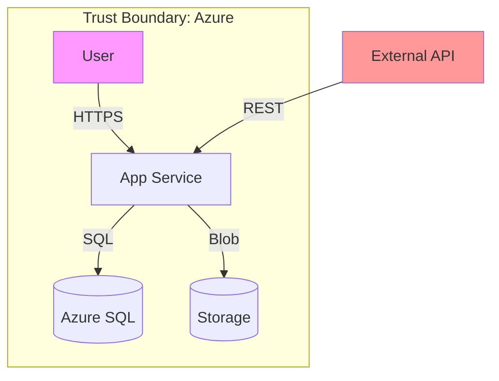
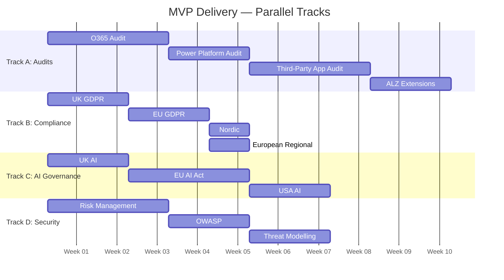

# Feature MVP Specifications

This document defines Minimum Viable Product (MVP) specifications for all planned features in the INS-PPL-AZL repository.

---

## MVP Definition Criteria

| Attribute | MVP Requirement |
|-----------|-----------------|
| Scope | Core functionality only, no edge cases |
| Deliverables | Working artifacts, not polished |
| Coverage | 60% of typical use cases |
| Timeline | 2-4 weeks per feature MVP |
| Quality | Functional, documented, testable |

---

## 1. O365 Tenancy Snapshot Audit MVP (#42)

### Objective
Deliver basic M365 tenant security assessment capability following ALZ pattern.

### MVP Scope

#### In Scope
| Component | MVP Deliverable |
|-----------|-----------------|
| Ontology | 8 core entities (M365Service, ExchangeConfig, SharePointConfig, TeamsConfig, EntraIDConfig, M365Finding, M365Assessment, M365Control) |
| Queries | 15 Graph API queries covering critical security settings |
| Mapping | MCSB v2 identity and data protection controls only |
| Report | Basic markdown report template |

#### Out of Scope (v2+)
- Purview compliance center integration
- Defender for Office 365 deep analysis
- Historical trend analysis
- Automated remediation scripts

### Core Queries (MVP)

```
Query ID    | Target                      | Risk
------------|-----------------------------|---------
O365-001    | MFA enforcement status      | Critical
O365-002    | Conditional Access policies | Critical
O365-003    | Admin role assignments      | High
O365-004    | External sharing settings   | High
O365-005    | Guest access policies       | High
O365-006    | Legacy auth protocols       | Critical
O365-007    | Mail flow rules (risky)     | Medium
O365-008    | DKIM/DMARC status          | Medium
O365-009    | Teams external access       | Medium
O365-010    | OneDrive sharing defaults   | Medium
O365-011    | Audit log retention         | High
O365-012    | DLP policies active         | Medium
O365-013    | Sensitivity labels deployed | Medium
O365-014    | PIM role activation         | High
O365-015    | Sign-in risk policies       | High
```

### MVP Ontology (8 Entities)

```json
{
  "entities": [
    {
      "name": "M365Tenant",
      "schemaType": "Organization",
      "properties": ["tenantId", "displayName", "verifiedDomains"]
    },
    {
      "name": "EntraIDConfig",
      "schemaType": "SoftwareApplication",
      "properties": ["mfaStatus", "conditionalAccessPolicies", "pimEnabled"]
    },
    {
      "name": "ExchangeOnlineConfig",
      "schemaType": "SoftwareApplication",
      "properties": ["mailFlowRules", "antiPhishingPolicies", "dkimStatus"]
    },
    {
      "name": "SharePointConfig",
      "schemaType": "SoftwareApplication",
      "properties": ["externalSharing", "dlpPolicies", "sensitivityLabels"]
    },
    {
      "name": "TeamsConfig",
      "schemaType": "SoftwareApplication",
      "properties": ["guestAccess", "externalAccess", "meetingPolicies"]
    },
    {
      "name": "M365ComplianceControl",
      "schemaType": "Action",
      "properties": ["controlId", "framework", "status"]
    },
    {
      "name": "M365Finding",
      "schemaType": "Observation",
      "properties": ["severity", "description", "remediation"]
    },
    {
      "name": "M365Assessment",
      "schemaType": "Assessment",
      "properties": ["assessmentDate", "overallScore", "findings"]
    }
  ]
}
```

### Acceptance Criteria
- [ ] Ontology validates against OAA v6 schema
- [ ] All 15 queries execute successfully against test tenant
- [ ] MCSB identity controls mapped (IM-1 through IM-8)
- [ ] Report generates with findings and scores
- [ ] Test data follows 60-20-10-10 pattern

### Timeline: 3 weeks
| Week | Deliverable |
|------|-------------|
| 1 | Ontology + 5 critical queries |
| 2 | Remaining queries + mapping |
| 3 | Report template + testing |

---

## 2. Power Platform Snapshot Audit MVP (#43)

### Objective
Deliver basic Power Platform governance assessment capability.

### MVP Scope

#### In Scope
| Component | MVP Deliverable |
|-----------|-----------------|
| Ontology | 6 core entities |
| Queries | 12 Admin API queries |
| Mapping | DLP and governance controls |
| Report | Basic governance report |

#### Out of Scope (v2+)
- Individual app security analysis
- Flow performance metrics
- Dataverse deep security review
- CoE Starter Kit integration

### Core Queries (MVP)

```
Query ID    | Target                      | Risk
------------|-----------------------------|---------
PP-001      | Environment inventory       | Info
PP-002      | DLP policy coverage         | Critical
PP-003      | Connector classification    | High
PP-004      | Unmanaged environments      | High
PP-005      | Apps without owners         | Medium
PP-006      | Flows with premium connectors| Medium
PP-007      | External sharing enabled    | High
PP-008      | Admin role assignments      | High
PP-009      | Environment security groups | Medium
PP-010      | Capacity consumption        | Low
PP-011      | Solution publisher trust    | Medium
PP-012      | Custom connector inventory  | High
```

### MVP Ontology (6 Entities)

```json
{
  "entities": [
    {
      "name": "PowerPlatformEnvironment",
      "schemaType": "SoftwareApplication",
      "properties": ["environmentId", "type", "securityGroup", "dlpPolicies"]
    },
    {
      "name": "DLPPolicy",
      "schemaType": "Action",
      "properties": ["policyId", "scope", "businessConnectors", "blockedConnectors"]
    },
    {
      "name": "PowerApp",
      "schemaType": "SoftwareApplication",
      "properties": ["appId", "owner", "connectors", "sharedWith"]
    },
    {
      "name": "PowerAutomateFlow",
      "schemaType": "SoftwareApplication",
      "properties": ["flowId", "owner", "triggers", "connectors"]
    },
    {
      "name": "PPFinding",
      "schemaType": "Observation",
      "properties": ["severity", "category", "remediation"]
    },
    {
      "name": "PPAssessment",
      "schemaType": "Assessment",
      "properties": ["assessmentDate", "governanceScore", "findings"]
    }
  ]
}
```

### Acceptance Criteria
- [ ] Ontology validates against OAA v6
- [ ] All 12 queries execute via Power Platform Admin API
- [ ] DLP gap analysis generates recommendations
- [ ] Environment inventory complete
- [ ] Test data follows 60-20-10-10 pattern

### Timeline: 2 weeks
| Week | Deliverable |
|------|-------------|
| 1 | Ontology + environment/DLP queries |
| 2 | App/Flow queries + report |

---

## 3. UK GDPR Compliance MVP (#46)

### Objective
Deliver UK-specific GDPR compliance mapping for Azure assessments.

### MVP Scope

#### In Scope
| Component | MVP Deliverable |
|-----------|-----------------|
| Ontology | 5 GDPR entities |
| Mapping | 20 key DPA 2018 requirements to Azure controls |
| Checklist | DPIA template |
| Queries | 8 data protection queries |

#### Out of Scope (v2+)
- SAR workflow automation
- ICO breach notification workflow
- Full UK IDTA assessment
- Processor agreement templates

### Key Requirements Mapping (MVP)

```
UK GDPR Article  | Azure Control           | Query
-----------------|-------------------------|-------
Art.5 Principles | Encryption, access logs | UKGDPR-001
Art.6 Lawful Basis| Consent management     | UKGDPR-002
Art.25 Privacy by Design | Defender settings | UKGDPR-003
Art.30 RoPA      | Resource inventory      | UKGDPR-004
Art.32 Security  | NSG, encryption, MFA    | UKGDPR-005
Art.33 Breach    | Sentinel alerts         | UKGDPR-006
Art.35 DPIA      | Risk assessment         | UKGDPR-007
UK IDTA          | Data residency check    | UKGDPR-008
```

### MVP Ontology (5 Entities)

```json
{
  "entities": [
    {
      "name": "GDPRRequirement",
      "schemaType": "Legislation",
      "properties": ["article", "description", "ukSpecific"]
    },
    {
      "name": "LawfulBasis",
      "schemaType": "Action",
      "properties": ["basisType", "documentation", "dataCategories"]
    },
    {
      "name": "DataProcessingActivity",
      "schemaType": "Action",
      "properties": ["purpose", "lawfulBasis", "dataSubjects", "retention"]
    },
    {
      "name": "DPIA",
      "schemaType": "Assessment",
      "properties": ["processingDescription", "necessity", "risks", "mitigations"]
    },
    {
      "name": "DataTransfer",
      "schemaType": "TransferAction",
      "properties": ["destination", "mechanism", "safeguards"]
    }
  ]
}
```

### DPIA Template (MVP)
1. Processing description
2. Necessity and proportionality
3. Risk identification (using STRIDE)
4. Risk mitigation measures
5. ICO consultation triggers

### Acceptance Criteria
- [ ] 20 DPA 2018 requirements mapped to Azure
- [ ] DPIA template validated against ICO guidance
- [ ] Data residency queries identify UK region resources
- [ ] Art.32 security checklist complete

### Timeline: 2 weeks

---

## 4. EU GDPR Compliance MVP (#47)

### Objective
Deliver EU GDPR compliance framework for Azure assessments.

### MVP Scope

#### In Scope
| Component | MVP Deliverable |
|-----------|-----------------|
| Ontology | Extend UK GDPR entities |
| Mapping | 25 key GDPR articles to Azure |
| Checklist | SCC compliance checklist |
| Queries | 10 data protection queries |

#### Out of Scope (v2+)
- BCR assessment
- Full RoPA generator
- Cross-border transfer impact assessment
- EDPB guideline deep integration

### Key Articles Mapping (MVP)

```
GDPR Article     | Focus                   | Azure Mapping
-----------------|-------------------------|---------------
Art.5            | Processing principles   | Policy compliance
Art.6            | Lawful basis           | Consent/contract
Art.9            | Special categories     | Sensitivity labels
Art.12-22        | Data subject rights    | Access controls
Art.25           | Privacy by design      | Secure defaults
Art.30           | Records of processing  | Resource tags
Art.32           | Security measures      | Full MCSB
Art.33-34        | Breach notification    | Sentinel, alerts
Art.35           | DPIA                   | Risk assessment
Art.44-49        | International transfers| Region, SCCs
```

### SCC Compliance Checklist (MVP)
- [ ] Module selection (C2C, C2P, P2P, P2C)
- [ ] Technical measures documented
- [ ] Supplementary measures assessed
- [ ] Transfer impact assessment
- [ ] Onward transfer restrictions

### Acceptance Criteria
- [ ] 25 GDPR articles mapped
- [ ] SCC checklist complete
- [ ] Integration with UK GDPR entities
- [ ] EDPB TIA template included

### Timeline: 2 weeks

---

## 5. UK AI Regulation MVP (#48)

### Objective
Map UK AI regulatory principles to Azure AI services.

### MVP Scope

#### In Scope
| Component | MVP Deliverable |
|-----------|-----------------|
| Ontology | 4 AI governance entities |
| Mapping | 5 UK principles to Azure OpenAI controls |
| Checklist | FCA AI/ML checklist (SS1/23) |
| Queries | 5 AI governance queries |

#### Out of Scope (v2+)
- Full sector regulator mapping (all 7)
- AI assurance certification
- AI Safety Institute alignment
- Algorithmic impact assessment

### UK AI Principles Mapping (MVP)

```
Principle              | Azure Implementation        | Check
-----------------------|-----------------------------|---------
Safety & Security      | Content filters, guardrails | UKAI-001
Transparency           | Model cards, logging        | UKAI-002
Fairness               | Bias testing, monitoring    | UKAI-003
Accountability         | RBAC, audit logs           | UKAI-004
Contestability         | Human review workflows     | UKAI-005
```

### FCA SS1/23 Checklist (MVP)
- [ ] Model risk management framework
- [ ] Model validation procedures
- [ ] Ongoing monitoring
- [ ] Documentation standards
- [ ] Third-party model governance

### MVP Ontology (4 Entities)

```json
{
  "entities": [
    {
      "name": "AISystem",
      "schemaType": "SoftwareApplication",
      "properties": ["systemId", "purpose", "riskLevel", "sector"]
    },
    {
      "name": "AIPrinciple",
      "schemaType": "Action",
      "properties": ["principleId", "description", "regulator"]
    },
    {
      "name": "AIControl",
      "schemaType": "Action",
      "properties": ["controlId", "implementation", "evidence"]
    },
    {
      "name": "AIAssessment",
      "schemaType": "Assessment",
      "properties": ["assessmentDate", "principleScores", "findings"]
    }
  ]
}
```

### Acceptance Criteria
- [ ] 5 UK principles mapped to Azure OpenAI
- [ ] FCA SS1/23 checklist complete
- [ ] Queries detect AI service configurations
- [ ] Insurance sector AI risks identified

### Timeline: 2 weeks

---

## 6. EU AI Act Compliance MVP (#49)

### Objective
Deliver EU AI Act risk classification and compliance framework.

### MVP Scope

#### In Scope
| Component | MVP Deliverable |
|-----------|-----------------|
| Ontology | 5 AI Act entities |
| Tool | Risk classification questionnaire |
| Mapping | High-risk requirements to Azure |
| Checklist | GPAI transparency checklist |

#### Out of Scope (v2+)
- Conformity assessment procedures
- Notified body integration
- Full Annex III system coverage
- AI Office reporting

### Risk Classification Tool (MVP)

```
Question                                          | Weight
--------------------------------------------------|--------
Does the system make decisions affecting rights?  | High
Is it used in critical infrastructure?            | High
Is it used for recruitment/HR decisions?          | High
Does it process biometric data?                   | High
Is it used for credit scoring?                    | High
Does it interact with children?                   | Medium
Is it a general-purpose AI model?                 | Medium
```

**Classification Output:**
- Unacceptable Risk → Prohibited
- High Risk → Full compliance required
- Limited Risk → Transparency only
- Minimal Risk → No requirements

### High-Risk Requirements Mapping (MVP)

```
AI Act Article | Requirement              | Azure Control
---------------|--------------------------|---------------
Art.9          | Risk management         | Responsible AI
Art.10         | Data governance         | Data lineage
Art.11         | Technical documentation | Model cards
Art.12         | Record-keeping          | Audit logs
Art.13         | Transparency            | Explainability
Art.14         | Human oversight         | Human-in-loop
Art.15         | Accuracy & robustness   | Testing, monitoring
```

### MVP Ontology (5 Entities)

```json
{
  "entities": [
    {
      "name": "AIActSystem",
      "schemaType": "SoftwareApplication",
      "properties": ["systemId", "riskClassification", "provider", "deployer"]
    },
    {
      "name": "AIActRequirement",
      "schemaType": "Legislation",
      "properties": ["article", "category", "applicability"]
    },
    {
      "name": "ConformityAssessment",
      "schemaType": "Assessment",
      "properties": ["assessmentType", "status", "evidence"]
    },
    {
      "name": "GPAIModel",
      "schemaType": "SoftwareApplication",
      "properties": ["modelId", "systemic", "transparencyObligations"]
    },
    {
      "name": "AIActCompliance",
      "schemaType": "Assessment",
      "properties": ["systemId", "requirements", "gaps"]
    }
  ]
}
```

### Acceptance Criteria
- [ ] Risk classification questionnaire functional
- [ ] High-risk requirements mapped (Art.9-15)
- [ ] GPAI transparency checklist complete
- [ ] Timeline obligations documented

### Timeline: 3 weeks

---

## 7. USA AI Governance MVP (#50)

### Objective
Map US AI governance requirements (NIST AI RMF, EO 14110) to Azure.

### MVP Scope

#### In Scope
| Component | MVP Deliverable |
|-----------|-----------------|
| Ontology | 4 US AI entities |
| Mapping | NIST AI RMF functions to Azure |
| Checklist | EO 14110 reporting checklist |
| Matrix | State law applicability |

#### Out of Scope (v2+)
- Full state law compliance (50 states)
- SEC AI disclosure templates
- FTC enforcement guidance
- Sector-specific requirements

### NIST AI RMF Mapping (MVP)

```
Function  | Category        | Azure Implementation
----------|-----------------|----------------------
GOVERN    | Culture         | Responsible AI policies
GOVERN    | Roles           | RBAC, accountability
MAP       | Context         | Use case documentation
MAP       | Risks           | Risk assessment
MEASURE   | Analysis        | Monitoring, metrics
MEASURE   | Trustworthiness | Testing, validation
MANAGE    | Treatment       | Controls, mitigations
MANAGE    | Monitoring      | Continuous assessment
```

### State Law Matrix (MVP - Top 5)

```
State      | Law       | Focus                | Effective
-----------|-----------|----------------------|----------
Colorado   | SB 24-205 | High-risk decisions  | 2026-02
California | AB 2013   | GenAI transparency   | 2026-01
Illinois   | AIPA      | Employment decisions | 2026-01
NYC        | LL 144    | Automated employment | Active
Texas      | HB 2060   | AI inventory         | 2025-09
```

### Acceptance Criteria
- [ ] NIST AI RMF 4 functions mapped
- [ ] EO 14110 checklist for dual-use foundation models
- [ ] Top 5 state laws documented
- [ ] Applicability assessment tool

### Timeline: 2 weeks

---

## 8. Nordic/Scandinavian Compliance MVP (#51)

### Objective
Document Nordic-specific data protection and AI requirements.

### MVP Scope

#### In Scope
| Component | MVP Deliverable |
|-----------|-----------------|
| Matrix | 5 DPA guidance comparison |
| Checklist | Nordic GDPR specifics |
| Mapping | Public sector AI requirements |

#### Out of Scope (v2+)
- Full national law translations
- Nordic AI sandbox applications
- Health data secondary use
- Cross-border Nordic cooperation

### DPA Guidance Matrix (MVP)

```
Topic                  | SE (IMY) | NO | DK | FI | IS
-----------------------|----------|----|----|----|----|
Facial recognition     | Strict   | M  | M  | M  | L  |
Public sector AI       | Strict   | S  | M  | M  | L  |
Cookie consent         | Medium   | M  | M  | M  | M  |
Cloud transfers        | Medium   | M  | S  | M  | M  |
Employee monitoring    | Strict   | S  | M  | M  | L  |

Legend: S=Strict, M=Medium, L=Lenient
```

### Nordic-Specific Checklist (MVP)
- [ ] National derogation assessment
- [ ] Public sector transparency requirements
- [ ] Works council notification (where applicable)
- [ ] Nordic cooperation considerations

### Acceptance Criteria
- [ ] 5 DPA guidance areas documented
- [ ] Key differences from standard GDPR identified
- [ ] Public sector AI checklist complete

### Timeline: 1 week

---

## 9. European Regional Compliance MVP (#52)

### Objective
Document DACH, Benelux, and Southern European specifics.

### MVP Scope

#### In Scope
| Component | MVP Deliverable |
|-----------|-----------------|
| Matrix | 10 DPA guidance comparison |
| Checklist | Germany works council requirements |
| Mapping | Swiss nDSG key differences |

#### Out of Scope (v2+)
- Full 16 German state DPA mapping
- French CNIL AI sandbox
- Spanish AEPD AI sandbox
- All national derogations

### Regional Matrix (MVP)

```
Topic              | DE    | CH   | FR   | NL   | ES   | IT
-------------------|-------|------|------|------|------|------
Consent strictness | High  | Med  | High | Med  | Med  | High
Works councils     | Req   | -    | Cons | Cons | -    | -
AI transparency    | High  | Med  | High | High | Med  | High
Cookie enforcement | High  | Med  | High | Med  | Med  | High
Transfer scrutiny  | High  | N/A  | High | Med  | Med  | High
```

### German Specifics Checklist (MVP)
- [ ] Federal vs state DPA jurisdiction
- [ ] Works council AI consultation (BetrVG §87)
- [ ] Strict consent requirements
- [ ] Data minimization enforcement

### Swiss nDSG Checklist (MVP)
- [ ] New law effective Sep 2023
- [ ] Adequacy decision implications
- [ ] Swiss-specific requirements
- [ ] Cross-border considerations

### Acceptance Criteria
- [ ] 10 key topics compared across 6 jurisdictions
- [ ] German works council checklist complete
- [ ] Swiss nDSG differences documented

### Timeline: 1 week

---

## 10. ALZ-SS-Audit Compliance Extensions MVP (#53)

### Objective
Extend ALZ Snapshot Audit with GDPR and AI Act compliance.

### MVP Scope

#### In Scope
| Component | MVP Deliverable |
|-----------|-----------------|
| Ontology | Add 5 compliance entities |
| Queries | 10 new KQL queries |
| Mapping | GDPR Art.32 + AI Act controls |
| Dashboard | 2 new workbook panels |

#### Out of Scope (v2+)
- International transfer deep analysis
- AI Act conformity workflow
- Full GDPR RoPA generation
- Automated remediation

### New KQL Queries (MVP)

```
Query ID      | Target                        | Framework
--------------|-------------------------------|----------
GDPR-001      | Encryption at rest status     | Art.32
GDPR-002      | Encryption in transit         | Art.32
GDPR-003      | Access logging enabled        | Art.30
GDPR-004      | Data residency compliance     | Art.44
GDPR-005      | Pseudonymization capability   | Art.32
AIACT-001     | AI service inventory          | Art.9
AIACT-002     | AI logging enabled            | Art.12
AIACT-003     | Content filter status         | Art.14
AIACT-004     | Model deployment governance   | Art.11
AIACT-005     | Human oversight configuration | Art.14
```

### New Dashboard Panels (MVP)
1. **GDPR Compliance Score** - Art.32 security measures status
2. **AI Risk Classification** - Azure AI services risk levels

### Acceptance Criteria
- [ ] 10 new queries integrated
- [ ] Ontology extended with compliance entities
- [ ] Dashboard panels render correctly
- [ ] Compliance mapping JSON updated

### Timeline: 2 weeks

---

## 11. Risk Management Framework MVP (#54)

### Objective
Deliver MITRE-based risk assessment capability.

### MVP Scope

#### In Scope
| Component | MVP Deliverable |
|-----------|-----------------|
| Ontology | 6 risk entities |
| Mapping | Top 20 ATT&CK techniques for Azure |
| Mapping | Top 10 ATLAS techniques for AI |
| Matrix | Risk-to-control mapping |

#### Out of Scope (v2+)
- Full ATT&CK matrix coverage
- D3FEND countermeasure automation
- MITRE ENGAGE integration
- Threat intelligence feeds

### ATT&CK Azure Techniques (MVP - Top 20)

```
Technique ID | Name                        | Azure Relevance
-------------|-----------------------------|-----------------
T1078        | Valid Accounts              | Azure AD compromise
T1190        | Exploit Public-Facing App   | App Service, VMs
T1098        | Account Manipulation        | RBAC changes
T1136        | Create Account              | Service principals
T1552        | Credentials in Files        | Key Vault access
T1087        | Account Discovery           | Enumeration
T1069        | Permission Groups Discovery | RBAC enumeration
T1082        | System Info Discovery       | Resource metadata
T1021        | Remote Services             | Bastion, RDP
T1570        | Lateral Tool Transfer       | Storage, VMs
T1486        | Data Encrypted for Impact   | Ransomware
T1490        | Inhibit System Recovery     | Backup deletion
T1485        | Data Destruction            | Resource deletion
T1496        | Resource Hijacking          | Cryptomining
T1078.004    | Cloud Accounts              | Azure AD
T1199        | Trusted Relationship        | Partner tenants
T1195        | Supply Chain Compromise     | Marketplace apps
T1110        | Brute Force                 | Azure AD
T1556        | Modify Auth Process         | Custom claims
T1562        | Impair Defenses             | Disable logging
```

### ATLAS AI Techniques (MVP - Top 10)

```
Technique ID  | Name                    | Azure AI Relevance
--------------|-------------------------|-----------------------
AML.T0000     | ML Model Access         | API exposure
AML.T0040     | ML Model Inference API  | Azure OpenAI API
AML.T0043     | Prompt Injection        | LLM attacks
AML.T0044     | Full Model Access       | Model extraction
AML.T0042     | Verify Attack           | Adversarial inputs
AML.T0048     | Supply Chain            | Model provenance
AML.T0010     | Public Data Sources     | Training data
AML.T0020     | Poisoning               | Data manipulation
AML.T0046     | Denial of ML Service    | Resource exhaustion
AML.T0047     | ML Artifact Exfiltration| Weights theft
```

### MVP Ontology (6 Entities)

```json
{
  "entities": [
    {
      "name": "ThreatTechnique",
      "schemaType": "Action",
      "properties": ["techniqueId", "name", "tactic", "platform"]
    },
    {
      "name": "ThreatActor",
      "schemaType": "Person",
      "properties": ["actorId", "motivation", "sophistication"]
    },
    {
      "name": "RiskScenario",
      "schemaType": "Event",
      "properties": ["techniques", "likelihood", "impact", "score"]
    },
    {
      "name": "SecurityControl",
      "schemaType": "Action",
      "properties": ["controlId", "mitigates", "effectiveness"]
    },
    {
      "name": "RiskAssessment",
      "schemaType": "Assessment",
      "properties": ["assessmentDate", "scenarios", "residualRisk"]
    },
    {
      "name": "ControlGap",
      "schemaType": "Observation",
      "properties": ["technique", "missingControl", "remediation"]
    }
  ]
}
```

### Acceptance Criteria
- [ ] 20 ATT&CK techniques mapped to Azure controls
- [ ] 10 ATLAS techniques mapped to AI controls
- [ ] Risk scoring methodology documented
- [ ] Control gap analysis functional

### Timeline: 3 weeks

---

## 12. OWASP Integration MVP (#56)

### Objective
Integrate OWASP security standards into audit framework.

### MVP Scope

#### In Scope
| Component | MVP Deliverable |
|-----------|-----------------|
| Mapping | OWASP Top 10 (2021) to Azure |
| Mapping | OWASP LLM Top 10 (2025) to Azure OpenAI |
| Checklist | OWASP ASVS L1 checklist |

#### Out of Scope (v2+)
- OWASP API Top 10 deep integration
- ASVS L2/L3 requirements
- OWASP SAMM assessment
- Automated OWASP testing

### OWASP Top 10 Mapping (MVP)

```
OWASP Risk              | Azure Control         | KQL Query
------------------------|-----------------------|----------
A01 Broken Access Ctrl  | RBAC, Conditional Acc | OWASP-001
A02 Crypto Failures     | Key Vault, TLS        | OWASP-002
A03 Injection           | WAF, Input validation | OWASP-003
A04 Insecure Design     | Threat modelling      | Manual
A05 Security Misconfig  | Policy, Defender      | OWASP-005
A06 Vulnerable Comp     | Container scanning    | OWASP-006
A07 Auth Failures       | Azure AD, MFA         | OWASP-007
A08 Data Integrity      | DevSecOps pipeline    | OWASP-008
A09 Logging Failures    | Monitor, Sentinel     | OWASP-009
A10 SSRF                | NSG, Private endpoints| OWASP-010
```

### OWASP LLM Top 10 Mapping (MVP)

```
OWASP LLM Risk          | Azure OpenAI Control  | Check
------------------------|-----------------------|-------
LLM01 Prompt Injection  | Content filters       | Config
LLM02 Sensitive Disclosure| PII detection       | Config
LLM03 Supply Chain      | Model catalog         | Inventory
LLM04 Data Poisoning    | Training governance   | Process
LLM05 Improper Output   | Response filters      | Config
LLM06 Excessive Agency  | Function limits       | Config
LLM07 System Prompt Leak| Prompt protection     | Design
LLM08 Vector Weakness   | Embedding security    | Design
LLM09 Misinformation    | Grounding, RAG        | Config
LLM10 Unbounded Consumption| Rate limits, quotas | Config
```

### OWASP ASVS L1 Checklist (MVP - 30 controls)
- Architecture (5 controls)
- Authentication (8 controls)
- Session Management (5 controls)
- Access Control (6 controls)
- Cryptography (6 controls)

### Acceptance Criteria
- [ ] OWASP Top 10 mapped to Azure
- [ ] OWASP LLM Top 10 mapped to Azure OpenAI
- [ ] ASVS L1 checklist complete (30 controls)
- [ ] Integration with ALZ audit queries

### Timeline: 2 weeks

---

## 13. Threat Modelling Workflow MVP (#57)

### Objective
Deliver systematic threat modelling capability for audits.

### MVP Scope

#### In Scope
| Component | MVP Deliverable |
|-----------|-----------------|
| Template | STRIDE threat identification template |
| Tool | DREAD risk scoring calculator |
| Diagrams | Mermaid DFD templates |
| Report | Threat model report template |

#### Out of Scope (v2+)
- Automated threat generation
- Tool integration (Threat Dragon, MS TMT)
- Attack tree generation
- Continuous threat modelling

### STRIDE Template (MVP)

```markdown
## Threat Analysis: [Component Name]

### 1. Spoofing
| Threat | ATT&CK | Likelihood | Impact | Controls |
|--------|--------|------------|--------|----------|
|        |        |            |        |          |

### 2. Tampering
| Threat | ATT&CK | Likelihood | Impact | Controls |
|--------|--------|------------|--------|----------|
|        |        |            |        |          |

### 3. Repudiation
| Threat | ATT&CK | Likelihood | Impact | Controls |
|--------|--------|------------|--------|----------|
|        |        |            |        |          |

### 4. Information Disclosure
| Threat | ATT&CK | Likelihood | Impact | Controls |
|--------|--------|------------|--------|----------|
|        |        |            |        |          |

### 5. Denial of Service
| Threat | ATT&CK | Likelihood | Impact | Controls |
|--------|--------|------------|--------|----------|
|        |        |            |        |          |

### 6. Elevation of Privilege
| Threat | ATT&CK | Likelihood | Impact | Controls |
|--------|--------|------------|--------|----------|
|        |        |            |        |          |
```

### DREAD Calculator (MVP)

```
Input Form:
┌─────────────────────────────────────────┐
│ Damage Potential:        [1-10] ___     │
│ Reproducibility:         [1-10] ___     │
│ Exploitability:          [1-10] ___     │
│ Affected Users:          [1-10] ___     │
│ Discoverability:         [1-10] ___     │
├─────────────────────────────────────────┤
│ DREAD Score: ___ / 10                   │
│ Risk Level:  [ ] Low [ ] Med [ ] High   │
└─────────────────────────────────────────┘

Scoring:
- 1-3:   Low Risk
- 4-6:   Medium Risk
- 7-10:  High Risk
```

### Mermaid DFD Template (MVP)



### Acceptance Criteria
- [ ] STRIDE template usable for ALZ components
- [ ] DREAD calculator produces risk scores
- [ ] DFD templates for common Azure patterns
- [ ] Threat model report template complete

### Timeline: 2 weeks

---

## 14. Third-Party Application Snapshot Audit MVP (#61)

### Objective
Deliver third-party application portfolio assessment with Acturis integration deep-dive.

### MVP Scope

#### In Scope
| Component | MVP Deliverable |
|-----------|-----------------|
| Ontology | 7 core entities |
| Queries | 15 Graph API / Azure CLI discovery queries |
| Mapping | GDPR Art.28, FCA, PRA SS1/21, DORA vendor risk controls |
| Report | Application portfolio + Acturis integration report |

#### Out of Scope (v2+)
- Penetration testing of third-party applications
- Full vendor contract review automation
- Sub-processor chain audit
- API endpoint security testing
- Automated vendor scoring platform

### Core Queries (MVP)

```
Query ID    | Target                           | Risk
------------|----------------------------------|---------
TP-001      | Enterprise app inventory         | Info
TP-002      | Application permissions (roles)  | Critical
TP-003      | Delegated permission grants      | High
TP-004      | OAuth consent grants             | High
TP-005      | High-risk Graph permissions      | Critical
TP-006      | App registration credential expiry| High
TP-007      | Insecure redirect URIs           | High
TP-008      | App registrations without owners | Medium
TP-009      | Key Vault inventory & metadata   | High
TP-010      | Service account inventory        | Medium
TP-011      | Acturis app registration         | High
TP-012      | Acturis sign-in activity         | Medium
TP-013      | Insurance vendor app detection   | Medium
TP-014      | APIM / Logic App / Function inventory | Medium
TP-015      | Synapse / ADF linked services    | High
```

### MVP Ontology (7 Entities)

```json
{
  "entities": [
    {
      "name": "ThirdPartyApplication",
      "schemaType": "SoftwareApplication",
      "properties": ["appId", "publisher", "permissions", "ssoMethod", "criticality"]
    },
    {
      "name": "VendorOrganisation",
      "schemaType": "Organization",
      "properties": ["vendorName", "dpaStatus", "certifications", "dataResidency"]
    },
    {
      "name": "IntegrationEndpoint",
      "schemaType": "EntryPoint",
      "properties": ["endpointType", "authMethod", "encryptionStatus", "credentialLocation"]
    },
    {
      "name": "DataFlow",
      "schemaType": "TransferAction",
      "properties": ["source", "destination", "dataTypes", "frequency", "encryption"]
    },
    {
      "name": "CredentialAsset",
      "schemaType": "DigitalDocument",
      "properties": ["credentialType", "storageLocation", "expiryDate", "rotationPolicy"]
    },
    {
      "name": "TPFinding",
      "schemaType": "Observation",
      "properties": ["severity", "domain", "description", "remediation"]
    },
    {
      "name": "TPAssessment",
      "schemaType": "Assessment",
      "properties": ["assessmentDate", "portfolioScore", "vendorRiskScore", "findings"]
    }
  ]
}
```

### Acceptance Criteria
- [ ] Ontology validates against OAA v6 schema
- [ ] All 15 queries execute successfully against test tenant
- [ ] Acturis integration mapped (SSO, API, data flows, credentials)
- [ ] Vendor risk matrix generates for critical vendors
- [ ] GDPR Art.28 / PRA SS1/21 / DORA vendor controls mapped
- [ ] Test data follows 60-20-10-10 pattern

### Timeline: 3 weeks
| Week | Deliverable |
|------|-------------|
| 1 | Ontology + enterprise app/OAuth queries |
| 2 | Credential audit + Acturis discovery + vendor risk matrix |
| 3 | Integration mapping + compliance mapping + testing |

---

## MVP Delivery Summary

| # | Feature | Timeline | Dependencies |
|---|---------|----------|--------------|
| 1 | O365 Audit | 3 weeks | ALZ patterns |
| 2 | Power Platform Audit | 2 weeks | ALZ patterns |
| 3 | UK GDPR | 2 weeks | None |
| 4 | EU GDPR | 2 weeks | UK GDPR |
| 5 | UK AI | 2 weeks | None |
| 6 | EU AI Act | 3 weeks | UK AI |
| 7 | USA AI | 2 weeks | None |
| 8 | Nordic | 1 week | EU GDPR |
| 9 | European Regional | 1 week | EU GDPR |
| 10 | ALZ Extensions | 2 weeks | #3, #4, #5, #6 |
| 11 | Risk Management | 3 weeks | None |
| 12 | OWASP | 2 weeks | None |
| 13 | Threat Modelling | 2 weeks | #11, #12 |
| 14 | Third-Party App Audit | 3 weeks | O365, PP patterns |

**Total Estimated Effort:** ~30 weeks (sequential) / ~10 weeks (parallel tracks)

### Parallel Track Suggestion



---

*Updated: 2026-02-04*
*Repository: INS-PPL-AZL*
