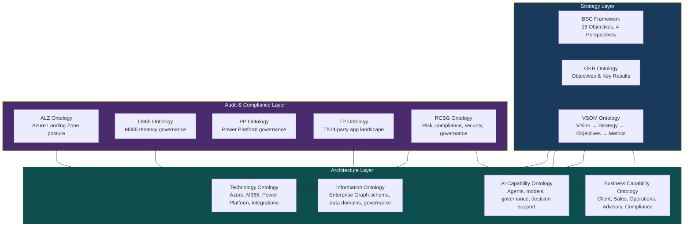
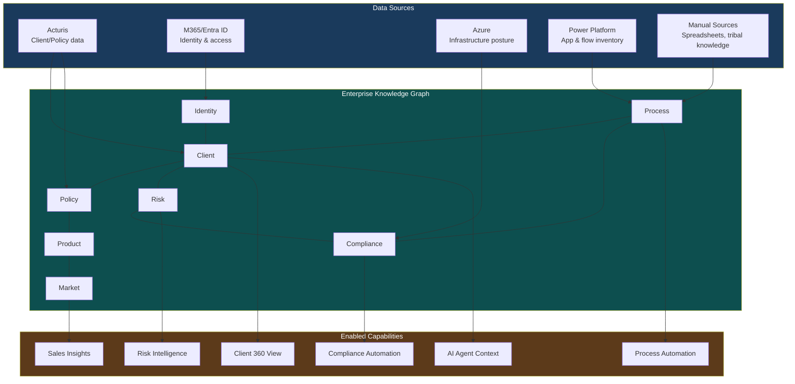
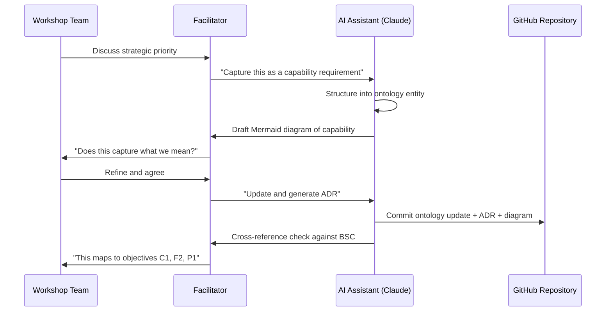
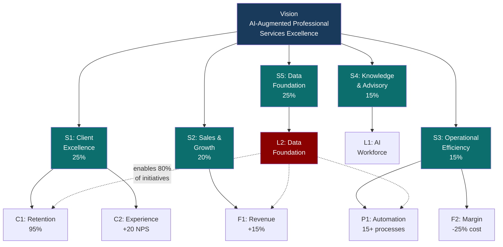
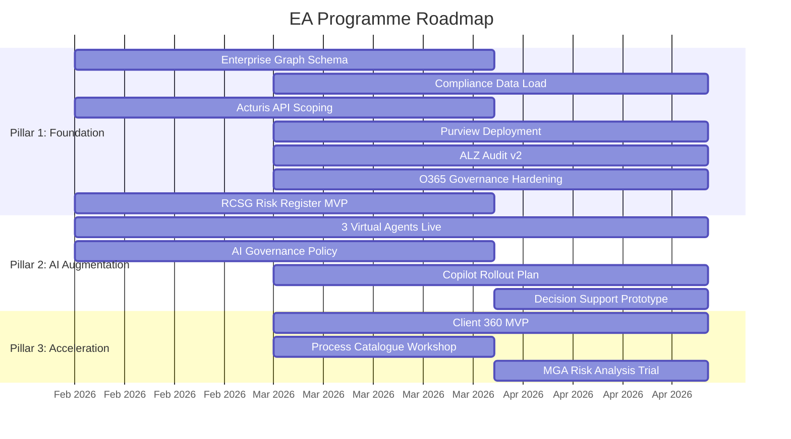
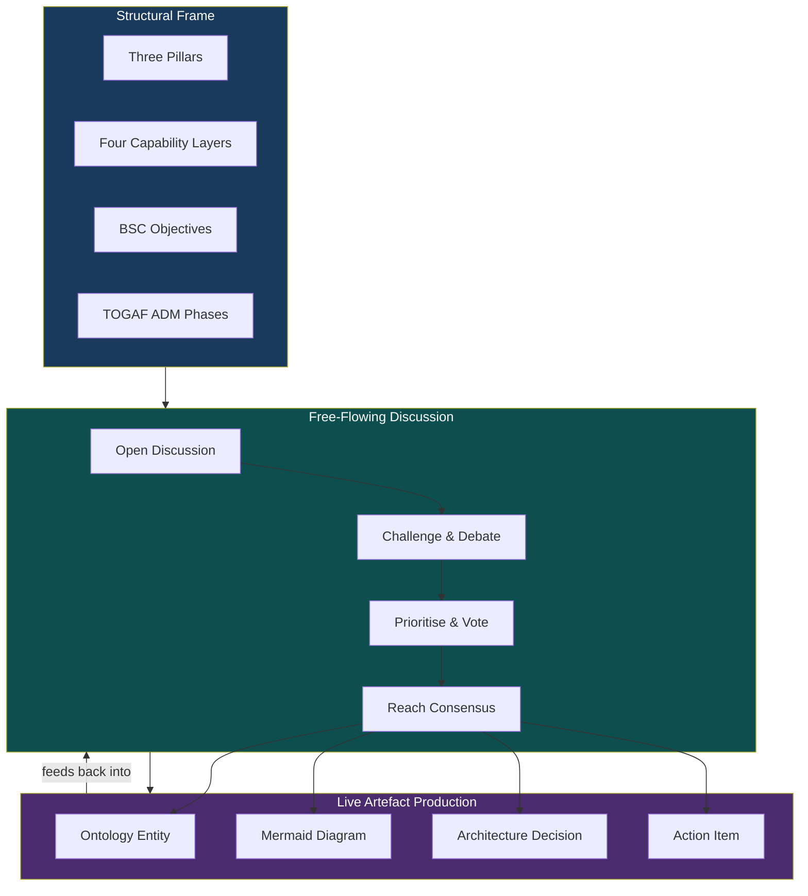

# EA Framework Summary

## An Ontology-Driven, AI-Augmented Enterprise Architecture Framework for INS

| Property | Value |
|----------|-------|
| Document Title | EA Framework Summary |
| Document Reference | EA-PPM-FW-2026-001 |
| Version | 1.0 |
| Date | 05 February 2026 |
| Status | Draft for Review |
| Classification | Internal — Commercial in Confidence |
| Audience | Steering Committee, EA Lead, Programme Manager, Workshop Participants |

---

## 1. Purpose

This document defines the framework by which the Enterprise Architecture for INS will be produced, maintained, and evolved. It is not the architecture itself — it is the method and tooling by which the architecture comes into existence, from ideas through to execution.

The framework has three defining characteristics:

1. **Ontology-driven** — the architecture is captured as structured, machine-readable models (ontologies) that can be graphed, queried, validated, and connected — not as static documents that age on a shelf
2. **AI-augmented** — every stage of the process is augmented by AI: from strategy articulation to diagram generation, from compliance mapping to document production
3. **Workshop-native** — the architecture is produced collaboratively and interactively, with live artefact generation during sessions, not retrospectively written up after the fact

---

## 2. From Ideas to Execution: The Flow

```mermaid
graph LR
    subgraph IDEATION["1. Ideation"]
        A[Strategic Intent] --> B[Workshop Discussion]
        B --> C[Captured Decision]
    end

    subgraph MODELLING["2. Modelling"]
        C --> D[Ontology Definition]
        D --> E[Graph Visualisation]
        E --> F[Cross-Domain Linking]
    end

    subgraph DESIGN["3. Design"]
        F --> G[Mermaid Diagrams]
        G --> H[Figma Artefacts]
        H --> I[Architecture Decision Records]
    end

    subgraph EXECUTION["4. Execution"]
        I --> J[Programme Specification]
        J --> K[Implementation Backlog]
        K --> L[Delivery & Measurement]
    end

    style IDEATION fill:#1a3a5c,color:#fff
    style MODELLING fill:#0d4f4f,color:#fff
    style DESIGN fill:#4a2c6e,color:#fff
    style EXECUTION fill:#5c3a1a,color:#fff
```



### Stage 1: Ideation — Workshop Capture

Strategic intent and business needs are articulated in a facilitated, free-flowing workshop environment. Decisions, priorities, and constraints are captured live in markdown, committed to the repository in real time.

### Stage 2: Modelling — Ontology & Graph

Workshop outputs are immediately structured into ontologies — formal, machine-readable models that define the entities, relationships, and properties of each architectural domain. These ontologies are loaded into the Enterprise Graph, connecting domains that were previously siloed.

### Stage 3: Design — Diagrams & Artefacts

From the ontologies and graph, architecture diagrams are generated (Mermaid for technical views, Figma for stakeholder-facing views). ADRs document key decisions. AI augments every step — generating initial diagram drafts, validating consistency, producing documentation.

### Stage 4: Execution — Programme & Delivery

The architecture translates into a structured programme with workstreams, milestones, dependencies, and a delivery backlog. BSC metrics provide continuous measurement. The ontologies remain the living model — updated as the architecture evolves.

---

## 3. The Ontology-Driven Approach

### Why Ontologies?

Traditional EA produces documents — Word files, Visio diagrams, PowerPoints — that are disconnected from each other and from the systems they describe. They become stale within weeks.

This framework uses **ontologies** (structured, machine-readable models in JSON-LD format) as the primary architecture artefact:

| Traditional EA | Ontology-Driven EA |
|----------------|-------------------|
| Architecture in Word/Visio documents | Architecture in machine-readable JSON-LD ontologies |
| Diagrams drawn manually, become stale | Diagrams generated from the model, always current |
| Domains described in separate documents | Domains connected in a single graph with cross-references |
| Compliance checked manually against frameworks | Compliance mapped automatically (MCSB ↔ NIST ↔ ISO ↔ FCA) |
| Strategy disconnected from implementation | Strategy encoded as VSOM ontology, linked to every domain |
| Architecture review requires meetings | Architecture queryable, visualisable, auditable on demand |

### The Ontology Stack



Each ontology:
- Is defined in JSON-LD format with a formal schema (entities, properties, relationships)
- Is version-controlled in the GitHub repository
- Is cross-referenced to related ontologies via shared key bridges
- Can be visualised in the ontology visualiser (3-tier drill-through: Series → Ontology → Entity)
- Is validated against the OAA v6.1.0 compliance standard (6 quality gates)

### The Enterprise Graph

The ontologies feed the Enterprise Graph — a graph database that connects all architectural domains into a single queryable knowledge layer:



The graph is the single source of architectural truth. Every question — "which processes affect this client?", "which compliance obligations apply to this product?", "which systems does this identity touch?" — is answered by traversing the graph, not by opening a document.

---

## 4. AI Augmentation at Every Stage

AI is not a bolt-on to this framework — it is embedded in the method at every stage:

| Stage | AI Role | Tooling |
|-------|---------|---------|
| **Ideation** | Capture and structure workshop discussions in real time; suggest connections between ideas; identify gaps in coverage | Claude (conversational AI), live markdown capture |
| **Modelling** | Generate ontology drafts from natural language descriptions; validate schema consistency; detect missing cross-references | Claude (code generation), OAA compliance engine |
| **Diagramming** | Generate Mermaid diagrams from ontology models; produce architecture views for different audiences; iterate on visual layout | Claude (Mermaid generation), Figma AI |
| **Documentation** | Produce ADRs, design specs, and programme documents from structured inputs; maintain consistency across artefacts | Claude (document generation), GitHub-native markdown |
| **Compliance** | Map controls across frameworks (MCSB ↔ NIST ↔ ISO 27001 ↔ FCA); assess posture against ontology-defined requirements | Compliance cross-mapping automation, RCSG ontology |
| **Review** | Validate architecture decisions against BSC objectives; identify orphaned initiatives; check traceability | BSC implementation map, graph queries |

### The AI-Augmented Workshop

During the workshop itself, AI augmentation operates in real time:



The result: by the end of the workshop, the repository contains structured, cross-referenced, machine-readable artefacts — not a set of meeting notes that someone has to interpret later.

---

## 5. Workshop Artefact Production

### Live Outputs

The workshop produces artefacts in real time, not retrospectively:

| Artefact Type | Format | How Produced | Example |
|---------------|--------|-------------|---------|
| **Architecture Decisions** | ADR (markdown) | AI-drafted during discussion, refined live, committed to repo | "ADR: Graph database technology selection" |
| **Capability Maps** | Mermaid diagram | Generated from ontology model as capabilities are discussed | Four-layer capability model with current/target state |
| **Process Flows** | Mermaid sequence/flowchart | Drawn live during process discussion, AI-augmented | Renewals process current vs target state |
| **Roadmaps** | Mermaid Gantt/timeline | Built incrementally as phases are agreed | 24-month capability roadmap by pillar |
| **Stakeholder Views** | Figma | Produced from Mermaid source for polished presentation | Executive-facing vision diagram |
| **Ontology Updates** | JSON-LD | Structured from workshop decisions, validated by OAA engine | Business capability ontology v1 |
| **Decision Records** | Markdown table | Captured in real time as consensus is reached | Workshop decision log |
| **Action Items** | Markdown table | Recorded as they arise, assigned live | Post-workshop action register |

### Mermaid Diagram Types

The framework uses Mermaid extensively for architecture communication:

**1. Strategy Cascade (Flowchart)**



**2. Three Pillars Progression (Flowchart)**


**3. Current State vs Target State (Quadrant)**

```mermaid
quadrantChart
    title Current State vs Target State by Capability Layer
    x-axis Low Maturity --> High Maturity
    y-axis Low Strategic Impact --> High Strategic Impact
    quadrant-1 Transform (High Impact, High Maturity)
    quadrant-2 Invest (High Impact, Low Maturity)
    quadrant-3 Monitor (Low Impact, Low Maturity)
    quadrant-4 Maintain (Low Impact, High Maturity)
    Business Capabilities: [0.2, 0.8]
    Information Capabilities: [0.15, 0.9]
    AI Capabilities: [0.25, 0.7]
    Technology Capabilities: [0.45, 0.6]
```

**4. Programme Timeline (Gantt)**



### Figma Artefacts

For stakeholder-facing and presentation-quality outputs, Mermaid diagrams are translated into Figma:

| Artefact | Source | Audience | Purpose |
|----------|--------|----------|---------|
| EA Vision Board | Mermaid strategy cascade + pillar diagram | Steering Committee | Wall-mounted reference for programme governance |
| Capability Layer Model | Mermaid four-layer stack | All stakeholders | Shared mental model of the architecture |
| Current vs Target Roadmap | Mermaid Gantt + timeline | Programme Manager, PMO | Planning and tracking reference |
| Enterprise Graph Schema | Ontology visualiser export | EA, IT, Data leads | Technical reference for graph implementation |
| BSC Strategy Map | Mermaid cause-effect diagram | Steering Committee | Strategic alignment reference |
| Three Pillars Progression | Mermaid flowchart | All participants | Programme narrative and framing |

Figma artefacts are produced from the same underlying model as the Mermaid diagrams — ensuring consistency. When the model changes, diagrams are regenerated, and Figma artefacts are updated to match.

---

## 6. The Workshop as a Production Environment

### Principles

The workshop is not a talking shop — it is a **production environment** for architecture artefacts:

1. **Ideas to artefacts in the room** — every significant decision produces a committed artefact before the session ends
2. **Structured capture, not meeting notes** — outputs are ontology entities, ADRs, and diagrams, not bullet points
3. **AI as a third participant** — not a scribe, but an active contributor that structures, validates, cross-references, and generates
4. **Version-controlled from the start** — every artefact is committed to the repository during the session, with full audit trail
5. **Free-flowing but framed** — discussion is open and exploratory, but the three pillars and four capability layers provide the structure that prevents drift

### Workshop Tooling

| Tool | Role | Live During Workshop? |
|------|------|-----------------------|
| **Claude (AI Assistant)** | Real-time ontology structuring, Mermaid generation, document drafting, cross-reference checking, BSC mapping | Yes — active throughout |
| **GitHub Repository** | Version-controlled artefact store, single source of truth, PR-based review | Yes — commits during session |
| **Ontology Visualiser** | Live graph exploration, 3-tier drill-through, cross-domain connection demo | Yes — Session 1 demo + on-demand |
| **Mermaid Live Editor** | Real-time diagram rendering from markdown, screen-shared for validation | Yes — diagrams built live |
| **Figma** | Polished stakeholder-facing artefacts from Mermaid sources | Post-session (same day) |
| **Markdown (VS Code)** | Live decision capture, ADR drafting, action recording | Yes — projected on screen |
| **Sticky Notes / Whiteboard** | Physical prioritisation, voting, unconstrained brainstorming | Yes — for divergent thinking |

### Workshop Flow: Free-Flowing Within Structure



The structural frame (pillars, layers, BSC, TOGAF) keeps the discussion anchored without constraining it. Participants are free to challenge, diverge, and explore — but every significant conclusion is captured as a structured artefact before moving on.

---

## 7. Framework Summary

### The EA Framework for INS in One Page

```text
PURPOSE
  Translate business strategy into architecture that delivers it.
  Reduce manual process from 60% to <=20%.
  Enable AI-augmented professional services excellence.

METHOD
  TOGAF ADM — fast-tracked for a mid-market firm (~£100M, ~800 people).
  Platform-agnostic by design, mindful of Microsoft stack benefits.
  Three pillars: Foundation → Augmentation → Acceleration.
  Four capability layers: Business, Information, AI, Technology.
  BSC alignment: 16 objectives across Financial, Customer, Process, Learning & Growth.

MODEL
  Ontology-driven: architecture captured as machine-readable JSON-LD models.
  Enterprise Graph: single knowledge layer connecting all domains.
  OAA v6.1.0: quality standard for ontology validation (6 gates).
  23 ontologies across 6 series, cross-referenced and versioned.

TOOLING
  AI-augmented: Claude for structuring, generation, validation, documentation.
  Mermaid: architecture diagrams generated from models, rendered in real time.
  Figma: stakeholder-facing artefacts from Mermaid sources.
  GitHub: version-controlled repository, PR-based governance, CI/CD for artefacts.
  Ontology Visualiser: 3-tier graph exploration (Series → Ontology → Entity).

GOVERNANCE
  Steering Committee: strategic decisions, resource allocation, programme sign-off.
  EA Lead: architecture decisions, technology selection (ADRs), ontology governance.
  SA → EA → CTO: escalation hierarchy for architecture decisions.
  All artefacts committed to repository with full audit trail.

PRODUCTION
  Workshop-native: artefacts produced in the room, not written up afterwards.
  Ideas to execution: discussion → ontology → diagram → decision → backlog.
  AI as third participant: structures, validates, generates, cross-references.
  Free-flowing within structure: open debate framed by pillars, layers, and BSC.
```

---

## 8. How This Framework Maps to TOGAF ADM

| TOGAF Phase | INS Framework Activity | Output |
|-------------|----------------------|--------|
| **Preliminary** | Framework definition (this document), tooling setup, ontology standards | EA Framework Summary, OAA v6 standard, repository structure |
| **A: Architecture Vision** | EA Vision & Roadmap Workshop | Workshop Decision Record, Three Pillars agreement, Phase 2 scope |
| **B: Business Architecture** | BSC objectives, strategic pillars, process catalogue, capability mapping | Business Capability Ontology, Process Automation Assessment |
| **C: Information Systems Architecture** | Enterprise Graph specification, data governance model, ontology framework | Enterprise Graph Specification, Information Ontology, data source mapping |
| **D: Technology Architecture** | Snapshot audits (ALZ, O365, PP, TP), technology stack decisions | Technology Ontology, ADRs (graph DB, AI platform, integration, governance, compliance) |
| **E: Opportunities & Solutions** | Three pillars progression, initiative portfolio mapping, dependency analysis | Capability Roadmap, BSC Implementation Map |
| **F: Migration Planning** | Programme design, workstream definition, milestone planning | Programme Design, Gantt chart, workstream specifications |
| **G: Implementation Governance** | Steering committee cadence, ADR review, ontology governance, PR-based artefact management | Governance framework, decision log, change control |
| **H: Architecture Change Management** | Ontology versioning, graph evolution, continuous compliance monitoring | Updated ontologies, graph schema migrations, compliance reports |

---

*EA-PPM-FW-2026-001 — EA Framework Summary v1.0*
*Classification: Internal — Commercial in Confidence*
