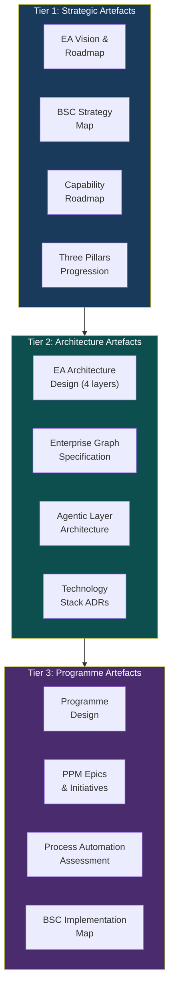
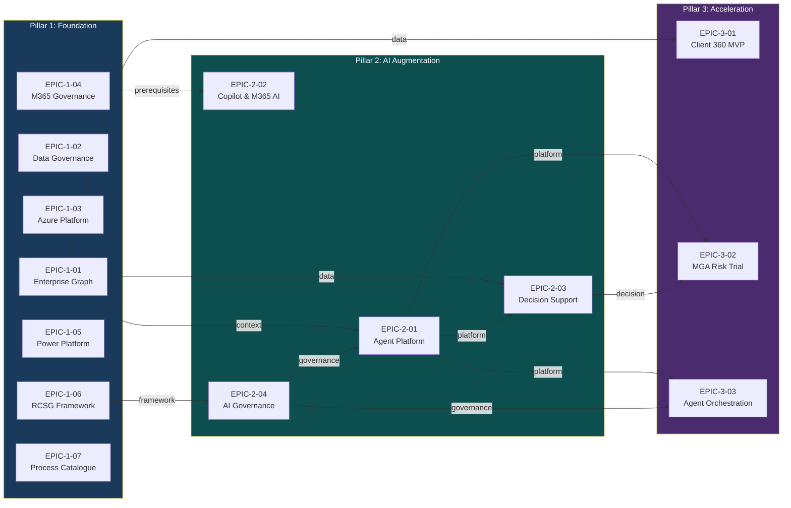
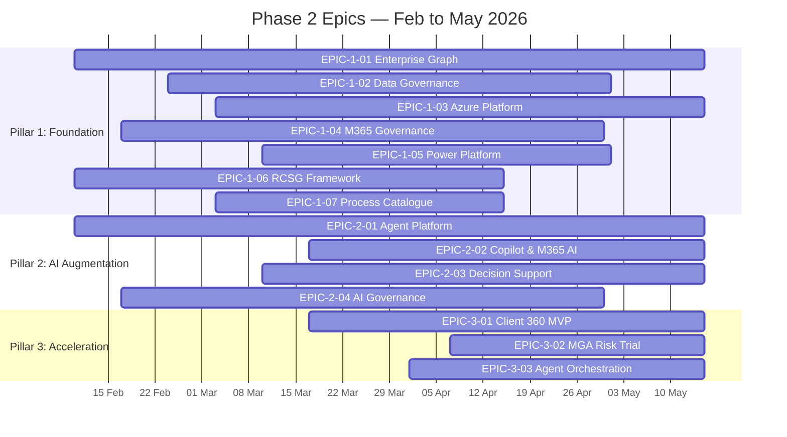
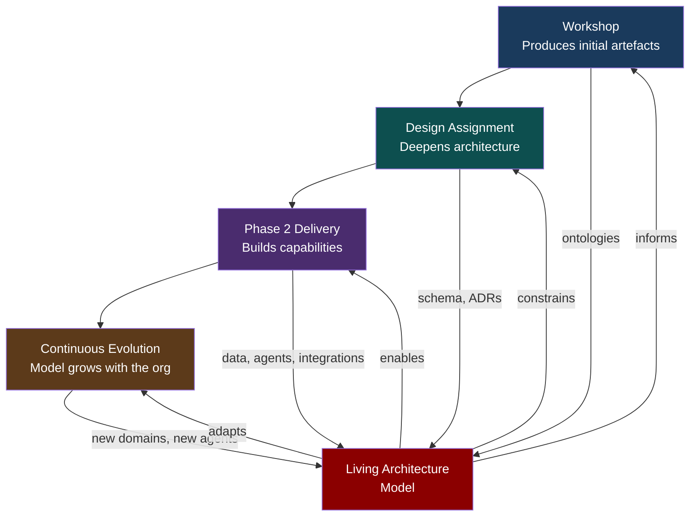

# EA Key Artefacts

## Enterprise Architecture Artefact Catalogue, PPM Epics, and Phase 2 Scope

| Property | Value |
|----------|-------|
| Document Title | EA Key Artefacts |
| Document Reference | EA-PPM-KA-2026-001 |
| Version | 1.0 |
| Date | 05 February 2026 |
| Status | Draft for Review |
| Classification | Internal — Commercial in Confidence |

---

## 1. EA Artefact Map

The architecture produces a defined set of artefacts across three tiers — strategic, architectural, and operational — each supported by interactive AI tooling and maintained as living models.



---

## 2. Key Artefacts Defined

### Tier 1: Strategic Artefacts

#### A1 — EA Vision & Roadmap

| Attribute | Detail |
|-----------|--------|
| **What** | The overarching architectural vision showing where we are, where we're going, and how we get there |
| **Format** | Markdown + Mermaid diagrams + Figma poster |
| **Source** | Workshop Session 1 (EA Model) + Session 3 (Vision) |
| **Maintained by** | EA Lead |
| **AI-supported** | Claude generates roadmap timeline from agreed milestones; regenerated when scope changes |
| **Living model** | VSOM ontology encodes vision → strategy → objectives → metrics as machine-readable JSON-LD |

#### A2 — BSC Strategy Map

| Attribute | Detail |
|-----------|--------|
| **What** | Cause-effect diagram showing how 16 BSC objectives cascade across Financial, Customer, Process, Learning & Growth perspectives |
| **Format** | Mermaid flowchart + Figma poster |
| **Source** | EA PPM Context Summary v3.1, refined in Workshop Session 1A |
| **Maintained by** | Programme Manager + EA Lead |
| **AI-supported** | Claude validates every initiative has BSC alignment; flags orphaned objectives |
| **Living model** | OKR ontology links objectives to key results; BSC metrics tracked via PMF ontology |

#### A3 — Capability Roadmap

| Attribute | Detail |
|-----------|--------|
| **What** | Time-phased roadmap showing capability build sequence across Phase 2 (4 months), Medium Term (12 months), Long Term (24 months) — mapped to the three pillars |
| **Format** | Mermaid Gantt + markdown table + Figma timeline |
| **Source** | Workshop Session 4 (Roadmap), refined during design assignment |
| **Maintained by** | EA Lead + Programme Manager |
| **AI-supported** | Claude generates Gantt from dependency model; identifies critical path and resource conflicts |
| **Living model** | PPM ontology encodes phase → workstream → epic → initiative with dependencies |

#### A4 — Three Pillars Progression

| Attribute | Detail |
|-----------|--------|
| **What** | Visual showing Foundation → Augmentation → Acceleration progression with capabilities mapped to each pillar |
| **Format** | Mermaid flowchart + Figma poster |
| **Source** | Workshop Session 3A |
| **Maintained by** | EA Lead |
| **AI-supported** | Claude maps every initiative to its pillar and validates dependencies (Pillar 2/3 items must have Pillar 1 prerequisites) |

---

### Tier 2: Architecture Artefacts

#### A5 — EA Architecture Design (Four Layers)

| Attribute | Detail |
|-----------|--------|
| **What** | The complete enterprise architecture across Business, Information, AI, and Technology capability layers — current state, target state, gap analysis for each |
| **Format** | Markdown document + Mermaid layer diagrams + ontology models |
| **Source** | Design assignment Week 2 (Design phase) |
| **Maintained by** | EA Lead |
| **AI-supported** | Claude generates layer diagrams from ontology models; produces gap analysis tables from current vs target state |
| **Living model** | Four architecture ontologies (Business, Information, AI, Technology) maintained in graph |

#### A6 — Enterprise Graph Specification

| Attribute | Detail |
|-----------|--------|
| **What** | Technical specification for the graph database: technology selection, schema design, data sources, integration patterns, ontology alignment |
| **Format** | Markdown document + Mermaid entity-relationship diagrams + ADR |
| **Source** | Workshop Session 1C (Graph intro) + design assignment Week 2 |
| **Maintained by** | EA Lead + SA |
| **AI-supported** | Claude generates schema from ontology definitions; validates referential integrity across data domains |
| **Living model** | Graph schema is the ontology — the specification and the model are the same artefact |

#### A7 — Agentic Layer Architecture

| Attribute | Detail |
|-----------|--------|
| **What** | The architecture for AI agents across the organisation — agent catalogue, orchestration model, governance framework, data access patterns, human-in-the-loop controls |
| **Format** | Markdown document + Mermaid diagrams + ADR |
| **Source** | Workshop Session 3C (AI Augmentation) + design assignment Week 2 |
| **Maintained by** | EA Lead + SA |
| **AI-supported** | Claude maintains agent registry; validates governance compliance for each agent; generates interaction diagrams |
| **Living model** | AI Capability Ontology defines agents, their capabilities, data access, and governance controls |

**See Section 3 for full Agentic Layer definition.**

#### A8 — Technology Stack ADRs

| Attribute | Detail |
|-----------|--------|
| **What** | Architecture Decision Records for 5 key technology choices: graph database, AI platform, integration architecture, data governance platform, compliance automation approach |
| **Format** | Markdown ADRs (standard format: Context, Decision, Consequences) |
| **Source** | Design assignment Week 2 |
| **Maintained by** | EA Lead + IT Lead (joint) |
| **AI-supported** | Claude generates options analysis for each ADR; compares Microsoft vs alternatives on merit |

---

### Tier 3: Programme Artefacts

#### A9 — Programme Design

| Attribute | Detail |
|-----------|--------|
| **What** | Structured programme with workstreams, dependencies, milestones, governance, and resource allocation |
| **Format** | Markdown document + Mermaid Gantt + dependency diagrams |
| **Source** | Design assignment Week 3 (Specify phase) |
| **Maintained by** | Programme Manager |
| **AI-supported** | Claude identifies cross-workstream dependencies; flags resource conflicts; generates milestone reports |
| **Living model** | PPM ontology encodes programme structure; initiatives tracked as GitHub issues |

#### A10 — PPM Epics & Initiatives

| Attribute | Detail |
|-----------|--------|
| **What** | The portfolio of initiatives structured as PPM epics, scoped for delivery, mapped to BSC objectives and capability layers |
| **Format** | Markdown tables + GitHub issues + Mermaid dependency diagrams |
| **Source** | Workshop Session 4B + design assignment Week 3 |
| **Maintained by** | Programme Manager + EA Lead |
| **AI-supported** | Claude generates epic definitions from initiative descriptions; links to BSC objectives; produces dependency graphs |
| **Living model** | Each epic is a GitHub issue with labels for pillar, layer, BSC objective, workstream, and phase |

**See Section 4 for full PPM Epics definition.**

#### A11 — Process Automation Assessment

| Attribute | Detail |
|-----------|--------|
| **What** | Catalogue of top 20 manual processes with automation feasibility, priority scoring, and target manual reduction path (60% → <=20%) |
| **Format** | Markdown tables + Mermaid process flow diagrams |
| **Source** | Workshop Session 2B + design assignment Week 1 (stakeholder interviews) |
| **Maintained by** | Business Leads + EA Lead |
| **AI-supported** | Claude generates current-state process flows from descriptions; models automation impact; tracks manual % reduction |

#### A12 — BSC Implementation Map

| Attribute | Detail |
|-----------|--------|
| **What** | Complete mapping of all 50+ initiatives to BSC objectives, capabilities, dependencies, delivery workstream, and target milestone |
| **Format** | Comprehensive markdown table + Mermaid traceability diagram |
| **Source** | Design assignment Week 3 |
| **Maintained by** | EA Lead + Programme Manager |
| **AI-supported** | Claude validates complete coverage (every initiative mapped, every BSC objective served); identifies gaps |

---

## 3. The Agentic Layer

### Architecture

The agentic layer is a distinct architectural component that spans the AI and Business capability layers. It defines how AI agents operate across the organisation — not as isolated chatbots, but as governed, data-connected, graph-aware participants in business processes.

```mermaid
graph TB
    subgraph ORCHESTRATION["Agent Orchestration Layer"]
        ROUTER["Intent Router<br/>Classifies request, selects agent"]
        CONTEXT["Context Manager<br/>Graph-powered context retrieval"]
        GOVERNOR["Governance Engine<br/>Policy enforcement, audit logging"]
    end

    subgraph AGENTS["Agent Catalogue"]
        EMMA["Emma<br/>Client Onboarding<br/>& Renewals"]
        MATT["Matt<br/>Commercial Lines<br/>& Placement"]
        SCITECH["Sci/Tech<br/>Technical Advisory<br/>& Risk Analysis"]
        COMP_AGT["Compliance Agent<br/>Regulatory Checks<br/>& RCSG Queries"]
        OPS_AGT["Operations Agent<br/>Process Automation<br/>& Workflow"]
        FUTURE["Future Agents<br/>Claims, MGA, Prospecting<br/>Advisory, Training..."]
    end

    subgraph DATA["Data & Knowledge Layer"]
        GRAPH["Enterprise Graph<br/>Client, Policy, Risk,<br/>Compliance, Process"]
        DOCS["Document Store<br/>Policies, Wordings,<br/>Regulatory Guidance"]
        M365_DATA["M365 Data<br/>Email, Teams, Calendar,<br/>SharePoint"]
        ACT_DATA["Acturis Data<br/>Client, Policy,<br/>Claims, Accounts"]
    end

    subgraph GOVERNANCE["AI Governance"]
        POLICY["AI Governance Policy<br/>UK AI Act, OWASP LLM Top 10"]
        HITL["Human-in-the-Loop<br/>Controls & Escalation"]
        AUDIT_LOG["Audit Trail<br/>Every agent action logged"]
        EXPLAIN["Explainability<br/>Decision rationale exposed"]
    end

    ROUTER --> EMMA
    ROUTER --> MATT
    ROUTER --> SCITECH
    ROUTER --> COMP_AGT
    ROUTER --> OPS_AGT
    ROUTER --> FUTURE

    CONTEXT --> GRAPH
    CONTEXT --> DOCS
    CONTEXT --> M365_DATA
    CONTEXT --> ACT_DATA

    EMMA --> CONTEXT
    MATT --> CONTEXT
    SCITECH --> CONTEXT
    COMP_AGT --> CONTEXT
    OPS_AGT --> CONTEXT

    GOVERNOR --> POLICY
    GOVERNOR --> HITL
    GOVERNOR --> AUDIT_LOG
    GOVERNOR --> EXPLAIN

    EMMA --> GOVERNOR
    MATT --> GOVERNOR
    SCITECH --> GOVERNOR
    COMP_AGT --> GOVERNOR
    OPS_AGT --> GOVERNOR

    style ORCHESTRATION fill:#1a3a5c,color:#fff
    style AGENTS fill:#0d4f4f,color:#fff
    style DATA fill:#5c3a1a,color:#fff
    style GOVERNANCE fill:#4a2c6e,color:#fff
```



### Agent Catalogue (Phase 2 + Roadmap)

| Agent | Domain | Phase 2 Status | Data Sources | Pillar | Key BSC |
|-------|--------|---------------|-------------|--------|---------|
| **Emma** | Client Onboarding & Renewals | Live, iterating | Acturis (client/policy), M365 (email), Graph (client context) | 2 | C1, C2, P1 |
| **Matt** | Commercial Lines & Placement | Live, iterating | Acturis (policy/market), Document store (wordings), Graph (product/market) | 2 | F1, P2, C4 |
| **Sci/Tech** | Technical Advisory & Risk | Live, iterating | Document store (technical guidance), Graph (risk/compliance), External data | 2 | C2, P4, L1 |
| **Compliance Agent** | Regulatory Checks & RCSG | Phase 2 scoping | RCSG ontology, ALZ/O365 audit data, Graph (compliance posture) | 2 → 3 | P3, F4 |
| **Operations Agent** | Process Automation & Workflow | Phase 2 scoping | Process catalogue, M365 (Teams/email), Graph (process/client) | 2 → 3 | P1, F2 |
| **Prospecting Agent** | Lead Gen & Introducer Network | Medium term | Graph (client connections, market data), External data sources | 3 | F1, P2, C4 |
| **Claims Agent** | Claims Processing & Analysis | Medium term | Acturis (claims), Document store, Graph (policy/risk) | 3 | P1, F2, C2 |
| **Advisory Agent** | Client Advisory & Recommendations | Long term | Full graph, all document stores, agent collaboration | 3 | C2, C4, L1 |

### Agentic Layer Principles

1. **Graph-powered context** — every agent retrieves context from the Enterprise Graph, not from isolated data sources. The graph provides the connected knowledge that makes agent responses accurate and contextual.
2. **Governance by design** — every agent action is logged, every decision is explainable, every escalation path is defined. AI governance is not optional — it's architectural.
3. **Human-in-the-loop by default** — agents augment, they do not replace. Critical decisions require human approval. The loop tightens over time as confidence grows, but the human always has override.
4. **Agent collaboration** — agents can hand off to each other through the orchestration layer. Emma hands a risk question to Sci/Tech. Matt hands a compliance check to the Compliance Agent. The orchestration layer manages the conversation.
5. **Progressive autonomy** — Phase 2 agents operate with close human oversight. Medium-term agents handle routine tasks end-to-end. Long-term agents collaborate autonomously on complex advisory workflows — but always within governance rails.

### Agentic Layer in the EA Model

The agentic layer sits across the AI and Business capability layers:

```text
┌──────────────────────────────────────────────────────────────────┐
│                     BUSINESS CAPABILITIES                        │
│  ┌─────────────────────────────────────────────────────────┐     │
│  │              AGENTIC LAYER (business-facing)             │     │
│  │  Emma │ Matt │ Sci/Tech │ Compliance │ Operations │ ... │     │
│  └─────────────────────────────────────────────────────────┘     │
├──────────────────────────────────────────────────────────────────┤
│                    INFORMATION CAPABILITIES                      │
│  Enterprise Graph │ Data Governance │ Document Store │ Acturis   │
├──────────────────────────────────────────────────────────────────┤
│                       AI CAPABILITIES                            │
│  ┌─────────────────────────────────────────────────────────┐     │
│  │              AGENTIC LAYER (technical)                   │     │
│  │  Orchestration │ Context Mgr │ Governance │ LLM Services│     │
│  └─────────────────────────────────────────────────────────┘     │
│  Azure OpenAI │ Copilot Studio │ Claude │ Model Governance       │
├──────────────────────────────────────────────────────────────────┤
│                    TECHNOLOGY CAPABILITIES                        │
│  Azure │ Entra ID │ API Management │ Event Grid │ Key Vault      │
└──────────────────────────────────────────────────────────────────┘
```

---

## 4. PPM Epics: Phase 2 Scope (Feb-May 2026)

### Epic Structure

Each epic follows a consistent structure mapped to the EA framework:

```text
EPIC-{PILLAR}-{SEQ}
├── Pillar:        1 (Foundation) | 2 (Augmentation) | 3 (Acceleration)
├── Layer:         Business | Information | AI | Technology
├── BSC Objectives: F1, C2, P3, L2, etc.
├── Workstream:    WS-A through WS-F
├── Dependencies:  [list of prerequisite epics]
├── Initiatives:   [child initiative IDs]
├── Phase 2 Scope: What's delivered by May 2026
└── Success Metric: Measurable outcome
```

### Pillar 1 Epics — Foundational Infrastructure

#### EPIC-1-01: Enterprise Graph Foundation

| Attribute | Detail |
|-----------|--------|
| **Pillar** | 1 — Foundational Infrastructure |
| **Layer** | Information |
| **BSC** | L2 (Data Foundation), L3 (AI Platform) |
| **Workstream** | WS-A: Data Foundation |
| **Dependencies** | None (foundational) |
| **Phase 2 Scope** | Graph technology ADR, schema design for compliance + identity + risk domains, initial data load from ALZ/O365 audit outputs and Entra ID |
| **Success Metric** | Graph database deployed, schema validated against >=2 data sources, queryable via API |
| **Initiatives** | Graph DB technology selection, schema design, compliance data load, identity data load, API layer, Acturis API scoping |

#### EPIC-1-02: Data Governance Platform

| Attribute | Detail |
|-----------|--------|
| **Pillar** | 1 — Foundational Infrastructure |
| **Layer** | Information |
| **BSC** | L2 (Data Foundation), P3 (Compliance) |
| **Workstream** | WS-A: Data Foundation |
| **Dependencies** | None |
| **Phase 2 Scope** | Microsoft Purview deployment, initial data classification for M365 and Azure, data quality baseline for graph data |
| **Success Metric** | Purview deployed and scanning >=1 data source, classification policy applied |
| **Initiatives** | Purview deployment, data classification policy, quality baseline, sensitive data inventory |

#### EPIC-1-03: Azure Platform Governance

| Attribute | Detail |
|-----------|--------|
| **Pillar** | 1 — Foundational Infrastructure |
| **Layer** | Technology |
| **BSC** | P3 (Compliance), L2 (Data Foundation) |
| **Workstream** | WS-E: Platform & Security |
| **Dependencies** | Azure production access (constraint) |
| **Phase 2 Scope** | ALZ Audit v2 execution (live tenant), MCSB compliance gap quantification, remediation plan for critical findings |
| **Success Metric** | Live audit complete, MCSB compliance score established, critical gaps have remediation timeline |
| **Initiatives** | ALZ v2 execution, MCSB gap analysis, remediation prioritisation, policy export/assessment |

#### EPIC-1-04: M365 Governance Hardening

| Attribute | Detail |
|-----------|--------|
| **Pillar** | 1 — Foundational Infrastructure |
| **Layer** | Technology |
| **BSC** | P3 (Compliance), L2 (Data Foundation) |
| **Workstream** | WS-E: Platform & Security |
| **Dependencies** | O365 audit completion |
| **Phase 2 Scope** | Identity governance hardening, Entra ID posture improvement, conditional access policy review, Copilot readiness assessment |
| **Success Metric** | Identity governance gaps addressed, conditional access hardened, Copilot prerequisites met |
| **Initiatives** | Entra ID hardening, conditional access, DLP policy, Copilot readiness, Teams governance |

#### EPIC-1-05: Power Platform Governance

| Attribute | Detail |
|-----------|--------|
| **Pillar** | 1 — Foundational Infrastructure |
| **Layer** | Technology |
| **BSC** | P3 (Compliance), L3 (AI Platform) |
| **Workstream** | WS-E: Platform & Security |
| **Dependencies** | PP audit completion |
| **Phase 2 Scope** | DLP policy audit, connector governance, Dataverse readiness assessment, environment strategy |
| **Success Metric** | DLP policies reviewed and applied, ungoverned connectors identified, Dataverse assessment complete |
| **Initiatives** | DLP audit, connector governance, Dataverse assessment, environment strategy, maker governance |

#### EPIC-1-06: RCSG Governance Framework

| Attribute | Detail |
|-----------|--------|
| **Pillar** | 1 — Foundational Infrastructure |
| **Layer** | Business + Technology (cross-cutting) |
| **BSC** | P3 (Compliance), F4 (Cost-to-Serve) |
| **Workstream** | WS-D: Operations & Compliance |
| **Dependencies** | None |
| **Phase 2 Scope** | Machine-readable risk register MVP (graph-connected), compliance obligation inventory, compliance cross-mapping automation (MCSB ↔ NIST ↔ ISO 27001 ↔ FCA) |
| **Success Metric** | Risk register operational with >=10 risks scored, compliance cross-mapping automated for >=2 framework pairs |
| **Initiatives** | Risk register MVP, compliance inventory, cross-mapping automation, RCSG governance working group, RCSG ontology v2 |

#### EPIC-1-07: Process Catalogue

| Attribute | Detail |
|-----------|--------|
| **Pillar** | 1 — Foundational Infrastructure |
| **Layer** | Business |
| **BSC** | P1 (Automation), F2 (Operating Margin), F4 (Cost-to-Serve) |
| **Workstream** | WS-D: Operations & Compliance |
| **Dependencies** | Business lead availability |
| **Phase 2 Scope** | Catalogue top 20 manual processes, score automation feasibility, identify top 5 automation candidates, baseline manual % |
| **Success Metric** | 20 processes catalogued, 5 automation candidates prioritised, baseline manual % established |
| **Initiatives** | Process catalogue workshop, manual process inventory, automation scoring, baseline measurement |

---

### Pillar 2 Epics — AI Augmentation

#### EPIC-2-01: Virtual Agent Platform

| Attribute | Detail |
|-----------|--------|
| **Pillar** | 2 — AI Augmentation |
| **Layer** | AI + Business |
| **BSC** | C2 (Experience), L1 (AI Workforce), P1 (Automation) |
| **Workstream** | WS-B: AI Platform |
| **Dependencies** | EPIC-1-01 (Graph for agent context), EPIC-2-04 (AI governance) |
| **Phase 2 Scope** | 3 agents (Emma, Matt, Sci/Tech) deployed and iterating, agent orchestration layer design, graph-connected context retrieval |
| **Success Metric** | 3 agents live with measurable usage, orchestration design documented, context retrieval from >=1 graph domain |
| **Initiatives** | Emma v2 (graph-connected), Matt v2 (graph-connected), Sci/Tech v2, orchestration layer design, agent monitoring |

#### EPIC-2-02: Copilot & M365 AI

| Attribute | Detail |
|-----------|--------|
| **Pillar** | 2 — AI Augmentation |
| **Layer** | AI + Business |
| **BSC** | L1 (AI Workforce), C2 (Experience) |
| **Workstream** | WS-B: AI Platform + WS-F: Enablement |
| **Dependencies** | EPIC-1-04 (M365 governance — Copilot prerequisites) |
| **Phase 2 Scope** | Copilot adoption plan, licensing assessment, initial rollout to power users, training programme design |
| **Success Metric** | Copilot plan approved, >=10 power users active, training programme designed |
| **Initiatives** | Copilot licensing, pilot deployment, power user selection, training programme, adoption measurement |

#### EPIC-2-03: Decision Support & Automation

| Attribute | Detail |
|-----------|--------|
| **Pillar** | 2 — AI Augmentation |
| **Layer** | AI + Business |
| **BSC** | P4 (Decision Quality), P1 (Automation), F1 (Revenue) |
| **Workstream** | WS-C: Client & Sales |
| **Dependencies** | EPIC-1-01 (Graph for data context), EPIC-2-01 (agent platform) |
| **Phase 2 Scope** | Decision support prototype for policy comparison, renewals automation, Next Best Action model, prospecting suite (introducers, mass, leads) |
| **Success Metric** | Policy comparison prototype functional, renewals workflow automated, prospecting suite live |
| **Initiatives** | Policy comparison prototype, renewals automation, Next Best Action, introducer prospecting, mass prospecting, lead management |

#### EPIC-2-04: AI Governance

| Attribute | Detail |
|-----------|--------|
| **Pillar** | 2 — AI Augmentation |
| **Layer** | AI (cross-cutting) |
| **BSC** | P3 (Compliance), L1 (AI Workforce) |
| **Workstream** | WS-B: AI Platform + WS-D: Operations & Compliance |
| **Dependencies** | EPIC-1-06 (RCSG governance framework) |
| **Phase 2 Scope** | AI governance policy aligned to UK AI Act and OWASP LLM Top 10, risk assessment for deployed agents, human-in-the-loop controls, audit logging |
| **Success Metric** | AI governance policy published, all 3 deployed agents assessed, audit logging operational |
| **Initiatives** | AI governance policy, agent risk assessment, OWASP LLM assessment, HITL control design, audit log implementation |

---

### Pillar 3 Epics — Acceleration Foundations (Phase 2 Seeding)

#### EPIC-3-01: Client 360 MVP

| Attribute | Detail |
|-----------|--------|
| **Pillar** | 3 — Acceleration (Phase 2 seeding) |
| **Layer** | Business + Information |
| **BSC** | C1 (Retention), C4 (Proactive Insight), F1 (Revenue) |
| **Workstream** | WS-C: Client & Sales |
| **Dependencies** | EPIC-1-01 (Graph), Acturis API access (constraint) |
| **Phase 2 Scope** | Client 360 MVP dependent on Acturis extraction — if API available: connected client view; if not: mock data prototype + Acturis engagement |
| **Success Metric** | Client 360 prototype functional with >=1 real or mock data source |
| **Initiatives** | Acturis API engagement, client data extraction, Client 360 UI, graph client domain, mock data fallback |

#### EPIC-3-02: MGA Risk Analysis Trial

| Attribute | Detail |
|-----------|--------|
| **Pillar** | 3 — Acceleration (Phase 2 seeding) |
| **Layer** | Business + AI |
| **BSC** | C4 (Proactive Insight), P4 (Decision Quality) |
| **Workstream** | WS-C: Client & Sales |
| **Dependencies** | EPIC-2-01 (agent platform), EPIC-2-03 (decision support) |
| **Phase 2 Scope** | Trial MGA risk analysis capability using Sci/Tech agent with graph-connected risk data |
| **Success Metric** | Trial completed with measurable risk analysis output |
| **Initiatives** | Risk data modelling, Sci/Tech agent MGA extension, trial execution, outcome assessment |

#### EPIC-3-03: Agentic Orchestration Design

| Attribute | Detail |
|-----------|--------|
| **Pillar** | 3 — Acceleration (Phase 2 seeding) |
| **Layer** | AI |
| **BSC** | L1 (AI Workforce), L3 (AI Platform), P1 (Automation) |
| **Workstream** | WS-B: AI Platform |
| **Dependencies** | EPIC-2-01 (agent platform), EPIC-2-04 (AI governance) |
| **Phase 2 Scope** | Design the orchestration layer for agent collaboration, handoff protocols, context sharing, and progressive autonomy roadmap |
| **Success Metric** | Orchestration architecture documented (ADR), handoff protocol defined for >=1 agent pair |
| **Initiatives** | Orchestration architecture ADR, agent handoff protocol, context sharing design, autonomy progression model |

---

## 5. Epic Dependency Map



---

## 6. Phase 2 Timeline (Feb-May 2026)



---

## 7. Interactive AI-Supported Model and Tools

### The Living Architecture

The artefacts defined above are not static documents — they form an interactive, AI-supported model that the team builds on continuously:

| Component | What It Does | How It's Interactive |
|-----------|-------------|---------------------|
| **Ontology Visualiser** | Renders architecture as navigable graphs with 3-tier drill-through | Click through Series → Ontology → Entity; explore cross-domain connections; live during workshops |
| **Enterprise Graph** | Stores all architecture domains as connected knowledge | Queryable via API; agents retrieve context from graph; data updates flow automatically |
| **Mermaid Diagrams** | Architecture views generated from models | Edit markdown source → diagram regenerates; version-controlled; AI generates drafts |
| **GitHub Issues** | Epics and initiatives tracked as issues with labels | Filter by pillar, layer, BSC objective, workstream; dependency linking; progress tracking |
| **Claude (AI Assistant)** | Augments every stage of architecture work | Generates ontologies, diagrams, documents, cross-references; validates consistency; answers architecture queries |
| **OAA Compliance Engine** | Validates ontology quality against 6 gates | Run against any ontology; produces compliance badge; ensures quality standard |

### Building On: How the Model Grows



The model is never "finished" — it grows with the organisation. Each workshop, each delivery phase, each new data source adds to the graph, refines the ontologies, and expands the agent capabilities. The tools are designed to support this continuous evolution, not to produce a one-time architecture document.

---

## 8. Artefact Summary Table

| # | Artefact | Tier | Format | Produced By | Pillar | AI-Supported |
|---|----------|------|--------|-------------|--------|-------------|
| A1 | EA Vision & Roadmap | Strategic | MD + Mermaid + Figma | Workshop | All | Roadmap generation |
| A2 | BSC Strategy Map | Strategic | Mermaid + Figma | Workshop | All | Coverage validation |
| A3 | Capability Roadmap | Strategic | Gantt + MD + Figma | Assignment | All | Dependency analysis |
| A4 | Three Pillars Progression | Strategic | Mermaid + Figma | Workshop | All | Initiative mapping |
| A5 | EA Architecture Design | Architecture | MD + Mermaid + Ontology | Assignment | All | Layer diagram generation |
| A6 | Enterprise Graph Spec | Architecture | MD + Mermaid + ADR | Assignment | 1 | Schema generation |
| A7 | Agentic Layer Architecture | Architecture | MD + Mermaid + ADR | Workshop + Assignment | 2, 3 | Agent registry, governance |
| A8 | Technology Stack ADRs (×5) | Architecture | MD (ADR format) | Assignment | 1 | Options analysis |
| A9 | Programme Design | Programme | MD + Mermaid Gantt | Assignment | All | Dependency detection |
| A10 | PPM Epics & Initiatives | Programme | MD + GitHub Issues | Workshop + Assignment | All | Epic generation |
| A11 | Process Automation Assessment | Programme | MD + Mermaid flows | Assignment | 1, 3 | Process flow generation |
| A12 | BSC Implementation Map | Programme | MD table + Mermaid | Assignment | All | Gap detection |

---

*EA-PPM-KA-2026-001 — EA Key Artefacts v1.0*
*Classification: Internal — Commercial in Confidence*
