# EA Programme — Executive Summary

## Enterprise Architecture & AI Strategy Engagement

| Property | Value |
|----------|-------|
| Document Title | EA Programme — Executive Summary |
| Document Reference | EA-PPM-PT-2026-001-ES |
| Version | 1.0 |
| Date | 05 February 2026 |
| Status | Draft for Approval |
| Classification | Internal — Commercial in Confidence |
| Full Proposal | EA-PPM-PT-2026-001 |

---

## The Opportunity

INS operates as a mid-market insurance broker (~£100M turnover, ~800 people) with significant ambition to transform into an AI-augmented professional services firm. The strategy is defined — 5 strategic pillars, 16 BSC objectives, 50+ initiatives — but the enabling architecture that connects strategy to execution does not yet exist.

Today: no Enterprise Architecture, no unified data model, no AI governance, ~60% manual processes, technology decisions made ad hoc.

This engagement produces the architectural and programme foundation to change that.

---

## What We Do

A **15-day fixed-price engagement** delivering three phases:

```mermaid
graph LR
    subgraph A["Phase A: Prepare"]
        A1["Synthesise 5 audit<br/>workstreams (33 artefacts)"]
        A2["Prepare workshop<br/>materials & visuals"]
        A3["Stage ontology<br/>visualiser demo"]
    end

    subgraph B["Phase B: Workshop"]
        B1["1-Day EA Vision &<br/>Roadmap Workshop"]
        B2["Agree vision, pillars,<br/>Phase 2 scope"]
        B3["Commission the<br/>design assignment"]
    end

    subgraph C["Phase C: Design Assignment"]
        C1["Discover<br/>Interviews, process<br/>catalogue, gap analysis"]
        C2["Design<br/>EA architecture,<br/>graph spec, ADRs"]
        C3["Specify<br/>Programme, roadmap,<br/>BSC implementation map"]
    end

    A --> B --> C

    style A fill:#1a3a5c,color:#fff
    style B fill:#0d4f4f,color:#fff
    style C fill:#4a2c6e,color:#fff
```

**Prepare** → synthesise 33 audit artefacts, stage workshop materials and live demo. **Workshop** → 1-day facilitated session: agree vision, three pillars (Foundation → Augmentation → Acceleration), Phase 2 scope, and commission the design assignment. **Design Assignment** → produce the complete EA: four capability layers, Enterprise Graph spec, 5 ADRs, agentic layer, AI governance, programme design (14 epics), and BSC implementation map.

---

## The Team

| Role | Focus |
|------|-------|
| **Enterprise & Azure Architect** | EA design, TOGAF facilitation, Azure/M365 architecture, platform governance, technology decisions, compliance-by-design |
| **AI Engineer / Consultant** | AI strategy, agentic layer, ontology modelling, graph schema, AI governance, virtual agent architecture, AI-assisted artefact production |

Both roles work across all phases. The team operates directly with the steering committee and business/IT stakeholders.

---

## Key Deliverables

| # | Deliverable | What It Enables |
|---|-------------|----------------|
| D1 | EA Architecture Design (4 layers) | Structured capability build across Business, Information, AI, Technology |
| D2 | Enterprise Graph Specification | Foundational information architecture connecting all data sources |
| D3 | Capability Roadmap (4/12/24 months) | Phased delivery plan mapped to three pillars and BSC objectives |
| D4 | Programme Design (14 epics, 6 workstreams) | Sequenced, dependency-mapped programme ready for execution |
| D5 | Process Automation Assessment (top 20) | Quantified path from 60% → <=20% manual processes |
| D6 | Technology Stack ADRs (x5) | Confident, documented technology selection |
| D7 | BSC Implementation Map (50+ initiatives) | Every initiative traced to strategic value |
| D8 | Agentic Layer Architecture | Safe, governed AI agent scale-out (8-agent catalogue) |
| D9 | AI Governance Policy | Regulatory compliance from day one (UK AI Act, OWASP, FCA) |

Plus 6 pre-workshop artefacts and 6 workshop deliverables (decision record, scope confirmation, actions register).

---

## The Approach: TOGAF Fast-Tracked

We follow TOGAF — the world's most widely adopted EA framework — but right-sized for INS. Every ADM phase (Preliminary through Phase H) is covered. Nothing is skipped. But the method is compressed, AI-augmented, and governed by a lean steering committee rather than formal review boards.

The architecture is **ontology-driven** (machine-readable models, not static documents), **AI-augmented** (artefacts generated and validated with AI tooling), and **platform-agnostic** (leveraging Microsoft stack benefits without vendor lock-in).

**Maturity trajectory:** Level 1 (today) → Level 2 (May 2026) → Level 3 (Feb 2027) → Level 4 (Feb 2028)

---

## Commercial

| | |
|---|---|
| **Duration** | 15 Days |
| **Price** | **£15,000 — Fixed Price, All-In** |
| **Includes** | All professional fees, preparation, workshop facilitation, design work, artefact production, tooling, and repository commits |
| **Scope** | As defined in EA-PPM-PT-2026-001 — changes managed via steering committee |

---

## Terms and Conditions

**Scope.** This engagement covers pre-workshop preparation, 1-day facilitated workshop, and design assignment delivering 21 named artefacts as defined in EA-PPM-PT-2026-001. Programme execution (Phase 2 delivery) is a separate engagement.

**Fixed Price.** £15,000 (fifteen thousand pounds) all-in. No additional charges without prior written agreement.

**Payment Terms.**

| Milestone | Amount | Trigger |
|-----------|--------|---------|
| On commissioning | £4,500 (30%) | Signed acceptance of this proposal |
| Workshop complete | £4,500 (30%) | Delivery of workshop and decision record |
| Final delivery | £6,000 (40%) | Acceptance of all design assignment deliverables |

Payment is due within 14 days of invoice date.

**Client Obligations.** Stakeholder access for interviews; access to existing audit artefacts, strategy documents, and tenant environments; workshop venue and logistics; timely review of deliverables (within 5 working days).

**Deliverable Acceptance.** Deliverables are submitted via pull request to the INS-PPL-AZL GitHub repository. Each deliverable is accepted 5 working days after submission unless written feedback is provided. Reasonable changes within scope are included.

**Intellectual Property.** All deliverables become client property upon payment. The engagement team retains the right to use general methodologies and non-client-specific techniques.

**Confidentiality.** All engagement information is treated as confidential and classified "Internal — Commercial in Confidence."

**Scope Changes.** Material changes documented and agreed in writing via steering committee. Minor clarifications within scope are included.

**Cancellation.** 5 working days' written notice. Payment due for work completed and milestone payments triggered.

**Liability.** Limited to the engagement fee of £15,000. Neither party liable for indirect or consequential damages.

---

## Acceptance

| Role | Name | Signature | Date |
|------|------|-----------|------|
| Steering Committee Chair | | | |
| EA Lead | | | |

---

*EA-PPM-PT-2026-001-ES — EA Programme Executive Summary v1.0*
*Classification: Internal — Commercial in Confidence*
