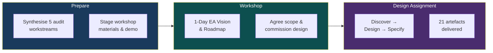
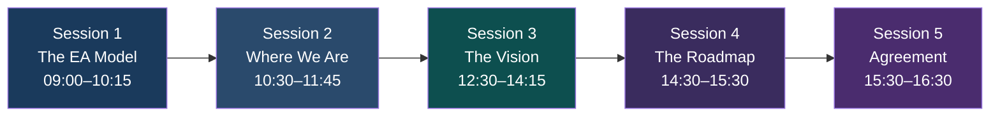
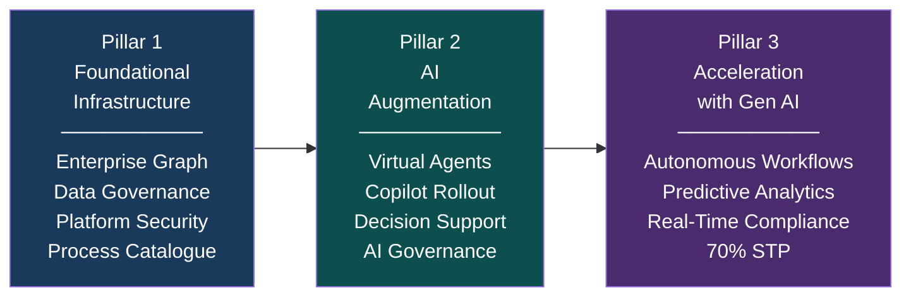

# EA Programme — Executive Proposal

## Enterprise Architecture & AI Strategy

| | |
|---|---|
| **Reference** | EA-PPM-PT-2026-001-EP |
| **Date** | 05 February 2026 |
| **Classification** | Internal — Commercial in Confidence |
| **Engagement** | 15 Days — Fixed Price — £15,000 All-In |

---

## Direction

**Vision:** AI-Augmented Professional Services Excellence — transforming a mid-market insurance broker from manual, siloed operations into a data-driven, AI-augmented, compliance-assured organisation.

**Strategy:** Deliver the Enterprise Architecture that bridges strategy to execution across three progressive pillars — Foundational Infrastructure, AI Augmentation, and Acceleration with Gen AI — using TOGAF ADM (fast-tracked), ontology-driven modelling, and AI-assisted tooling.

**Objectives:**

| Objective | BSC |
|-----------|-----|
| Shared architectural vision and model across all stakeholders | Phase A |
| EA design across four capability layers (Business, Information, AI, Technology) | L2, L3 |
| Enterprise Graph specified as foundational information architecture | L2, L3, C1 |
| 50+ initiatives translated into a structured, sequenced programme | P1, F2, F4 |
| AI governance and agentic layer architecture established | P3, L1 |
| Manual process reduction path quantified (60% → <=20%) | F4, P1 |

---

## The Opportunity

INS (~£100M turnover, ~800 people) has a defined strategy — 5 strategic pillars, 16 BSC objectives, 50+ initiatives — but no enabling architecture connecting strategy to execution. Today: no Enterprise Architecture, no unified data model, no AI governance, ~60% manual processes. This engagement produces the architectural and programme foundation to change that.

---

## What We Deliver

A **15-day fixed-price engagement** across three phases:

**The Team:**

| Role | Focus |
|------|-------|
| **Enterprise & Azure Architect** | EA design, TOGAF facilitation, Azure/M365 architecture, platform governance, technology decisions, compliance-by-design |
| **AI Engineer / Consultant** | AI strategy, agentic layer, ontology modelling, graph schema, AI governance, virtual agent architecture, AI-assisted artefact production |

---

## Workshop Outline — 1-Day EA Vision & Roadmap

**Session 1 — The EA Model (75 mins):** Present the Enterprise Architecture as four capability layers (Business, Information, AI, Technology), introduce the Enterprise Graph as the connective tissue, map to TOGAF ADM phases, and demonstrate the ontology visualiser with 23 live ontologies.

**Session 2 — Where We Are (75 mins):** Map current state against the EA model using 5 snapshot audits (ALZ ~80%, O365 ~50%, PP ~25%, TP ~25%, RCSG ~15%). Quantify the manual process problem (~60% manual). Present the gap summary: where we are vs where we need to be.

**Session 3 — The Vision (105 mins):** Present the target state through three progressive pillars:

**Session 4 — The Roadmap (60 mins):** Agree Phase 2 commitments (Feb–May 2026) across all three pillars. Identify constraints: Acturis API access, Azure production access, resource contention, regulatory clarity.

**Session 5 — Agreement (60 mins):** Confirm the EA model, three pillars, Phase 2 scope, and governance. Commission the 2–3 week design assignment.

**Workshop outputs:** Decision Record, Phase 2 Scope Confirmation, Design Assignment Commission, Priority Process Catalogue, Parking Lot & Actions Register — all committed to the repository on the day.

---

## Design Assignment Deliverables

| # | Deliverable | What It Enables |
|---|-------------|----------------|
| D1 | EA Architecture Design (4 layers) | Structured capability build across Business, Information, AI, Technology |
| D2 | Enterprise Graph Specification | Foundational information architecture connecting all data sources |
| D3 | Capability Roadmap (4/12/24 months) | Phased delivery mapped to three pillars and BSC objectives |
| D4 | Programme Design (14 epics, 6 workstreams) | Sequenced, dependency-mapped programme ready for execution |
| D5 | Process Automation Assessment (top 20) | Quantified path from 60% → <=20% manual processes |
| D6 | Technology Stack ADRs (x5) | Documented technology selection: Graph DB, AI Platform, Integration, Data Governance, Compliance |
| D7 | BSC Implementation Map (50+ initiatives) | Every initiative traced to strategic value |
| D8 | Agentic Layer Architecture (8 agents) | Safe, governed AI agent scale-out with orchestration and progressive autonomy |
| D9 | AI Governance Policy | Regulatory compliance from day one (UK AI Act, OWASP LLM Top 10, FCA) |

---

## TOGAF — Fast-Tracked for INS

We follow TOGAF — the world's most widely adopted EA framework — but right-sized for a mid-market firm. Every ADM phase (Preliminary through Phase H) is covered. Nothing is skipped. The method is compressed, AI-augmented, and governed by a lean steering committee.

The architecture is **ontology-driven** (machine-readable models in a graph, not static documents), **AI-augmented** (artefacts generated and validated with AI tooling), and **platform-agnostic** (leveraging Microsoft stack benefits without vendor lock-in).

**Maturity trajectory:** Level 1 (today) → Level 2 (May 2026) → Level 3 (Feb 2027) → Level 4 (Feb 2028)

---

## Commercial

| | |
|---|---|
| **Duration** | 15 Days |
| **Price** | **£15,000 — Fixed Price, All-In** |
| **Includes** | All professional fees, preparation, workshop facilitation, design work, artefact production, tooling |

---

## Terms and Conditions

**Scope.** Pre-workshop preparation, 1-day facilitated workshop, and design assignment delivering 21 named artefacts. Programme execution (Phase 2) is a separate engagement.

**Fixed Price.** £15,000 all-in. No additional charges without prior written agreement.

**Payment Terms.**

| Milestone | Amount | Trigger |
|-----------|--------|---------|
| On commissioning | £4,500 (30%) | Signed acceptance of this proposal |
| Workshop complete | £4,500 (30%) | Delivery of workshop and decision record |
| Final delivery | £6,000 (40%) | Acceptance of all design assignment deliverables |

Payment due within 14 days of invoice date.

**Client Obligations.** Stakeholder access for interviews; access to audit artefacts, strategy documents, and tenant environments; workshop venue and logistics; timely review of deliverables (within 5 working days).

**Deliverable Acceptance.** Submitted via pull request. Accepted 5 working days after submission unless written feedback is provided. Reasonable changes within scope included.

**IP.** All deliverables become client property upon payment. Engagement team retains general methodologies and non-client-specific techniques.

**Confidentiality.** All engagement information classified "Internal — Commercial in Confidence."

**Scope Changes.** Material changes agreed in writing via steering committee. Minor clarifications within scope included.

**Cancellation.** 5 working days' written notice. Payment due for work completed and milestone payments triggered.

**Liability.** Limited to £15,000. Neither party liable for indirect or consequential damages.

---

## Acceptance

| Role | Name | Signature | Date |
|------|------|-----------|------|
| Steering Committee Chair | | | |
| EA Lead | | | |

---

*EA-PPM-PT-2026-001-EP — EA Programme Executive Proposal v1.0*
*Classification: Internal — Commercial in Confidence*
