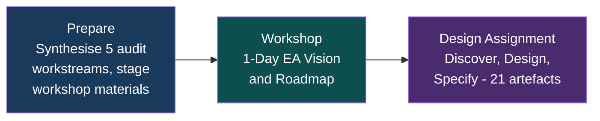
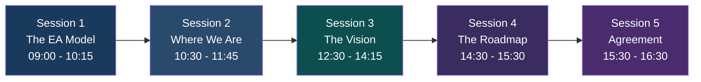
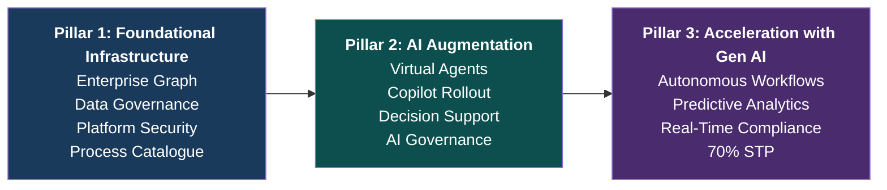

# EA Programme — Executive Proposal

## Enterprise Architecture & AI Strategy

|  |  |
| :---- | :---- |
| **Reference** | EA-PPM-PT-2026-001-EP |
| **Date** | 05 February 2026 |
| **Classification** | Internal — Commercial in Confidence |
| **Engagement** | In 15 Elapsed Days at Fixed Price of £14,500 All-In. |

## Scope

1. Vision Strategy Objectives and Metrics set by the business,   
2. Snapshot audits of where the Information Systems IT, and AI stack currently sits (Azure, Power Platform& Data, O365, 3rd Party Applications including Acturis and RCSG review of Risk, Compliance, Security and Lean Governance.  
3. The Proposed Programme of Prioritised Business Initiatives aligned with strategy and vision, mapped to BSC-OKR framework, pillars and themes to maximise and leverage the strategic infrastructure to enable and accelerate time to value.  
4. The Enterprise Architecture and infrastructure needed to deliver and realise the value of the planned programme.  
5. The impact components and relationship and dependencies and costs to deliver the EA and programme over time.  
6. The Architectural Design and Iterative Decision Making needed to optimise the potential solutions for the client  
7. Consideration of how an Enterprise Graph and Ontology can provide agile foundations for adoption of the best of stochastic and deterministic information system leveraging Gen AI and providing means by which to integrate and maximise the Information systems in line with the initiatives, priorities and budgets set by the business.

## Vision and Strategy

**Vision:** Client transformation to deliver and create value for Customers and P& as a leading AI-Augmented Insurance Advisory Professional Services business building on mid-market , acquisitive success as insurance broker from 60% manual, siloed operations into a data-driven, AI-augmented, compliance-assured organisation.

**Strategy:** Deliver the Enterprise Architecture that bridges strategy, specification and budgeted programme to implement execution across three progressive pillars:

1. Foundational Infrastructure, with integrated GenAI, Enterprise Graph and enabling technology.  
2. Portfolio of Prioritised Applications and Initiatives implemented over  phased plan and priorities, design to maximise value and benefits to the business enabling ad   
3. AI Augmentation, and Acceleration with Gen AI using TOGAF ADM (fast-trackedaccelerator, ontology-driven modelling, and AI-assisted tooling.

**Objectives:**

| Objective and Delivery | BSC Alignments, see appendices |
| :---- | :---- |
| Shared architectural vision and model across all stakeholders | Phase A |
| EA design across four capability layers (Business, Information, AI, Technology) | L2, L3 |
| Enterprise Graph specified as foundational information architecture | L2, L3, C1 |
| 50+ initiatives translated into a structured, sequenced programme | P1, F2, F4 |
| AI governance and agentic layer architecture established | P3, L1 |
| Manual process reduction path quantified (60% → <=20%) | F4, P1 |
| Budgeted Programme and Component Specification, including proposed Infrastructure Projects. |  |

## The Process

1. The Snapshot Audits: prerequisites to minimise time and effort to agree current state baseline  
2. Analysis, Outline Design and Optioneering Workshop determining the architecture and infrastructure needed to realise value and optimise performance of the business in line with the draft programme of initiatives under consideration  
3. Workshop Key Stakeholders - working though and discussing in structured sessions the options and potential EA to maximise value and ROI in line with business strategy  
4. Review and Initial Summary and Updates as 2nd pass and sub-selection of Options and Iterations based on discussions and decisions arising from the Workshop.  
5. Programme with Impact and action plan of EA Updated and Budgeted for Preliminary Review with particular reference to Wave 1 and at least in summary for projected subsequent phases.

## The Opportunity

INS (~£100M turnover, ~800 people) has a defined strategy ,5 strategic pillars, 16 Potential BSC (Balanced Scorecard) objectives, 50+ initiatives , but needing enabling architecture connecting strategy to execution. Today: Build on foundations and delivery Enterprise Architecture, currently no unified data model, new AI potential, opportunity to smash ~60% manual processes down to 20% or less. 

This project, workshop design, and costed programme will accelerate the ability to deliver on the key pillars and themes of the strategy that the portfolio of initiatives underpins.

## What We Deliver

A **15-day fixed-price engagement** across three phases:

**The Team:**

| Role | Focus |
| :---- | :---- |
| **Enterprise Solution & Azure Architects** | EA design, TOGAF facilitation, Azure/M365 architecture, platform governance, technology decisions, compliance-by-design |
| **AI Augmented Value and  Data Engineering consultants**  | AI strategy, agentic layer, ontology modelling, graph schema, AI governance, virtual agent architecture, AI-assisted artefact production |

## Workshop Outline — 1-Day EA Vision & Roadmap

**Session 1 — The EA Model (75 mins):** Present the Enterprise Architecture as four capability layers (Business, Information, AI, Technology), introduce the Enterprise Graph as the connective tissue, map to TOGAF ADM phases, and demonstrate the ontology visualiser with 23 live ontologies.

**Session 2 — Where We Are (75 mins):** Map current state against the EA model using 5 snapshot audits (ALZ ~80%, O365 ~50%, PP ~25%, TP ~25%, RCSG ~15%). Quantify the manual process problem (~60% manual). Present the gap summary: where we are vs where we need to be.

**Session 3 — The Vision (105 mins):** Present the target state through three progressive pillars:

**Session 4 — The Roadmap (60 mins):** Agree Phase 2 commitments (Feb–May 2026) across all three pillars. Identify constraints: Acturis API access, Azure production access, resource contention, regulatory clarity.

**Session 5 — Agreement (60 mins):** Confirm the EA model, three pillars, Phase 2 scope, and governance. Commission the 2–3 week design assignment.

**Workshop outputs:** Decision Record, Phase 2 Scope Confirmation, Design Assignment Commission, Priority Process Catalogue, Parking Lot & Actions Register — all committed to the repository on the day.

## Design Assignment Deliverables

| # | Deliverable | What It Enables |
| :---- | :---- | :---- |
| D1 | EA Architecture Design (4 layers) | Structured capability build across Business, Information, AI, Technology |
| D2 | Enterprise Graph Specification | Foundational information architecture connecting all data sources |
| D3 | Capability Roadmap (4/12/24 months) | Phased delivery mapped to three pillars and BSC objectives |
| D4 | Programme High level Design and Budget  (14 epics, 6 workstreams) | Sequenced, dependency-mapped programme ready for execution |
| D5 | Process Automation Assessment (top 20) | Quantified path from 60% to 20% or less manual processes |
| D6 | Technology Stack ADRs (x5) | Documented technology selection: Graph DB, AI Platform, Integration, Data Governance, Compliance |
| D7 | BSC Implementation Map (50+ initiatives) | Every initiative traced to strategic value |
| D8 | Agentic Layer Architecture (8 agents) | Safe, governed AI agent scale-out with orchestration and progressive autonomy |
| D9 | AI Governance Policy | Regulatory compliance from day one (UK AI Act, OWASP LLM Top 10, FCA) |

## TOGAF — Fast-Tracked for INS

We follow TOGAF — the world's most widely adopted EA framework — but right-sized and streamlined for a mid-market firm and AI augmentation. Every ADM phase (Preliminary through Phase H) is covered.The method is compressed, AI-augmented, and governed by your lean team.

The architecture is **ontology-driven** (machine-readable models in a graph, not static documents), **AI-augmented** (artefacts generated and validated with AI tooling), and **platform-agnostic** (leveraging Microsoft stack benefits without vendor lock-in).

**Maturity trajectory:** Level 1 (today) → Level 2 (May 2026) → Level 3 (Feb 2027) → Level 4 (Feb 2028)

## Commercial

| Key commercial terms |  |
| :---- | :---- |
| **Duration** | 15 Elapsed Working Days. |
| **Price** | **£15,000 — Fixed Price, All-In** |
| **Includes** | All professional fees, preparation, workshop facilitation, design work, artefact production, tooling |

## Terms and Conditions

**Scope.** Pre-workshop preparation, 1-day facilitated workshop, and design assignment delivering 21 named artefacts. Programme execution (Phase 2) is a separate engagement.

**Fixed Price.** £15,000 all-in. No additional charges without prior written agreement.

**Payment Terms.**

| Milestone | Amount | Trigger |
| :---- | :---- | :---- |
| On commissioning | £4,500 (30%) | Signed acceptance of this proposal |
| Workshop complete | £4,500 (30%) | Delivery of workshop and decision record |
| Final delivery | £6,000 (40%) | Acceptance of all design assignment deliverables |

Payment due within 14 days of invoice date.

**Client Obligations.** Stakeholder access for workshop and  interviews; access to audit artefacts, strategy documents, and tenant environments; workshop venue and logistics; timely review of deliverables (within agreed timeframes to enable and not block project completion.).

**Deliverable Acceptance.** Accepted 5 working days after submission unless written feedback is provided. Reasonable changes within scope included.

**IP.** All deliverables become client property upon payment. The engagement team retains general methodologies and non-client-specific techniques.

**Confidentiality and NDA.** All engagement information classified "Internal — Commercial in Confidence."

**Scope Changes.** Material changes agreed in writing via CTO and RCS. Minor clarifications within scope included.

**Cancellation.** 5 working days' written notice. Payment due for work completed and milestone payments triggered.

**Liability.** Limited to £15,000. Neither party liable for indirect or consequential damages.

## Acceptance

| Role | Name | Signature | Date |
| :---- | :---- | :---- | :---- |
| CTO | Ian Keats |  |  |
| External Board Advisor |  |  |  |

---

*EA-PPM-PT-2026-001-EP — EA Programme Executive Proposal v2.1*
*Classification: Internal — Commercial in Confidence*
