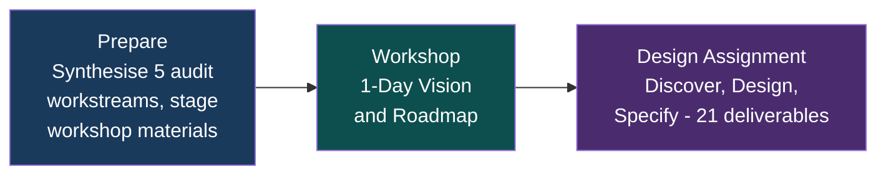
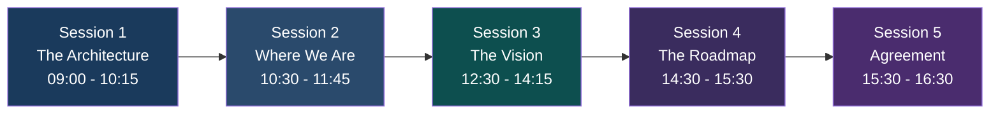
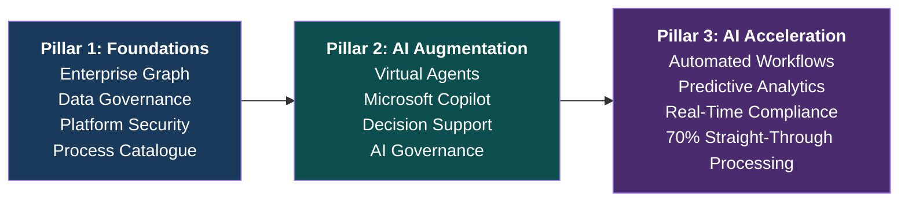

# EA Programme — Executive Proposal

## Enterprise Architecture & AI Strategy

|  |  |
| :---- | :---- |
| **Reference** | EA-PPM-PT-2026-001-EP |
| **Date** | 05 February 2026 |
| **Classification** | Internal — Commercial in Confidence |
| **Engagement** | In 15 Elapsed Days at Fixed Price of £14,500 All-In. |

---

## Why This Matters

**In less than three weeks, this engagement delivers the architecture, programme plan, and budget that turns P&'s strategic ambitions into a sequenced, costed delivery programme — reducing manual processes, connecting data across systems, and giving the leadership team a clear path to commission and govern with confidence.**

P& has the strategy. Five pillars, sixteen objectives, over fifty planned initiatives. What is missing is the blueprint that turns those plans into action — a clear picture of how the technology, data, and AI capabilities connect, what to build first, and how to get there without wasting time or money.

Today, roughly 60% of key business processes are manual. There is no single view of client, policy, or risk data across systems. Technology decisions are made without a joined-up plan. AI opportunities exist but there is no safe framework to use them.

**What we do:** In 15 working days, we run a structured workshop with your leadership team, carry out a design exercise, and deliver a complete architecture and costed programme plan — covering your technology platform, data, AI capabilities, and business processes.

**What you get:**

- A snapshot of where you are now — your systems, data, processes, and technology — and a clear view of where you want to be
- Analysis and design of the enterprise requirements, capturing how key initiatives will deliver value to P&
- A workshop round table with key team members to agree the vision, priorities, and next steps
- An architecture design across four layers: business operations, data and information, AI and automation, and technology infrastructure
- A prioritised programme of work (14 delivery packages across 6 streams) sequenced so the right things are built in the right order
- A costed roadmap at 4, 12, and 24 months mapped to your strategic objectives
- A plan to reduce manual processes from 60% to under 20%
- Technology decisions documented with options and rationale, not guesswork
- An AI governance framework so you can adopt AI safely and in line with regulation
- An Enterprise Graph specification for connecting your data across systems so every team works from the same facts
- All done and dusted, ready for next steps, in less than 3 working weeks

**Why we are doing it:** Without this foundation, initiatives will compete for the same resources, technology choices will be made in isolation, AI adoption will stall or create risk, and the strategic plan will remain a set of ambitions rather than a delivery programme. This engagement gives the leadership team everything needed to commission and govern the programme with confidence.

**The outcome:** A single, structured, budgeted programme plan that the board can approve, the teams can deliver, and the business can measure — turning strategy into results.

---

## Scope

1. Confirm the vision, strategy, objectives, and success measures set by the business
2. Snapshot audits of where the current technology sits — cloud platform, data, productivity tools, third-party applications including Acturis, and a review of risk, compliance, security, and governance
3. A prioritised programme of business initiatives aligned to strategy, mapped to the pillars and themes that will accelerate time to value
4. The technology architecture and infrastructure needed to deliver the planned programme
5. The dependencies, relationships, and costs to deliver the architecture and programme over time
6. Design work and documented decision-making to identify the best solutions for P&
7. How an Enterprise Graph and Ontology can provide the foundation for integrating systems, adopting AI, and making better use of information — in line with the priorities and budgets set by the business

## Vision and Strategy

**Vision:** Transform P& into a leading AI-augmented insurance advisory business — building on mid-market success to move from 60% manual, siloed operations into a data-driven, compliance-assured organisation that delivers superior value for customers and partners.

**Strategy:** Deliver the technology blueprint that connects strategy to action across three progressive stages:

1. Get the foundations right — Enterprise Graph, secure platform, enabling technology
2. A prioritised portfolio of applications and initiatives, phased to maximise value and benefits to the business
3. AI augmentation and acceleration — using AI to automate, predict, and improve decision-making across the business

**What we will achieve:**

| What we deliver | Why it matters |
| :---- | :---- |
| A shared vision and technology model agreed by all stakeholders | Everyone working from the same plan |
| Architecture design across business operations, data, AI, and technology | Clear picture of what needs to be built and how it fits together |
| Enterprise Graph specification linking all key systems | One view of client, policy, and risk data across the business |
| 50+ initiatives translated into a structured, sequenced programme | The right things built in the right order |
| AI governance and safe adoption framework | Confidence to use AI without regulatory or operational risk |
| Manual process reduction plan (60% down to under 20%) | Quantified efficiency gains with a clear path to get there |
| Budgeted programme and infrastructure specification | Costed plan ready for board approval |

## The Process

1. Snapshot audits — assess where the current systems and technology sit, so we start from an agreed baseline
2. Analysis and design workshop — work through the architecture and infrastructure needed to deliver the programme of business initiatives
3. Workshop with key stakeholders — structured sessions to discuss options, agree priorities, and align with business strategy
4. Review and refine — second pass on options and decisions arising from the workshop
5. Budgeted programme — updated and costed plan ready for review, with particular focus on the first wave of delivery and a summary of subsequent phases

## The Opportunity

P& (~£100M turnover, ~800 people) has a defined strategy — five strategic pillars, sixteen objectives, and over fifty planned initiatives — but needs the enabling architecture to connect strategy to execution. Today there is no unified data model, no joined-up technology plan, and roughly 60% of key processes are manual. The opportunity is to change that.

This engagement — workshop, design, and costed programme — will accelerate P&'s ability to deliver on the key pillars of the strategy that the portfolio of initiatives underpins.

## What We Deliver

A **15-day fixed-price engagement** across three phases:

**The Team:**

| Role | Focus |
| :---- | :---- |
| **Enterprise Solution & Azure Architects** | Architecture design, workshop facilitation, cloud and Microsoft 365 platform, governance, technology decisions, compliance |
| **AI & Data Engineering Consultants** | AI strategy, data modelling, connected data design, AI governance, virtual agent architecture, AI-assisted delivery |

## Workshop Outline — 1-Day Vision & Roadmap

**Session 1 — The Architecture Model (75 mins):** Present the architecture across four layers — business operations, data and information, AI and automation, and technology infrastructure. Introduce the Enterprise Graph as the connective tissue linking data across systems. Demonstrate the live ontology modelling tools used to build and validate the design.

**Session 2 — Where We Are (75 mins):** Walk through 5 snapshot audits covering cloud platform, Microsoft 365, business applications, third-party systems, and risk/compliance/security/governance. Quantify the manual process problem (~60% manual). Present the gap summary: where we are vs where we need to be.

**Session 3 — The Vision (105 mins):** Present the target state through three progressive pillars:

**Session 4 — The Roadmap (60 mins):** Agree the next phase of commitments (Feb-May 2026) across all three pillars. Identify constraints: Acturis integration access, Azure production access, resource availability, and regulatory clarity.

**Session 5 — Agreement (60 mins):** Confirm the architecture model, three pillars, next-phase scope, and governance. Commission the 2-3 week design assignment.

**Workshop outputs:** Decision Record, Next Phase Scope Confirmation, Design Assignment Commission, Priority Process Catalogue, Parking Lot and Actions Register — all documented and shared on the day.

## Design Assignment Deliverables

| # | Deliverable | What It Enables |
| :---- | :---- | :---- |
| D1 | Architecture Design (4 layers) | Clear picture of what needs to be built across business operations, data, AI, and technology |
| D2 | Enterprise Graph Specification | One joined-up view of client, policy, and risk data across all systems |
| D3 | Delivery Roadmap (4, 12, and 24 months) | Phased plan mapped to the three pillars and strategic objectives |
| D4 | Programme Design and Budget (14 packages, 6 streams) | Sequenced, costed programme with dependencies mapped and ready for execution |
| D5 | Process Automation Assessment (top 20 processes) | Quantified path from 60% to under 20% manual processes |
| D6 | Technology Decision Records (x5) | Documented technology choices with options and rationale for connected data, AI platform, integration, data governance, and compliance |
| D7 | Strategic Initiative Map (50+ initiatives) | Every initiative traced to strategic value and business outcomes |
| D8 | AI Agent Architecture (8 agents) | Safe, governed AI agents that can automate tasks with human oversight built in |
| D9 | AI Governance Policy | Regulatory compliance from day one — UK AI regulation, AI security standards, FCA requirements |

## TOGAF — Fast-Tracked for P&

We follow TOGAF — the world's most widely adopted framework for enterprise architecture — but streamlined and fast-tracked for a mid-market firm. Every phase of the standard method is covered. Nothing is skipped. The approach is compressed, uses AI to accelerate delivery, and is governed by your lean team.

The architecture is **ontology-driven** (live, machine-readable models in a graph, not static documents), **AI-assisted** (deliverables generated and validated using AI tooling), and **not locked to any single vendor** (making the most of the Microsoft platform without creating dependency).

**Maturity trajectory:** Level 1 (today) to Level 2 (May 2026) to Level 3 (Feb 2027) to Level 4 (Feb 2028)

## Commercial

| Key commercial terms |  |
| :---- | :---- |
| **Duration** | 15 Elapsed Working Days. |
| **Price** | **£14,500 — Fixed Price, All-In** |
| **Includes** | All professional fees, preparation, workshop facilitation, design work, artefact production, tooling |

## Terms and Conditions

**Scope.** Pre-workshop preparation, 1-day facilitated workshop, and design assignment delivering 21 named artefacts. Programme execution (Phase 2) is a separate engagement.

**Fixed Price.** £14,500 all-in. No additional charges without prior written agreement.

**Payment Terms.**

| Milestone | Amount | Trigger |
| :---- | :---- | :---- |
| On commissioning | £4,350 (30%) | Signed acceptance of this proposal |
| Workshop complete | £4,350 (30%) | Delivery of workshop and decision record |
| Final delivery | £5,800 (40%) | Acceptance of all design assignment deliverables |

Payment due within 14 days of invoice date.

**Client Obligations.** Stakeholder access for workshop and  interviews; access to audit artefacts, strategy documents, and tenant environments; workshop venue and logistics; timely review of deliverables (within agreed timeframes to enable and not block project completion.).

**Deliverable Acceptance.** Accepted 5 working days after submission unless written feedback is provided. Reasonable changes within scope included.

**IP.** All deliverables become client property upon payment. The engagement team retains general methodologies and non-client-specific techniques.

**Confidentiality and NDA.** All engagement information classified "Internal — Commercial in Confidence."

**Scope Changes.** Material changes agreed in writing via CTO and RCS. Minor clarifications within scope included.

**Cancellation.** 5 working days' written notice. Payment due for work completed and milestone payments triggered.

**Liability.** Limited to £14,500. Neither party liable for indirect or consequential damages.

## Acceptance

| Role | Name | Signature | Date |
| :---- | :---- | :---- | :---- |
| CTO | Ian Keats |  |  |
| External Board Advisor |  |  |  |

---

## Glossary

| Term | Definition |
| :---- | :---- |
| **Acturis** | Third-party insurance broking platform used by P& for policy administration, claims, and client management |
| **ADM** | Architecture Development Method — the core process of TOGAF, comprising phases Preliminary through H for developing and governing enterprise architecture |
| **ADR** | Architecture Decision Record — a structured document capturing a technology or design decision, the options considered, and the rationale for the chosen approach |
| **Agentic Layer** | The architectural tier of AI agents (virtual agents) that perform tasks autonomously or semi-autonomously within governed boundaries |
| **ALZ** | Azure Landing Zone — the foundational Azure infrastructure configuration covering identity, networking, security, and governance |
| **Azure** | Microsoft's cloud computing platform providing infrastructure, platform, and software services |
| **BSC** | Balanced Scorecard — a strategic management framework linking objectives across four perspectives (Financial, Customer, Internal Process, Learning and Growth) to measurable outcomes |
| **Copilot** | Microsoft's AI assistant integrated across M365 applications (Word, Excel, Teams, Outlook) providing generative AI capabilities to end users |
| **EA** | Enterprise Architecture — the discipline of designing, planning, and governing an organisation's business, information, application, and technology landscape as a coherent whole |
| **Enterprise Graph** | A graph database serving as the foundational information architecture, connecting data from multiple sources (clients, policies, risks, compliance, identity) into a queryable, relationship-rich model |
| **Entra ID** | Microsoft Entra ID (formerly Azure Active Directory) — the cloud identity and access management service used for authentication, authorisation, and governance |
| **Epic** | A large body of work within a programme that can be broken down into smaller initiatives or user stories, used here to structure the 14 PPM delivery packages |
| **FCA** | Financial Conduct Authority — the UK regulator for financial services firms including insurance brokers, setting conduct and prudential standards |
| **Gen AI** | Generative AI — artificial intelligence systems capable of generating text, code, images, and other content, including large language models (LLMs) |
| **Graph DB** | Graph Database — a database that uses graph structures (nodes and edges) to store, map, and query relationships between data, enabling connected data queries that relational databases handle poorly |
| **HITL** | Human in the Loop — a governance control requiring human review and approval before an AI agent takes consequential actions |
| **JSON-LD** | JavaScript Object Notation for Linked Data — a standard format for encoding structured, machine-readable data with semantic meaning, used for ontology definitions |
| **M365** | Microsoft 365 — the suite of cloud productivity and collaboration tools including Exchange, SharePoint, Teams, OneDrive, and associated services |
| **O365** | Office 365 — used interchangeably with M365 in this document to refer to the Microsoft productivity suite and its configuration audit |
| **OKR** | Objectives and Key Results — a goal-setting framework that defines measurable objectives and the key results needed to achieve them |
| **Ontology** | A formal, machine-readable model defining the concepts, relationships, and rules within a domain — used here as the primary architectural modelling approach across 23 domains |
| **OWASP LLM Top 10** | The Open Web Application Security Project's list of the ten most critical security risks for large language model applications, used as a governance baseline for AI deployments |
| **PP** | Power Platform — Microsoft's low-code/no-code platform comprising Power Apps, Power Automate, Power BI, and Power Pages |
| **PPM** | Programme and Portfolio Management — the discipline of organising, prioritising, and governing a portfolio of projects and initiatives to deliver strategic objectives |
| **Purview** | Microsoft Purview — the data governance, risk, and compliance platform providing data classification, loss prevention, and information protection |
| **RCSG** | Risk, Compliance, Security, and Governance — the cross-cutting audit workstream assessing the organisation's posture across these four domains |
| **ROI** | Return on Investment — the ratio of net benefit to cost, used to evaluate and prioritise programme initiatives |
| **schema.org** | A collaborative vocabulary for structured data on the internet, used as a foundation for ontology alignment and interoperability |
| **STP** | Straight-Through Processing — the ability to process a transaction from initiation to completion without manual intervention, targeted at 70% in Pillar 3 |
| **TOGAF** | The Open Group Architecture Framework — the world's most widely adopted standard for enterprise architecture methodology, providing a structured approach to design, planning, implementation, and governance |
| **TP** | Third-Party Applications — the audit workstream covering non-Microsoft applications including Acturis and other line-of-business systems |
| **UK AI Act** | The United Kingdom's forthcoming AI regulation framework establishing requirements for transparency, safety, and accountability in AI systems |
| **Virtual Agent** | An AI-powered software agent designed to perform specific business tasks (e.g., compliance checking, document processing) within the governed agentic layer |
| **VSOM** | Vision, Strategy, Objectives, Metrics — the direction-setting cascade used to align programme delivery with strategic intent |
| **Workstream** | A defined stream of related work within the programme (WS-A through WS-F), each containing multiple epics and initiatives with shared dependencies |

---

*EA-PPM-PT-2026-001-EP — EA Programme Executive Proposal v2.3.1*
*Classification: Internal — Commercial in Confidence*
