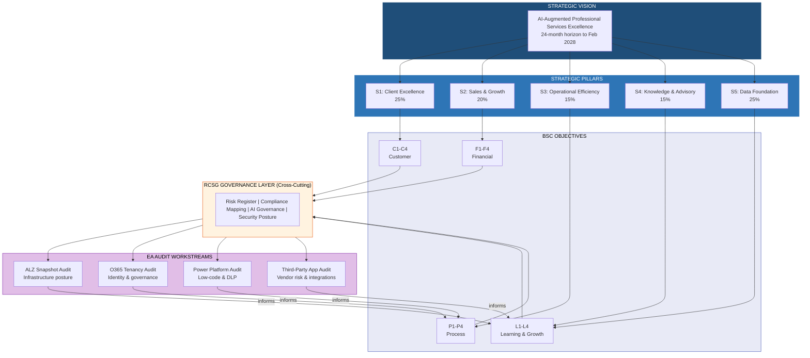
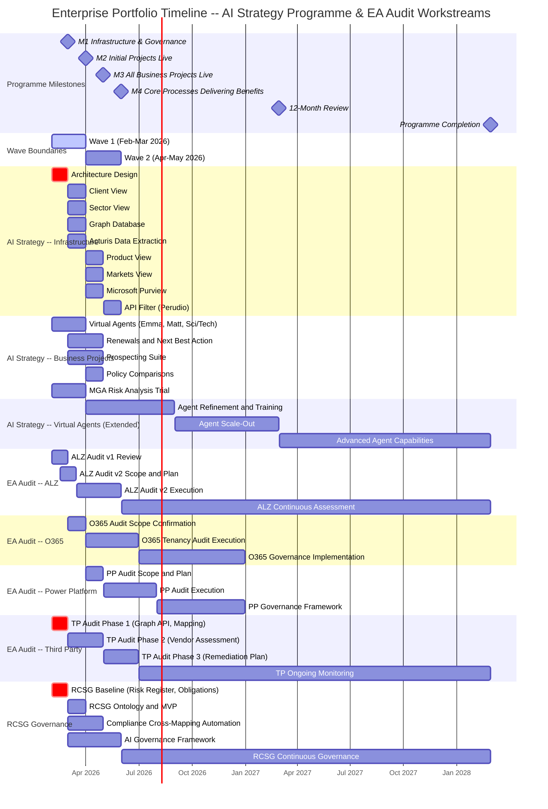
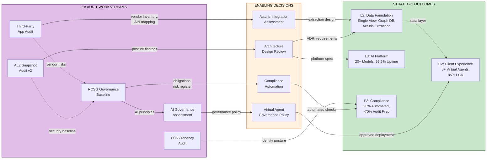

# EA Strategy Review -- Wave 1 Priorities & Enterprise Portfolio Alignment

## Bridging AI Strategy Programme to EA Audit Workstreams

| Property | Value |
|:---|:---|
| Document Title | EA Strategy Review -- Wave 1 Priorities & Enterprise Portfolio Alignment |
| Document Reference | EA-PPM-W1-2026-001 |
| Version | 1.0 |
| Date | 04 February 2026 |
| Status | Draft for Review |
| Classification | Internal -- Commercial in Confidence |
| Author | Mission Optimisation Team |
| Owner | AI Strategy Steering Committee |

### Version History

| Version | Date | Author | Changes |
|:---|:---|:---|:---|
| 1.0 | 04 Feb 2026 | Mission Optimisation | Initial draft -- Wave 1 priorities, enterprise portfolio alignment, audit-to-BSC mapping, strategic dependency analysis |

### Document Approval

| Role | Name | Signature | Date |
|:---|:---|:---|:---|
| Document Author | | | |
| Technical Reviewer | | | |
| EA Lead | | | |
| Steering Committee | | | |

### Distribution List

| Name / Role | Organisation | Distribution |
|:---|:---|:---|
| AI Strategy Steering Committee | Executive Leadership | For Approval |
| Programme Management Office | PMO | For Action |
| Enterprise Architecture | Technology | For Review |
| Compliance & Governance | Risk | For Review |
| Business Transformation | Operations | For Information |

---

## 1. Executive Summary

This document connects the AI Strategy Programme (50+ initiatives, 5 strategic pillars, Balanced Scorecard framework) to the Enterprise Architecture Audit Portfolio workstreams, establishing the strategic rationale for EA-specific enabling works in Wave 1 (February -- March 2026).

The AI Strategy Programme defines a 24-month transformation horizon (February 2026 to February 2028) organised under five strategic pillars with 16 BSC objectives, four cross-cutting themes, and six core AI capabilities. Phase 2 delivery (February -- May 2026) is gated by four milestones (M1 through M4), with infrastructure and governance foundations due by end of February (M1) and initial business projects live by end of March (M2).

The EA audit portfolio comprises five workstreams -- ALZ Snapshot Audit, O365 Tenancy Audit, Power Platform Audit, Third-Party App Audit, and RCSG Governance -- each of which produces deliverables that directly inform strategic infrastructure decisions, AI platform architecture, and compliance posture. Specifically:

- **ALZ and O365 audit outputs** inform L2 (Data Foundation) and L3 (AI Platform) decisions regarding cloud infrastructure posture, identity governance, and security baseline configuration.
- **Third-Party App audit findings** feed the Acturis data extraction strategy (L2-KR2.2) and vendor risk management under P3 (Streamline Compliance).
- **RCSG Governance** establishes the cross-cutting compliance and risk framework that underpins P3 objectives and enables AI governance for virtual agent deployment (C2-KR2.1).
- **Power Platform audit results** validate the low-code automation strategy supporting P1 (Process Automation) and inform DLP policy decisions.

This review identifies ten priority items across Wave 1 (five for M1 in February and five for M2 in March), maps each to BSC objectives and GitHub issue references, and defines success criteria for the steering committee to evaluate at milestone gates.

---

## 2. Enterprise Portfolio View

### 2.1 Strategic Pillars with EA Governance Layer

The AI Strategy Programme operates under five strategic pillars. This review proposes RCSG (Risk, Compliance, Security, Governance) as a sixth cross-cutting governance layer that spans all pillars. RCSG is not a standalone investment pillar but an enabling governance function that ensures compliance-by-design across every initiative.

| Pillar | Strategic Intent | Investment % | EA Audit Dependency |
|:---|:---|:---|:---|
| S1: Client Excellence | AI-powered client intelligence and retention | 25% | TP Audit (Acturis data), RCSG (data governance) |
| S2: Sales & Growth | Intelligent prospecting and sales enablement | 20% | TP Audit (vendor integrations), ALZ (platform) |
| S3: Operational Efficiency | Process automation, cost reduction | 15% | PP Audit (low-code governance), ALZ (infrastructure) |
| S4: Knowledge & Advisory | AI assistants, decision support | 15% | RCSG (AI governance), O365 (identity/access) |
| S5: Data Foundation | Data infrastructure, governance, integration | 25% | ALZ Audit (infrastructure), O365 (tenancy), RCSG (Purview) |
| RCSG: Governance (cross-cutting) | Risk, compliance, security, AI governance | Cross-cutting | All audit workstreams feed into RCSG |

### 2.2 Portfolio Architecture -- Pillars to Audit Workstreams

### 2.3 Audit Workstream to BSC Objective Mapping

| Audit Workstream | Primary BSC Objectives | Secondary BSC Objectives | Key Outputs | Wave 1 Priority |
|:---|:---|:---|:---|:---|
| ALZ Snapshot Audit | L2: Data Foundation, L3: AI Platform | P3: Compliance | Infrastructure posture assessment, security baseline evaluation, subscription architecture review, resource configuration audit | HIGH |
| O365 Tenancy Audit | P3: Compliance | C1: Client Retention (security posture supports client trust) | M365 governance review, identity and access posture, Entra ID configuration, license utilisation analysis | MEDIUM |
| Power Platform Audit | P1: Process Automation | P3: Compliance | Low-code governance assessment, DLP policy evaluation, connector inventory, environment strategy review | MEDIUM |
| Third-Party App Audit | P3: Compliance | F4: Cost-to-Serve | Vendor risk assessment, Acturis integration mapping, credential and secret audit, API dependency inventory | HIGH |
| RCSG Governance | P3: Compliance, F4: Cost-to-Serve | All perspectives (cross-cutting) | Risk register baseline, compliance obligation mapping, AI governance framework, regulatory change tracking (DORA, UK AI Act) | HIGHEST |

---

## 3. Initiative-to-Issue Mapping

The following table maps key PPM initiatives to their corresponding BSC objectives, existing GitHub issues in the INS-PPL-AZL repository, and the EA audit workstream they depend on or contribute to.

| PPM Initiative | BSC Objective(s) | GitHub Issues | EA Workstream | Wave 1 Relevance |
|:---|:---|:---|:---|:---|
| Acturis Data Extraction | L2: Data Foundation | #62, #61 | TP Audit | Direct -- scoping in Feb, extraction design in Mar |
| Microsoft Purview | L2: Data Foundation, P3: Compliance | #10 | RCSG Governance | Direct -- governance framework prerequisite |
| Policy Comparisons | P3: Compliance | #10 | RCSG Governance | Indirect -- compliance framework feeds policy tool |
| Compliance Checks | P3: Compliance | #46, #47, #48, #49, #50, #51, #52, #53 | RCSG Governance | Direct -- compliance mapping automation |
| Architecture Design | L2: Data Foundation, L3: AI Platform | #60 | ALZ Audit v2 | Direct -- M1 deliverable, gates all infrastructure |
| Virtual Emma | C2: Client Experience, L1: AI Workforce | #48 (AI governance) | RCSG Governance | Indirect -- AI governance assessment for agents |
| Virtual Matt (Cyber) | C2: Client Experience, L1: AI Workforce | #49 (AI governance) | RCSG Governance | Indirect -- AI governance assessment for agents |
| Virtual Science/Tech | C2: Client Experience, L1: AI Workforce | #50 (AI governance) | RCSG Governance | Indirect -- AI governance assessment for agents |
| Graph Database | L2: Data Foundation | #63 | EA Graph / Data Architecture | Indirect -- data model informs graph schema |
| Single View of Clients | L2: Data Foundation, C4: Proactive Insights | -- | ALZ Audit (platform), TP Audit (data sources) | Indirect -- infrastructure and integration readiness |
| Compliance Automation | P3: Compliance | #46-#53 | RCSG Governance | Direct -- cross-mapping framework in Mar |

---

## 4. Wave 1 Priorities -- February 2026 (M1: Infrastructure & Governance)

Milestone M1 (end of February 2026) establishes the infrastructure foundation and governance baseline. The five priority items below are selected for their gating effect on subsequent milestones and their direct alignment with Learning & Growth and Process BSC perspectives.

| Ref | Priority Item | Description | BSC Alignment | GitHub Issues | Success Criteria |
|:---|:---|:---|:---|:---|:---|
| W1-01 | Architecture Design Review | Define technical architecture for AI platform; review ALZ audit v1 findings against target-state infrastructure. Produces architecture decision record (ADR) and infrastructure requirements specification. | L2: Data Foundation, L3: AI Platform | #60 | ADR published; infrastructure requirements documented; steering committee sign-off on target architecture |
| W1-02 | RCSG Governance Baseline | Establish risk register structure, inventory compliance obligations (FCA, PRA, GDPR, Lloyd's MS13, DORA), define AI governance principles. Produces risk register v1 and compliance obligation matrix. | P3: Compliance, F4: Cost-to-Serve | #46-#53 | Risk register v1 created; compliance obligations inventoried; AI governance principles drafted |
| W1-03 | ALZ Audit v2 Milestone Plan | Define scope and schedule for revised ALZ snapshot audit incorporating lessons learned from v1. Confirms query coverage, MCSB v2 alignment, and test environment access. | P3: Compliance, L2: Data Foundation | #60 | Audit v2 scope document approved; schedule published; environment access confirmed |
| W1-04 | TP Audit Completion (Phase 1) | Complete Graph API queries (#04 artifact) and initial compliance mapping (#05 artifact) for third-party applications. Produces vendor inventory and preliminary risk classification. | P3: Compliance, F4: Cost-to-Serve | #61, #62 | Graph API query results delivered; vendor inventory complete; risk classification draft |
| W1-05 | Acturis Integration Assessment Scope | Define scope of Acturis data extraction assessment; identify API endpoints, data schemas, and integration patterns. Feeds L2-KR2.2 (Acturis data extraction and integration). | L2: Data Foundation | #62 | Scope document published; API endpoints identified; data schema mapping initiated |

### M1 Milestone Gate Criteria

The following conditions must be met for M1 milestone sign-off at the end of February 2026:

1. Architecture decision record (ADR) reviewed and accepted by EA lead
2. Risk register v1 structure approved by compliance function
3. ALZ Audit v2 scope and schedule confirmed
4. TP Audit Phase 1 artifacts (#04, #05) delivered to repository
5. Acturis integration scope document circulated to stakeholders
6. Resource allocation confirmed for March workstreams
7. Steering committee briefing completed

---

## 5. Wave 1 Priorities -- March 2026 (M2: Initial Projects Live)

Milestone M2 (end of March 2026) transitions from planning to initial delivery. The five priority items below build on M1 outputs and align with the AI Strategy Programme milestone of initial business projects going live.

| Ref | Priority Item | Description | BSC Alignment | GitHub Issues | Success Criteria |
|:---|:---|:---|:---|:---|:---|
| W1-06 | RCSG Ontology and Risk Register MVP | Develop RCSG ontology aligned to OAA framework; populate risk register with identified risks from ALZ and TP audits. Produces machine-readable risk register and ontology definition. | P3: Compliance | #46-#53 | Ontology schema published (OAA-aligned); risk register populated with minimum 15 risks; risk scoring methodology defined |
| W1-07 | Compliance Framework Cross-Mapping Automation | Automate cross-mapping between compliance frameworks (MCSB v2, NIST 800-53 R5, ISO 27001:2022, FCA, PRA). Build on ALZ audit compliance mapping artifact (#06). | P3: Compliance | #10, #46-#53 | Cross-mapping tool operational; minimum 3 framework pairs mapped; automated report generation functional |
| W1-08 | O365 Audit Scope Confirmation | Define scope for O365 tenancy audit; confirm Entra ID, Exchange Online, SharePoint, Teams governance review parameters. Establishes audit methodology and data collection approach. | P3: Compliance, L2: Data Foundation | -- | Scope document approved; audit methodology defined; data collection scripts prepared; environment access confirmed |
| W1-09 | AI Governance Initial Assessment | Assess AI governance requirements for virtual agent deployment (Emma, Matt, Science/Tech). Review UK AI regulatory framework, OWASP LLM Top 10, and sector-specific guidance. Produces AI governance policy draft. | P3: Compliance, C2: Client Experience | #48, #49, #50 | AI governance policy draft completed; OWASP LLM Top 10 assessment for each agent; UK AI regulatory gap analysis documented |
| W1-10 | Enterprise Portfolio View Dashboard Design | Design unified portfolio dashboard integrating AI Strategy initiatives, EA audit progress, and BSC metrics. Define data sources, refresh cadence, and stakeholder views. | All BSC perspectives | -- | Dashboard wireframes approved; data source mapping complete; refresh cadence defined; stakeholder access model documented |

### M2 Milestone Gate Criteria

The following conditions must be met for M2 milestone sign-off at the end of March 2026:

1. RCSG ontology published and risk register MVP operational
2. Compliance cross-mapping automation producing reports for at least three framework pairs
3. O365 audit scope confirmed and data collection initiated
4. AI governance policy draft reviewed by compliance and legal
5. Portfolio dashboard design approved for implementation
6. Virtual agents (Emma, Matt, Science/Tech) deployment assessed against AI governance policy
7. Progress report delivered to steering committee

---

## 6. Enterprise Portfolio Gantt

The following unified timeline shows all programme workstreams and their interdependencies across the 24-month programme horizon, with Wave 1 and Wave 2 milestones highlighted.

---

## 7. Strategic Dependencies

The following diagram illustrates the critical path dependencies between EA audit workstreams, AI Strategy initiatives, and BSC objectives. Understanding these dependencies is essential for sequencing work correctly and managing risk across the portfolio.

### 7.1 Critical Path Analysis

Four critical paths have been identified for Wave 1:

**Critical Path 1 -- Infrastructure Platform**
ALZ Snapshot Audit --> Architecture Design Review --> AI Platform Decisions (L2, L3)
- The ALZ audit provides the infrastructure posture assessment that informs the architecture decision record. Without this, AI platform and data foundation decisions lack an evidence base.
- Gating risk: ALZ audit data availability and environment access.

**Critical Path 2 -- Data Foundation**
TP App Audit --> Acturis Integration Assessment --> Data Extraction Strategy (L2-KR2.2)
- The third-party app audit maps Acturis integration points, API endpoints, and data schemas. The Acturis extraction initiative depends on this mapping for its technical design.
- Gating risk: Acturis API access and documentation availability.

**Critical Path 3 -- Compliance Automation**
RCSG Governance Baseline --> Compliance Cross-Mapping Automation --> Compliance Checks (P3-KR3.1)
- The RCSG baseline establishes the compliance obligations inventory and risk register structure. The cross-mapping automation builds on this to produce automated compliance checking capability.
- Gating risk: Completeness of regulatory obligation identification.

**Critical Path 4 -- AI Governance for Virtual Agents**
RCSG Governance Baseline --> AI Governance Assessment --> Virtual Agent Deployment (C2-KR2.1)
- Virtual agent deployment (Emma, Matt, Science/Tech) requires an AI governance framework addressing responsible AI principles, data handling, and regulatory compliance (UK AI regulatory framework, OWASP LLM Top 10).
- Gating risk: Regulatory clarity on AI in insurance advisory services.

---

## 8. Risk and Assumptions

### 8.1 Wave 1 Risk Register

| Ref | Risk Description | Likelihood | Impact | Mitigation | Owner | BSC Impact |
|:---|:---|:---|:---|:---|:---|:---|
| R-W1-01 | ALZ audit data availability -- production environment access may be restricted or require elevated approvals, delaying posture assessment | Medium | High | Engage IT operations early; confirm access requirements by week 2 of February; prepare alternative data collection via Azure Policy exports | EA Lead | L2, L3 |
| R-W1-02 | Acturis API access for TP audit -- API documentation may be incomplete or access credentials unavailable, blocking integration assessment | Medium | High | Initiate Acturis vendor engagement in first week; identify internal Acturis SMEs; document known integration patterns as fallback | Programme Manager | L2 |
| R-W1-03 | Regulatory change (DORA timeline) -- Digital Operational Resilience Act enforcement timeline may accelerate, changing compliance priorities | Low | High | Monitor EIOPA communications; maintain DORA readiness assessment as standing RCSG item; ensure compliance mapping includes DORA controls | Compliance Lead | P3, F4 |
| R-W1-04 | Resource contention with AI Strategy business projects -- EA workstream resources may be diverted to higher-profile virtual agent or prospecting initiatives | Medium | Medium | Confirm dedicated EA resource allocation at steering committee; establish resource booking through PMO; escalation path for conflicts | PMO | All |
| R-W1-05 | Scope creep in RCSG governance -- breadth of compliance obligations may expand beyond manageable scope for February baseline | Medium | Medium | Define minimum viable scope for RCSG baseline (FCA, PRA, GDPR, Lloyd's MS13); defer secondary frameworks to Wave 2 | EA Lead | P3 |
| R-W1-06 | O365 audit scope dependency on ALZ findings -- O365 audit scoping may need to incorporate ALZ findings, creating sequencing pressure | Low | Medium | Begin O365 scoping in parallel with ALZ review; treat as independent initially with integration checkpoint at end of March | EA Lead | P3 |

### 8.2 Key Assumptions

| Ref | Assumption | Rationale | Validation Method | Validation Date |
|:---|:---|:---|:---|:---|
| A-W1-01 | Steering committee approval of Wave 1 priorities by end of February 2026 | M1 milestone gate requires formal sign-off to proceed with March deliverables | Steering committee meeting scheduled for final week of February | 28 Feb 2026 |
| A-W1-02 | Resource availability for EA workstreams throughout Wave 1 | Dedicated EA analyst and architect capacity required for audit execution and architecture design | PMO resource plan confirmed; any reallocation requires steering committee approval | 14 Feb 2026 |
| A-W1-03 | Azure environment access for ALZ audit v2 scoping | Read-only access to production Azure subscriptions required for posture assessment | IT operations access request submitted; expected approval within 5 working days | 14 Feb 2026 |
| A-W1-04 | Existing ALZ audit v1 artifacts are reusable as baseline | Query library, compliance mapping structure, and ontology from v1 can be extended rather than rebuilt | Review v1 artifacts against v2 requirements; confirm reuse percentage | 21 Feb 2026 |
| A-W1-05 | GitHub repository (INS-PPL-AZL) continues as primary artifact store | All audit deliverables, ontologies, and compliance mappings are maintained in the repository with CI/CD validation | Repository access confirmed for all EA team members | Confirmed |
| A-W1-06 | Insurance sector regulatory landscape remains stable through Wave 1 | No material changes to FCA, PRA, or Lloyd's requirements expected in February-March 2026 period | Regulatory monitoring via RCSG governance function | Ongoing |

---

## 9. BSC Perspective Summary -- EA Contribution

This section summarises how EA audit workstreams contribute to each BSC perspective, providing strategic justification for the investment in EA-specific enabling works.

### Financial Perspective (F1-F4)

EA audit workstreams are not direct drivers of financial outcomes but are essential enablers. The TP audit directly informs F4 (Cost-to-Serve) through vendor rationalisation and credential management efficiency. RCSG governance contributes to F4 through compliance cost reduction (automated checking versus manual audit preparation).

### Customer Perspective (C1-C4)

EA contributions to customer outcomes are indirect but material. The O365 audit strengthens security posture, which supports client trust and retention (C1). AI governance assessment enables responsible virtual agent deployment (C2). Infrastructure posture from the ALZ audit ensures platform reliability for client-facing AI services.

### Internal Process Perspective (P1-P4)

This is the primary BSC perspective for EA audit workstreams. P3 (Streamline Compliance) is directly served by all five audit workstreams. P1 (Process Automation) benefits from Power Platform audit findings that establish the governance framework for low-code automation at scale.

### Learning and Growth Perspective (L1-L4)

EA audit workstreams are foundational to L2 (Data Foundation) and L3 (AI Platform). The ALZ audit provides the infrastructure evidence base for platform architecture decisions. The TP audit maps external data sources (particularly Acturis) that feed the data foundation strategy.

---

## 10. Next Steps

The following actions are required to advance Wave 1 priorities through to M1 milestone gate:

1. **Circulate this document** to the AI Strategy Steering Committee and EA team for review and comment by 07 February 2026.

2. **Confirm resource allocation** for EA workstreams with the Programme Management Office. Dedicated architect and analyst capacity must be ring-fenced for February and March 2026.

3. **Submit Azure environment access requests** for ALZ audit v2 scoping. Target read-only access to production subscriptions with expected approval by 14 February 2026.

4. **Initiate Acturis vendor engagement** for TP audit integration assessment. Identify API documentation sources and internal Acturis subject matter experts.

5. **Establish RCSG governance working group** comprising EA lead, compliance lead, and programme manager. Schedule weekly checkpoints for February-March 2026.

6. **Schedule architecture design review workshop** for mid-February 2026. Ensure ALZ audit v1 findings are pre-circulated as input material.

7. **Create GitHub issues** for any Wave 1 priority items not yet tracked in the INS-PPL-AZL repository. Ensure all issues are labelled with the appropriate EA workstream and BSC objective tags.

8. **Prepare M1 milestone gate briefing pack** for steering committee review at end of February 2026. Include progress against all five W1-01 to W1-05 priority items.

9. **Review and update the enterprise portfolio Gantt** at end of February to reflect actual progress and any schedule adjustments for Wave 1 March priorities.

10. **Confirm AI governance assessment scope** with compliance and legal functions. Identify UK AI regulatory framework materials and OWASP LLM Top 10 assessment templates for March delivery.

---

## Appendix A: Document Cross-References

| Document | Reference | Relationship |
|:---|:---|:---|
| EA PPM Portfolio Review & Context Summary | EA-PPM-AIS-2026-001 v3.0 | Parent strategy document; provides full VSOM framework, BSC strategy map, and 50+ initiative portfolio |
| AI Strategy Programme Portfolio (Feb-May 2026) | PPM-01-01 | Phase 2 delivery programme with milestones M1-M4 and five workstreams |
| BSC Strategy Map (Mermaid) | AI_Strategy_Programme_BSC_Strategy_Map.mermaid | Visual strategy map showing cause-effect relationships between 16 objectives |
| ALZ Audit Package v1 | ALZ-Audit-Snapshot-alz-ss-v1 | Source audit package with KQL queries, compliance mapping, and ontology |
| CLAUDE.md | Repository root | Repository conventions, directory structure, and compliance framework reference |

## Appendix B: Glossary of Abbreviations

| Abbreviation | Full Form |
|:---|:---|
| ADR | Architecture Decision Record |
| ALZ | Azure Landing Zone |
| BSC | Balanced Scorecard |
| CAF | Cloud Adoption Framework |
| DLP | Data Loss Prevention |
| DORA | Digital Operational Resilience Act |
| EA | Enterprise Architecture |
| FCA | Financial Conduct Authority |
| MCSB | Microsoft Cloud Security Benchmark |
| MGA | Managing General Agent |
| NIST | National Institute of Standards and Technology |
| O365 | Office 365 / Microsoft 365 |
| OAA | Open Architecture Alignment |
| OKR | Objectives and Key Results |
| PP | Power Platform |
| PPM | Programme Portfolio Management |
| PRA | Prudential Regulation Authority |
| RCSG | Risk, Compliance, Security, Governance |
| TP | Third Party |
| VSOM | Vision, Strategy, Objectives, Metrics |
| WAF | Well-Architected Framework |

---

*Generated: 04 February 2026*
*Document Reference: EA-PPM-W1-2026-001 | Version 1.0*
*Repository: INS-PPL-AZL (github.com/ajrmooreuk/INS-PPL-AZL)*
*Classification: Internal -- Commercial in Confidence*
