# PFI-AIRL-GRC-ARCH — Azure Assessment & ALZ Healthcheck Architecture

**Document ID:** PFI-AIRL-GRC-ARCH-Azure-Assessment-ALZ-Healthcheck-Architecture-v1.0.0
**Date:** 2026-03-13
**Epic:** [Epic 74 (#1074)](https://github.com/ajrmooreuk/Azlan-EA-AAA/issues/1074)
**Status:** Active
**Product:** PFI-AIRL Azure Assessment & ALZ Healthcheck
**Type:** ARCH (Architecture)

---

## 1. Product Overview

The AIRL Azure Assessment & ALZ Healthcheck is a complete GRC product that takes a customer from initial engagement through to a verified, financially-quantified strategic report with interactive dashboards. This document maps the full architecture: skill chains, ontology graph, data flows, and DMAIC lifecycle.

---

## 2. End-to-End Skill Chain Architecture

### 2.1 Seven-Stage Pipeline

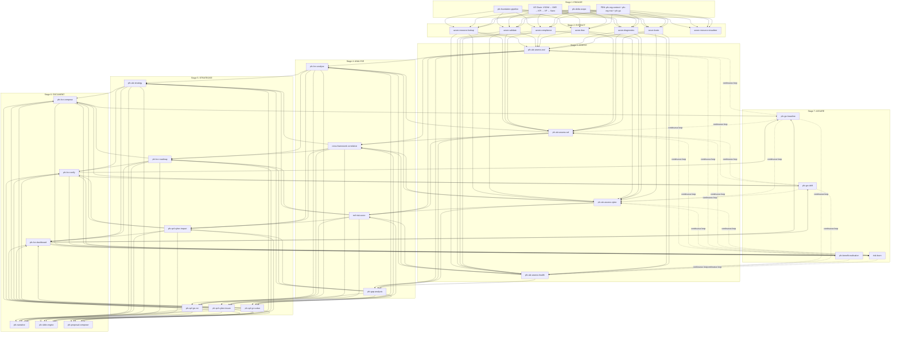

### 2.2 Human Checkpoints

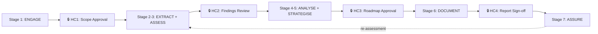

---

## 3. Ontology Dependency Graph

### 3.1 Full Ontology Map

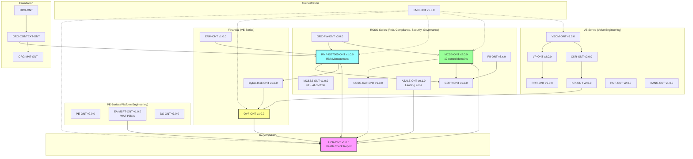

### 3.2 Ontology-to-Skill Mapping

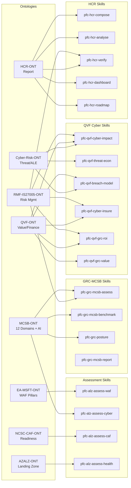

---

## 4. Data Flow Architecture

### 4.1 Assessment Data Flow

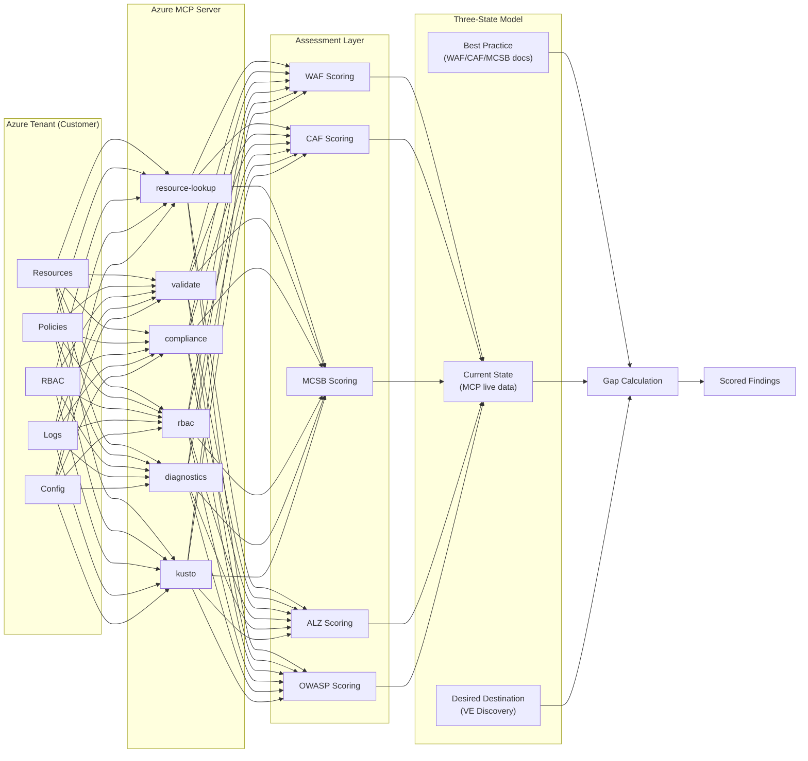

### 4.2 Finding-to-Report Flow

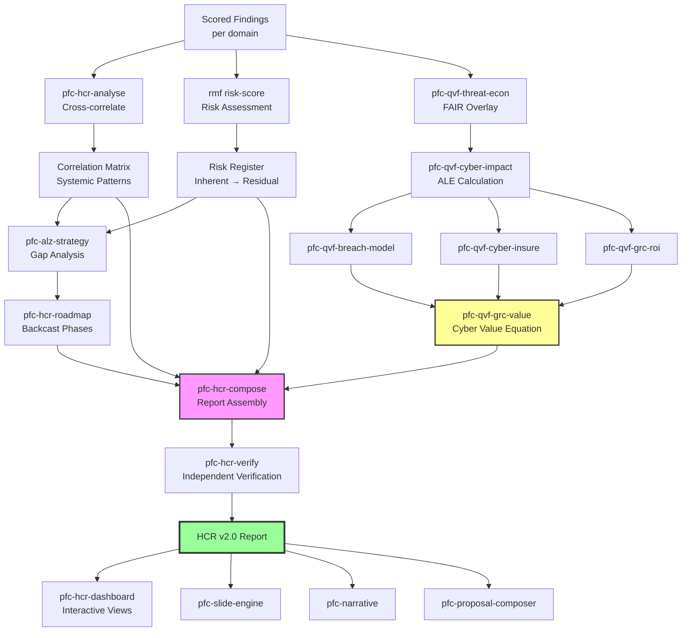

---

## 5. HCR-ONT Entity Relationship Diagram

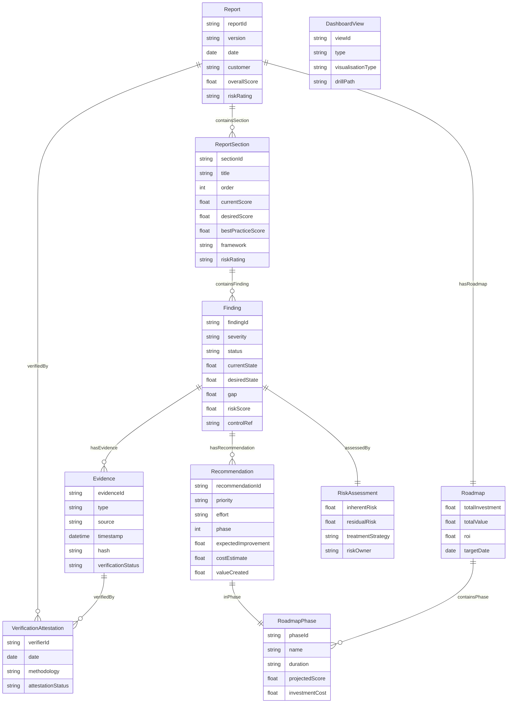

---

## 6. Three-State Scoring Architecture

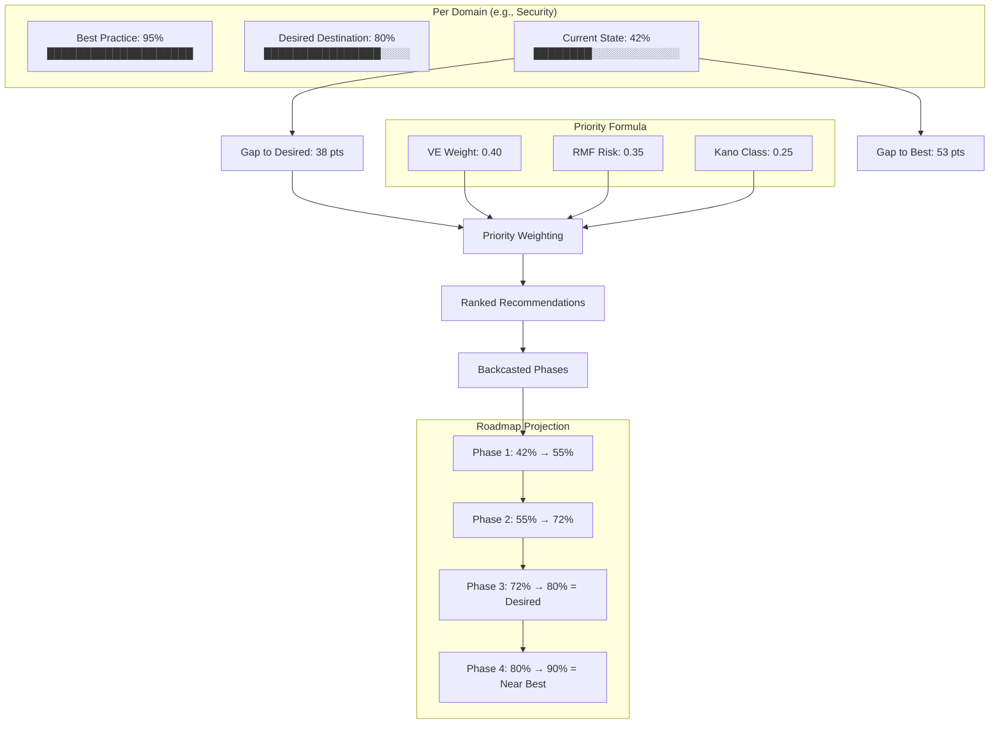

---

## 7. Risk Assessment Architecture

### 7.1 RMF-IS27005 Risk Flow

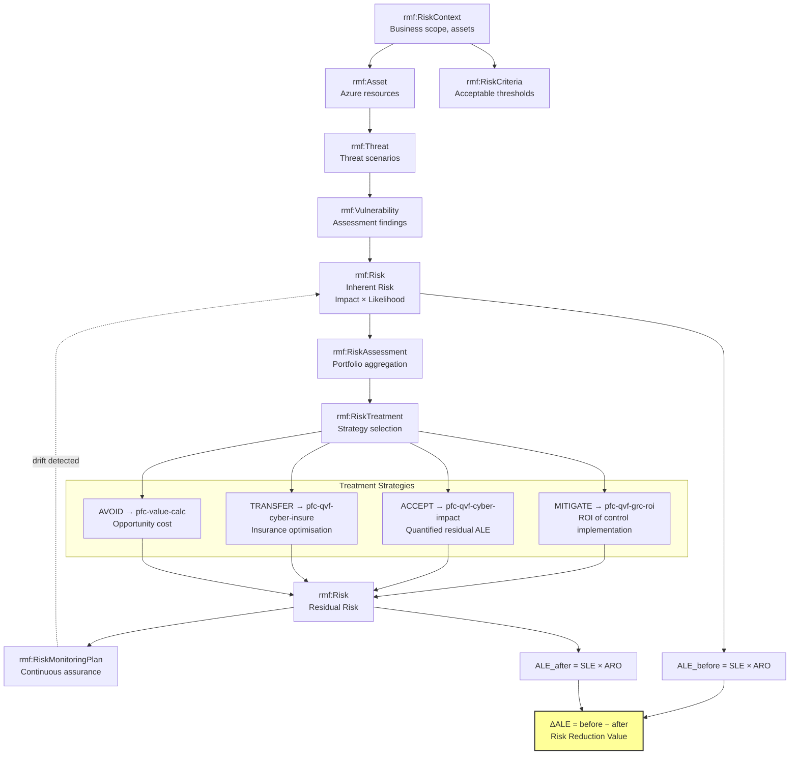

### 7.2 Risk Heatmap Structure

```mermaid
quadrantChart
    title Risk Heatmap (Impact × Likelihood)
    x-axis Low Likelihood --> High Likelihood
    y-axis Low Impact --> High Impact
    quadrant-1 Critical Risk (Mitigate NOW)
    quadrant-2 High Risk (Plan mitigation)
    quadrant-3 Medium Risk (Monitor)
    quadrant-4 Low Risk (Accept/Review)
    NSG Misconfiguration: [0.7, 0.8]
    Missing MFA: [0.6, 0.9]
    No Backup Testing: [0.3, 0.85]
    Tagging Gaps: [0.5, 0.2]
    Legacy VM OS: [0.8, 0.6]
    Missing Logs: [0.4, 0.7]
```

---

## 8. Financial Architecture (QVF Cyber Economics)

### 8.1 Cyber Value Equation Flow

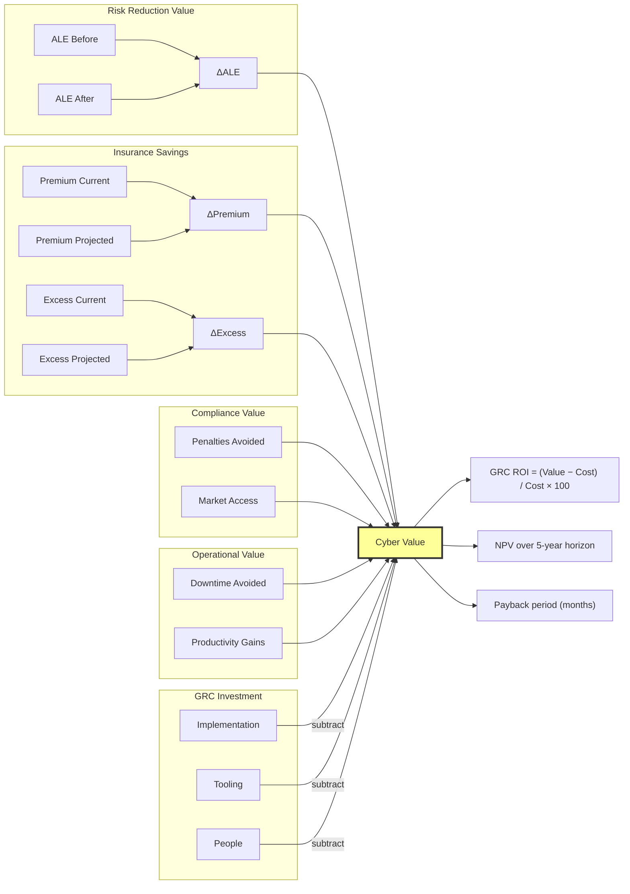

### 8.2 ALE Calculation Chain

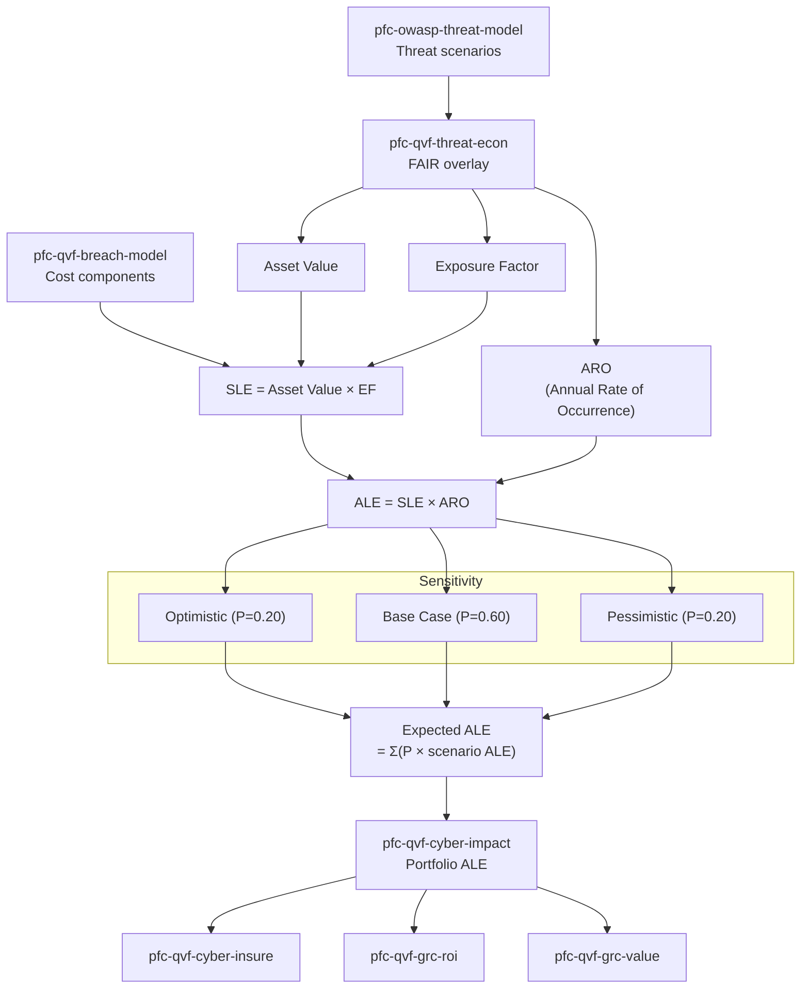

---

## 9. Dashboard Drill-Down Architecture

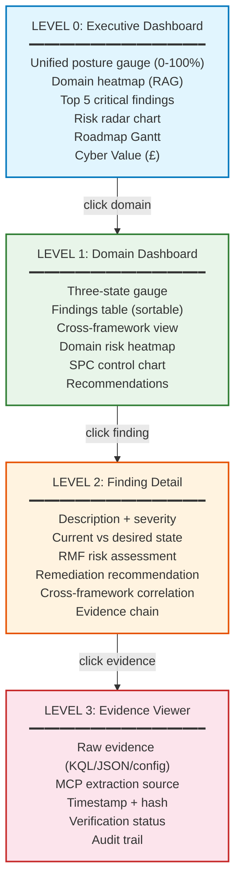

---

## 10. DMAIC Lifecycle Architecture

```mermaid
flowchart LR
    subgraph D["DEFINE"]
        D1[Scope engagement]
        D2[VE Discovery]
        D3[Set desired destination]
        D4[Define risk appetite]
    end

    subgraph M["MEASURE"]
        M1[Azure MCP extraction]
        M2[WAF/CAF/MCSB/ALZ scoring]
        M3[Three-state gap calculation]
        M4[Baseline ALE measurement]
    end

    subgraph A["ANALYSE"]
        A1[Cross-framework correlation]
        A2[RMF risk assessment]
        A3[Root cause analysis]
        A4[Financial impact (QVF)]
    end

    subgraph I["IMPROVE"]
        I1[Backcast roadmap]
        I2[OKR-aligned phases]
        I3[VE-prioritised remediation]
        I4[Insurance optimisation]
    end

    subgraph C["CONTROL"]
        C1[SPC baselines]
        C2[Drift detection]
        C3[Benefit realisation]
        C4[Risk model calibration]
    end

    D --> M --> A --> I --> C
    C -.->|continuous loop| M

    subgraph "Report Output per Phase"
        R_D[Part I: Executive Summary]
        R_M[Part II: Domain Assessments]
        R_A[Part III: Strategic Analysis]
        R_I[Part III §16: Roadmap]
        R_C[Part IV: Assurance]
    end

    D -.-> R_D
    M -.-> R_M
    A -.-> R_A
    I -.-> R_I
    C -.-> R_C
```

---

## 11. Verification Architecture

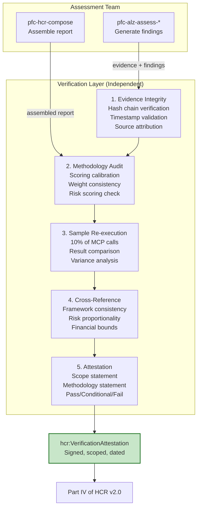

---

## 12. Continuous Assurance Loop

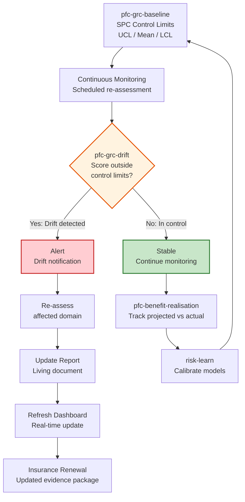

---

## 13. Cross-Framework Correlation Architecture

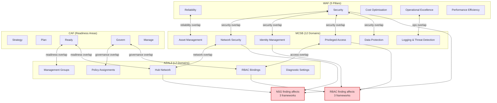

---

## 14. Skill Inventory Summary

### 14.1 By Skill Family

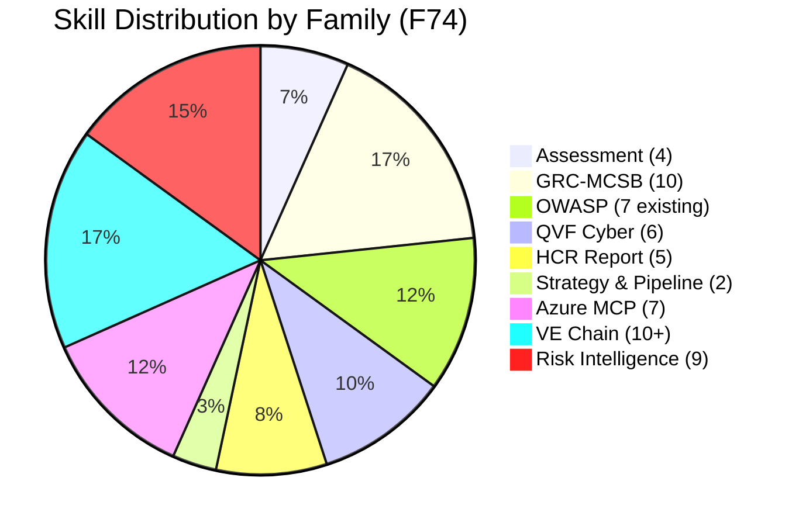

### 14.2 Skill Families Table

| Family | Skills | Epic/Feature | Status |
|---|---|---|---|
| **pfc-alz-assess** | waf, caf, cyber, health | F74.2–F74.5 | Scaffold |
| **pfc-grc-mcsb** | assess, benchmark, migrate, policy, report, posture, plan, remediate, baseline, drift | F74.20 | Scaffold |
| **pfc-qvf-cyber** | cyber-impact, threat-econ, breach-model, cyber-insure, grc-roi, grc-value | F74.22–F74.24 | Scaffold |
| **pfc-hcr** | compose, analyse, verify, dashboard, roadmap | F74.25 | Scaffold |
| **pfc-alz-strategy** | strategy | F74.17 | Scaffold |
| **pfc-alz-pipeline** | pipeline (orchestrator) | F74.18 | Scaffold |
| **pfc-owasp** | agentic, llm, pipeline, code-review, web, threat-model, ext-agamm | Epic 37 | Candidate |
| **risk-*** | profile, score, balance, update, report, learn, waive, pfc-ve-prioritise, pfc-cga | Epic 73 | Candidate |
| **azure-*** | resource-lookup, validate, compliance, rbac, diagnostics, kusto, visualizer | External MCP | MCP |

---

## 15. Deployment Architecture

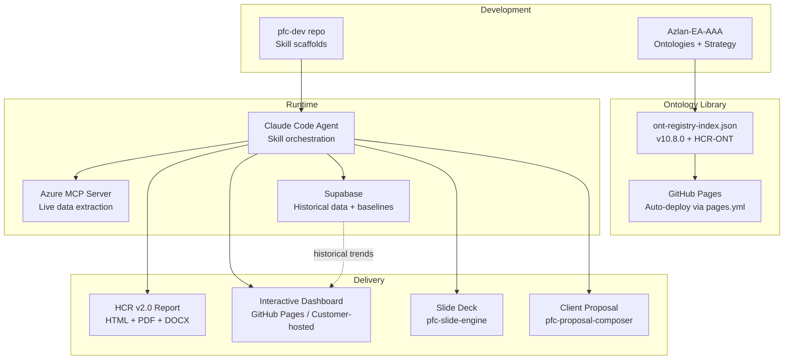

---

*PFI-AIRL-GRC-ARCH-Azure-Assessment-ALZ-Healthcheck-Architecture-v1.0.0*
*Epic 74 (#1074) — Product Architecture*
