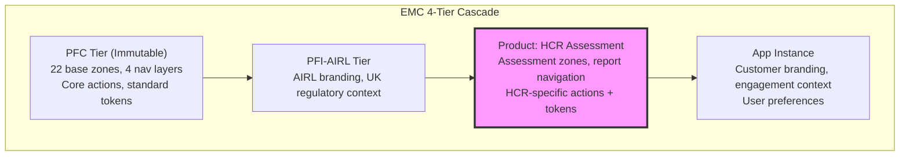
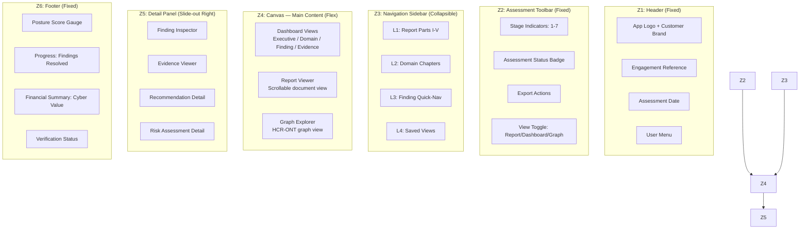
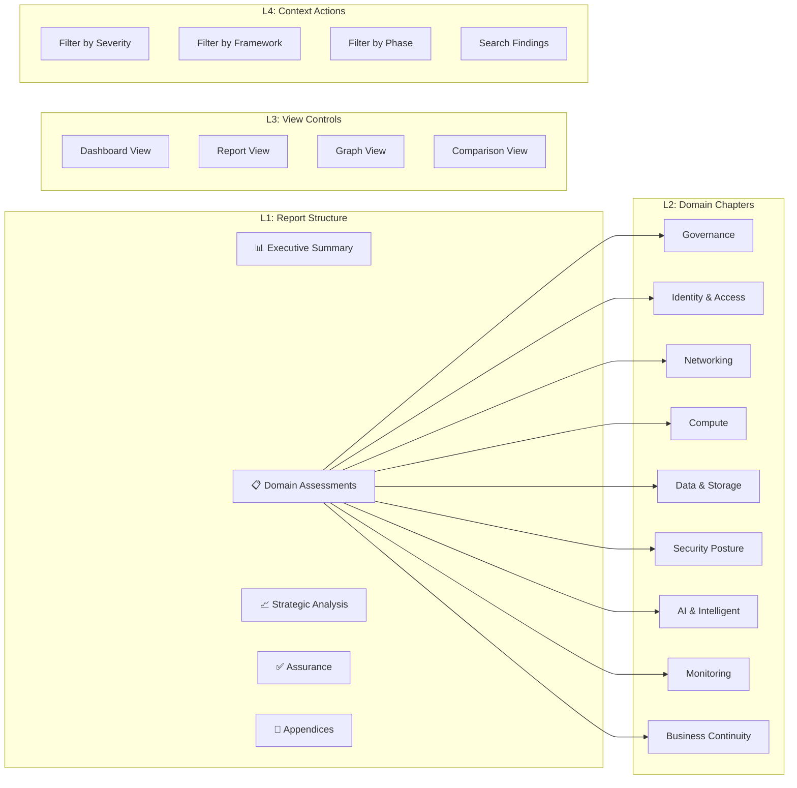
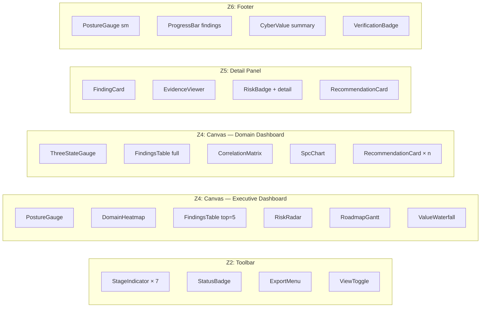
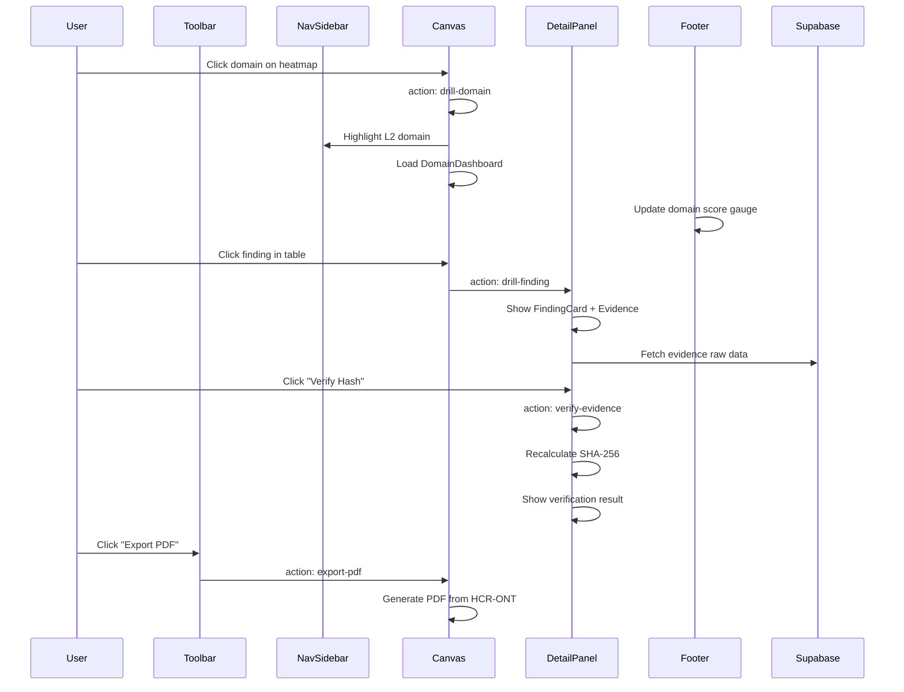
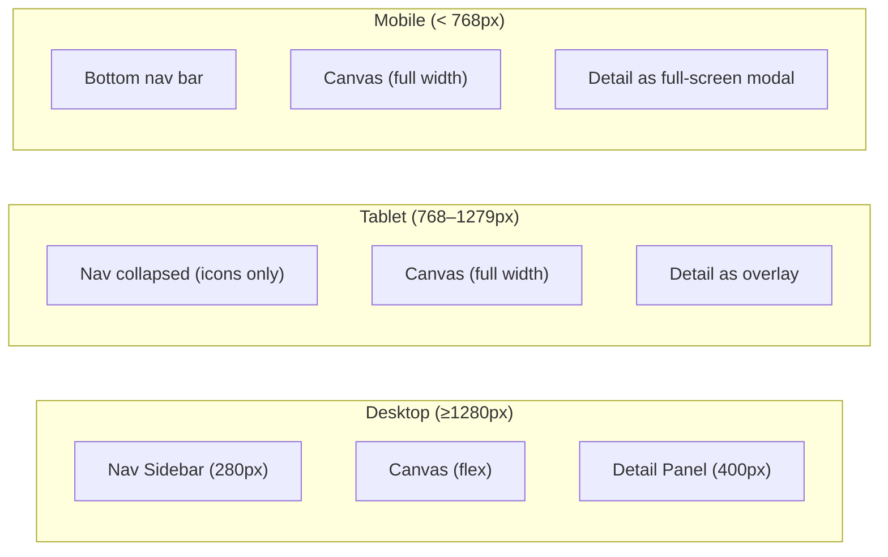
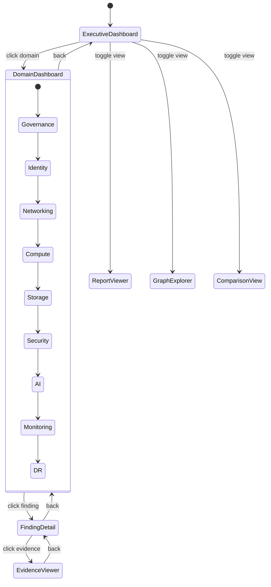
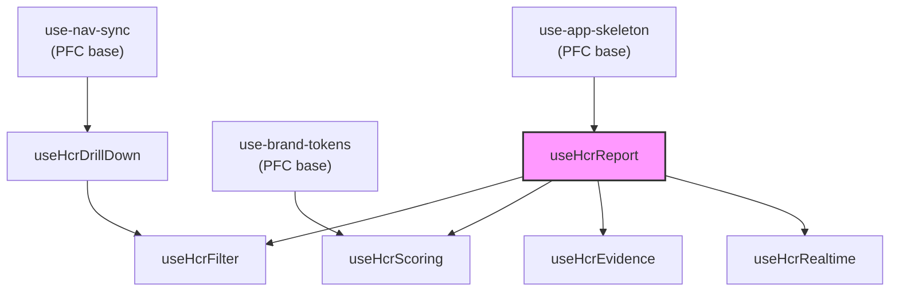

# PFI-AIRL-GRC-ARCH — HCR App Skeleton & UI/UX Architecture

**Document ID:** PFI-AIRL-GRC-ARCH-HCR-App-Skeleton-UI-UX-v1.0.0
**Date:** 2026-03-13
**Epic:** [Epic 74 (#1074)](https://github.com/ajrmooreuk/Azlan-EA-AAA/issues/1074), [Epic 65 (TS/React Skeleton)](https://github.com/ajrmooreuk/Azlan-EA-AAA/issues/965)
**Status:** Active
**Audience:** UI/UX Designers, Frontend Developers, Platform Architects

---

## 1. Overview

The HCR App Skeleton extends the PFC base app skeleton (`pfc-app-skeleton-v1.0.0.jsonld`) at the PFI-AIRL Product tier to support the Azure Assessment Health Check Report dashboard. It defines zones, navigation, components, actions, and design tokens specific to the HCR product.



---

## 2. Zone Architecture

### 2.1 HCR Zone Map



### 2.2 Zone Definitions (DS-ONT JSONLD)

```json
{
  "@context": {
    "ds": "https://platformcore.io/ontology/ds/",
    "hcr": "https://platformcore.io/ontology/hcr/"
  },
  "@id": "ds:hcr-app-skeleton-v1.0.0",
  "@type": "ds:AppSkeletonInstance",
  "version": "1.0.0",
  "ds:cascadeTier": "Product",
  "ds:extendsBase": "ds:pfc-app-skeleton-v1.0.0",
  "ds:productId": "hcr-assessment",
  "@graph": [
    {
      "@id": "ds:app-hcr-assessment",
      "@type": "ds:Application",
      "ds:appId": "hcr-assessment",
      "ds:appName": "Azure Assessment Health Check Report",
      "ds:version": "1.0.0",
      "ds:cascadeTier": "Product",
      "ds:baseApplication": "ds:app-pfc-visualiser"
    },
    {
      "@id": "ds:zone-HCR-toolbar",
      "@type": "ds:AppZone",
      "ds:zoneId": "Z2-HCR",
      "ds:zoneName": "Assessment Toolbar",
      "ds:zoneType": "Fixed",
      "ds:position": "top",
      "ds:overrides": "ds:zone-Z2",
      "ds:cascadeTier": "Product",
      "ds:components": [
        "ds:comp-stage-indicators",
        "ds:comp-status-badge",
        "ds:comp-export-menu",
        "ds:comp-view-toggle"
      ]
    },
    {
      "@id": "ds:zone-HCR-nav",
      "@type": "ds:AppZone",
      "ds:zoneId": "Z3-HCR",
      "ds:zoneName": "Report Navigation",
      "ds:zoneType": "Collapsible",
      "ds:position": "left",
      "ds:defaultWidth": "280px",
      "ds:overrides": "ds:zone-Z3",
      "ds:cascadeTier": "Product"
    },
    {
      "@id": "ds:zone-HCR-canvas",
      "@type": "ds:AppZone",
      "ds:zoneId": "Z4-HCR",
      "ds:zoneName": "Assessment Canvas",
      "ds:zoneType": "Flex",
      "ds:position": "center",
      "ds:overrides": "ds:zone-Z4",
      "ds:cascadeTier": "Product",
      "ds:defaultView": "dashboard-executive"
    },
    {
      "@id": "ds:zone-HCR-detail",
      "@type": "ds:AppZone",
      "ds:zoneId": "Z5-HCR",
      "ds:zoneName": "Detail Panel",
      "ds:zoneType": "SlideOut",
      "ds:position": "right",
      "ds:defaultWidth": "400px",
      "ds:cascadeTier": "Product",
      "ds:initialState": "collapsed"
    },
    {
      "@id": "ds:zone-HCR-footer",
      "@type": "ds:AppZone",
      "ds:zoneId": "Z6-HCR",
      "ds:zoneName": "Status Footer",
      "ds:zoneType": "Fixed",
      "ds:position": "bottom",
      "ds:defaultHeight": "48px",
      "ds:cascadeTier": "Product"
    }
  ]
}
```

---

## 3. Navigation Architecture

### 3.1 Navigation Layers



### 3.2 Navigation JSONLD

```json
[
  {
    "@id": "ds:nav-HCR-L1-report",
    "@type": "ds:NavLayer",
    "ds:layerId": "L1-HCR",
    "ds:layerName": "Report Structure",
    "ds:layerLevel": 1,
    "ds:cascadeTier": "Product",
    "ds:items": [
      {
        "@id": "ds:nav-item-exec-summary",
        "ds:label": "Executive Summary",
        "ds:icon": "chart-bar",
        "ds:targetView": "dashboard-executive",
        "ds:badge": { "ds:type": "score", "ds:binding": "hcr:Report.overallScore" }
      },
      {
        "@id": "ds:nav-item-domains",
        "ds:label": "Domain Assessments",
        "ds:icon": "layers",
        "ds:expandable": true,
        "ds:children": "ds:nav-HCR-L2-domains"
      },
      {
        "@id": "ds:nav-item-strategic",
        "ds:label": "Strategic Analysis",
        "ds:icon": "trending-up",
        "ds:targetView": "strategic-analysis"
      },
      {
        "@id": "ds:nav-item-assurance",
        "ds:label": "Assurance & Verification",
        "ds:icon": "shield-check",
        "ds:targetView": "assurance",
        "ds:badge": { "ds:type": "status", "ds:binding": "hcr:VerificationAttestation.attestationStatus" }
      }
    ]
  },
  {
    "@id": "ds:nav-HCR-L2-domains",
    "@type": "ds:NavLayer",
    "ds:layerId": "L2-HCR",
    "ds:layerName": "Domain Chapters",
    "ds:layerLevel": 2,
    "ds:cascadeTier": "Product",
    "ds:dynamicBinding": "hcr:ReportSection",
    "ds:sortBy": "ds:order",
    "ds:badgeBinding": "hcr:ReportSection.currentScore",
    "ds:colorBinding": "hcr:ReportSection.riskRating"
  }
]
```

---

## 4. Component Architecture

### 4.1 Component Hierarchy

```mermaid
graph TD
    subgraph "Layout Components"
        LC1[HcrShell<br/>App frame + zones]
        LC2[HcrToolbar<br/>Stage indicators + actions]
        LC3[HcrNavSidebar<br/>L1-L4 navigation]
        LC4[HcrCanvas<br/>View router]
        LC5[HcrDetailPanel<br/>Slide-out inspector]
        LC6[HcrFooter<br/>Status bar]
    end

    subgraph "Dashboard Components"
        DC1[PostureGauge<br/>Circular 0-100%]
        DC2[DomainHeatmap<br/>RAG grid]
        DC3[RiskRadar<br/>Multi-axis chart]
        DC4[RoadmapGantt<br/>Phase timeline]
        DC5[ValueWaterfall<br/>Financial breakdown]
        DC6[SpcChart<br/>Control limits]
        DC7[TrendSparkline<br/>Inline mini-chart]
        DC8[CorrelationMatrix<br/>Framework overlap]
    end

    subgraph "Data Components"
        DD1[FindingsTable<br/>Sortable, filterable]
        DD2[FindingCard<br/>Summary card]
        DD3[EvidenceViewer<br/>Raw data + hash]
        DD4[RecommendationCard<br/>Priority + effort + value]
        DD5[RiskBadge<br/>Critical/High/Med/Low]
        DD6[ScoreGauge<br/>Three-state mini]
        DD7[FrameworkTag<br/>WAF/MCSB/CAF/AZALZ chip]
    end

    subgraph "Report Components"
        RC1[ReportViewer<br/>Scrollable document]
        RC2[SectionRenderer<br/>Per HCR-ONT section]
        RC3[ExecutiveSummary<br/>Part I layout]
        RC4[DomainChapter<br/>Part II per domain]
        RC5[StrategicAnalysis<br/>Part III layout]
        RC6[AssuranceSection<br/>Part IV layout]
    end

    LC1 --> LC2 & LC3 & LC4 & LC5 & LC6
    LC4 --> DC1 & DC2 & DC3 & DC4 & DD1
    LC4 --> RC1 --> RC2 --> RC3 & RC4 & RC5 & RC6
    LC5 --> DD2 & DD3 & DD4
```



### 4.2 Component Props (TypeScript Interfaces)

```typescript
// PostureGauge — circular gauge (compliance-reporter pattern)
interface PostureGaugeProps {
  score: number;             // 0–100
  label: string;             // "Overall Posture" | domain name
  size?: 'sm' | 'md' | 'lg';
  showTrend?: boolean;       // sparkline underneath
  trendData?: number[];      // historical scores
}

// DomainHeatmap — RAG grid of all domains
interface DomainHeatmapProps {
  sections: HcrReportSection[];  // from HCR-ONT
  onDomainClick: (sectionId: string) => void;
  showScores?: boolean;
  colorScale?: 'rag' | 'gradient';
}

// FindingsTable — sortable, filterable data table
interface FindingsTableProps {
  findings: HcrFinding[];
  sortBy?: 'severity' | 'risk' | 'gap' | 'vePriority';
  filterFramework?: string[];
  filterSeverity?: string[];
  onFindingClick: (findingId: string) => void;
}

// ThreeStateGauge — current / desired / best practice
interface ThreeStateGaugeProps {
  current: number;
  desired: number;
  bestPractice: number;
  domain: string;
  showGap?: boolean;
}

// RiskHeatmap — impact × likelihood matrix
interface RiskHeatmapProps {
  findings: HcrFinding[];
  onCellClick: (impact: number, likelihood: number) => void;
}

// EvidenceViewer — raw data with hash verification
interface EvidenceViewerProps {
  evidence: HcrEvidence;
  showHash?: boolean;
  showAuditTrail?: boolean;
  verificationStatus: 'verified' | 'unverified' | 'disputed';
}

// RoadmapGantt — backcasted phase timeline
interface RoadmapGanttProps {
  roadmap: HcrRoadmap;
  showMilestones?: boolean;
  showInvestment?: boolean;
  highlightPhase?: number;
}

// ValueWaterfall — financial breakdown chart
interface ValueWaterfallProps {
  riskReduction: number;
  insuranceSavings: number;
  complianceValue: number;
  operationalValue: number;
  grcCost: number;
  currency?: string;
}
```

### 4.3 Component-to-Zone Mapping



---

## 5. Action Architecture

### 5.1 HCR Actions

```json
[
  {
    "@id": "ds:action-drill-domain",
    "@type": "ds:Action",
    "ds:actionId": "drill-domain",
    "ds:label": "Drill into Domain",
    "ds:functionRef": "navigateToDomain",
    "ds:parameterType": "hcr:ReportSection.sectionId",
    "ds:trigger": "click",
    "ds:sourceZone": "Z4-HCR",
    "ds:targetView": "dashboard-domain"
  },
  {
    "@id": "ds:action-drill-finding",
    "@type": "ds:Action",
    "ds:actionId": "drill-finding",
    "ds:label": "View Finding Detail",
    "ds:functionRef": "openFindingDetail",
    "ds:parameterType": "hcr:Finding.findingId",
    "ds:trigger": "click",
    "ds:sourceZone": "Z4-HCR",
    "ds:targetZone": "Z5-HCR"
  },
  {
    "@id": "ds:action-export-pdf",
    "@type": "ds:Action",
    "ds:actionId": "export-pdf",
    "ds:label": "Export PDF",
    "ds:functionRef": "exportReport",
    "ds:parameterType": "format:pdf",
    "ds:trigger": "click",
    "ds:sourceZone": "Z2-HCR"
  },
  {
    "@id": "ds:action-filter-severity",
    "@type": "ds:Action",
    "ds:actionId": "filter-severity",
    "ds:label": "Filter by Severity",
    "ds:functionRef": "applyFilter",
    "ds:parameterType": "severity:Critical|High|Medium|Low",
    "ds:trigger": "select"
  },
  {
    "@id": "ds:action-toggle-view",
    "@type": "ds:Action",
    "ds:actionId": "toggle-view",
    "ds:label": "Switch View",
    "ds:functionRef": "setCanvasView",
    "ds:parameterType": "view:dashboard|report|graph|comparison",
    "ds:trigger": "click",
    "ds:sourceZone": "Z2-HCR"
  },
  {
    "@id": "ds:action-verify-evidence",
    "@type": "ds:Action",
    "ds:actionId": "verify-evidence",
    "ds:label": "Verify Evidence Hash",
    "ds:functionRef": "verifyEvidenceHash",
    "ds:parameterType": "hcr:Evidence.evidenceId",
    "ds:trigger": "click",
    "ds:sourceZone": "Z5-HCR"
  }
]
```

### 5.2 Action Flow



---

## 6. Design Token Architecture

### 6.1 HCR Token Cascade

```mermaid
graph TD
    subgraph "PFC Primitives (Immutable)"
        P1["--viz-color-green-500: #22c55e"]
        P2["--viz-color-amber-500: #f59e0b"]
        P3["--viz-color-red-500: #ef4444"]
        P4["--viz-spacing-md: 16px"]
        P5["--viz-radius-md: 8px"]
    end

    subgraph "PFI-AIRL Semantics"
        S1["--airl-surface-default: #ffffff"]
        S2["--airl-accent-primary: #1e40af"]
        S3["--airl-text-primary: #1e293b"]
    end

    subgraph "HCR Product Tokens (NEW)"
        H1["--hcr-score-excellent: var(--viz-color-green-500)"]
        H2["--hcr-score-good: #86efac"]
        H3["--hcr-score-adequate: var(--viz-color-amber-500)"]
        H4["--hcr-score-poor: #fb923c"]
        H5["--hcr-score-critical: var(--viz-color-red-500)"]
        H6["--hcr-gauge-bg: #f1f5f9"]
        H7["--hcr-gauge-track: #e2e8f0"]
        H8["--hcr-evidence-verified: #22c55e"]
        H9["--hcr-evidence-unverified: #94a3b8"]
        H10["--hcr-evidence-disputed: #ef4444"]
        H11["--hcr-phase-1: #3b82f6"]
        H12["--hcr-phase-2: #8b5cf6"]
        H13["--hcr-phase-3: #06b6d4"]
        H14["--hcr-phase-4: #22c55e"]
        H15["--hcr-risk-critical: #991b1b"]
        H16["--hcr-risk-high: #dc2626"]
        H17["--hcr-risk-medium: #f59e0b"]
        H18["--hcr-risk-low: #22c55e"]
    end

    P1 & P2 & P3 --> H1 & H3 & H5
    S1 & S2 & S3 --> H6 & H7
```



### 6.2 Score Color Scale

| Score | Rating | Token | Value |
|---|---|---|---|
| 90–100% | Excellent | `--hcr-score-excellent` | `#22c55e` (Green) |
| 70–89% | Good | `--hcr-score-good` | `#86efac` (Light Green) |
| 50–69% | Adequate | `--hcr-score-adequate` | `#f59e0b` (Amber) |
| 30–49% | Poor | `--hcr-score-poor` | `#fb923c` (Orange) |
| 0–29% | Critical | `--hcr-score-critical` | `#ef4444` (Red) |

### 6.3 CSS Custom Properties

```css
/* HCR Product Tokens — applied at :root or [data-product="hcr"] */
:root[data-product="hcr"] {
  /* Scoring */
  --hcr-score-excellent: var(--viz-color-green-500);
  --hcr-score-good: #86efac;
  --hcr-score-adequate: var(--viz-color-amber-500);
  --hcr-score-poor: #fb923c;
  --hcr-score-critical: var(--viz-color-red-500);

  /* Gauge */
  --hcr-gauge-bg: var(--viz-surface-muted);
  --hcr-gauge-track: var(--viz-border-default);
  --hcr-gauge-size-sm: 48px;
  --hcr-gauge-size-md: 120px;
  --hcr-gauge-size-lg: 200px;

  /* Evidence verification */
  --hcr-evidence-verified: var(--viz-color-green-500);
  --hcr-evidence-unverified: var(--viz-color-slate-400);
  --hcr-evidence-disputed: var(--viz-color-red-500);

  /* Roadmap phases */
  --hcr-phase-1: var(--viz-color-blue-500);
  --hcr-phase-2: var(--viz-color-violet-500);
  --hcr-phase-3: var(--viz-color-cyan-500);
  --hcr-phase-4: var(--viz-color-green-500);

  /* Risk levels */
  --hcr-risk-critical: #991b1b;
  --hcr-risk-high: #dc2626;
  --hcr-risk-medium: var(--viz-color-amber-500);
  --hcr-risk-low: var(--viz-color-green-500);

  /* Layout */
  --hcr-nav-width: 280px;
  --hcr-detail-width: 400px;
  --hcr-footer-height: 48px;
  --hcr-toolbar-height: 56px;
}
```

---

## 7. Responsive Layout

### 7.1 Breakpoints



### 7.2 Layout CSS Grid

```css
.hcr-shell {
  display: grid;
  grid-template-areas:
    "toolbar toolbar toolbar"
    "nav     canvas  detail"
    "footer  footer  footer";
  grid-template-columns: var(--hcr-nav-width) 1fr var(--hcr-detail-width);
  grid-template-rows: var(--hcr-toolbar-height) 1fr var(--hcr-footer-height);
  height: 100vh;
}

.hcr-shell[data-detail="collapsed"] {
  grid-template-columns: var(--hcr-nav-width) 1fr 0;
}

.hcr-shell[data-nav="collapsed"] {
  grid-template-columns: 56px 1fr var(--hcr-detail-width);
}

@media (max-width: 1279px) {
  .hcr-shell {
    grid-template-columns: 56px 1fr 0;
  }
}

@media (max-width: 767px) {
  .hcr-shell {
    grid-template-areas:
      "toolbar"
      "canvas"
      "footer";
    grid-template-columns: 1fr;
    grid-template-rows: var(--hcr-toolbar-height) 1fr 56px;
  }
}
```

---

## 8. View Router Architecture

### 8.1 Canvas Views



### 8.2 View Registry

```typescript
const HCR_VIEWS: ViewRegistry = {
  'dashboard-executive': {
    component: ExecutiveDashboard,
    zone: 'Z4-HCR',
    title: 'Executive Dashboard',
    breadcrumb: ['Report'],
    dataBinding: 'hcr:Report',
  },
  'dashboard-domain': {
    component: DomainDashboard,
    zone: 'Z4-HCR',
    title: (params) => `Domain: ${params.sectionName}`,
    breadcrumb: ['Report', 'Domains', '{sectionName}'],
    dataBinding: 'hcr:ReportSection',
    params: ['sectionId'],
  },
  'finding-detail': {
    component: FindingDetail,
    zone: 'Z5-HCR',
    title: (params) => `Finding: ${params.findingId}`,
    dataBinding: 'hcr:Finding',
    params: ['findingId'],
  },
  'evidence-viewer': {
    component: EvidenceViewer,
    zone: 'Z5-HCR',
    title: 'Evidence',
    dataBinding: 'hcr:Evidence',
    params: ['evidenceId'],
  },
  'report-viewer': {
    component: ReportViewer,
    zone: 'Z4-HCR',
    title: 'Report View',
    dataBinding: 'hcr:Report',
  },
  'graph-explorer': {
    component: GraphExplorer,
    zone: 'Z4-HCR',
    title: 'Graph Explorer',
    dataBinding: 'hcr:Report',
  },
  'strategic-analysis': {
    component: StrategicAnalysis,
    zone: 'Z4-HCR',
    title: 'Strategic Analysis',
    dataBinding: 'hcr:Roadmap',
  },
  'assurance': {
    component: AssuranceView,
    zone: 'Z4-HCR',
    title: 'Assurance & Verification',
    dataBinding: 'hcr:VerificationAttestation',
  },
};
```

---

## 9. React Hook Architecture

### 9.1 HCR-Specific Hooks

```typescript
// useHcrReport — load and manage HCR-ONT report data
function useHcrReport(reportId: string): {
  report: HcrReport | null;
  sections: HcrReportSection[];
  findings: HcrFinding[];
  roadmap: HcrRoadmap | null;
  loading: boolean;
  error: Error | null;
  refresh: () => Promise<void>;
}

// useHcrDrillDown — manage dashboard drill-down state
function useHcrDrillDown(): {
  level: 0 | 1 | 2 | 3;
  currentView: string;
  breadcrumb: string[];
  drillTo: (view: string, params?: Record<string, string>) => void;
  drillBack: () => void;
  drillToRoot: () => void;
}

// useHcrFilter — manage finding filters
function useHcrFilter(): {
  filters: HcrFilterState;
  setFilter: (key: string, value: string[]) => void;
  clearFilters: () => void;
  filteredFindings: HcrFinding[];
  activeFilterCount: number;
}

// useHcrScoring — three-state scoring calculations
function useHcrScoring(sectionId: string): {
  current: number;
  desired: number;
  bestPractice: number;
  gapToDesired: number;
  gapToBest: number;
  rating: 'excellent' | 'good' | 'adequate' | 'poor' | 'critical';
  colorToken: string;
}

// useHcrEvidence — evidence with hash verification
function useHcrEvidence(findingId: string): {
  evidence: HcrEvidence[];
  verifyHash: (evidenceId: string) => Promise<VerifyResult>;
  loading: boolean;
}

// useHcrRealtime — Supabase real-time subscriptions
function useHcrRealtime(reportId: string): {
  latestScore: number;
  driftAlerts: DriftAlert[];
  lastUpdated: Date;
}
```

### 9.2 Hook Dependencies



---

## 10. Technology Stack

| Layer | Technology | Purpose |
|---|---|---|
| **Framework** | React 18 + TypeScript | Component rendering, type safety |
| **State** | React hooks + context | HCR report state, drill-down, filters |
| **Styling** | CSS custom properties + Tailwind | DS-ONT token cascade + utility classes |
| **Charts** | vis-network + Chart.js | Graph views + gauges/charts |
| **Real-time** | Supabase JS client | Live dashboard updates |
| **Build** | Vite | Zero-config, fast HMR |
| **Test** | Vitest + React Testing Library | Component + integration tests |
| **Export** | html2pdf.js + docx.js | PDF and DOCX generation |
| **Deploy** | GitHub Pages / Customer-hosted | Static site deploy |

---

*PFI-AIRL-GRC-ARCH-HCR-App-Skeleton-UI-UX-v1.0.0*
*Epic 74 (#1074) + Epic 65 (TS/React Skeleton)*
