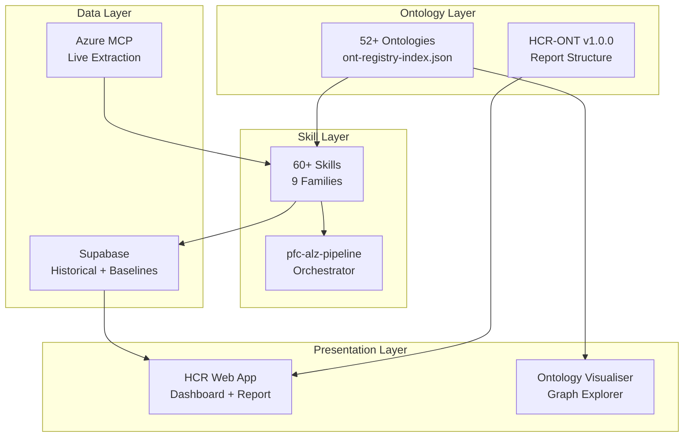
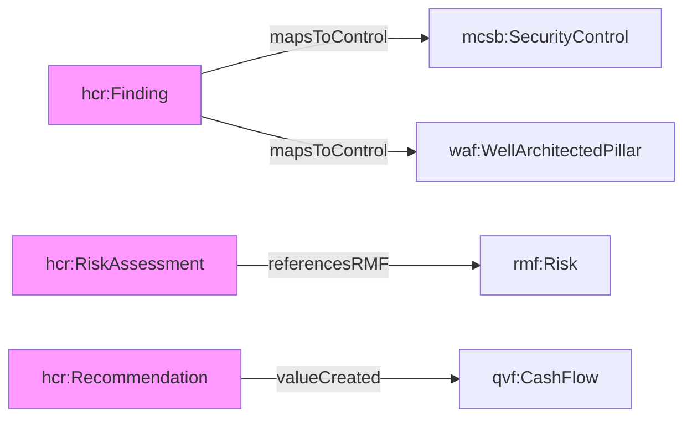
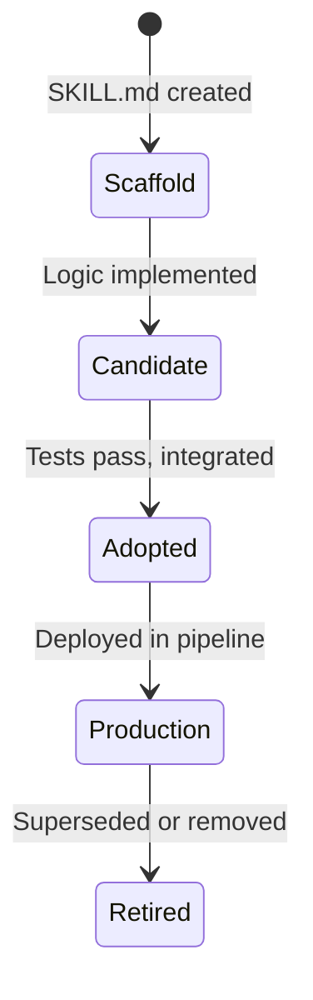
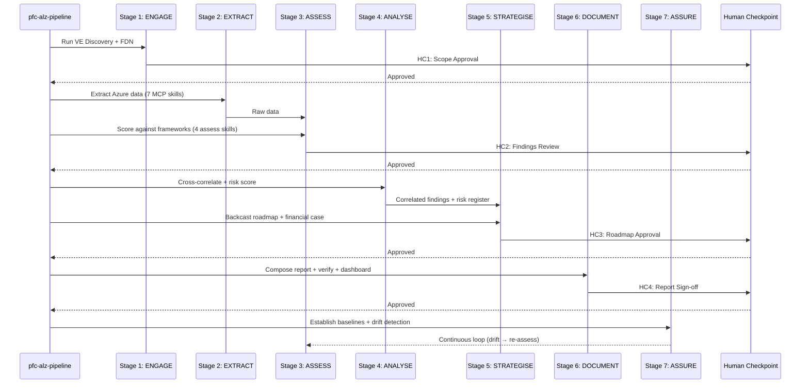
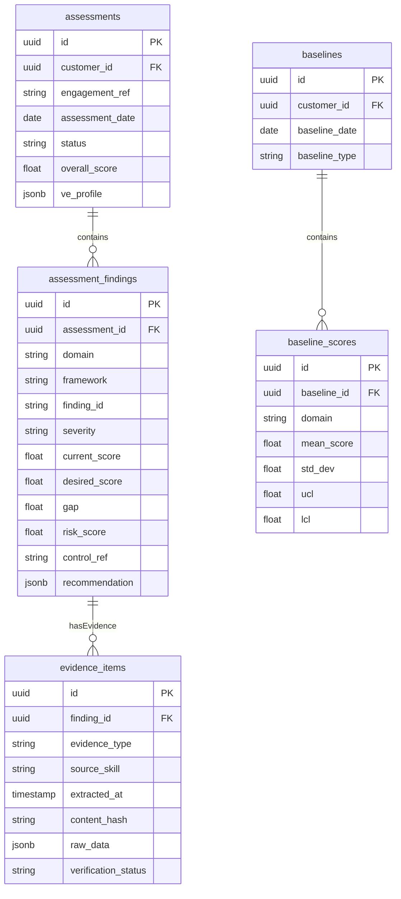
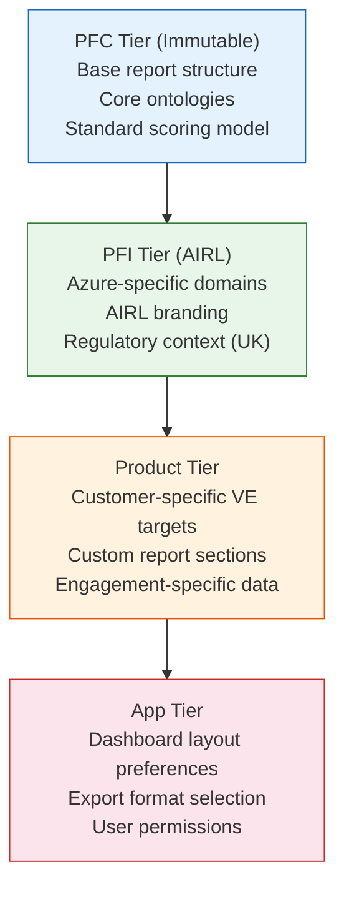

# PFI-AIRL-GRC-GUIDE — Azure Assessment & ALZ Healthcheck Architect Guide

**Document ID:** PFI-AIRL-GRC-GUIDE-Azure-Assessment-Architect-Guide-v1.0.0
**Date:** 2026-03-13
**Epic:** [Epic 74 (#1074)](https://github.com/ajrmooreuk/Azlan-EA-AAA/issues/1074)
**Status:** Active
**Audience:** Platform Architects, Skill Developers, Ontology Engineers

---

## 1. Architecture Overview

This guide is the technical companion to the [Architecture Document](PFI-AIRL-GRC-ARCH-Azure-Assessment-ALZ-Healthcheck-Architecture-v1.0.0.md). It covers how to extend, customise, and maintain the Azure Assessment product architecture.



---

## 2. Ontology Architecture

### 2.1 Ontology Registry

All ontologies are registered in `PBS/ONTOLOGIES/ontology-library/ont-registry-index.json` (v10.8.0). HCR-ONT will be added to the RCSG series or a new Reporting series.

### 2.2 HCR-ONT Design Principles

| Principle | Implementation |
|---|---|
| **Graph-native** | Every report element is a node with typed relationships |
| **Composable** | Report sections can be assembled, reordered, filtered via EMC rules |
| **Cascadable** | PFC base report structure, PFI customisation, Product override |
| **Cross-referenced** | Every finding links to source ontology control (MCSB/WAF/CAF/AZALZ) |
| **Evidence-chained** | Every finding → evidence → hash → timestamp → verification |
| **Queryable** | Report data is structured, not prose — enables dashboard generation |

### 2.3 Adding a New Ontology Entity to HCR-ONT

```text
1. Define entity in HCR-ONT JSONLD:
   {
     "@id": "hcr:NewEntity",
     "@type": "owl:Class",
     "rdfs:label": "New Entity",
     "rdfs:comment": "Purpose of this entity",
     "hcr:properties": [ ... ]
   }

2. Define relationships:
   {
     "@id": "hcr:newRelationship",
     "@type": "owl:ObjectProperty",
     "rdfs:domain": "hcr:Finding",
     "rdfs:range": "hcr:NewEntity"
   }

3. Add business rule (BR-HCR-NNN):
   Constraint on when/how the entity is used

4. Update ont-registry-index.json (bump version)
5. Run vitest: npx vitest run (2081+ tests must pass)
6. Update HCR-ONT architecture diagrams
```

### 2.4 Cross-Ontology Bridge Pattern

When HCR-ONT references entities from other ontologies:



Use `@context` prefixes — never inline full URIs:
```json
{
  "@context": {
    "hcr": "https://platformcore.io/ontology/hcr/",
    "mcsb": "https://platformcore.io/ontology/mcsb/",
    "rmf": "https://platformcore.io/ontology/rmf/",
    "qvf": "https://platformcore.io/ontology/qvf/"
  }
}
```

---

## 3. Skill Architecture

### 3.1 Skill Lifecycle



### 3.2 Creating a New Skill

1. **Create directory** in `pfc-dev/skills/<family>/<skill-name>/`
2. **Write SKILL.md** with:
   - Skill ID, version, type (AUTONOMOUS/SUPERVISED/ORCHESTRATOR)
   - Feature and Epic reference
   - Purpose, inputs, process, outputs
   - Ontology surface (which ontologies it reads/writes)
   - Downstream consumers
3. **Register** in `skills-register-index.json`
4. **Implement** logic (TypeScript or ES module)
5. **Test** with TDD data sets
6. **Wire** into pipeline (pfc-alz-pipeline Stage N)

### 3.3 Skill Type Reference

| Type | Human Needed | Use Case |
|---|---|---|
| `AGENT_AUTONOMOUS` | No (except critical escalation) | Data extraction, scoring, baseline calculation |
| `AGENT_SUPERVISED` | Yes (approval checkpoint) | Strategy, roadmap, financial case, report sign-off |
| `AGENT_ORCHESTRATOR` | No (orchestration only) | Pipeline coordination, stage sequencing |

### 3.4 Skill Input/Output Contract

Every skill must declare:

```typescript
interface SkillContract {
  id: string;                          // e.g., "pfc-hcr-compose"
  version: string;                     // semver
  type: "AUTONOMOUS" | "SUPERVISED" | "ORCHESTRATOR";

  inputs: {
    required: OntologyRef[];           // ontology entities consumed
    optional: OntologyRef[];
  };

  outputs: {
    produces: OntologyRef[];           // ontology entities produced
    stores: SubabaseRef[];             // Supabase tables written
  };

  ontologySurface: string[];           // ontology IDs referenced
  downstreamConsumers: string[];       // skill IDs that consume output
}
```

### 3.5 Pipeline Orchestration Pattern



---

## 4. Data Architecture

### 4.1 Supabase Schema (Epic 59)



### 4.2 Evidence Hash Chain

```text
Evidence Integrity:
  hash = SHA-256(raw_data + timestamp + source_skill)
  chain = SHA-256(previous_hash + current_hash)

Verification:
  pfc-hcr-verify recalculates hash from raw data
  If hash_stored ≠ hash_calculated → evidence tampered → flag
```

---

## 5. Extending the Architecture

### 5.1 Adding a New Assessment Domain

To add a domain (e.g., "AI Workloads"):

1. **Ontology:** Add entities to relevant ONT (MCSB2-ONT for AI controls)
2. **Assessment skill:** Create `pfc-alz-assess-ai` in assessment family
3. **Scoring model:** Add domain to three-state scoring (best practice/current/desired)
4. **HCR-ONT:** Add `hcr:ReportSection` for the new domain
5. **Report template:** Add Part II chapter (e.g., Chapter 10: AI & Intelligent Workloads)
6. **Dashboard:** Add domain to heatmap, create domain dashboard view
7. **Cross-framework:** Map correlations to existing frameworks
8. **Tests:** Add TDD data set (TD-ALZ-AI)
9. **Pipeline:** Wire into pfc-alz-pipeline Stage 3

### 5.2 Adding a New Financial Model

To add a financial calculation:

1. **QVF-ONT:** Extend with new `qvf:CashFlow` category if needed
2. **Skill:** Create in `pfc-qvf-cyber/` family
3. **Inputs:** Map to existing ontology entities (don't create new ones if avoidable)
4. **Outputs:** Produce `qvf:CashFlow` entries consumed by `pfc-qvf-grc-value`
5. **Report:** Wire into HCR Part III §15 (Financial Analysis)

### 5.3 Adding a New Framework

To add a compliance framework (e.g., DORA):

1. **Ontology:** Create DORA-ONT in RCSG-Series
2. **Registry:** Add to `ont-registry-index.json`
3. **Assessment:** Create assessment skill or extend `pfc-alz-assess-cyber`
4. **Cross-framework:** Add correlation mappings to `pfc-hcr-analyse`
5. **Report:** Add to Part III §13 (regulatory mapping)
6. **Breach model:** Add regulatory fine calculation to `pfc-qvf-breach-model`

### 5.4 PFI Customisation Pattern



---

## 6. Testing Strategy

### 6.1 Test Data Sets

| Data Set | Purpose | Assessment Profile |
|---|---|---|
| TD-ALZ-GOLD | Gold-standard compliant LZ | All domains >90%, no critical findings |
| TD-ALZ-DRIFT | Gold + injected drift | Configuration, policy, RBAC, topology drift |
| TD-ALZ-GREENFIELD | Empty tenant | Zero scores, maximum gap |
| TD-ALZ-LEGACY | Classic hub-spoke | Mixed maturity, legacy patterns |
| TD-ALZ-MULTI | Multi-subscription | Varied maturity per subscription |
| TD-ALZ-REGULATED | Regulated sector | NCSC CAF, MCSB strict, GDPR |
| TD-ALZ-AI | AI workloads | MCSB v2 AI controls, OWASP agentic/LLM |
| TD-HCR-GOLD | Complete report | All sections populated, all evidence verified |
| TD-HCR-PARTIAL | Partial report | Some domains assessed, roadmap incomplete |
| TD-QVF-CYBER-BREACH | Breach cost model | Multiple threat scenarios with cost components |

### 6.2 Running Tests

```bash
cd PBS/TOOLS/ontology-visualiser
npx vitest run
# Expected: 2081+ tests passing
```

### 6.3 Validation Checklist for New Skills

- [ ] SKILL.md follows template (ID, version, type, feature, epic)
- [ ] Ontology surface declared (all consumed/produced entities)
- [ ] Downstream consumers listed
- [ ] Input/output contract defined
- [ ] Test data set exists or created
- [ ] Integrated into pipeline stage
- [ ] Registered in skills-register-index.json

---

## 7. Operational Runbook

### 7.1 Common Issues

| Issue | Cause | Resolution |
|---|---|---|
| MCP extraction timeout | Large tenant, slow API | Increase timeout, use incremental extraction |
| Score drift between runs | Environment changed | Compare timestamps, check for deployment between runs |
| Evidence hash mismatch | Data modified after extraction | Re-extract from source, verify no tampering |
| Dashboard not loading | Supabase connection | Check Supabase project status, API key validity |
| Report generation slow | Large finding set | Paginate findings, generate per-domain then merge |

### 7.2 Monitoring

| Metric | Threshold | Alert |
|---|---|---|
| Overall posture score | Below SPC LCL | Drift alert → re-assess |
| Evidence verification rate | < 95% | Quality alert → review extraction |
| Dashboard response time | > 3s | Performance alert → optimise queries |
| Supabase row count | > 80% of plan | Capacity alert → archive or upgrade |

---

*PFI-AIRL-GRC-GUIDE-Azure-Assessment-Architect-Guide-v1.0.0*
*Epic 74 (#1074)*
