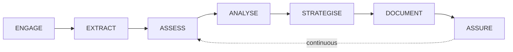

# PFI-AIRL-GRC-GUIDE — Azure Assessment & ALZ Healthcheck User Guide

**Document ID:** PFI-AIRL-GRC-GUIDE-Azure-Assessment-User-Guide-v1.0.0
**Date:** 2026-03-13
**Epic:** [Epic 74 (#1074)](https://github.com/ajrmooreuk/Azlan-EA-AAA/issues/1074)
**Status:** Active
**Audience:** Consultants, Engagement Leads, Customer-Facing Teams

---

## 1. What Is the Azure Assessment?

The AIRL Azure Assessment is a 7-stage GRC engagement that evaluates a customer's Azure environment against WAF, CAF, MCSB, and AZALZ frameworks, producing a verified Health Check Report with financial case and strategic roadmap.



**Deliverables:**
- Health Check Report v2.0 (interactive HTML + PDF + DOCX)
- Executive Dashboard with 4-level drill-down
- Backcasted Strategic Roadmap (4 phases)
- Financial Investment Case (ALE, ROI, insurance impact)
- Independently Verified Evidence Pack

---

## 2. Getting Started

### 2.1 Prerequisites

| Requirement | Detail |
|---|---|
| Azure tenant access | Read-only (Reader + Security Reader roles) |
| Customer engagement | Signed SOW with scope definition |
| VE Discovery complete | VSOM, OKR, KPI, VP, Kano — defines desired destination |
| FDN context | pfc-org-context + pfc-org-mat completed |
| Claude Code agent | Configured with Azure MCP Server access |

### 2.2 Engagement Kickoff Checklist

- [ ] Customer SOW signed, engagement reference assigned
- [ ] Azure tenant credentials provisioned (read-only)
- [ ] VE Discovery session complete — desired destination scores set
- [ ] FDN Foundation series populated (org context, maturity, risk appetite)
- [ ] pfc-delta-scope completed — engagement boundaries defined
- [ ] Human Checkpoint HC1: **Scope Approval** signed off

---

## 3. Stage-by-Stage Workflow

### 3.1 Stage 1: ENGAGE (Week 1)

**What happens:** Establish engagement context, run VE Discovery, define desired destination.

**Skills used:**
- `pfc-foundation-pipeline` — org context, maturity assessment
- VE Chain: VSOM → OKR → KPI → VP → Kano
- `pfc-delta-scope` — engagement boundaries

**Your actions:**
1. Run Foundation pipeline with customer stakeholders
2. Facilitate VE Discovery workshop
3. Document desired destination scores per domain
4. Define risk appetite via `erm:RiskAppetite`
5. Submit for **HC1: Scope Approval**

**Output:** Engagement context, VE profile, desired destination targets

---

### 3.2 Stage 2: EXTRACT (Week 2)

**What happens:** Azure MCP Server extracts live data from customer tenant.

**Skills used:** 7 Azure MCP skills (resource-lookup, validate, compliance, rbac, diagnostics, kusto, resource-visualizer)

**Your actions:**
1. Confirm Azure credentials are active
2. Trigger extraction pipeline
3. Monitor extraction progress (autonomous — no intervention needed)
4. Review extracted resource inventory

**Output:** Raw Azure data (resources, policies, RBAC, logs, config)

> **Note:** This stage is fully autonomous once credentials are provisioned. The agent handles all MCP calls.

---

### 3.3 Stage 3: ASSESS (Week 2–3)

**What happens:** Four assessment skills score the extracted data against frameworks.

**Skills used:**
- `pfc-alz-assess-waf` — WAF 5 pillars (Reliability, Security, Cost, Ops, Performance)
- `pfc-alz-assess-caf` — CAF readiness (Strategy, Plan, Ready, Govern, Manage)
- `pfc-alz-assess-cyber` — MCSB 12 domains + OWASP + AI security
- `pfc-alz-assess-health` — AZALZ healthcheck (drift detection, policy compliance)

**Your actions:**
1. Monitor scoring progress
2. Review initial findings summary
3. Flag any findings needing customer context
4. Submit for **HC2: Findings Review**

**Output:** Scored findings per domain with three-state gaps

---

### 3.4 Stage 4: ANALYSE (Week 3)

**What happens:** Cross-domain correlation, risk assessment, systemic pattern identification.

**Skills used:**
- `pfc-hcr-analyse` — cross-framework correlation
- `rmf risk-score` — RMF-IS27005 risk assessment per finding
- `pfc-gap-analysis` — structured gap analysis

**Your actions:**
1. Review correlation matrix (which findings affect multiple frameworks)
2. Validate risk scores with customer context
3. Identify root causes (single fix → multiple improvements)
4. Confirm systemic patterns with technical stakeholders

**Output:** Correlated findings, risk register, systemic pattern report

---

### 3.5 Stage 5: STRATEGISE (Week 3–4)

**What happens:** Generate backcasted roadmap and financial case.

**Skills used:**
- `pfc-alz-strategy` — gap analysis, backcasting, OKRs
- `pfc-hcr-roadmap` — phased roadmap with investment model
- `pfc-qvf-cyber-impact` — ALE calculation
- `pfc-qvf-grc-roi` — investment ROI
- `pfc-qvf-cyber-insure` — insurance premium impact
- `pfc-qvf-grc-value` — unified Cyber Value Equation

**Your actions:**
1. Review backcasted roadmap (4 phases)
2. Validate investment estimates with customer budget constraints
3. Review financial case (ALE, ROI, insurance)
4. Submit for **HC3: Roadmap Approval**

**Output:** Strategic roadmap, OKR framework, investment case, Cyber Value Equation

---

### 3.6 Stage 6: DOCUMENT (Week 4–5)

**What happens:** Compose report, verify evidence, generate dashboards.

**Skills used:**
- `pfc-hcr-compose` — assemble Health Check Report v2.0
- `pfc-hcr-verify` — independent verification
- `pfc-hcr-dashboard` — interactive dashboard views
- `pfc-narrative` + `pfc-slide-engine` + `pfc-proposal-composer`

**Your actions:**
1. Review draft report (all 5 parts)
2. Review verification attestation
3. Test dashboard drill-down (executive → domain → finding → evidence)
4. Present to customer
5. Submit for **HC4: Report Sign-off**

**Output:** HCR v2.0 (HTML + PDF + DOCX), interactive dashboard, slide deck

---

### 3.7 Stage 7: ASSURE (Ongoing)

**What happens:** Establish baselines, activate drift detection, track benefits.

**Skills used:**
- `pfc-grc-baseline` — SPC control limits
- `pfc-grc-drift` — continuous drift detection
- `pfc-benefit-realisation` — projected vs actual tracking
- `risk-learn` — model calibration from actuals

**Your actions:**
1. Confirm SPC baselines established
2. Configure drift detection thresholds
3. Schedule re-assessment cadence
4. Monitor benefit realisation dashboard
5. Prepare insurance renewal evidence package

**Output:** Living report, drift alerts, benefit tracking, insurance evidence

---

## 4. Understanding the Report

### 4.1 Report Structure

| Part | Content | Audience |
|---|---|---|
| **Part I** | Executive Summary — scorecard, strategic recommendation | C-suite, Board |
| **Part II** | Domain Assessments — 9 chapters, each scored with findings | Technical leads |
| **Part III** | Strategic Analysis — risk, financial, roadmap | CTO, CISO, Finance |
| **Part IV** | Assurance & Verification — evidence, attestation | Audit, Compliance |
| **Part V** | Appendices — inventory, full recommendations, evidence pack | Technical team |

### 4.2 Reading the Three-State Scores

```text
Best Practice    ████████████████████  95%   ← Industry benchmark
Desired State    ████████████████░░░░  80%   ← Your target (from VE)
Current State    ████████░░░░░░░░░░░░  42%   ← Where you are now

Gap to Desired:  38 points  ← What we need to close
Gap to Best:     53 points  ← Distance to industry best
```

### 4.3 Reading the Risk Scores

| Rating | Score | Meaning | Action |
|---|---|---|---|
| Critical | 19–25 | Immediate action required | Phase 1 quick wins |
| High | 13–18 | Plan mitigation | Phase 1–2 |
| Medium | 7–12 | Monitor and schedule | Phase 2–3 |
| Low | 1–6 | Accept or review | Phase 3–4 |

### 4.4 Reading the Financial Case

| Metric | What It Means |
|---|---|
| **ALE** | Annual expected loss from cyber threats (£/year) |
| **ΔALE** | Risk reduction value (ALE before − ALE after remediation) |
| **GRC ROI** | Return on investment: (ΔALE − cost) / cost × 100 |
| **Payback** | Months until investment pays for itself |
| **Insurance ΔPremium** | Annual premium saving from improved posture |
| **Cyber Value** | Total value = risk reduction + insurance + compliance + ops − cost |

---

## 5. Using the Dashboard

### 5.1 Executive View (Level 0)

The landing page shows:
- **Posture gauge** — overall score (0–100%, colour-coded)
- **Domain heatmap** — RAG per domain at a glance
- **Top 5 findings** — most critical items requiring attention
- **Risk radar** — multi-axis chart showing risk profile
- **Roadmap timeline** — Gantt chart of 4 phases
- **Cyber Value** — headline £ figure

**Click any domain** to drill into Level 1.

### 5.2 Domain View (Level 1)

Shows detail for one domain (e.g., Security):
- Three-state gauge (current / desired / best practice)
- Findings table (sortable by severity, risk, priority)
- Cross-framework view (how findings map to other frameworks)
- SPC control chart (if historical data exists)

**Click any finding** to drill into Level 2.

### 5.3 Finding View (Level 2)

Shows a single finding:
- Description, severity, control reference
- Current state vs desired state
- RMF risk assessment
- Remediation recommendation (effort, cost, expected improvement)
- Evidence chain

**Click evidence** to drill into Level 3.

### 5.4 Evidence View (Level 3)

Shows raw evidence:
- KQL result, policy JSON, or config snapshot
- Source MCP call, timestamp, hash
- Verification status (verified / unverified)

---

## 6. Frequently Asked Questions

**Q: How long does a full assessment take?**
A: 4–5 weeks for initial assessment. Stage 7 (Assure) is ongoing.

**Q: Can we run just a healthcheck without the full assessment?**
A: Yes — Stage 2 + Stage 3 (pfc-alz-assess-health only) produces a focused ALZ healthcheck in ~1 week.

**Q: What if we don't have VE Discovery data?**
A: The assessment runs with best-practice defaults as the desired destination. VE Discovery makes the roadmap customer-specific rather than generic.

**Q: How often should we re-run the assessment?**
A: Quarterly full re-assessment recommended. Continuous drift detection runs between assessments.

**Q: Can the report be customised for our branding?**
A: Yes — DS-ONT brand tokens cascade from PFI tier. Customer logo, colours, and typography are applied automatically.

**Q: How do we share the dashboard with our insurance broker?**
A: Export a PDF snapshot or grant read-only access to the hosted dashboard URL.

---

*PFI-AIRL-GRC-GUIDE-Azure-Assessment-User-Guide-v1.0.0*
*Epic 74 (#1074)*
