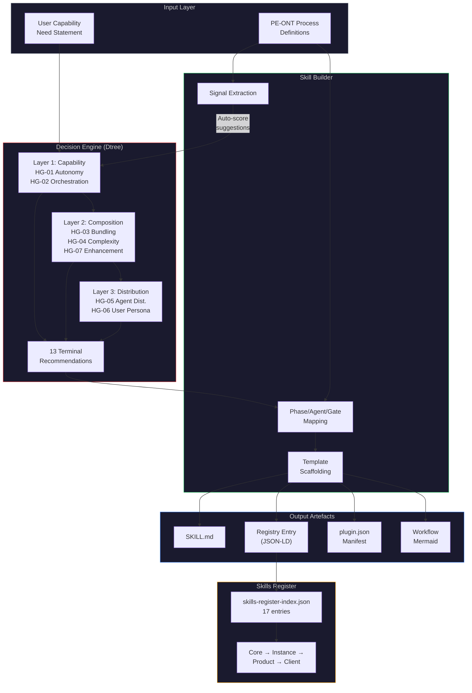
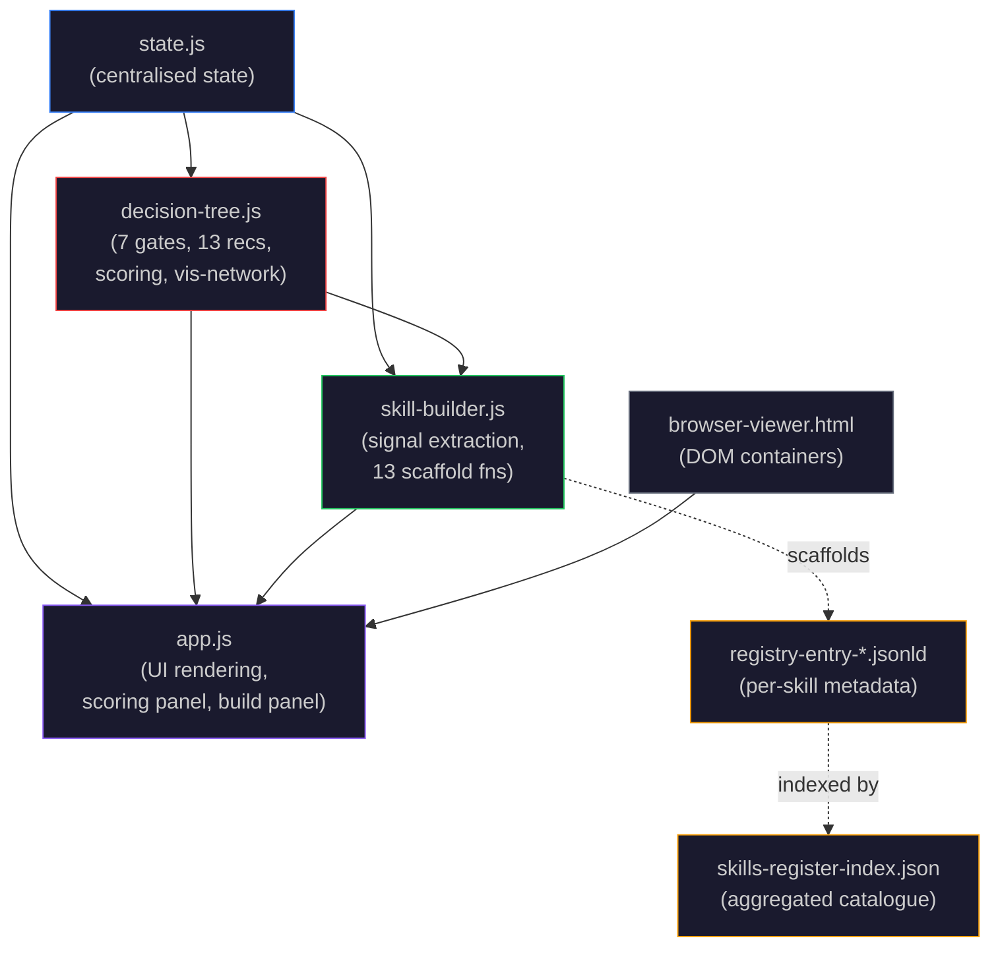

> ✅ **PFC-Dev Copy** | Sourced from [Azlan-EA-AAA](https://github.com/ajrmooreuk/pfc-dev/blob/main/docs/strategy/PFC-SKBLD-ARCH-Skill-Building-Capability-v1.0.0.md) on 2026-03-14. Canonical version lives in the Azlan monorepo.

# PFC-SKBLD: Skill Building Capability — Architecture

**Product Code:** PFC-SKBLD (Skill Builder)
**Version:** 1.0.0
**Date:** 2026-03-07
**Scope:** Platform Foundation Core (PFC) — Agents, Skills, Plugins
**Features:** F40.1 (Extensibility Decision Engine), F34.11 (Process-to-Skill Scaffolding), F40.24 (Skill Builder UI)
**Parent Epics:** Epic 34 (#518), Epic 40 (#577), Epic 49 (#747)

---

## 1. Executive Summary

The PFC Skill Building Capability is the platform's mechanism for determining, scaffolding, cataloguing, and distributing automation artefacts — **Skills**, **Plugins**, and **Agents**. It comprises three tightly integrated subsystems:

| Subsystem | Module | Purpose |
|-----------|--------|---------|
| **Dtree Engine** | `decision-tree.js` (944 lines) | 7-gate hypothesis-testing engine that routes capability needs to 1 of 13 terminal recommendations |
| **Skill Builder** | `skill-builder.js` (718 lines) | PE-ONT process signal extraction + template scaffolding for all 13 recommendation types |
| **Skills Register** | `skills-register-index.json` | Aggregated index of all registered skills, agents, and plugins (17 entries) |

Together these enable a **Define → Evaluate → Scaffold → Register** pipeline that converts PE-ONT process definitions into deployable automation artefacts.

---

## 2. Architecture Overview



---

## 3. The Three-Layer Decision Engine (Dtree)

### 3.1 Gate Model

The Dtree organises **7 hypothesis gates** across **3 decision layers**. Each gate has 4 weighted evaluation criteria scored 0-10. The normalised score formula:

```
normalizedScore = sum(weight_i × score_i) / sum(weight_i × 10) × 10
```

| Layer | Gates | Architectural Question |
|-------|-------|----------------------|
| **L1: Capability** | HG-01 (Autonomy), HG-02 (Orchestration) | Is this an Agent or Skill? |
| **L2: Composition** | HG-03 (Bundling), HG-04 (Complexity), HG-07 (Enhancement) | How should it be packaged? |
| **L3: Distribution** | HG-05 (Agent Dist.), HG-06 (User Persona) | Who consumes it? |

### 3.2 Gate Routing Rules

| Gate | PASS (>=7) | PARTIAL (4-6.9) | FAIL (<4) |
|------|-----------|-----------------|-----------|
| HG-01 | → HG-02 | → HG-03 | → HG-04 |
| HG-02 | AGENT_ORCHESTRATOR → HG-05 | AGENT_SPECIALIST → HG-05 | AGENT_UTILITY → HG-05 |
| HG-03 | → HG-06 | → HG-07 | SKILL_STANDALONE |
| HG-04 | SKILL_STANDALONE | SKILL_SIMPLE | NO_ACTION |
| HG-05* | PLUGIN_COWORK_WITH_AGENT (>=8) | PLUGIN_CC_WITH_AGENT (>=6) | AGENT_STANDALONE (<6) |
| HG-06 | PLUGIN_COWORK (>=7) | — | PLUGIN_CLAUDECODE (<7) |
| HG-07 | SKILL_WITH_MCP (>=7) | — | PLUGIN_LIGHTWEIGHT (<7) |

*HG-05 uses 3-tier thresholds: pass_with_gui (>=8), pass_dev_only (>=6), fail (<6)

### 3.3 Thirteen Terminal Recommendations

| Key | Label | Complexity | Effort | Template |
|-----|-------|-----------|--------|----------|
| `AGENT_ORCHESTRATOR` | Full Agent (Orchestrator) | High | 2-4 weeks | Agent Template v6.1 S0-S14 |
| `AGENT_SPECIALIST` | Full Agent (Specialist) | Medium-High | 1-2 weeks | Agent Template v6.1 domain-specific |
| `AGENT_UTILITY` | Full Agent (Utility) | Medium | 3-5 days | Simplified Agent (T1+S6) |
| `AGENT_STANDALONE` | Standalone Agent | Medium | 3-5 days | Agent Template (no plugin) |
| `SKILL_STANDALONE` | Standalone Skill | Low-Medium | 1-3 days | SKILL.md + YAML + scripts |
| `SKILL_SIMPLE` | Simple Skill | Low | Hours | SKILL.md frontmatter only |
| `SKILL_WITH_MCP` | Skill + MCP | Medium | 3-5 days | SKILL.md + MCP config |
| `PLUGIN_CLAUDECODE` | Claude Code Plugin | Medium-High | 1-2 weeks | plugin.json + commands/skills |
| `PLUGIN_COWORK` | Cowork Plugin | Medium-High | 1-2 weeks | plugin.json + connectors |
| `PLUGIN_COWORK_WITH_AGENT` | Cowork + Agent | High | 3-4 weeks | Agent + Plugin + Cowork UI |
| `PLUGIN_CLAUDECODE_WITH_AGENT` | CC Plugin + Agent | High | 2-3 weeks | Agent + Plugin packaging |
| `PLUGIN_LIGHTWEIGHT` | Lightweight Plugin | Low-Medium | 2-3 days | Minimal plugin.json |
| `NO_ACTION_INLINE_PROMPTING` | No Extensibility | None | None | Inline prompting guidance |

---

## 4. Skill Builder — Process-to-Artefact Pipeline

### 4.1 Core Thesis (JP-PE-SK-001)

Every well-defined PE-ONT process is a potential skill, plugin, or agent. The PE-Series ontologies provide the **structural definition** (what), the Dtree provides the **mechanism selection** (how), and the Unified Registry provides the **catalogue** (where).

### 4.2 Signal Extraction

`extractProcessSignals()` maps PE process characteristics to Dtree criterion scores:

| PE Process Field | Gate | Criterion | Score Heuristic |
|------------------|------|-----------|-----------------|
| `automationLevel` (0-100%) | HG-01 | C0 (ambiguity) | >50 → `round(level/10)`, else `round(level/15)` |
| `AIAgent[].autonomyLevel` | HG-01 | C1 (decisions) | highly-auto=9, hybrid=7, supervised=5, manual=2 |
| `processType` | HG-01 | C2 (state) | discovery/optimization=7, analysis=6, governance=5 |
| `AIAgent[].length` | HG-01 | C3 (coordinates) | >2 agents=8, >0=5, 0=1 |
| `ProcessPhase[].parallelExecution` | HG-02 | C1 (parallel) | any parallel=7, else=3 |
| `ProcessGate[].automated` | HG-04 | C3 (quality) | automated gates=8, else=4 |
| `ProcessPattern[].length` | HG-04 | C2 (repeatable) | patterns exist=8, else=3 |

### 4.3 Template Scaffolding

13 scaffold functions map PE entities to output artefacts:

```
pe:Process     → YAML frontmatter (processName, objective)
pe:ProcessPhase → Workflow sections (activities, entry/exit conditions)
pe:ProcessGate  → Quality checkpoints (criteria, threshold)
pe:AIAgent     → Agent capabilities (type, autonomy, model)
pe:ProcessArtifact → Expected outputs (name, type, format)
pe:ProcessMetric → Success metrics (target, unit, frequency)
pe:ProcessPattern → Best practices (context, problem, solution)
```

### 4.4 PE-ONT v4.0.0 Evolution

PE-ONT v4.0.0 formalises what was previously inferred heuristically:

| v3.0.0 (current) | v4.0.0 (planned) |
|---|---|
| Skills inferred from `agent.capabilities` string | `pe:Skill` first-class entity with typed I/O |
| Plugins scaffolded as ad-hoc `plugin.json` | `pe:Plugin` entity with cascade tier |
| Single-process scaffolding only | `pe:ProcessPath` / `pe:PathStep` / `pe:PathLink` for cross-series paths |

The Dtree engine itself (7 gates, 13 recommendations) is unchanged — only the input quality improves.

---

## 5. Skills Register — Current Inventory

### 5.1 Registry Structure

The skills register lives at `skills/skills-register-index.json` (v1.0.0). Each skill also has an individual `registry-entry-v1.0.0.jsonld` in its subfolder.

### 5.2 Classification Taxonomy

| Classification | Count | Description |
|---------------|-------|-------------|
| `SKILL_STANDALONE` | 13 | Self-contained SKILL.md with optional scripts |
| `AGENT_STANDALONE` | 2 | Autonomous agents without plugin wrapper |
| `AGENT_ORCHESTRATOR` | 1 | Multi-agent pipeline orchestrator |
| `PLUGIN_LIGHTWEIGHT` | 1 | Minimal plugin packaging |
| **Total** | **17** | |

### 5.3 Complete Skills Catalogue

| ID | Skill Name | Display Name | Classification | Category |
|----|-----------|-------------|----------------|----------|
| SKL-001 | `pfc-efs` | Epic-Feature-Story Generator | SKILL_STANDALONE | foundation |
| SKL-002 | `pfc-org-context` | Organization Context Builder | SKILL_STANDALONE | foundation |
| SKL-003 | `pfc-macro-analysis` | Macro Environment & Scenario Planner | SKILL_STANDALONE | analysis |
| SKL-004 | `pfc-industry-analysis` | Competitive Environment Analyser | SKILL_STANDALONE | analysis |
| SKL-005 | `pfc-vsom` | Vision-Strategy-Objectives-Metrics + BSC | SKILL_STANDALONE | strategy |
| SKL-006 | `pfc-okr` | OKR Cascade Generator | SKILL_STANDALONE | execution |
| SKL-007 | `pfc-kpi` | KPI Definition & BSC Classification | SKILL_STANDALONE | measurement |
| SKL-008 | `pfc-vp` | Value Proposition Builder | SKILL_STANDALONE | value |
| SKL-009 | `pfc-ve-pipeline` | Value Engineering Process Orchestrator | AGENT_STANDALONE | orchestrator |
| SKL-010 | `pfc-delta-scope` | Discovery Scoping & Stakeholder Mapping | SKILL_STANDALONE | delta |
| SKL-011 | `pfc-delta-evaluate` | Comparative Gap Analysis & Quantification | SKILL_STANDALONE | delta |
| SKL-012 | `pfc-delta-leverage` | Lever Analysis & Recommendations | SKILL_STANDALONE | delta |
| SKL-013 | `pfc-delta-narrate` | VE-SC Transformation Narrative | SKILL_STANDALONE | delta |
| SKL-014 | `pfc-delta-adapt` | Variance Analysis & Cycle Adaptation | SKILL_STANDALONE | delta |
| SKL-015 | `pfc-delta-pipeline` | DELTA Process Orchestrator | AGENT_STANDALONE | orchestrator |
| SKL-016 | `pfc-dmaic-ve` | DMAIC Pipeline Orchestrator with VE | AGENT_ORCHESTRATOR | orchestrator |
| PLG-001 | `pfc-reason` | Structured Reasoning Plugin | PLUGIN_LIGHTWEIGHT | plugin |

### 5.4 Skills by Pipeline

```
VE Pipeline (SKL-009 orchestrates):
  ORG-CONTEXT (SKL-002) → MACRO (SKL-003) → INDUSTRY (SKL-004) → VSOM (SKL-005) → OKR (SKL-006) → KPI (SKL-007) → VP (SKL-008)

DELTA Pipeline (SKL-015 orchestrates):
  SCOPE (SKL-010) → EVALUATE (SKL-011) → LEVERAGE (SKL-012) → NARRATE (SKL-013) → ADAPT (SKL-014)

DMAIC-VE Pipeline (SKL-016 orchestrates):
  DMAIC Define → Measure → Analyse → Improve → Control (with VE integration)

Foundation:
  EFS (SKL-001) — Epic-Feature-Story generation
  REASON (PLG-001) — Structured reasoning plugin
```

### 5.5 Cascade Model

All artefacts follow the 4-tier PFC cascade:

```
PFC Core (shared platform skills)
  └── PFI Instance (e.g. BAIV, W4M-WWG, AIRL)
       └── Product (e.g. AI Visibility Audit)
            └── Client (e.g. Acme Corp custom)
```

Currently all 17 registered skills operate at **PFC Core** scope. PFI instance-specific skills exist in concept (e.g. BAIV discovery agents) but are not yet formally registered.

---

## 6. Module Dependency Graph



| Module | Lines | Key Exports |
|--------|-------|-------------|
| `decision-tree.js` | 944 | `GATES`, `RECOMMENDATIONS`, `calculateNormalizedScore()`, `advanceGate()`, `renderDecisionTreeGraph()`, `generateDecisionRecord()`, `generateMermaidPath()` |
| `skill-builder.js` | 718 | `extractProcessSignals()`, `prefillDTFromProcess()`, `mapPhasesToSections()`, `mapAgentsToCapabilities()`, `scaffoldFromRecommendation()`, `buildRegistryArtifact()` |
| `state.js` | 8 Dtree + 8 SB props | `dtActiveGateId`, `dtCompletedGates`, `dtPath`, `dtFinalRecommendation`, `skillBuilderOpen`, `skillBuilderSelectedProcess` |
| `app.js` | ~200 lines added | `_renderDecisionTreeView()`, `_renderDTScoringContent()`, `_openSkillBuildPanel()`, `_generateSkillTemplate()` |

---

## 7. JSON-LD Artefact Schemas

### 7.1 Decision Record (`dt:AutomationDecisionRecord`)

Exported by `generateDecisionRecord()` after completing a Dtree evaluation:

```json
{
  "@type": "dt:AutomationDecisionRecord",
  "@id": "dt:decision-<timestamp>",
  "dt:problemStatement": "...",
  "dt:evaluator": "...",
  "dt:gateResults": [{ "dt:gateId": "HG-01", "dt:normalizedScore": 7.2, "dt:outcome": "PASS" }],
  "dt:path": ["HG-01", "HG-02", "HG-05"],
  "dt:recommendation": { "dt:key": "AGENT_STANDALONE", "dt:complexity": "Medium" }
}
```

### 7.2 Registry Entry (`pfc:RegistryArtifact`)

Produced by `buildRegistryArtifact()` when scaffolding a template:

```json
{
  "@type": "pfc:RegistryArtifact",
  "@id": "pfc:skill-<name>-v1.0.0",
  "pfc:artifactType": "skill|agent|plugin",
  "pfc:scope": "core|instance|product|client",
  "pfc:derivedFromProcess": "pe:<processId>",
  "pfc:decisionRecord": "dt:decision-<timestamp>",
  "pfc:recommendation": "SKILL_STANDALONE",
  "pfc:components": ["SKILL.md"],
  "pfc:dependencies": ["PE-ONT", "VP-ONT"]
}
```

---

## 8. Test Coverage

| Suite | Tests | File |
|-------|-------|------|
| Dtree Scoring Engine | ~25 | `tests/decision-tree.test.js` |
| Dtree Path Traversal | ~15 | `tests/decision-tree.test.js` |
| Process Signal Extraction | 7 | `tests/skill-builder.test.js` |
| Heuristic Scoring | 5 | `tests/skill-builder.test.js` |
| Dtree Prefill Integration | 3 | `tests/skill-builder.test.js` |
| Phase/Agent/Gate Mapping | 10 | `tests/skill-builder.test.js` |
| Template Scaffolding (13 recs) | 12 | `tests/skill-builder.test.js` |
| Registry Artifact Output | 2 | `tests/skill-builder.test.js` |
| Mermaid Workflow Export | 2 | `tests/skill-builder.test.js` |
| Edge Cases + Entities | 5 | `tests/skill-builder.test.js` |
| Skills Register Index | varies | `tests/skills-register.test.js` |
| **Total** | **~86** | |

All tests run via `npx vitest run` from the visualiser directory.

---

## 9. Existing Documentation Map

| Document | Location | Scope |
|----------|----------|-------|
| **This document** | `docs/strategy/PFC-SKBLD-ARCH-Skill-Building-Capability-v1.0.0.md` | Top-level architecture (you are here) |
| Dtree + Skill Builder internals | `tools/ontology-visualiser/ARCH-DECISION-TREE.md` | Module-level arch, UI flows, state |
| PE-as-Skill-Catalogue thesis | `tools/ontology-visualiser/ARCH-PE-SKILL-CATALOGUE.md` | JP-PE-SK-001, PE coverage, cascade |
| PE v4 Skill Builder upgrade | `tools/ontology-visualiser/UPGRADE-PE-v4-SKILL-BUILDER.md` | pe:Skill, pe:Plugin, pe:ProcessPath |
| DELTA Architecture | `skills/ARCH-PFC-DELTA-v1.0.0.md` | DELTA pipeline (5 skills) |
| DELTA Ops Guide | `skills/OPERATING-GUIDE-PFC-DELTA-v1.0.0.md` | DELTA operating procedures |
| DELTA Release Bulletin | `skills/UPDATE-BULLETIN-PFC-DELTA-v1.0.0.md` | DELTA v1.0.0 release |
| EFS Architecture | `skills/pfc-efs/ARCHITECTURE-v1.0.0.md` | EFS skill internals |
| EFS Ops Guide | `skills/pfc-efs/EFSOPS-GUIDE-v1.0.0.md` | EFS operating procedures |
| EFS Release Bulletin | `skills/pfc-efs/RELEASE-BULLETIN-v1.0.0.md` | EFS v1.0.0 release |
| Unified Registry Skills Arch | `docs/strategy/BRIEFING-Epic34-Unified-Registry-Skills-Architecture.md` | Registry cascade strategy |
| Operating Guide | `docs/strategy/PFC-SKBLD-OPS-Skill-Building-Capability-v1.0.0.md` | Top-level ops guide |
| Release Bulletin | `docs/strategy/PFC-SKBLD-REL-Skill-Building-Capability-v1.0.0.md` | Consolidated release bulletin |

---

## 10. Relationship to Platform Strategy

```
Epic 34 (PF-Core Graph-Based Agentic Platform)
  └── S2: VE-Driven Everything
       └── Unified Registry + Skills Architecture
            └── This Skill Building Capability
                 ├── Dtree Engine (F40.1)
                 ├── Skill Builder (F34.11)
                 └── Skills Register (F40.24)

Epic 40 (Graphing Workbench)
  └── F40.24: Skill Builder panel in visualiser UI

Epic 49 (VSOM Skilled Application Planner)
  └── Skills as registry artefacts in application spec framework
```

---

## 11. File Reference

| File | Location | Key Functions |
|------|----------|---------------|
| `decision-tree.js:323` | `tools/ontology-visualiser/js/` | `calculateNormalizedScore()` |
| `decision-tree.js:346` | | `determineOutcome()` |
| `decision-tree.js:420` | | `advanceGate()` |
| `decision-tree.js:503` | | `generateDecisionRecord()` |
| `decision-tree.js:556` | | `generateMermaidPath()` |
| `decision-tree.js:634` | | `buildDecisionTreeGraph()` |
| `decision-tree.js:811` | | `renderDecisionTreeGraph()` |
| `skill-builder.js:59` | | `extractProcessSignals()` |
| `skill-builder.js:161` | | `prefillDTFromProcess()` |
| `skill-builder.js:183` | | `mapPhasesToSections()` |
| `skill-builder.js:232` | | `mapAgentsToCapabilities()` |
| `app.js:5152` | | `_renderDecisionTreeView()` |
| `app.js:5263` | | `_renderDTScoringContent()` |
| `app.js:5503` | | `_openSkillBuildPanel()` |
| `app.js:5689` | | `_generateSkillTemplate()` |
| `skills-register-index.json` | `skills/` | Aggregated 24-entry index |
| `extensibility-decision-tree-v1.0.json` | `docs/strategy/` | Original Dtree data source |

---

## 12. URG — Unified Registry Graph Extension (F40.30)

The Skills Register extends into a **Unified Registry Graph (URG)** — a cross-platform resource registry that manages PFC-native, open-source, and partner-sourced skills with RBAC scoping, FairSlice attribution, and triad governance.

**Full strategy, architecture, ops, and dev guide:** `PFC-SKBLD-BRIEF-URG-OpenSource-Skill-Intake-Strategy-v1.0.0.md`
