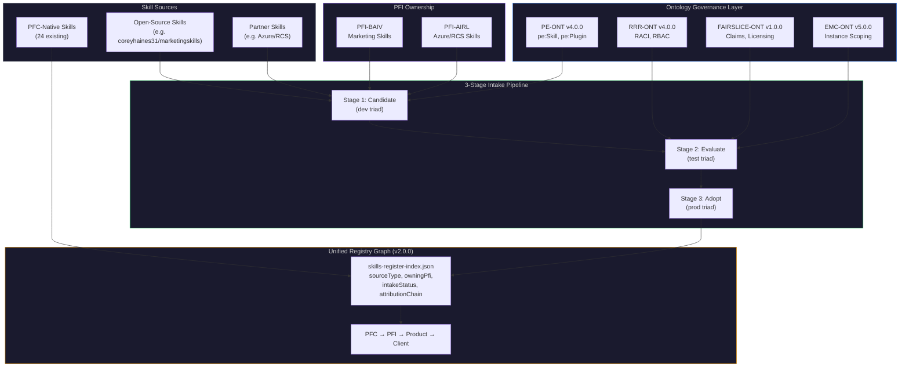

> ✅ **PFC-Dev Copy** | Sourced from [Azlan-EA-AAA](https://github.com/ajrmooreuk/pfc-dev/blob/main/docs/strategy/PFC-SKBLD-BRIEF-URG-OpenSource-Skill-Intake-Strategy-v1.0.0.md) on 2026-03-14. Canonical version lives in the Azlan monorepo.

# PFC-SKBLD-BRIEF: URG Open-Source & Partner Skill Intake Strategy

**Product Code:** PFC-SKBLD (Skill Builder)
**Version:** 1.0.0
**Date:** 2026-03-11
**Status:** Draft
**Epic Ref:** Epic 40 (#577) — Graphing Workbench Evolution
**Feature Ref:** F40.30 (#999) — URG Open-Source & Partner Skill Intake
**Dependencies:** PE-ONT v4.0.0, RRR-ONT v4.0.0, FAIRSLICE-ONT v1.0.0, EMC-ONT v5.0.0

---

## 1. Purpose

Define the intake, evaluation, and adoption process for open-source and partner-sourced resources into the PFC platform via the **Unified Registry Graph (URG)** — the platform's cross-instance resource graph that manages all PF resources and capabilities (ontologies, skills, agents, plugins, PFI instances, design systems, and more) with RBAC scoping, attribution tracking, and triad governance. This document focuses on **skill intake as the first URG use case**, proving the pattern that applies to all resource types.

---

## 2. Executive Summary

The PFC Skills Register (24 registered, 14+ unregistered skills) has matured to the point where external skill intake is the natural next step. Two intake channels are immediate:

1. **BAIV (PFI-Product-AIV)** — Marketing skills from open-source sources (e.g. `coreyhaines31/marketingskills` content-strategy family)
2. **AIRL + Azure Partner Instance** — Azure/RCS infrastructure skills, hybrid-sourced with partner-specific graph bindings

The existing ontology stack already provides the governance backbone:

| Concern | Ontology | Mechanism |
|---|---|---|
| Skill/Plugin formal definition | PE-ONT v4.0.0 | `pe:Skill`, `pe:Plugin`, JP-PE-001 |
| Roles, RACI, RBAC | RRR-ONT v4.0.0 | `rrr:FunctionalRole`, UC-002, UC-003 |
| Attribution & licensing | FAIRSLICE-ONT v1.0.0 | `fs:Claim`, `fs:License`, JP-FS-001/002 |
| Composition & instance scoping | EMC-ONT v5.0.0 | `constrainToInstanceOntologies()` |
| Cross-platform resource graph | URG | Unified Registry Graph — all PF resources |

This is a **process extension**, not a new architecture. The URG is the platform's unified graph for all PF resources and capabilities — ontologies, skills, agents, plugins, PFI instances, design systems, and data products. The Skills Register (`skills-register-index.json`) and the Ontology Registry (`ont-registry-index.json`) are both resource indices within the URG. Skill intake is the first use case that exercises URG's cross-platform provenance and attribution capabilities.

---

## 3. Core Thesis: URG as Cross-Platform Resource Graph

The URG is the **unified query surface over all PF resources and capabilities** — structurally analogous to Azure Resource Graph but spanning the entire PFC platform. Existing indices (`skills-register-index.json` for skills, `ont-registry-index.json` for ontologies) are resource-type-specific views within the URG. The URG adds three cross-cutting dimensions to every resource type:

1. **Provenance** — Where did this resource come from? (`pfc-native`, `opensource`, `partner`)
2. **Intake lifecycle** — What stage is this resource at? (`candidate`, `evaluating`, `adopted`, `rejected`)
3. **PFI ownership** — Which PFI instance is accountable? (RACI-bound via RRR-ONT)

For skills specifically, the extension to the Skills Register Index looks like this:

### 3.1 Schema Extension (Skills Register Index v2.0.0)

Existing entry fields remain unchanged. Three new fields per entry:

```json
{
  "entryId": "Entry-SKL-025",
  "skillName": "mkt-content-strategy",
  "displayName": "MKT-CONTENT-STRATEGY: Content Strategy Planner",
  "classification": "SKILL_STANDALONE",
  "version": "0.1.0",
  "status": "candidate",
  "category": "marketing",

  "sourceType": "opensource",
  "owningPfi": "PFI-BAIV",
  "intakeStatus": "candidate",
  "attributionChain": [
    {
      "source": "coreyhaines31/marketingskills",
      "license": "MIT",
      "fairsliceClaimId": null
    }
  ],

  "filePath": "skills/mkt-content-strategy/registry-entry-v0.1.0.jsonld",
  "invocation": "/azlan-github-workflow:mkt-content-strategy"
}
```

**New fields:**

| Field | Type | Values | Purpose |
|---|---|---|---|
| `sourceType` | enum | `pfc-native`, `opensource`, `partner` | Provenance tracking |
| `owningPfi` | string | `PFI-BAIV`, `PFI-AIRL`, `PFI-W4M`, etc. | RRR-RACI accountability |
| `intakeStatus` | enum | `candidate`, `evaluating`, `adopted`, `rejected` | Lifecycle stage |
| `attributionChain` | array | `[{ source, license, fairsliceClaimId }]` | FairSlice attribution link |

**Backward compatibility:** All 24 existing entries default to `sourceType: "pfc-native"`, `owningPfi: "PFC"`, `intakeStatus: "adopted"`, `attributionChain: []`. No migration required — fields are additive.

### 3.2 Summary Extension

```json
"summary": {
  "SKILL_STANDALONE": 20,
  "AGENT_STANDALONE": 2,
  "AGENT_ORCHESTRATOR": 1,
  "PLUGIN_LIGHTWEIGHT": 1,
  "bySource": {
    "pfc-native": 24,
    "opensource": 0,
    "partner": 0
  },
  "byIntakeStatus": {
    "adopted": 24,
    "candidate": 0,
    "evaluating": 0,
    "rejected": 0
  }
}
```

---

## 4. Intake Pipeline: 3-Stage Triad Process

Every external resource follows the same triad pipeline used for PFC-native resources, with additional intake-specific gates. The pipeline below is described for skills but applies equally to any URG resource type (ontologies, agents, plugins, data products, etc.).

### 4.1 Stage 1: Candidate (dev)

| Step | Action | Gate |
|---|---|---|
| 1 | Fork/import OS skill source into `skills/<skill-name>/` | — |
| 2 | Create `SKILL.md` with PFC frontmatter conventions | G1: Format compliance |
| 3 | Map to PE-ONT process type (JP-PE-001: Skill Invocation Chain) | G1: PE alignment |
| 4 | Create `registry-entry-v0.1.0.jsonld` with `intakeStatus: "candidate"` | G1: Registry entry exists |
| 5 | Add to `skills-register-index.json` with `status: "candidate"` | — |
| 6 | Register `attributionChain` with original author/license | G1: Attribution recorded |

**Owning PFI assignment:** BAIV for marketing, AIRL for Azure/infra, W4M for operational.

### 4.2 Stage 2: Evaluate (test)

| Step | Action | Gate |
|---|---|---|
| 7 | Functional review against PFC quality gates (G1-G5) | G3: Quality pass |
| 8 | PE-functional enhancements — adapt to PFC conventions, ontology bindings | G3: PE-ONT bound |
| 9 | RRR-RACI assignment — who is R, A, C, I for this skill | G3: RACI matrix |
| 10 | FairSlice claim registration — immutable original attribution + PFC enhancement slice | G3: FairSlice claim |
| 11 | Test in owning PFI dev triad (`pfi-baiv-aiv-dev`, etc.) | G4: Triad test pass |

**Key principle:** The original OS author attribution is **immutable** in the claim chain. PFC enhancements get a separate sliced claim (JP-FS-002: Claim to PE Process Verification).

### 4.3 Stage 3: Adopt (prod)

| Step | Action | Gate |
|---|---|---|
| 12 | Update `intakeStatus` to `"adopted"`, bump version to `1.0.0` | G5: Full registry |
| 13 | Promote via `pfc-release.yml` to PFI prod triads | G5: CI/CD distributed |
| 14 | Available for cross-PFI licensing via FairSlice | G5: License active |

---

## 5. PFI Ownership Model

### 5.1 BAIV as Marketing Skill Owner

BAIV (PFI-Product-AIV) is the platform's origin PFI and the marketing domain expert. It owns:

- **Intake authority** for all marketing-domain skills (content strategy, SEO, campaign planning, etc.)
- **Enhancement responsibility** — adapting OS skills to PFC conventions, adding ontology bindings
- **Licensing authority** — may license adopted marketing skills to other PFIs via FairSlice
- **RRR Role:** `rrr:FunctionalRole` = Marketing Skill Curator (R+A); other PFIs are C/I as consumers

### 5.2 AIRL + Azure Partner for Infrastructure Skills

- **AIRL** owns infrastructure/cloud skill intake (Azure, RCS, compliance)
- **Partner instances** (Azure-specific) provide source skills with partner-specific graph bindings
- **Hybrid model:** Partner provides skill candidate → AIRL evaluates/enhances → adopted into URG
- **RRR Role:** AIRL = R+A for infra skills; Azure partner = C (consulted on source fidelity)

### 5.3 Cross-PFI Licensing via FairSlice

Once adopted, skills are available to all PFIs via FairSlice licensing:

```
JP-FS-001: Pie Member → RRR Role Bridge
  → BAIV (as skill owner) holds slice for marketing skills
  → Consuming PFI pays attribution via FairSlice waterfall
  → Original OS author retains immutable attribution claim

JP-FS-002: Claim → PE Process Verification
  → Each enhancement claim follows PE-ONT governed process
  → AI-verified claim processing validates enhancement scope
```

---

## 6. BAIV Marketing Skills — Initial Intake Set

The `coreyhaines31/marketingskills` repository provides the initial candidate set for proving the intake pipeline. Proposed mapping:

| OS Skill | PE-ONT Process Type | PFC Category | Priority |
|---|---|---|---|
| `content-strategy` | `pe:Process` (Strategy/Planning) | marketing | P1 — first intake |
| Additional skills TBD | Mapped during Stage 1 | marketing | P2 |

### 6.1 Why BAIV First

1. **Origin PFI** — BAIV started the entire platform; natural first mover
2. **Domain clarity** — marketing skills map cleanly to BAIV's existing VE skill chain (VSOM → OKR → KPI → VP)
3. **Existing briefing** — `PFI-BAIV-STRAT-BRIEF-Prospecting-Appify-Cowork-Integration-v1.0.0.md` already defines BAIV's prospecting pipeline; marketing skills extend it
4. **Pattern proof** — if intake works for BAIV marketing skills, the identical pipeline handles Azure/RCS skills through AIRL

---

## 7. Azure/RCS Partner Skills — Second Intake Channel

| Aspect | Detail |
|---|---|
| **Source** | Azure partner instance + community OS |
| **Owning PFI** | AIRL (R+A), Azure partner (C) |
| **Graph bindings** | Partner-specific instance ontologies, scoped via EMC `constrainToInstanceOntologies()` |
| **Hybrid model** | Partner provides → AIRL evaluates/enhances → URG adopts |
| **FairSlice** | Partner gets attribution slice; AIRL gets enhancement slice |

This channel follows the identical 3-stage pipeline. The only difference is `sourceType: "partner"` and the dual-PFI RACI assignment.

---

## 8. Ontology Integration — No New Ontologies Required

| Existing Ontology | Role in Intake | Join Pattern |
|---|---|---|
| PE-ONT v4.0.0 | `pe:Skill` entity + `pe:Plugin` for extensions | JP-PE-001 (Skill Invocation Chain) |
| RRR-ONT v4.0.0 | RACI assignment per skill, RBAC for intake authority | UC-002 (RACI Matrix Generation) |
| FAIRSLICE-ONT v1.0.0 | Attribution chain, licensing, waterfall distribution | JP-FS-001/002 (Role Bridge + Claim Verification) |
| EMC-ONT v5.0.0 | Instance scoping for partner skills | `constrainToInstanceOntologies()` |
| VP-ONT | Value proposition for adopted skills (VP → RRR alignment) | JP-VP-RRR-001 |

No new ontologies, no new join patterns, no new series. The existing stack covers all intake governance concerns.

---

## 9. Implementation Plan

| # | Task | Owner | Depends On | Output |
|---|---|---|---|---|
| 1 | Extend `skills-register-index.json` schema to v2.0.0 | PFC | — | Updated index with `sourceType`, `owningPfi`, `intakeStatus`, `attributionChain` |
| 2 | Backfill existing 24 entries with default values | PFC | 1 | All entries gain `pfc-native` / `adopted` defaults |
| 3 | Import `content-strategy` skill as first candidate | BAIV | 1 | `skills/mkt-content-strategy/` |
| 4 | Create SKILL.md + registry-entry for candidate | BAIV | 3 | PFC-format skill definition |
| 5 | Map to PE-ONT process type | BAIV | 4 | PE binding in registry-entry |
| 6 | RRR-RACI assignment for BAIV marketing skills | BAIV | 4 | RACI matrix entry |
| 7 | Register FairSlice attribution claim | BAIV | 4 | `fs:Claim` with OS author attribution |
| 8 | Evaluate in BAIV dev triad | BAIV | 5,6,7 | Quality gates G1-G5 |
| 9 | Adopt and promote to prod | BAIV | 8 | `intakeStatus: "adopted"`, v1.0.0 |
| 10 | Document pattern for Azure/RCS intake | AIRL | 9 | Repeatable intake SOP |

---

## 10. Risk Assessment

| Risk | Impact | Mitigation |
|---|---|---|
| OS skill quality below PFC standards | Medium | Stage 2 evaluation gates; PE-functional enhancement before adoption |
| License incompatibility | High | Stage 1 attribution recording; legal review of OS license terms |
| Attribution disputes | Medium | Immutable FairSlice claim chain; OS author attribution never modified |
| Over-engineering the intake process | Low | 3-stage pipeline mirrors existing triad; no new infrastructure |
| Skill proliferation without governance | Medium | `intakeStatus` lifecycle; rejected skills remain visible in URG for audit |

---

## 11. Relationship to Existing Epics

| Epic / Feature | Relationship |
|---|---|
| **F40.30 (#999)** | **Primary feature** — URG Open-Source & Partner Skill Intake (this briefing's parent) |
| Epic 40 (#577) | Workbench Tooling — Skills Register Index is a F40 artefact; F40.24 (Skill Builder) and F40.27 (Mandatory Registration) are prerequisites |
| Epic 34 (#518) | Platform Strategy (closed) — URG is a direct extension of the platform's registry architecture |
| Epic 52 (#755) | DELTA Process — DELTA skills were the first skill-family pattern; intake extends this |
| Epic 12 (#87) | PFI-BAIV-AIV-Build — BAIV marketing skills extend the prospecting pipeline |

---

## 12. Architecture

### 12.1 URG Extension to Existing Skill Building Architecture

The URG extends the existing Define → Evaluate → Scaffold → Register pipeline (see `PFC-SKBLD-ARCH-Skill-Building-Capability-v1.0.0.md`) with an upstream intake layer:



### 12.2 Intake Gate Model

The existing G1-G5 quality gate model extends with intake-specific checkpoints:

| Gate | Standard Check | Intake Addition |
|------|---------------|----------------|
| G1 | Format compliance | + PE alignment + attribution chain recorded |
| G3 | Quality pass | + PE-ONT binding + RRR-RACI assignment + FairSlice claim |
| G4 | Triad test | + Pass in owning PFI dev repo |
| G5 | Full registry | + CI/CD distribution + cross-PFI licensing active |

### 12.3 Ontology Join Patterns (all existing — no new JPs)

| Join Pattern | Ontology | Role in URG |
|--------------|----------|-------------|
| JP-PE-001 | PE-ONT | Skill Invocation Chain — maps OS skill to PE process type |
| JP-FS-001 | FAIRSLICE-ONT | Pie Member → RRR Role Bridge — PFI owner holds attribution slice |
| JP-FS-002 | FAIRSLICE-ONT | Claim → PE Process Verification — enhancement claims follow governed process |
| JP-VP-RRR-001 | VP-ONT/RRR-ONT | VP ↔ RRR alignment — adopted skills bind to value propositions |

---

## 13. Operating Procedures

### 13.1 Import a Candidate Skill

**Who:** The owning PFI lead (BAIV for marketing, AIRL for infra)

1. Create the skill directory:

   ```
   skills/<skill-name>/
   ```

2. Fork/adapt the source skill into `SKILL.md` with PFC frontmatter:

   ```yaml
   ---
   name: "<skill-name>"
   description: "<adapted description>"
   argument-hint: "[context-file]"
   user-invocable: true
   allowed-tools: "Read,Grep,Glob,Write"
   ---
   ```

3. Create `registry-entry-v0.1.0.jsonld` using the standard `UniRegistryEntry` format with:

   ```json
   "registryMetadata": {
     "status": "candidate",
     "sourceType": "opensource",
     "owningPfi": "PFI-BAIV"
   }
   ```

4. Record attribution in the registry entry:

   ```json
   "attributionChain": [
     {
       "source": "github-user/repo-name",
       "license": "MIT",
       "originalAuthor": "Author Name",
       "fairsliceClaimId": null
     }
   ]
   ```

5. Add to `skills-register-index.json` with `status: "candidate"` and `intakeStatus: "candidate"`

6. **Validation checkpoint (G1):** SKILL.md exists, registry entry exists, attribution recorded, PE process type identified

### 13.2 Evaluate in Triad

**Who:** The owning PFI lead + PFC platform reviewer

1. Run the Dtree evaluation to confirm/refine the classification
2. Apply PE-functional enhancements — add ontology bindings, adapt workflow sections to PFC conventions
3. Assign RRR-RACI roles:
   - **R (Responsible):** Owning PFI lead
   - **A (Accountable):** Owning PFI lead
   - **C (Consulted):** Original OS author (if reachable), PFC platform team
   - **I (Informed):** Other PFI instance leads
4. Register FairSlice claim — immutable claim for original OS author + separate enhancement claim for PFC improvements
5. Push to owning PFI dev triad and test

**Validation checkpoint (G3):** Quality gates pass, PE-ONT bound, RACI assigned, FairSlice claim active

### 13.3 Adopt and Promote

**Who:** PFC platform team

1. Update registry entry: `intakeStatus: "adopted"`, bump version to `1.0.0`
2. Update `skills-register-index.json`: `status: "active"`, update counts
3. Promote via `pfc-release.yml` to PFI prod triads
4. Skill is now available for cross-PFI licensing via FairSlice

**Validation checkpoint (G5):** Full registry entry, CI/CD distributed, FairSlice license active

### 13.4 Rejecting a Candidate

If a candidate fails evaluation:

1. Update `intakeStatus` to `"rejected"` (do NOT delete — maintain audit trail)
2. Add `"rejectionReason"` to the registry entry
3. The skill remains in the register index with `status: "rejected"` for governance visibility

---

## 14. Developer Guide

### 14.1 Directory Structure for Intake Skills

```
skills/<skill-name>/
  ├── SKILL.md                          # Skill definition (mandatory)
  ├── registry-entry-v0.1.0.jsonld      # Registry metadata (mandatory, starts at v0.1.0)
  ├── templates/                        # Optional template files
  └── scripts/                          # Optional automation scripts
```

### 14.2 Registry Entry Fields for Intake Skills

Beyond the standard `UniRegistryEntry` fields (see `PFC-SKBLD-OPS-Skill-Building-Capability-v1.0.0.md` Section 4.3), intake skills require:

```json
{
  "@context": "https://baiv.co.uk/context/uniregistry/v1",
  "@type": "UniRegistryEntry",
  "@id": "baiv:uniregistry:skill:<skill-name>",

  "registryMetadata": {
    "entryType": "skill",
    "entryId": "Entry-SKL-<next>",
    "name": "<Display Name>",
    "version": "0.1.0",
    "status": "candidate",
    "sourceType": "opensource",
    "owningPfi": "PFI-BAIV",
    "intakeStatus": "candidate",
    "attributionChain": [
      {
        "source": "github-user/repo-name",
        "license": "MIT",
        "originalAuthor": "Author Name",
        "fairsliceClaimId": null
      }
    ]
  }
}
```

### 14.3 Naming Conventions for Intake Skills

| Source Type | Prefix | Example |
|-------------|--------|---------|
| OS marketing skills | `mkt-` | `mkt-content-strategy` |
| OS general skills | `os-` | `os-data-pipeline` |
| Azure partner skills | `azr-` | `azr-resource-manager` |
| RCS partner skills | `rcs-` | `rcs-channel-manager` |

### 14.4 Entry ID Allocation

Continue from the existing sequence in `skills-register-index.json`:

| Classification | Current Max | Next Available |
|---------------|-------------|----------------|
| `Entry-SKL-` | SKL-024 | SKL-025 |
| `Entry-AGT-` | (none formal) | AGT-001 |
| `Entry-PLG-` | PLG-001 | PLG-002 |

### 14.5 Validation

Run tests to verify the register is valid after any intake operation:

```bash
cd PBS/TOOLS/ontology-visualiser
npx vitest run tests/skills-register.test.js
```

### 14.6 Quick Reference

| Action | Command / Location |
|--------|-------------------|
| Import OS skill | Create dir in `skills/<name>/` |
| Register candidate | Add to `skills-register-index.json` with `status: "candidate"` |
| Check attribution | Verify `attributionChain` in registry entry |
| Test in triad | Push to `pfi-<instance>-dev` repo |
| Promote to prod | Update status → `pfc-release.yml` |
| Reject candidate | Set `intakeStatus: "rejected"` (never delete) |
| Run validation | `npx vitest run tests/skills-register.test.js` |

---

## 15. Conclusion

The URG is not a new system — it is the Skills Register recognising what it already is: a cross-platform resource graph with RBAC, attribution, and triad governance. The schema extension is three fields. The intake pipeline is the existing triad process with intake-specific gates. BAIV proves the pattern with marketing skills; AIRL repeats it with Azure/RCS. No new ontologies, no new infrastructure, no over-engineering.

---

*PFC-SKBLD-BRIEF-URG-OpenSource-Skill-Intake-Strategy-v1.0.0.md*
*Product: PFC-SKBLD | Tier: PFC | Status: Draft*
